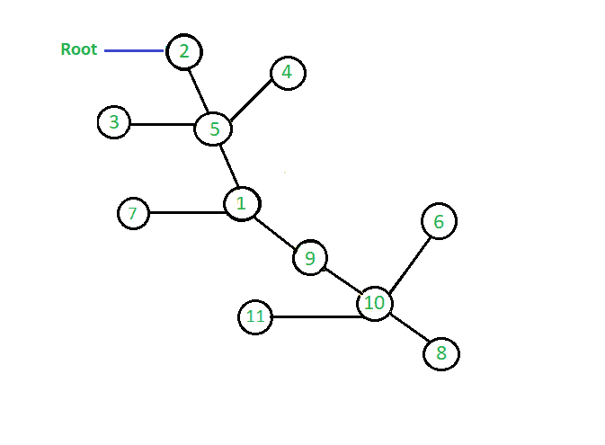

# 跳转指针算法

> 原文： [https://www.geeksforgeeks.org/jump-pointer-algorithm/](https://www.geeksforgeeks.org/jump-pointer-algorithm/)

**跳转指针算法**是一种针对并行算法的设计技术，该并行算法在指针结构（如数组或链表）上运行。 此算法通常用于确定有根树的森林的根。

在跳转指针算法中，我们对一棵树进行预处理，以使人们能够回答查询，以 **O（log n）**的时间复杂度找到树中任何节点的任何父节点。

跳转指针算法最多将**日志 <sub>2</sub> n** 指针关联到树的每个顶点。 **这些指针称为跳转指针，因为它们从树上向上跳转到树的根节点。** 对于处理树的任何节点，该算法存储长度为 **l** 跳线的数组，其中 **l = log2（depth（v））**。 该数组的第 i 个元素指向节点 **v** 的第 2 个父节点。 这种数据结构帮助我们从任何给定节点跳到树的中间。 当要求算法处理查询以找到树中任何节点的任何父节点时，我们将使用这些指针反复跳到树上。 跳跃数最多为 **log n** ，因此，在 **O（log n）**时间复杂度中可以找到在树中找到任何节点的父节点的任何问题。
在跳转指针中，有一个从节点 N 到 N 的第 j 个父级的指针，
j = 1、2、4、8 等。 因此，我们在每个节点的第个父节点中存储 2 个<sup>。</sup>

跳转指针算法基本上适用于**动态编程的方法，在该方法中，我们使用预先计算的结果来查找下一个结果**。 通过执行一些简单的计算，我们可以计算出数学公式，对于任何节点 **k，k 的第 2 个 <sup>j</sup> 等于 2 <sup>j-1</sup> 个父节点 <sup>k</sup>** 的第 j-1 个的父代。

该公式的简要说明在下面的算法部分中给出。

该算法最常见的用途是解决需要查找 O（log n）时间复杂度的任何节点的祖先的查询。

**图，用于实现跳转指针算法：**，



**存储所有节点的第 2 个父节点的跳转数组的表示形式：**


**示例：**

```
Input: 0th parent of node 2 
Output: 0th parent of node 2 is = 2

Input: 2th parent of node 4
Output: 2th parent of node 4 is = 2

Input: 3rd parent of node 8 
Output: 3rd parent of node 8 is = 1

```

**<u>算法</u>：**
这是实现跳转指针算法以找到图中任何节点的任何父代的算法。 我们使用**动态编程**确定跳跃矩阵。 在这里，我们将根节点表示为 **R** ，并最初假设**根节点的父级为 0，这意味着该节点**没有父级。 现在看一下该图，并在上图中显示该数组，我们可以轻松理解上述公式，以确定每个节点的第 2 个 <sup>i</sup> 父节点。 如果我们看一下值为 8 的节点，我们可以看到其 **2 <sup>0</sup> 父级为 10** ，现在找到其 2 <sup>1</sup> 父级 它是 2 个 <sup>1 个</sup>父级是 2 <sup>0</sup> 的值为 10 的节点父级，这里的 10 是 2 <sup>0</sup> 8 个父级**表示 2 <sup>节点 8 的父级</sup>为 2 <sup>0</sup> 父级 2 节点 8 0 父级。 同样，我们还可以看到节点 8 的第 2 个 <sup>2</sup> 的父节点是 5，即节点 2 的 <sup>1</sup> 的父节点 **2 <sup>1</sup> 8，即节点 2 的父节点 <sup>1</sup> 的值为 9** 。
因此，通过这种方式，我们可以为所有节点计算跳转指针数组，以存储它们的第 2 个 <sup>i</sup> 个父节点。**

以下是用于计算跳转指针矩阵的伪代码，该矩阵存储树中所有节点的第 2 个 <sup>i</sup> 父节点。

```
jump[k][j] =   it points 2^jth parent of k    
             =  2^j-1th parent of (2^j-1th parent of k)       
             =  jump[jump[i][j-1][j-1] 

```

**<u>实现</u>：**下面是实现上述算法的代码，以查找 O（logn）时间复杂度的任何节点的任何父代。

## C ++

```

// C++ program to implement Jump pointer algorithm
#include <bits/stdc++.h>
using namespace std;

int R = 0;
// n -> it represent total number of nodes
// len -> it is the maximum length of array
// to hold parent of each node.
// In worst case, the highest value of
// parent a node can have is n-1.
// 2 ^ len <= n-1
// len = O(log2n)
int getLen(int n)
{
    int len = (int)(log(n) / log(2)) + 1;
    return len;
}

// jump represent 2D matrix to hold parent of node in jump matrix
// here we pass reference of 2D matrix so that the change made
// occur directly to the original matrix
// len is same as defined above
// n is total nodes in graph
void set_jump_pointer(vector<vector<int> >& jump,
                      int* node, int len, int n)
{
    for (int j = 1; j <= len; j++)
        for (int i = 0; i < n; i++)
            jump[node[i]][j] = jump[jump[node[i]][j - 1]][j - 1];
}

// c -> it represent child
// p -> it represent parent
// i -> it represent node number
// p=0 means the node is root node
// here also we pass reference of 2D matrix
// and depth vector so that the change made
// occur directly to the original matrix and original vector
void constructGraph(vector<vector<int> >& jump,
                    int* node, int* isNode, int c, int p, int i)
{
    // enter the node in node array
    // it stores all the nodes in the graph
    node[i] = c;

    // to confirm that no child node have 2 parents
    if (isNode == 0) {
        isNode = 1;
        // make parent of x as y
        jump[0] = p;
    }
    return;
}

// function to jump to Lth parent of any node
void jumpPointer(vector<vector<int> >& jump,
                 int* isNode, int x, int L)
{
    int j = 0, n = x, k = L;

    // to check if node is present in graph or not
    if (isNode[x] == 0) {
        cout << "Node is not present in graph " << endl;
        return;
    }

    // in this loop we decrease the value of L by L/2 and
    // increment j by 1 after each iteration, and check for set bit
    // if we get set bit then we update x with jth parent of x
    // as L becomes less than or equal to zero means
    // we have jumped to Lth parent of node x
    while (L > 0) {
        // to check if last bit is 1 or not
        if (L & 1)
            x = jump[x][j];

        // use of shift operator to make
        // L = L/2 after every iteration
        L = L >> 1;
        j++;
    }

    cout << k << "th parent of node " << n 
                   << " is = " << x << endl;

    return;
}

// Driver code
int main()
{
    // n represent number of nodes
    int n = 11;

    // initialization of parent matrix
    // suppose max range of a node is up to 1000
    // if there are 1000 nodes than also
    // length of jump matrix will not exceed 10
    vector<vector<int> > jump(1000, vector<int>(10));

    // node array is used to store all nodes
    int* node = new int[1000];

    // isNode is an array to check whether
    // a node is present in graph or not
    int* isNode = new int[1000];

    // memset function to initialize isNode array with 0
    memset(isNode, 0, 1000 * sizeof(int));

    // function to calculate len
    // len -> it is the maximum length of
    // array to hold parent of each node.
    int len = getLen(n);

    // R stores root node
    R = 2;

    // construction of graph
    // here 0 represent that the node is root node
    constructGraph(jump, node, isNode, 2, 0, 0);
    constructGraph(jump, node, isNode, 5, 2, 1);
    constructGraph(jump, node, isNode, 3, 5, 2);
    constructGraph(jump, node, isNode, 4, 5, 3);
    constructGraph(jump, node, isNode, 1, 5, 4);
    constructGraph(jump, node, isNode, 7, 1, 5);
    constructGraph(jump, node, isNode, 9, 1, 6);
    constructGraph(jump, node, isNode, 10, 9, 7);
    constructGraph(jump, node, isNode, 11, 10, 8);
    constructGraph(jump, node, isNode, 6, 10, 9);
    constructGraph(jump, node, isNode, 8, 10, 10);

    // function to pre compute jump matrix
    set_jump_pointer(jump, node, len, n);

    // query to jump to parent using jump pointers
    // query to jump to 1st parent of node 2
    jumpPointer(jump, isNode, 2, 0);

    // query to jump to 2nd parent of node 4
    jumpPointer(jump, isNode, 4, 2);

    // query to jump to 3rd parent of node 8
    jumpPointer(jump, isNode, 8, 3);

    // query to jump to 5th parent of node 20
    jumpPointer(jump, isNode, 20, 5);

    return 0;
}

```

## Python3

```

# Python3 program to implement
# Jump pointer algorithm
import math

# Initialization of parent matrix
# suppose max range of a node is 
# up to 1000 if there are 1000 nodes
#  than also length of jump matrix 
# will not exceed 10
jump = [[0 for j in range(10)] 
           for i in range(1000)]

# Node array is used to store all nodes
node = [0 for i in range(1000)]

# isNode is an array to check whether
# a node is present in graph or not
isNode = [0 for i in range(1000)]

# n -> it represent total number of nodes
# len -> it is the maximum length of array
# to hold parent of each node.
# In worst case, the highest value of
# parent a node can have is n-1.
# 2 ^ len <= n-1
# len = O(log2n)
def getLen(n):

    len = int((math.log(n)) //
              (math.log(2))) + 1
    return len

# jump represent 2D matrix to hold parent 
# of node in jump matrix here we pass 
# reference of 2D matrix so that the 
# change made occur directly to the 
# original matrix len is same as 
# defined above n is total nodes 
# in graph
def set_jump_pointer(len, n):

    global jump, node
    for j in range(1,len + 1):
        for i in range(0, n):
            jump[node[i]][j] = jump[jump[node[i]][j - 1]][j - 1]

# c -> it represent child
# p -> it represent parent
# i -> it represent node number
# p=0 means the node is root node
# here also we pass reference of 
# 2D matrix and depth vector so 
# that the change made occur 
# directly to the original matrix
# and original vector
def constructGraph(c, p, i):

    global jump, node, isNode

    # Enter the node in node array
    # it stores all the nodes in the graph
    node[i] = c

    # To confirm that no child node
    # have 2 parents
    if (isNode == 0):
        isNode = 1

        # Make parent of x as y
        jump[0] = p

    return

# function to jump to Lth parent 
# of any node
def jumpPointer(x, L):

    j = 0
    n = x
    k = L

    global jump, isNode

    # To check if node is present in 
    # graph or not
    if (isNode[x] == 0):
        print("Node is not present in graph ")
        return

    # In this loop we decrease the value 
    # of L by L/2 and increment j by 1 
    # after each iteration, and check
    # for set bit if we get set bit 
    # then we update x with jth parent
    # of x as L becomes less than or 
    # equal to zero means we have 
    # jumped to Lth parent of node x
    while (L > 0):

        # To check if last bit is 1 or not
        if ((L & 1)!=0):
            x = jump[x][j]

        # Use of shift operator to make
        # L = L/2 after every iteration
        L = L >> 1
        j += 1

    print(str(k) + "th parent of node " +
          str(n) + " is = " + str(x))   

    return

# Driver code
if __name__=="__main__":

    # n represent number of nodes
    n = 11

    # Function to calculate len
    # len -> it is the maximum length of
    # array to hold parent of each node.
    len = getLen(n)

    # R stores root node
    R = 2

    # Construction of graph
    # here 0 represent that 
    # the node is root node
    constructGraph(2, 0, 0)
    constructGraph(5, 2, 1)
    constructGraph(3, 5, 2)
    constructGraph(4, 5, 3)
    constructGraph(1, 5, 4)
    constructGraph(7, 1, 5)
    constructGraph(9, 1, 6)
    constructGraph(10, 9, 7)
    constructGraph(11, 10, 8)
    constructGraph(6, 10, 9)
    constructGraph(8, 10, 10)

    # Function to pre compute jump matrix
    set_jump_pointer(len, n)

    # Query to jump to parent using jump pointers
    # query to jump to 1st parent of node 2
    jumpPointer(2, 0)

    # Query to jump to 2nd parent of node 4
    jumpPointer(4, 2)

    # Query to jump to 3rd parent of node 8
    jumpPointer(8, 3)

    # Query to jump to 5th parent of node 20
    jumpPointer(20, 5)

# This code is contributed by rutvik_56

```

**Output:** 

```
0th parent of node 2 is = 2
2th parent of node 4 is = 2
3th parent of node 8 is = 1
Node is not present in graph

```


* * *

* * *

如果您喜欢 GeeksforGeeks 并希望做出贡献，则还可以使用 [tribution.geeksforgeeks.org](https://contribute.geeksforgeeks.org/) 撰写文章，或将您的文章邮寄至 tribution@geeksforgeeks.org。 查看您的文章出现在 GeeksforGeeks 主页上，并帮助其他 Geeks。

如果您发现任何不正确的地方，请单击下面的“改进文章”按钮，以改进本文。