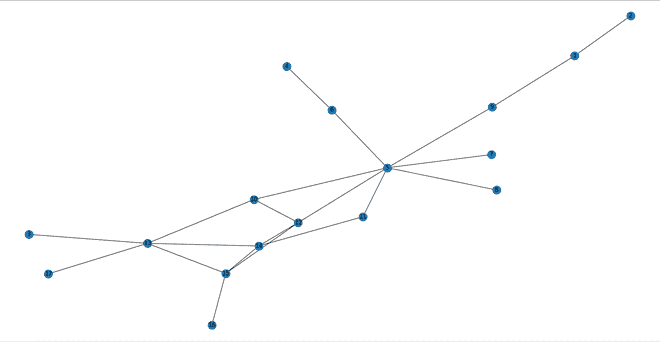

# 社交网络上的 K-shell 分解

> 原文： [https://www.geeksforgeeks.org/k-shell-decomposition-on-social-networks/](https://www.geeksforgeeks.org/k-shell-decomposition-on-social-networks/)

**先决条件：** [社交网络简介](https://www.geeksforgeeks.org/introduction-to-social-networks-using-networkx-in-python/)

K-shell 分解是一种方法，其中我们可以根据节点的度数将节点划分为一个桶中的度数为 1 的节点。

考虑一个示例，假设有 n 个节点，并且在其中应用了 k-shell 分解。 因此，等级为 1 的节点将位于 *bucket1* 中，然后我们会看到，断开这些节点的连接后，如果等级为 1，则剩下的节点仍为等级 1，然后将它们添加到存储桶 1 中，并再次检查并重复以下步骤 度 2、3 等，然后将其放入 *bucket2* ， *bucket3* 等。


具有 7 个节点的初始图

首先在上图中，我们将等级 1 的节点放入存储区 1，即节点 3 和 7。之后，我们将删除节点 3 和 7，并检查是否还剩下等级 1 的节点，即节点 6。 删除节点 6 并检查是否剩下节点 5 的度 1 节点。因此，我们将删除节点 5 并再次检查，但是节点 1 没有剩余，因此现在我们将检查度 2 的节点 1。 2、4，现在图中还剩下节点。 因此 *bucket1 = [3，7，6，5]* ， *bucket2 = [1,2,4]* 。

以下是社交网络上 K-shell 分解的实现：

## Python3

```

# Import required modules 
import networkx as nx 
import matplotlib.pyplot as plt 

# Check if there is any node left with degree d 
def check(h, d): 
    f = 0  # there is no node of deg <= d 
    for i in h.nodes(): 
        if (h.degree(i) <= d): 
            f = 1
            break
    return f 

# Find list of nodes with particular degree 
def find_nodes(h, it): 
    set1 = [] 
    for i in h.nodes(): 
        if (h.degree(i) <= it): 
            set1.append(i) 
    return set1 

# Create graph object and add nodes 
g = nx.Graph() 
g.add_edges_from( 
    [(1, 2), (1, 9), (3, 13), (4, 6), 
     (5, 6), (5, 7), (5, 8), (5, 9),  
     (5, 10), (5, 11), (5, 12), (10, 12),  
     (10, 13), (11, 14), (12, 14),  
     (12, 15), (13, 14), (13, 15),  
     (13, 17), (14, 15), (15, 16)]) 

# Copy the graph 
h = g.copy() 
it = 1

# Bucket being filled currently 
tmp = [] 

# list of lists of buckets 
buckets = [] 
while (1): 
    flag = check(h, it) 
    if (flag == 0): 
        it += 1
        buckets.append(tmp) 
        tmp = [] 
    if (flag == 1): 
        node_set = find_nodes(h, it) 
        for each in node_set: 
            h.remove_node(each) 
            tmp.append(each) 
    if (h.number_of_nodes() == 0): 
        buckets.append(tmp) 
        break
print(buckets) 

# Illustrate the Social Network  
# in the form of a graph 
nx.draw(g, with_labels=1) 
plt.show() 

```

**输出：**

```
[[2, 3, 4, 7, 8, 17, 16, 1, 6, 9], [11, 5, 10, 13, 12, 14, 15]]

```



具有 17 个节点的图

注意怪胎！ 通过 [**Python 编程基础**](https://practice.geeksforgeeks.org/courses/Python-Foundation?utm_source=geeksforgeeks&utm_medium=article&utm_campaign=GFG_Article_Bottom_Python_Foundation) 课程加强基础，并学习基础知识。

首先，您的面试准备将通过 [**Python DS**](https://practice.geeksforgeeks.org/courses/Data-Structures-With-Python?utm_source=geeksforgeeks&utm_medium=article&utm_campaign=GFG_Article_Bottom_Python_DS) 课程来增强您的数据结构概念。

* * *

* * *

如果您喜欢 GeeksforGeeks 并希望做出贡献，则还可以使用 [tribution.geeksforgeeks.org](https://contribute.geeksforgeeks.org/) 撰写文章，或将您的文章邮寄至 tribution@geeksforgeeks.org。 查看您的文章出现在 GeeksforGeeks 主页上，并帮助其他 Geeks。

如果您发现任何不正确的地方，请单击下面的“改进文章”按钮，以改进本文。