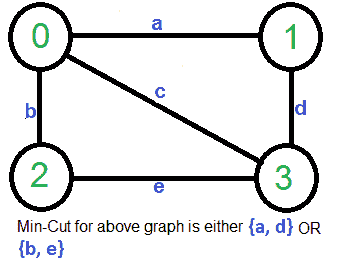
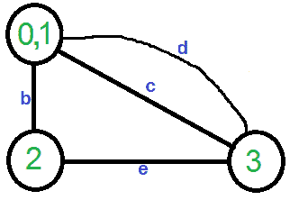
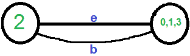
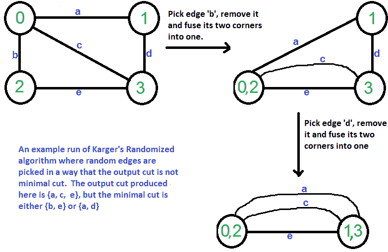

# Karger 的“最小切割”算法| 第 1 组（简介和实现）

> 原文： [https://www.geeksforgeeks.org/kargers-algorithm-for-minimum-cut-set-1-introduction-and-implementation/](https://www.geeksforgeeks.org/kargers-algorithm-for-minimum-cut-set-1-introduction-and-implementation/)

给定一个无向，无权的图，找到最小的切口（将图分成两个部分的最小边数）。
输入图可能具有平行边。

例如，考虑以下示例，最小的切割具有 2 条边。
[](https://media.geeksforgeeks.org/wp-content/cdn-uploads/Kargerfirst.png)

一个简单的解决方案使用[基于最大流量的](https://www.geeksforgeeks.org/ford-fulkerson-algorithm-for-maximum-flow-problem/) [s-t 切割算法](https://www.geeksforgeeks.org/minimum-cut-in-a-directed-graph/)来找到最小切割。 将每对顶点视为源“ s”和宿“ t”，并调用最小 s-t 割算法以找到 s-t 割。 返回所有 s-t 削减的最小值。 该算法的最佳时间复杂度是图形的 O（V <sup>5</sup> ）。 [怎么样？ 总共有 V <sup>2</sup> 对，一对的 s-t cut 算法需要 O（V * E）时间，并且 E = O（V [V <sup>2</sup> ）]。

以下是用于此目的的简单 Karger 算法。 低于 Karger 算法的时间可以用 O（E）= O（V <sup>2</sup> ）时间来实现。

```
1)  Initialize contracted graph CG as copy of original graph
2)  While there are more than 2 vertices.
      a) Pick a random edge (u, v) in the contracted graph.
      b) Merge (or contract) u and v into a single vertex (update 
         the contracted graph).
      c) Remove self-loops
3) Return cut represented by two vertices.

```

让我们通过给出的例子来理解上述算法。

假设第一个随机选择的顶点为连接顶点 0 和 1 的**和**。我们删除该边并收缩图形（合并顶点 0 和 1）。 我们得到下图。
[](https://media.geeksforgeeks.org/wp-content/cdn-uploads/Karger21.png)

让下一个随机选取的边缘为“ d”。 我们删除该边并合并顶点（0,1）和 3。
[](https://media.geeksforgeeks.org/wp-content/cdn-uploads/Karger3.png) 
我们需要删除图中的自环。 因此，我们删除了边缘'c'
[](https://media.geeksforgeeks.org/wp-content/cdn-uploads/Karger4.png)

现在图有两个顶点，所以我们停下来。 结果图中的边数是由 Karger 算法产生的割线。

***Karger 算法是[蒙特卡洛算法](http://en.wikipedia.org/wiki/Monte_Carlo_algorithm)，由它产生的切割可能不是最小的。*** 例如，下图显示了不同顺序的随机边缘拾取产生大小为 3 的最小切割。

[](https://media.geeksforgeeks.org/wp-content/cdn-uploads/Karger11.png)

下面是上述算法的 C ++实现。 输入图表示为边的集合，[联合查找数据结构](https://www.geeksforgeeks.org/union-find-algorithm-set-2-union-by-rank/)用于跟踪组件。

```

// Karger's algorithm to find Minimum Cut in an 
// undirected, unweighted and connected graph. 
#include <stdio.h> 
#include <stdlib.h> 
#include <time.h> 

// a structure to represent a unweighted edge in graph 
struct Edge 
{ 
    int src, dest; 
}; 

// a structure to represent a connected, undirected 
// and unweighted graph as a collection of edges. 
struct Graph 
{ 
    // V-> Number of vertices, E-> Number of edges 
    int V, E; 

    // graph is represented as an array of edges. 
    // Since the graph is undirected, the edge 
    // from src to dest is also edge from dest 
    // to src. Both are counted as 1 edge here. 
    Edge* edge; 
}; 

// A structure to represent a subset for union-find 
struct subset 
{ 
    int parent; 
    int rank; 
}; 

// Function prototypes for union-find (These functions are defined 
// after kargerMinCut() ) 
int find(struct subset subsets[], int i); 
void Union(struct subset subsets[], int x, int y); 

// A very basic implementation of Karger's randomized 
// algorithm for finding the minimum cut. Please note 
// that Karger's algorithm is a Monte Carlo Randomized algo 
// and the cut returned by the algorithm may not be 
// minimum always 
int kargerMinCut(struct Graph* graph) 
{ 
    // Get data of given graph 
    int V = graph->V, E = graph->E; 
    Edge *edge = graph->edge; 

    // Allocate memory for creating V subsets. 
    struct subset *subsets = new subset[V]; 

    // Create V subsets with single elements 
    for (int v = 0; v < V; ++v) 
    { 
        subsets[v].parent = v; 
        subsets[v].rank = 0; 
    } 

    // Initially there are V vertices in 
    // contracted graph 
    int vertices = V; 

    // Keep contracting vertices until there are 
    // 2 vertices. 
    while (vertices > 2) 
    { 
       // Pick a random edge 
       int i = rand() % E; 

       // Find vertices (or sets) of two corners 
       // of current edge 
       int subset1 = find(subsets, edge[i].src); 
       int subset2 = find(subsets, edge[i].dest); 

       // If two corners belong to same subset, 
       // then no point considering this edge 
       if (subset1 == subset2) 
         continue; 

       // Else contract the edge (or combine the 
       // corners of edge into one vertex) 
       else
       { 
          printf("Contracting edge %d-%d\n", 
                 edge[i].src, edge[i].dest); 
          vertices--; 
          Union(subsets, subset1, subset2); 
       } 
    } 

    // Now we have two vertices (or subsets) left in 
    // the contracted graph, so count the edges between 
    // two components and return the count. 
    int cutedges = 0; 
    for (int i=0; i<E; i++) 
    { 
        int subset1 = find(subsets, edge[i].src); 
        int subset2 = find(subsets, edge[i].dest); 
        if (subset1 != subset2) 
          cutedges++; 
    } 

    return cutedges; 
} 

// A utility function to find set of an element i 
// (uses path compression technique) 
int find(struct subset subsets[], int i) 
{ 
    // find root and make root as parent of i 
    // (path compression) 
    if (subsets[i].parent != i) 
      subsets[i].parent = 
             find(subsets, subsets[i].parent); 

    return subsets[i].parent; 
} 

// A function that does union of two sets of x and y 
// (uses union by rank) 
void Union(struct subset subsets[], int x, int y) 
{ 
    int xroot = find(subsets, x); 
    int yroot = find(subsets, y); 

    // Attach smaller rank tree under root of high 
    // rank tree (Union by Rank) 
    if (subsets[xroot].rank < subsets[yroot].rank) 
        subsets[xroot].parent = yroot; 
    else if (subsets[xroot].rank > subsets[yroot].rank) 
        subsets[yroot].parent = xroot; 

    // If ranks are same, then make one as root and 
    // increment its rank by one 
    else
    { 
        subsets[yroot].parent = xroot; 
        subsets[xroot].rank++; 
    } 
} 

// Creates a graph with V vertices and E edges 
struct Graph* createGraph(int V, int E) 
{ 
    Graph* graph = new Graph; 
    graph->V = V; 
    graph->E = E; 
    graph->edge = new Edge[E]; 
    return graph; 
} 

// Driver program to test above functions 
int main() 
{ 
    /* Let us create following unweighted graph 
        0------1 
        | \    | 
        |   \  | 
        |     \| 
        2------3   */
    int V = 4;  // Number of vertices in graph 
    int E = 5;  // Number of edges in graph 
    struct Graph* graph = createGraph(V, E); 

    // add edge 0-1 
    graph->edge[0].src = 0; 
    graph->edge[0].dest = 1; 

    // add edge 0-2 
    graph->edge[1].src = 0; 
    graph->edge[1].dest = 2; 

    // add edge 0-3 
    graph->edge[2].src = 0; 
    graph->edge[2].dest = 3; 

    // add edge 1-3 
    graph->edge[3].src = 1; 
    graph->edge[3].dest = 3; 

    // add edge 2-3 
    graph->edge[4].src = 2; 
    graph->edge[4].dest = 3; 

    // Use a different seed value for every run. 
    srand(time(NULL)); 

    printf("\nCut found by Karger's randomized algo is %d\n", 
           kargerMinCut(graph)); 

    return 0; 
} 

```

输出：

```
Contracting edge 0-2
Contracting edge 0-3

Cut found by Karger's randomized algo is 2
```

***请注意，以上程序基于随机函数的结果，可能会产生不同的输出。***

在本文中，我们讨论了简单的 Karger 算法，并发现该算法并不总是产生最小切割。 上述算法产生最小切割，其概率大于或等于 1 /（n <sup>2</sup> ）。 请参阅下一篇[Karl's Algortihm 的分析和应用[》，其中讨论了应用，这种可能性的证明和改进。](https://www.geeksforgeeks.org/kargers-algorithm-for-minimum-cut-set-2-analysis-and-applications/)

**参考：**
[http://en.wikipedia.org/wiki/Karger%27s_algorithm](http://en.wikipedia.org/wiki/Karger%27s_algorithm)

[https://www.youtube.com/watch?v=P0l8jMDQTEQ](https://www.youtube.com/watch?v=P0l8jMDQTEQ)

[https://www.cs.princeton.edu/courses/archive/fall13/cos521/lecnotes/lec2final.pdf](https://www.cs.princeton.edu/courses/archive/fall13/cos521/lecnotes/lec2final.pdf)

[http://web.stanford.edu/class/archive/cs/cs161/cs161.1138/lectures/11/Small11.pdf](http://web.stanford.edu/class/archive/cs/cs161/cs161.1138/lectures/11/Small11.pdf)

如果发现任何不正确的地方，或者想分享有关上述主题的更多信息，请写评论。

