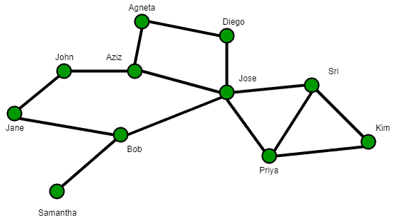
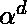
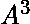
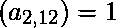
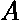
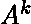
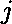
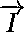
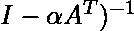

# Katz 集中度（集中度）

> 原文： [https://www.geeksforgeeks.org/katz-centrality-centrality-measure/](https://www.geeksforgeeks.org/katz-centrality-centrality-measure/)

在图论中，节点的 Katz 中心度是网络中中心度的度量。 它由 Leo Katz 于 1953 年提出，用于衡量社交网络中参与者（或节点）的相对影响程度。 与通常只考虑一对角色之间的最短路径（测地线）的典型集中度度量不同，Katz 集中度度量通过考虑一对角色之间的走动总数来影响。

它类似于 Google 的 PageRank 和特征向量中心性。

**测量 Katz 中心度**



一个简单的社交网络：节点代表人物或演员，节点之间的边缘代表演员之间的某种关系

Katz 中心性通过测量直接邻居（一级节点）以及网络中通过这些直接邻居连接到正在考虑的节点的所有其他节点的数量，来计算网络中某个节点的相对影响。 但是，与远方邻居的连接会受到衰减系数的惩罚。 一对节点之间的每个路径或连接均分配有权重，该权重由确定，节点之间的距离为。

例如，在右图中，假设正在测量 John 的中心性，并且假设。 分配给将 John 与他的直接邻居 Jane 和 Bob 连接的每个链接的权重将为。 由于 Jose 通过 Bob 间接连接到 John，因此分配给该连接（由两个链接组成）的权重将为。 类似地，通过阿齐兹和简分配给阿涅塔与约翰之间的连接的权重将为，通过迭戈，何塞和鲍勃分配给阿涅塔与约翰之间的连接的权重将为。

***数学公式***
令 A 为所考虑网络的邻接矩阵。 A 的元素是变量，如果节点 i 连接到节点 j 则值为 1，否则为 0。 A 的幂表示通过中间节点在两个节点之间存在（或不存在）链接。 例如，在矩阵中，如果元素表示节点 2 和节点 12 通过节点 2 的某些第一级和第二级邻居连接。如果表示节点 i 的 Katz 中心性，则在数学上 ：


注意，以上定义使用了以下事实：邻接矩阵的位置上的元素提升为幂（即）反映了的总数 节点和之间的度连接。 必须选择衰减因子的值，使其小于邻接矩阵 A 的最大特征值的绝对值的倒数。在这种情况下，以下表达式可用于计算 Katz 中心度：


这里是恒等矩阵，是大小为 n（n 是节点数）的恒等矢量，由 1 组成。 表示 A 的转置矩阵，而表示项（）的矩阵求逆。

以下是用于计算图及其各个节点的 Katz Centrality 的代码。

```

def katz_centrality(G, alpha=0.1, beta=1.0, 
                    max_iter=1000, tol=1.0e-6,  
                    nstart=None, normalized=True, 
                    weight = 'weight'): 
    """Compute the Katz centrality for the nodes  
        of the graph G. 

    Katz centrality computes the centrality for a node  
    based on the centrality of its neighbors. It is a  
    generalization of the eigenvector centrality. The 
    Katz centrality for node `i` is 

    .. math:: 

        x_i = \alpha \sum_{j} A_{ij} x_j + \beta, 

    where `A` is the adjacency matrix of the graph G  
    with eigenvalues `\lambda`. 

    The parameter `\beta` controls the initial centrality and 

    .. math:: 

        \alpha < \frac{1}{\lambda_{max}}. 

    Katz centrality computes the relative influence of 
    a node within a network by measuring the number of  
    the immediate neighbors (first degree nodes) and   
    also all other nodes in the network that connect 
    to the node under consideration through these  
    immediate neighbors. 

    Extra weight can be provided to immediate neighbors 
    through the parameter :math:`\beta`.  Connections  
    made with distant neighbors are, however, penalized 
    by an attenuation factor `\alpha` which should be  
    strictly less than the inverse largest eigenvalue  
    of the adjacency matrix in order for the Katz 
    centrality to be computed correctly.  

    Parameters 
    ---------- 
    G : graph 
      A NetworkX graph 

    alpha : float 
      Attenuation factor 

    beta : scalar or dictionary, optional (default=1.0) 
      Weight attributed to the immediate neighborhood.  
      If not a scalar, the dictionary must have an value 
      for every node. 

    max_iter : integer, optional (default=1000) 
      Maximum number of iterations in power method. 

    tol : float, optional (default=1.0e-6) 
      Error tolerance used to check convergence in 
      power method iteration. 

    nstart : dictionary, optional 
      Starting value of Katz iteration for each node. 

    normalized : bool, optional (default=True) 
      If True normalize the resulting values. 

    weight : None or string, optional 
      If None, all edge weights are considered equal. 
      Otherwise holds the name of the edge attribute 
      used as weight. 

    Returns 
    ------- 
    nodes : dictionary 
       Dictionary of nodes with Katz centrality as  
       the value. 

    Raises 
    ------ 
    NetworkXError 
       If the parameter `beta` is not a scalar but  
       lacks a value for at least  one node 

    Notes 
    ----- 

    This algorithm it uses the power method to find 
    the eigenvector corresponding to the largest  
    eigenvalue of the adjacency matrix of G. 
    The constant alpha should be strictly less than  
    the inverse of largest eigenvalue of the adjacency 
    matrix for the algorithm to converge. 
    The iteration will stop after max_iter iterations  
    or an error tolerance ofnumber_of_nodes(G)*tol  
     has been reached. 

    When `\alpha = 1/\lambda_{max}` and `\beta=0`,  
    Katz centrality is the same as eigenvector centrality. 

    For directed graphs this finds "left" eigenvectors 
    which corresponds to the in-edges in the graph. 
    For out-edges Katz centrality first reverse the  
    graph with G.reverse(). 

    """
    from math import sqrt 

    if len(G) == 0: 
        return {} 

    nnodes = G.number_of_nodes() 

    if nstart is None: 

        # choose starting vector with entries of 0 
        x = dict([(n,0) for n in G]) 
    else: 
        x = nstart 

    try: 
        b = dict.fromkeys(G,float(beta)) 
    except (TypeError,ValueError,AttributeError): 
        b = beta 
        if set(beta) != set(G): 
            raise nx.NetworkXError('beta dictionary '
                                   'must have a value for every node') 

    # make up to max_iter iterations 
    for i in range(max_iter): 
        xlast = x 
        x = dict.fromkeys(xlast, 0) 

        # do the multiplication y^T = Alpha * x^T A - Beta 
        for n in x: 
            for nbr in G[n]: 
                x[nbr] += xlast[n] * G[n][nbr].get(weight, 1) 
        for n in x: 
            x[n] = alpha*x[n] + b[n] 

        # check convergence 
        err = sum([abs(x[n]-xlast[n]) for n in x]) 
        if err < nnodes*tol: 
            if normalized: 

                # normalize vector 
                try: 
                    s = 1.0/sqrt(sum(v**2 for v in x.values())) 

                # this should never be zero? 
                except ZeroDivisionError: 
                    s = 1.0
            else: 
                s = 1
            for n in x: 
                x[n] *= s 
            return x 

    raise nx.NetworkXError('Power iteration failed to converge in '
                           '%d iterations.' % max_iter) 

```

上面的函数是使用 networkx 库调用的，一旦安装了该库，您就可以最终使用它，并且以下代码必须用 python 编写，以实现节点的 katz 中心性。

```

>>> import networkx as nx 
>>> import math 
>>> G = nx.path_graph(4) 
>>> phi = (1+math.sqrt(5))/2.0 # largest eigenvalue of adj matrix 
>>> centrality = nx.katz_centrality(G,1/phi-0.01) 
>>> for n,c in sorted(centrality.items()): 
...    print("%d %0.2f"%(n,c)) 

```

上面代码的输出是：

```

0 0.37
1 0.60
2 0.60
3 0.37

```

以上结果是一个字典，描述了每个节点的 katz 中心值。 以上是我关于集中度度量的文章系列的扩展。 保持联网！！！

**参考**
[http://networkx.readthedocs.io/en/networkx-1.10/index.html](http://networkx.readthedocs.io/en/networkx-1.10/index.html)
[https://en.wikipedia.org / wiki / Katz_centrality](https://en.wikipedia.org/wiki/Katz_centrality)

注意怪胎！ 通过 [**Python 编程基础**](https://practice.geeksforgeeks.org/courses/Python-Foundation?utm_source=geeksforgeeks&utm_medium=article&utm_campaign=GFG_Article_Bottom_Python_Foundation) 课程加强基础，并学习基础知识。

首先，您的面试准备将通过 [**Python DS**](https://practice.geeksforgeeks.org/courses/Data-Structures-With-Python?utm_source=geeksforgeeks&utm_medium=article&utm_campaign=GFG_Article_Bottom_Python_DS) 课程来增强您的数据结构概念。

* * *

* * *

如果您喜欢 GeeksforGeeks 并希望做出贡献，则还可以使用 [tribution.geeksforgeeks.org](https://contribute.geeksforgeeks.org/) 撰写文章，或将您的文章邮寄至 tribution@geeksforgeeks.org。 查看您的文章出现在 GeeksforGeeks 主页上，并帮助其他 Geeks。

如果您发现任何不正确的地方，请单击下面的“改进文章”按钮，以改进本文。