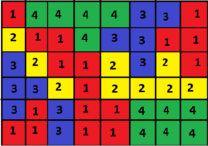

# 网格上最大的连接组件

> 原文： [https://www.geeksforgeeks.org/largest-connected-component-on-a-grid/](https://www.geeksforgeeks.org/largest-connected-component-on-a-grid/)

给定一个在不同单元格中具有不同颜色的网格，每种颜色由一个不同的数字表示。 任务是找出网格上最大的连接组件。 最大的组件网格指的是最大的单元格集合，这样您就可以通过仅在集合中相邻的单元格之间移动而从该单元格中的任何单元格移动到任何其他单元格。

**示例：**

> 输入：
> 
> [](https://media.geeksforgeeks.org/wp-content/uploads/Example-grid.png)
> 
> 不同颜色的网格
> 
> Output : 9
> [](https://media.geeksforgeeks.org/wp-content/uploads/output-4.png)
> 
> 电网最大的连接组件

**方法：**
该方法是将给定的网格可视化为一个图形，其中每个单元格代表图形的一个单独节点，每个节点连接到四个其他节点，这些节点将立即上下左右移动 和那个网格的右边。 现在，对图的每个节点进行 [BFS](https://www.geeksforgeeks.org/breadth-first-search-or-bfs-for-a-graph/) 搜索，找到*与当前节点*具有相同颜色值的所有连接到当前节点的节点。
这是上面示例的图形：

[](https://media.geeksforgeeks.org/wp-content/uploads/res.png)

网格的图形表示

.

在每个单元（i，j），可以完成 BFS。 从一个单元格可能的移动将是**的右，左，上或下**。 仅移动到范围内且颜色相同的那些单元格。 如果先前已访问过相同的节点，则网格的最大分量值将存储在 **result [] []** 数组中。 使用备注，减少任何单元上的 BFS 数量。 **Visited [] []** 数组用于标记先前是否已访问过该单元，并且在每个单元完成 BFS 时，count 存储连接的组件的计数。 存储最大数量，并使用 result [] []数组打印结果网格。

下面是上述方法的说明：

## C ++

```

// CPP program to print the largest 
// connected component in a grid 
#include <bits/stdc++.h> 
using namespace std; 

const int n = 6; 
const int m = 8; 

// stores information about  which cell 
// are already visited in a particular BFS 
int visited[n][m]; 

// result stores the final result grid 
int result[n][m]; 

// stores the count of cells in the largest  
// connected component 
int COUNT; 

// Function checks if a cell is valid i.e it 
// is inside the grid and equal to the key 
bool is_valid(int x, int y, int key, int input[n][m]) 
{ 
    if (x < n && y < m && x >= 0 && y >= 0) { 
        if (visited[x][y] == false && input[x][y] == key) 
            return true; 
        else
            return false; 
    } 
    else
        return false; 
} 

// BFS to find all cells in 
// connection with key = input[i][j] 
void BFS(int x, int y, int i, int j, int input[n][m]) 
{ 
    // terminating case for BFS 
    if (x != y) 
        return; 

    visited[i][j] = 1; 
    COUNT++; 

    // x_move and y_move arrays 
    // are the possible movements 
    // in x or y direction 
    int x_move[] = { 0, 0, 1, -1 }; 
    int y_move[] = { 1, -1, 0, 0 }; 

    // checks all four points connected with input[i][j] 
    for (int u = 0; u < 4; u++) 
        if (is_valid(i + y_move[u], j + x_move[u], x, input)) 
            BFS(x, y, i + y_move[u], j + x_move[u], input); 
} 

// called every time before a BFS 
// so that visited array is reset to zero 
void reset_visited() 
{ 
    for (int i = 0; i < n; i++) 
        for (int j = 0; j < m; j++) 
            visited[i][j] = 0; 
} 

// If a larger connected component 
// is found this function is called 
// to store information about that component. 
void reset_result(int key, int input[n][m]) 
{ 
    for (int i = 0; i < n; i++) { 
        for (int j = 0; j < m; j++) { 
            if (visited[i][j] && input[i][j] == key) 
                result[i][j] = visited[i][j]; 
            else
                result[i][j] = 0; 
        } 
    } 
} 
// function to print the result 
void print_result(int res) 
{ 
    cout << "The largest connected "
         << "component of the grid is :" << res << "\n"; 

    // prints the largest component 
    for (int i = 0; i < n; i++) { 
        for (int j = 0; j < m; j++) { 
            if (result[i][j]) 
                cout << result[i][j] << " "; 
            else
                cout << ". "; 
        } 
        cout << "\n"; 
    } 
} 

// function to calculate the largest connected  
// component 
void computeLargestConnectedGrid(int input[n][m]) 
{ 
    int current_max = INT_MIN; 

    for (int i = 0; i < n; i++) { 
        for (int j = 0; j < m; j++) { 
            reset_visited(); 
            COUNT = 0; 

            // checking cell to the right 
            if (j + 1 < m) 
                BFS(input[i][j], input[i][j + 1], i, j, input); 

            // updating result 
            if (COUNT >= current_max) { 
                current_max = COUNT; 
                reset_result(input[i][j], input); 
            } 
            reset_visited(); 
            COUNT = 0; 

            // checking cell downwards 
            if (i + 1 < n) 
                BFS(input[i][j], input[i + 1][j], i, j, input); 

            // updating result 
            if (COUNT >= current_max) { 
                current_max = COUNT; 
                reset_result(input[i][j], input); 
            } 
        } 
    } 
    print_result(current_max); 
} 
// Drivers Code 
int main() 
{ 
    int input[n][m] = { { 1, 4, 4, 4, 4, 3, 3, 1 }, 
                        { 2, 1, 1, 4, 3, 3, 1, 1 }, 
                        { 3, 2, 1, 1, 2, 3, 2, 1 }, 
                        { 3, 3, 2, 1, 2, 2, 2, 2 }, 
                        { 3, 1, 3, 1, 1, 4, 4, 4 }, 
                        { 1, 1, 3, 1, 1, 4, 4, 4 } }; 

    // function to compute the largest 
    // connected component in the grid 
    computeLargestConnectedGrid(input); 
    return 0; 
} 

```