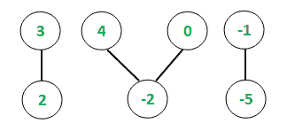
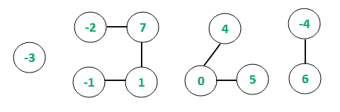

# 无向图

中所有连接组件的最大子数组总和

> 原文： [https://www.geeksforgeeks.org/largest-subarray-sum-of-all-connected-components-in-undirected-graph/](https://www.geeksforgeeks.org/largest-subarray-sum-of-all-connected-components-in-undirected-graph/)

给定一个[无向图](https://www.geeksforgeeks.org/graph-data-structure-and-algorithms/)并具有`V`顶点和`E`边，任务是在所有连接的组件中找到**最大连续子数组和** 图的

**范例**：

> **输入**：E = 4，V = 7
> 
> 
> 
> **输出**：
> 所有连接的组件中的最大子阵列总和= 5
> **说明**：
> 连接的组件和最大子阵列总和如下：
> [3， 2]：最大子数组总和= 3 + 2 =`5`
> [4，-2，0]：最大子阵列总和= 4
> [-1，-5]：最大子阵列总和= -1
> 因此，最大连续子数组总和= 5
> **输入**：E = 6，V = 10
> 
> 
> 
> **输出**：
> 所有连接的组件之间的最大子阵列总数= 9
> **说明**：
> 连接的组件和最大子阵列总数如下：
> [-3 ]：最大子阵列总和= -3
> [-2，7，1，-1]：最大子阵列总和= 7 + 1 = 8
> [4，0，5]：最大子阵列总和= 4 + 0 + 5 =`9`，
> [-4、6]：最大子阵列总和= 6
> 因此，最大连续子阵列总和= 9

**方法**：的想法是使用[深度优先搜索遍历](https://www.geeksforgeeks.org/depth-first-search-or-dfs-for-a-graph/)来跟踪无向图中的已连接组件，如本文的[中所述。 对于每个连接的组件，将根据 **Kadane 的算法**分析阵列并计算最大连续子阵列和，如](https://www.geeksforgeeks.org/connected-components-in-an-undirected-graph/)[此](https://www.geeksforgeeks.org/largest-sum-contiguous-subarray/)文章中所述。 设置一个全局变量，该变量在每次迭代时都与局部和值进行比较以获得最终结果。

以下是上述方法的实现：

## C++

```cpp

// C++ implementation to find
// largest subarray sum among
// all connected components

#include <bits/stdc++.h>
using namespace std;

// Function to traverse the undirected
// graph using the Depth first traversal
void depthFirst(int v, vector<int> graph[],
                vector<bool>& visited,
                vector<int>& storeChain)
{
    // Marking the visited
    // vertex as true
    visited[v] = true;

    // Store the connected chain
    storeChain.push_back(v);

    for (auto i : graph[v]) {
        if (visited[i] == false) {

            // Recursive call to
            // the DFS algorithm
            depthFirst(i, graph,
                       visited, storeChain);
        }
    }
}

// Function to return maximum
// subarray sum of each connected
// component using Kadane's Algorithm
int subarraySum(int arr[], int n)
{
    int maxSubarraySum = arr[0];
    int currentMax = arr[0];

    // Following loop finds maximum
    // subarray sum based on Kadane's
    // algorithm
    for (int i = 1; i < n; i++) {
        currentMax = max(arr[i],
                         arr[i] + currentMax);

        // Global maximum subarray sum
        maxSubarraySum = max(maxSubarraySum,
                             currentMax);
    }

    // Returning the sum
    return maxSubarraySum;
}

// Function to find the maximum subarray
// sum among all connected components
void maxSubarraySum(
    vector<int> graph[], int vertices,
    vector<int> values)
{
    // Initializing boolean array
    // to mark visited vertices
    vector<bool> visited(1001, false);

    // maxSum stores the
    // maximum subarray sum
    int maxSum = INT_MIN;

    // Following loop invokes DFS algorithm
    for (int i = 1; i <= vertices; i++) {
        if (visited[i] == false) {

            // Variable to hold
            // temporary length
            int sizeChain;

            // Variable to hold temporary
            // maximum subarray sum values
            int tempSum;

            // Container to store each chain
            vector<int> storeChain;

            // DFS algorithm
            depthFirst(i, graph, visited, storeChain);

            // Variable to hold each chain size
            sizeChain = storeChain.size();

            // Container to store values
            // of vertices of individual chains
            int chainValues[sizeChain + 1];

            // Storing the values of each chain
            for (int i = 0; i < sizeChain; i++) {
                int temp = values[storeChain[i] - 1];
                chainValues[i] = temp;
            }

            // Function call to find maximum
            // subarray sum of current connection
            tempSum = subarraySum(chainValues,
                                  sizeChain);

            // Conditional to store current
            // maximum subarray sum
            if (tempSum > maxSum) {
                maxSum = tempSum;
            }
        }
    }

    // Printing global maximum subarray sum
    cout << "Maximum subarray sum among all ";
    cout << "connected components = ";
    cout << maxSum;
}

// Driver code
int main()
{
    // Initializing graph in the
    // form of adjacency list
    vector<int> graph[1001];

    // Defining the number
    // of edges and vertices
    int E, V;
    E = 4;
    V = 7;

    // Assigning the values for each
    // vertex of the undirected graph
    vector<int> values;
    values.push_back(3);
    values.push_back(2);
    values.push_back(4);
    values.push_back(-2);
    values.push_back(0);
    values.push_back(-1);
    values.push_back(-5);

    // Constructing the undirected graph
    graph[1].push_back(2);
    graph[2].push_back(1);
    graph[3].push_back(4);
    graph[4].push_back(3);
    graph[4].push_back(5);
    graph[5].push_back(4);
    graph[6].push_back(7);
    graph[7].push_back(6);

    maxSubarraySum(graph, V, values);
    return 0;
}

```

## Java

```java

// Java program to implement
// the above approach
import java.io.*;
import java.util.*;
class GFG{

// Function to traverse the undirected
// graph using the Depth first traversal
static void depthFirst(int v, List<List<Integer>> graph,
                       boolean[] visited, 
                       List<Integer> storeChain)
{
  // Marking the visited
  // vertex as true
  visited[v] = true;

  // Store the connected chain
  storeChain.add(v);

  for (int i : graph.get(v)) 
  {
    if (visited[i] == false) 
    {
      // Recursive call to
      // the DFS algorithm
      depthFirst(i, graph, 
                 visited, 
                 storeChain);
    }
  }
}

// Function to return maximum
// subarray sum of each connected
// component using Kadane's Algorithm
static int subarraySum(int arr[], 
                       int n)
{
  int maxSubarraySum = arr[0];
  int currentMax = arr[0];

  // Following loop finds maximum
  // subarray sum based on Kadane's
  // algorithm
  for (int i = 1; i < n; i++) 
  {
    currentMax = Math.max(arr[i], arr[i] + 
                          currentMax);

    // Global maximum subarray sum
    maxSubarraySum = Math.max(maxSubarraySum, 
                              currentMax);
  }

  // Returning the sum
  return maxSubarraySum;
}

// Function to find the maximum subarray
// sum among all connected components
static void maxSubarraySum(List<List<Integer>> graph,
                           int vertices,
                           List<Integer> values)
{
  // Initializing boolean array
  // to mark visited vertices
  boolean[] visited = new boolean[1001];

  // maxSum stores the
  // maximum subarray sum
  int maxSum = Integer.MIN_VALUE;

  // Following loop invokes DFS 
  // algorithm
  for (int i = 1; i <= vertices; i++) 
  {
    if (visited[i] == false) 
    {
      // Variable to hold
      // temporary length
      int sizeChain;

      // Variable to hold temporary
      // maximum subarray sum values
      int tempSum;

      // Container to store each chain
      List<Integer> storeChain = 
           new ArrayList<Integer>();

      // DFS algorithm
      depthFirst(i, graph, 
                 visited, storeChain);

      // Variable to hold each 
      // chain size
      sizeChain = storeChain.size();

      // Container to store values
      // of vertices of individual chains
      int[] chainValues = 
            new int[sizeChain + 1];

      // Storing the values of each chain
      for (int j = 0; j < sizeChain; j++) 
      {
        int temp = values.get(storeChain.get(j) - 1);
        chainValues[j] = temp;
      }

      // Function call to find maximum
      // subarray sum of current connection
      tempSum = subarraySum(chainValues, 
                            sizeChain);

      // Conditional to store current
      // maximum subarray sum
      if (tempSum > maxSum) 
      {
        maxSum = tempSum;
      }
    }
  }

  // Printing global maximum subarray sum
  System.out.print("Maximum subarray sum among all ");
  System.out.print("connected components = ");
  System.out.print(maxSum);
}

// Driver code
public static void main(String[] args)
{
  // Initializing graph in the
  // form of adjacency list
  List<List<Integer>> graph = 
       new ArrayList();

  for (int i = 0; i < 1001; i++)
    graph.add(new ArrayList<Integer>());

  // Defining the number
  // of edges and vertices
  int E = 4, V = 7;

  // Assigning the values for each
  // vertex of the undirected graph
  List<Integer> values = 
       new ArrayList<Integer>();

  values.add(3);
  values.add(2);
  values.add(4);
  values.add(-2);
  values.add(0);
  values.add(-1);
  values.add(-5);

  // Constructing the undirected
  // graph
  graph.get(1).add(2);
  graph.get(2).add(1);
  graph.get(3).add(4);
  graph.get(4).add(3);
  graph.get(4).add(5);
  graph.get(5).add(4);
  graph.get(6).add(7);
  graph.get(7).add(6);

  maxSubarraySum(graph, V, values);
}
}

// This code is contributed by jithin

```

## Python

```py

# Python3 implementation to find
# largest subarray sum among
# all connected components
import sys

# Function to traverse 
# the undirected graph 
# using the Depth first 
# traversal
def depthFirst(v, graph, 
               visited, 
               storeChain):

    # Marking the visited
    # vertex as true
    visited[v] = True;

    # Store the connected chain
    storeChain.append(v);

    for i in graph[v]:
        if (visited[i] == False):

            # Recursive call to
            # the DFS algorithm
            depthFirst(i, graph,
                       visited, 
                       storeChain);        

# Function to return maximum
# subarray sum of each connected
# component using Kadane's Algorithm
def subarraySum(arr, n):

    maxSubarraySum = arr[0];
    currentMax = arr[0];

    # Following loop finds maximum
    # subarray sum based on Kadane's
    # algorithm
    for i in range(1, n):
        currentMax = max(arr[i],
                         arr[i] +
                         currentMax)

        # Global maximum subarray sum
        maxSubarraySum = max(maxSubarraySum,
                             currentMax);    

    # Returning the sum
    return maxSubarraySum;

# Function to find the 
# maximum subarray sum 
# among all connected components
def maxSubarraySum(graph, 
                   vertices, values):

    # Initializing boolean array
    # to mark visited vertices
    visited = [False for i in range(1001)]

    # maxSum stores the
    # maximum subarray sum
    maxSum = -sys.maxsize;

    # Following loop invokes 
    # DFS algorithm
    for i in range(1, vertices + 1):    
        if (visited[i] == False):

            # Variable to hold
            # temporary length
            sizeChain = 0

            # Variable to hold 
            # temporary maximum 
            # subarray sum values
            tempSum = 0;

            # Container to store 
            # each chain
            storeChain = [];

            # DFS algorithm
            depthFirst(i, graph, 
                       visited, 
                       storeChain);

            # Variable to hold each 
            # chain size
            sizeChain = len(storeChain)

            # Container to store values
            # of vertices of individual chains
            chainValues = [0 for i in range(sizeChain + 1)];

            # Storing the values of each chain
            for i in range(sizeChain):        
                temp = values[storeChain[i] - 1];
                chainValues[i] = temp;            

            # Function call to find maximum
            # subarray sum of current connection
            tempSum = subarraySum(chainValues,
                                  sizeChain);

            # Conditional to store current
            # maximum subarray sum
            if (tempSum > maxSum):
                maxSum = tempSum;            

    # Printing global maximum subarray sum
    print("Maximum subarray sum among all ", 
           end = '');
    print("connected components = ", 
           end = '')
    print(maxSum)

if __name__=="__main__":

    # Initializing graph in the
    # form of adjacency list
    graph = [[] for i in range(1001)]

    # Defining the number
    # of edges and vertices
    E = 4;
    V = 7;

    # Assigning the values 
    # for each vertex of the 
    # undirected graph
    values = [];
    values.append(3);
    values.append(2);
    values.append(4);
    values.append(-2);
    values.append(0);
    values.append(-1);
    values.append(-5);

    # Constructing the 
    # undirected graph
    graph[1].append(2);
    graph[2].append(1);
    graph[3].append(4);
    graph[4].append(3);
    graph[4].append(5);
    graph[5].append(4);
    graph[6].append(7);
    graph[7].append(6);

    maxSubarraySum(graph, V, values);

# This code is contributed by rutvik_56

```

输出：

```
Maximum subarray sum among all connected components = 5
```

**时间复杂度**：*O（V <sup>2</sup> ）*。

DFS 算法需要 O（V + E）时间来运行，其中 V，E 是顶点 和无向图的边。 此外，在每次迭代中都会找到最大的连续子数组总和，这需要额外的 O（V）才能根据 Kadane 的算法计算并返回结果。 因此，整体复杂度为 **O（V <sup>2</sup> ）**


* * *

* * *

如果您喜欢 GeeksforGeeks 并希望做出贡献，则还可以使用 [tribution.geeksforgeeks.org](https://contribute.geeksforgeeks.org/) 撰写文章，或将您的文章邮寄至 tribution@geeksforgeeks.org。 查看您的文章出现在 GeeksforGeeks 主页上，并帮助其他 Geeks。

如果您发现任何不正确的地方，请单击下面的“改进文章”按钮，以改进本文。