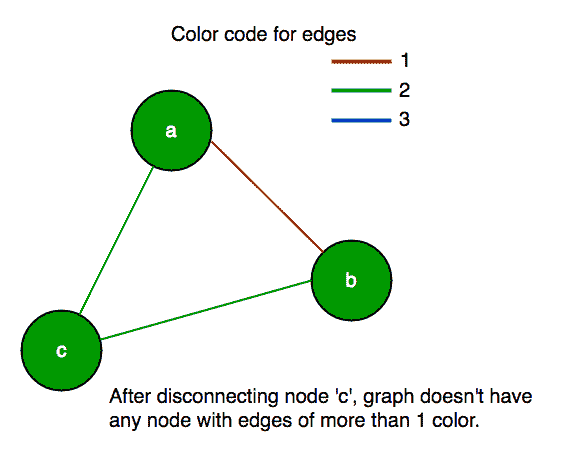
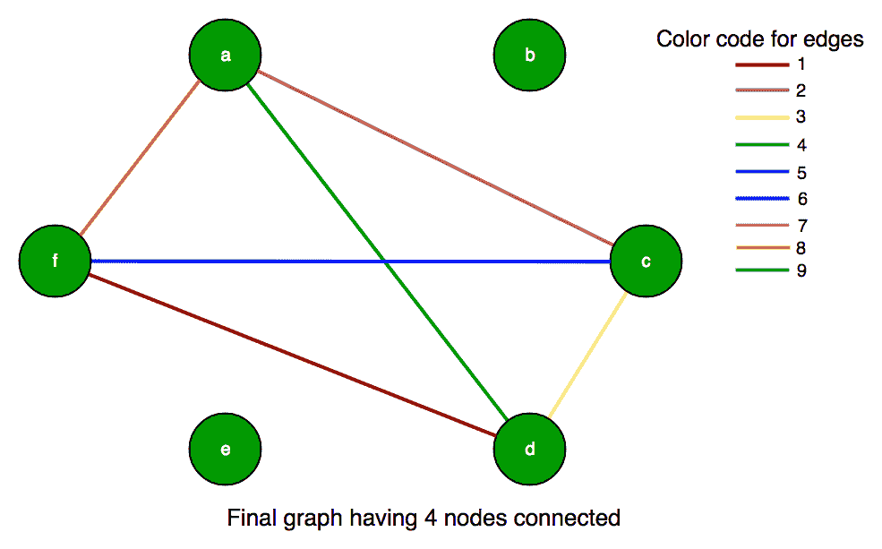

# 具有 2 种或更多颜色的边缘的图顶点的最大子集

> 原文： [https://www.geeksforgeeks.org/largest-subset-graph-vertices-edges-2-colors/](https://www.geeksforgeeks.org/largest-subset-graph-vertices-edges-2-colors/)

给定具有`N`个节点或顶点的无向完整图。 图的边缘是有色的，找到具有 2 种或更多种颜色的边缘的最大顶点子集。 给出图作为邻接矩阵 C [] []，其中 C [i] [j]是从顶点 i 到顶点 j 的边缘颜色。 由于图是无向的，因此 C [j] [i]的值 C [i] [j]相同。

我们将 C [i] [i]定义为零，尽管不存在这样的边。 即该图不包含自环。

**示例**：

```
<u>Example 1:</u> 
Input : C[][]= {{0, 1, 2},
                {1, 0, 3},
                {2, 3, 0}} 
Output : 3


<u>Example 2:</u> 
Input  : C[][]= {{0, 1, 1},
                {1, 0, 3},
                {1, 3, 0}} 
Output : 0


```

由于图形是完整的，因此每个边缘可以是 n *（n-1）/ 2 +1 种不同颜色之一。 这些颜色标记为 0 到 n *（n-1）/ 2（含）。 但并非所有这些 n *（n-1）/ 2 +1 颜色都需要使用。 即，两个不同的边缘可能具有相同的颜色。

如果顶点的所有邻居都具有相同的颜色，则称其为“坏”。 显然，子集中不能有任何此类不良顶点，因此请从图形中移除此类不良顶点。 这可能会引入更多的坏顶点，但是我们可以继续重复此过程，直到找到没有坏顶点的子集。 因此，最后，我们应该保留一个没有任何不良顶点的图，这意味着子集中的每个顶点至少具有两个其他相邻顶点的不同颜色边缘。

**示例**：
<u>输入：</u>
让 C [6] [6]：
{{0，9，2，4，4，7，8}，
{9，0，9，9，7，9}，
{2，9，0，3，7，6}，
{4，9，3，0，7，1}，
{7，7，7，7，0，7}，
{8，9，6，1，7，0}}；
[](https://media.geeksforgeeks.org/wp-content/uploads/kargest-subset-of-graph-vertices-with-edges-of-2-or-more-colors-2.png)

<u>步骤 I：</u>首先，我们可以看到第 5 行（节点'e'）仅包含 7 个，表示节点'e'是通过颜色代码为 7 的边连接的，因此它不止一种颜色 边缘，所以我们必须从子集中删除 5。 现在，我们的图形将仅包含 5 个顶点，并且为：
C [5] [5]：
{{0，9，2，4，4，8}，
{9，0，9， 9，9}，
{2，9，0，3，6}，
{4，9，3，0，1}，
{8，9，6，1，0}} ;
[](https://media.geeksforgeeks.org/wp-content/uploads/kargest-subset-of-graph-vertices-with-edges-of-2-or-more-colors-3.png)

<u>步骤 II：</u>此外，我们可以看到第 2 行（节点“ b”）也不包含超过 1 个颜色边，因此我们也应删除第 2 行和第 2 列。 结果在我们的新图中显示为：
C [4] [4]：
{{0，2，4，8}，
{2，0，3，6}，
{ 4，3，0，1}，
{8，6，1，0}};
[](https://media.geeksforgeeks.org/wp-content/uploads/kargest-subset-of-graph-vertices-with-edges-of-2-or-more-colors-4.png)

<u>步骤 III：</u>现在，我们可以看到每个顶点具有 1 个以上不同的颜色边缘。 因此，子集中的顶点总数为 4。

## C++

```cpp

// C++ program to find size of subset of graph vertex 
// such that each vertex has more than 1 color edges 
#include <bits/stdc++.h> 
using namespace std; 

// Number of vertices 
const int N = 6; 

// function to calculate max subset size 
int subsetGraph(int C[][N]) 
{ 
    // set for number of vertices 
    set<int> vertices; 
    for (int i = 0; i < N; ++i) 
        vertices.insert(i); 

    // loop for deletion of vertex from set 
    while (!vertices.empty()) 
    { 
        // if subset has only 1 vertex return 0 
        if (vertices.size() == 1) 
            return 1; 

        // for each vertex iterate and keep removing 
        // a vertix while we find a vertex with all 
        // edges of same color. 
        bool someone_removed = false; 
        for (int x : vertices) 
        { 
            // note down different color values 
            // for each vertex 
            set<int> values; 
            for (int y : vertices) 
                if (y != x) 
                    values.insert(C[x][y]); 

            // if only one color is found 
            // erase that vertex (bad vertex) 
            if (values.size() == 1) 
            { 
                vertices.erase(x); 
                someone_removed = true; 
                break; 
            } 
        } 

        // If no vertex was removed in the 
        // above loop. 
        if (!someone_removed) 
            break; 
    } 

    return (vertices.size()); 
} 

// Driver program 
int main() 
{ 
    int C[][N] = {{0, 9, 2, 4, 7, 8}, 
        {9, 0, 9, 9, 7, 9}, 
        {2, 9, 0, 3, 7, 6}, 
        {4, 9, 3, 0, 7, 1}, 
        {7, 7, 7, 7, 0, 7}, 
        {8, 9, 6, 1, 7, 0} 
    }; 
    cout << subsetGraph(C); 
    return 0; 
} 

```

## Java

```java

// Java program to find size of  
// subset of graph vertex such that  
// each vertex has more than 1 color edges  
import java.util.*; 

class GFG  
{ 

    // Number of vertices  
    static int N = 6; 

    // function to calculate max subset size  
    static int subsetGraph(int C[][]) 
    { 
        // set for number of vertices  
        HashSet<Integer> vertices = new HashSet<>(); 
        for (int i = 0; i < N; ++i)  
        { 
            vertices.add(i); 
        } 

        // loop for deletion of vertex from set  
        while (!vertices.isEmpty()) 
        { 

            // if subset has only 1 vertex return 0  
            if (vertices.size() == 1) 
            { 
                return 1; 
            } 

            // for each vertex iterate and keep removing  
            // a vertix while we find a vertex with all  
            // edges of same color.  
            boolean someone_removed = false; 
            for (int x : vertices)  
            { 

                // note down different color values  
                // for each vertex  
                HashSet<Integer> values = new HashSet<>(); 
                for (int y : vertices)  
                { 
                    if (y != x)  
                    { 
                        values.add(C[x][y]); 
                    } 
                } 

                // if only one color is found  
                // erase that vertex (bad vertex)  
                if (values.size() == 1)  
                { 
                    vertices.remove(x); 
                    someone_removed = true; 
                    break; 
                } 
            } 

            // If no vertex was removed in the  
            // above loop.  
            if (!someone_removed)  
            { 
                break; 
            } 
        } 

        return (vertices.size()); 
    } 

    // Driver code  
    public static void main(String[] args) 
    { 
        int C[][] = {{0, 9, 2, 4, 7, 8}, 
        {9, 0, 9, 9, 7, 9}, 
        {2, 9, 0, 3, 7, 6}, 
        {4, 9, 3, 0, 7, 1}, 
        {7, 7, 7, 7, 0, 7}, 
        {8, 9, 6, 1, 7, 0} 
        }; 
        System.out.println(subsetGraph(C)); 
    } 
}  

// This code has been contributed by 29AjayKumar 

```

## Python3

```

# Python3 program to find size of subset  
# of graph vertex such that each vertex 
# has more than 1 color edges 

# function to calculate max subset size  
def subsetGraph(C): 
    global N 

    # set for number of vertices  
    vertices = set() 
    for i in range(N): 
        vertices.add(i)  

    # loop for deletion of vertex from set  
    while (len(vertices) != 0): 

        # if subset has only 1 vertex return 0  
        if (len(vertices) == 1):  
            return 1

        # for each vertex iterate and keep removing  
        # a vertix while we find a vertex with all  
        # edges of same color.  
        someone_removed = False
        for x in vertices: 

            # note down different color values  
            # for each vertex  
            values = set() 
            for y in vertices: 
                if (y != x):  
                    values.add(C[x][y])  

            # if only one color is found  
            # erase that vertex (bad vertex)  
            if (len(values) == 1): 
                vertices.remove(x)  
                someone_removed = True
                break

        # If no vertex was removed in the  
        # above loop.  
        if (not someone_removed):  
            break

    return len(vertices) 

# Driver Code 

# Number of vertices  
N = 6
C = [[0, 9, 2, 4, 7, 8],  
     [9, 0, 9, 9, 7, 9], 
     [2, 9, 0, 3, 7, 6], 
     [4, 9, 3, 0, 7, 1], 
     [7, 7, 7, 7, 0, 7], 
     [8, 9, 6, 1, 7, 0]] 
print(subsetGraph(C)) 

# This code is contributed by PranchalK 

```

## C#

```cs

// C# program to find size of  
// subset of graph vertex such that  
// each vertex has more than 1 color edges  
using System; 
using System.Collections.Generic;  

class GFG  
{ 

    // Number of vertices  
    static int N = 6; 

    // function to calculate max subset size  
    static int subsetGraph(int [,]C) 
    { 
        // set for number of vertices  
        HashSet<int> vertices = new HashSet<int>(); 
        for (int i = 0; i < N; ++i)  
        { 
            vertices.Add(i); 
        } 

        // loop for deletion of vertex from set  
        while (vertices.Count != 0) 
        { 

            // if subset has only 1 vertex return 0  
            if (vertices.Count == 1) 
            { 
                return 1; 
            } 

            // for each vertex iterate and keep removing  
            // a vertix while we find a vertex with all  
            // edges of same color.  
            Boolean someone_removed = false; 
            foreach (int x in vertices)  
            { 

                // note down different color values  
                // for each vertex  
                HashSet<int> values = new HashSet<int>(); 
                foreach (int y in vertices)  
                { 
                    if (y != x)  
                    { 
                        values.Add(C[x, y]); 
                    } 
                } 

                // if only one color is found  
                // erase that vertex (bad vertex)  
                if (values.Count == 1)  
                { 
                    vertices.Remove(x); 
                    someone_removed = true; 
                    break; 
                } 
            } 

            // If no vertex was removed in the  
            // above loop.  
            if (!someone_removed)  
            { 
                break; 
            } 
        } 

        return (vertices.Count); 
    } 

    // Driver code  
    public static void Main(String[] args) 
    { 
        int [,]C = {{0, 9, 2, 4, 7, 8}, 
                    {9, 0, 9, 9, 7, 9}, 
                    {2, 9, 0, 3, 7, 6}, 
                    {4, 9, 3, 0, 7, 1}, 
                    {7, 7, 7, 7, 0, 7}, 
                    {8, 9, 6, 1, 7, 0}}; 
        Console.WriteLine(subsetGraph(C)); 
    } 
} 

// This code is contributed by Rajput-Ji 

```

**输出**：

```
4

```

本文由 **[Shivam Pradhan（anuj_charm）](https://www.facebook.com/anuj.charm)** 提供。 如果您喜欢 GeeksforGeeks 并希望做出贡献，则还可以使用 [tribution.geeksforgeeks.org](http://www.contribute.geeksforgeeks.org) 撰写文章，或将您的文章邮寄至 tribution@geeksforgeeks.org。 查看您的文章出现在 GeeksforGeeks 主页上，并帮助其他 Geeks。

如果发现任何不正确的地方，或者想分享有关上述主题的更多信息，请写评论。

