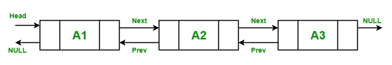

# C#

> 原文：[https://www.geeksforgeeks.org/linked-list-implementation-in-c-sharp/](https://www.geeksforgeeks.org/linked-list-implementation-in-c-sharp/)

中的链表实现

[**LinkedList**](https://www.geeksforgeeks.org/linked-list-set-1-introduction/) 是一种线性数据结构，将元素存储在非连续位置。 链表中的元素使用指针相互链接。 换句话说，LinkedList 由节点组成，其中每个节点包含一个数据字段和到列表中下一个节点的引用（链接）。

在 C#中，LinkedList 是集合的通用类型，它在 **System.Collections.Generic** 命名空间中定义。 它是一个*双链表*，因此，每个节点都指向下一个节点，并指向上一个节点。 它是一个动态集合，可以根据您的程序的需要进行扩展。 它还提供了快速的插入和删除元素。



**要点**：

*   LinkedList 类实现了 *ICollection < T >* ， *IEnumerable < T >* ， *IReadOnlyCollection < T >* ， *ICollection* ， *IEnumerable* ， *IDeserializationCallback* 和*可序列化*接口。

*   它还支持枚举器。

*   您可以删除节点并将它们重新插入同一列表或另一个列表中，这将导致在堆上没有分配其他对象。

*   LinkedList <t>对象中的每个节点的类型为 LinkedListNode <t>。</t></t>

*   它不支持链接，拆分，循环或其他可能会使列表处于不一致状态的功能。

*   如果 LinkedList 为空，则 First 和 Last 属性包含 null。

*   LinkedList 的容量是 LinkedList 可以容纳的元素数。

*   在 LinkedList 中，允许存储重复的但类型相同的元素。

#### 如何创建一个 LinkedList？

LinkedList 类具有 3 个用于创建 LinkedList 的构造函数，如下所示：

*   **LinkedList（）**：此构造函数用于创建为空的 LinkedList 类的实例。

*   **LinkedList（IEnumerable）**：此构造函数用于创建 LinkedList 类的实例，该实例包含从指定 IEnumerable 复制的元素，并具有足够的容量来容纳复制的元素数量。

*   **LinkedList（SerializationInfo，StreamingContext）**：此构造函数用于创建 LinkedList 类的实例，该实例可使用指定的 SerializationInfo 和 StreamingContext 进行序列化。

让我们看看如何使用 *LinkedList（）*构造函数创建 LinkedList：

**步骤 1**：借助关键字，在*的帮助下在程序中包含 *System.Collections.Generic* 命名空间：*

```
using System.Collections.Generic;
```

**步骤 2**：使用 LinkedList 类创建一个 LinkedList，如下所示：

> LinkedList <type_of_linkedlist>linkedlist_name = new LinkedList <type_of_linkedlist>（）;</type_of_linkedlist></type_of_linkedlist>

**步骤 3**：LinkedList 提供 4 种不同的方法来添加节点，这些方法是：

*   **AddAfter**：此方法用于在 LinkedList 中的现有节点之后添加新节点或值。

*   **AddBefore**：此方法用于在 LinkedList 中的现有节点之前添加新节点或值。

*   **[AddFirst](https://www.geeksforgeeks.org/c-adding-new-node-or-value-at-the-start-of-linkedlistt/) **：此方法用于在 LinkedList 的开始处添加新的节点或值。

*   **[AddLast](https://www.geeksforgeeks.org/c-adding-new-node-or-value-at-the-end-of-linkedlistt/) **：此方法用于在 LinkedList 的末尾添加新节点或值。

**步骤 4**：使用 foreach 循环或使用 for 循环访问 LinkedList 的元素。 如下例所示。

**示例**：

```

// C# program to illustrate how  
// to create a LinkedList 
using System; 
using System.Collections.Generic; 

class GFG { 

    // Main Method 
    static public void Main() 
    { 

        // Creating a linkedlist 
        // Using LinkedList class 
        LinkedList<String> my_list = new LinkedList<String>(); 

        // Adding elements in the LinkedList 
        // Using AddLast() method 
        my_list.AddLast("Zoya"); 
        my_list.AddLast("Shilpa"); 
        my_list.AddLast("Rohit"); 
        my_list.AddLast("Rohan"); 
        my_list.AddLast("Juhi"); 
        my_list.AddLast("Zoya"); 

        Console.WriteLine("Best students of XYZ university:"); 

        // Accessing the elements of  
        // LinkedList Using foreach loop 
        foreach(string str in my_list) 
        { 
            Console.WriteLine(str); 
        } 
    } 
} 

```

**Output:**

```
Best students of XYZ university:
Zoya
Shilpa
Rohit
Rohan
Juhi
Zoya

```

#### 如何从 LinkedList 中删除元素？

在 LinkedList 中，允许从 LinkedList 中删除元素。 LinkedList <t>类提供 5 种不同的方法来删除元素，这些方法是：</t>

*   [**Clear（）**](https://www.geeksforgeeks.org/c-removing-all-nodes-from-linkedlistt/)：此方法用于从 LinkedList 中删除所有节点。

*   [**Remove（LinkedListNode）**](https://www.geeksforgeeks.org/c-removing-the-specified-node-from-the-linkedlistt/)：此方法用于从 LinkedList 中删除指定的节点。

*   [**Remove（T）**](https://www.geeksforgeeks.org/c-removing-first-occurrence-of-specified-value-from-linkedlistt/)：此方法用于从 LinkedList 中删除第一次出现的指定值。

*   [**RemoveFirst（）**](https://www.geeksforgeeks.org/c-removing-the-node-at-the-start-of-the-linkedlistt/)：此方法用于删除 LinkedList 开始处的节点。

*   [**RemoveLast（）**](https://www.geeksforgeeks.org/c-removing-the-node-at-the-start-of-the-linkedlistt/)：此方法用于删除 LinkedList 末尾的节点。

**示例**：

```

// C# program to illustrate how to 
// remove elements from LinkedList 
using System; 
using System.Collections.Generic; 

class GFG { 

    // Main Method 
    static public void Main() 
    { 

        // Creating a linkedlist 
        // Using LinkedList class 
        LinkedList<String> my_list = new LinkedList<String>(); 

        // Adding elements in the LinkedList 
        // Using AddLast() method 
        my_list.AddLast("Zoya"); 
        my_list.AddLast("Shilpa"); 
        my_list.AddLast("Rohit"); 
        my_list.AddLast("Rohan"); 
        my_list.AddLast("Juhi"); 
        my_list.AddLast("Zoya"); 

        // Inital number of elements 
        Console.WriteLine("Best students of XYZ "+ 
                         "university initially:"); 

        // Accessing the elements of  
        // Linkedlist Using foreach loop 
        foreach(string str in my_list) 
        { 
            Console.WriteLine(str); 
        } 

        // After using Remove(LinkedListNode) 
        // method 
        Console.WriteLine("Best students of XYZ"+ 
                         " university in 2000:"); 

        my_list.Remove(my_list.First); 

        foreach(string str in my_list) 
        { 
            Console.WriteLine(str); 
        } 

        // After using Remove(T) method 
        Console.WriteLine("Best students of XYZ"+ 
                         " university in 2001:"); 

        my_list.Remove("Rohit"); 

        foreach(string str in my_list) 
        { 
            Console.WriteLine(str); 
        } 

        // After using RemoveFirst() method 
        Console.WriteLine("Best students of XYZ"+ 
                         " university in 2002:"); 

        my_list.RemoveFirst(); 

        foreach(string str in my_list) 
        { 
            Console.WriteLine(str); 
        } 

        // After using RemoveLast() method 
        Console.WriteLine("Best students of XYZ"+ 
                         " university in 2003:"); 

        my_list.RemoveLast(); 

        foreach(string str in my_list) 
        { 
            Console.WriteLine(str); 
        } 

        // After using Clear() method 
        my_list.Clear(); 
        Console.WriteLine("Number of students: {0}", 
                                     my_list.Count); 
    } 
} 

```

**Output:**

```
Best students of XYZ university initially:
Zoya
Shilpa
Rohit
Rohan
Juhi
Zoya
Best students of XYZ university in 2000:
Shilpa
Rohit
Rohan
Juhi
Zoya
Best students of XYZ university in 2001:
Shilpa
Rohan
Juhi
Zoya
Best students of XYZ university in 2002:
Rohan
Juhi
Zoya
Best students of XYZ university in 2003:
Rohan
Juhi
Number of students: 0

```

#### 如何检查 LinkedList 中元素的可用性？

在 LinkedList 中，可以使用 [Contains（T）](https://www.geeksforgeeks.org/c-check-if-a-value-is-in-linkedlistt/)方法检查给定值是否存在。 此方法用于确定值是否在 LinkedList 中。

**示例**：

```

// C# program to illustrate how  
// to check whether the given  
// element is present or not  
// in the LinkedList 
using System; 
using System.Collections.Generic; 

class GFG { 

    // Main Method 
    static public void Main() 
    { 

        // Creating a linkedlist 
        // Using LinkedList class 
        LinkedList<String> my_list = new LinkedList<String>(); 

        // Adding elements in the Linkedlist 
        // Using AddLast() method 
        my_list.AddLast("Zoya"); 
        my_list.AddLast("Shilpa"); 
        my_list.AddLast("Rohit"); 
        my_list.AddLast("Rohan"); 
        my_list.AddLast("Juhi"); 

        // Check if the given element 
        // is available or not 
        if (my_list.Contains("Shilpa") == true)  
        { 
            Console.WriteLine("Element Found...!!"); 
        } 
        else 
        { 
            Console.WriteLine("Element Not found...!!"); 
        } 
    } 
} 

```

**Output:**

```
Element Found...!!

```


* * *

* * *

如果您喜欢 GeeksforGeeks 并希望做出贡献，则还可以使用 [tribution.geeksforgeeks.org](https://contribute.geeksforgeeks.org/) 撰写文章，或将您的文章邮寄至 tribution@geeksforgeeks.org。 查看您的文章出现在 GeeksforGeeks 主页上，并帮助其他 Geeks。

如果您发现任何不正确的地方，请单击下面的“改进文章”按钮，以改进本文。