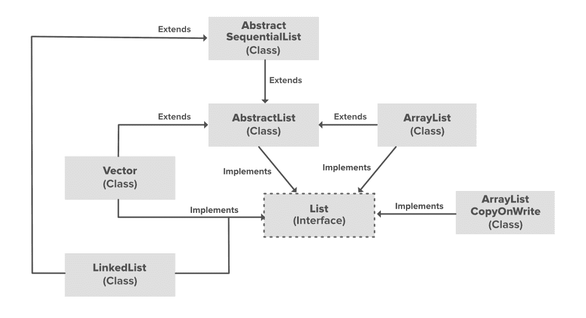

# Java 中的

# LinkedList

链表是 [java.util 包](https://www.geeksforgeeks.org/java-util-package-java/)中[集合框架](https://www.geeksforgeeks.org/collections-in-java-2/)的一部分。 此类是 [LinkedList 数据结构](https://www.geeksforgeeks.org/data-structures/linked-list/)的实现，该结构是一种线性数据结构，其中元素未存储在连续位置，并且每个元素都是具有数据部分和地址部分的单独对象。 元素使用指针和地址链接。 每个元素称为一个节点。 由于动态性以及插入和删除的简便性，它们比阵列更可取。 它还有一些缺点，例如无法直接访问节点，而我们需要从头开始并通过链接到达要访问的节点。

**示例：**以下实现演示了如何创建和使用链接列表。

```

import java.util.*; 

public class Test { 

    public static void main(String args[]) 
    { 
        // Creating object of the 
        // class linked list 
        LinkedList<String> ll 
            = new LinkedList<String>(); 

        // Adding elements to the linked list 
        ll.add("A"); 
        ll.add("B"); 
        ll.addLast("C"); 
        ll.addFirst("D"); 
        ll.add(2, "E"); 

        System.out.println(ll); 

        ll.remove("B"); 
        ll.remove(3); 
        ll.removeFirst(); 
        ll.removeLast(); 

        System.out.println(ll); 
    } 
} 

```

**Output:**

```
[D, A, E, B, C]
[A]

```

### 在 ArrayList 上执行各种操作

让我们看看如何在 LinkedList 上执行一些基本操作。

**1.添加元素：**为了向 ArrayList 添加元素，我们可以使用 [add（）方法](https://www.geeksforgeeks.org/java-util-linkedlist-add-method-in-java/)。 重载此方法可以根据不同的参数执行多项操作。 他们是：

*   **add（Object）：**此方法用于在 LinkedList 的末尾添加元素。

*   **add（int index，Object）：**此方法用于在 LinkedList 中的特定索引处添加元素。

```

// Java program to add elements  
// to a LinkedList 

import java.util.*;  

public class GFG {  

    public static void main(String args[])  
    {  
        LinkedList<String> ll = new LinkedList<>();  

        ll.add("Geeks");  
        ll.add("Geeks");  
        ll.add(1, "For");  

        System.out.println(ll);  
    }  
}  

```

**Output:**

```
[Geeks, For, Geeks]

```

**2.更改元素：**添加元素之后，如果要更改元素，可以使用 [set（）方法](https://www.geeksforgeeks.org/linkedlist-set-method-in-java/)来完成。 由于 LinkedList 已建立索引，因此我们希望更改的元素由该元素的索引引用。 因此，此方法采用索引和需要在该索引处插入的更新元素。

```

// Java program to change elements  
// in a LinkedList  

import java.util.*;  

public class GFG {  

    public static void main(String args[])  
    {  
        LinkedList<String> ll = new LinkedList<>();  

        ll.add("Geeks");  
        ll.add("Geeks");  
        ll.add(1, "Geeks");  

        System.out.println("Initial LinkedList " + ll);  

        ll.set(1, "For");  

        System.out.println("Updated LinkedList " + ll);  
    }  
}  

```

**Output:**

```
Initial LinkedList [Geeks, Geeks, Geeks]
Updated LinkedList [Geeks, For, Geeks]

```

**3.删除元素：**为了从 LinkedList 中删除元素，我们可以使用 [remove（）方法](https://www.geeksforgeeks.org/linkedlist-remove-method-in-java/)。 重载此方法可以根据不同的参数执行多项操作。 他们是：

*   **remove（Object）：**此方法仅用于从 LinkedList 中删除对象。 如果存在多个这样的对象，那么将删除第一次出现的对象。

*   **remove（int index）：**由于对 LinkedList 进行了索引，因此此方法采用一个整数值，该值简单地删除存在于 LinkedList 中该特定索引处的元素。 删除元素之后，所有元素都将移至左侧以填充空间，并且对象的索引将更新。

```

// Java program to remove elements  
// in a LinkedList 

import java.util.*;  

public class GFG {  

    public static void main(String args[])  
    {  
        LinkedList<String> ll = new LinkedList<>();  

        ll.add("Geeks");  
        ll.add("Geeks");  
        ll.add(1, "For");  

        System.out.println(  
            "Initial LinkedList " + ll);  

        ll.remove(1);  

        System.out.println(  
            "After the Index Removal " + ll);  

        ll.remove("Geeks");  

        System.out.println(  
            "After the Object Removal " + ll);  
    }  
}  

```

**Output:**

```
Initial LinkedList [Geeks, For, Geeks]
After the Index Removal [Geeks, Geeks]
After the Object Removal [Geeks]

```

**4.迭代 LinkedList：**有多种方法可以迭代 LinkedList。 最著名的方法是将基本的 for 循环与 [get（）方法](https://www.geeksforgeeks.org/linkedlist-get-method-in-java/)结合使用，以特定的索引获取元素，并使用高级的 for 循环。

```

// Java program to iterate the elements  
// in an LinkedList 

import java.util.*;  

public class GFG {  

    public static void main(String args[])  
    {  
        LinkedList<String> ll  
            = new LinkedList<>();  

        ll.add("Geeks");  
        ll.add("Geeks");  
        ll.add(1, "For");  

        // Using the Get method and the  
        // for loop  
        for (int i = 0; i < ll.size(); i++) {  

            System.out.print(ll.get(i) + " ");  
        }  

        System.out.println();  

        // Using the for each loop  
        for (String str : ll)  
            System.out.print(str + " ");  
    }  
}  

```

**Output:**

```
Geeks For Geeks 
Geeks For Geeks 

```

[](https://media.geeksforgeeks.org/wp-content/uploads/20200624224531/List-ArrayList-in-Java-In-Depth-Study.png)

在上图中， [AbstractList](https://www.geeksforgeeks.org/abstractlist-in-java-with-examples/) ， [CopyOnWriteArrayList](https://www.geeksforgeeks.org/copyonwritearraylist-in-java/) 和 [AbstractSequentialList](https://www.geeksforgeeks.org/abstractsequentiallist-in-java-with-examples/) 是实现列表接口的类。 在每个提到的类中实现了单独的功能。 他们是：

1.  **AbstractList：**此类用于实现不可修改的列表，为此，只需扩展此 AbstractList 类并仅实现 get（）和 size（）方法。

2.  **CopyOnWriteArrayList：**此类实现列表接口。 它是 ArrayList 的增强版本，其中的所有修改（添加，设置，删除等）都是通过制作列表的新副本来实现的。

3.  **AbstractSequentialList：**此类实现 Collection 接口和 AbstractCollection 类。 此类用于实现不可修改的列表，对于该列表，只需扩展此 AbstractList 类并仅实现 get（）和 size（）方法。

### LinkedList 如何在内部工作？

由于 LinkedList 充当动态数组，并且我们在创建它时不必指定大小，因此当我们动态添加和删除项目时，列表的大小会自动增加。 而且，元素不是以连续方式存储的。 因此，不需要增加尺寸。 在内部，使用[双链表数据结构](https://www.geeksforgeeks.org/doubly-linked-list/)实现 LinkedList。 普通链表和双向链表之间的主要区别在于，双向链表包含一个额外的指针，通常称为前一个指针，以及下一个指针和单链表中的数据。

### LinkedList 中的构造方法

为了创建一个 LinkedList，我们需要创建一个 LinkedList 类的对象。 LinkedList 类由各种构造函数组成，这些构造函数允许创建列表。 以下是此类中可用的构造函数：

1.  **LinkedList（）：**此构造函数用于创建一个空的链表。 如果我们希望创建一个名称为 ll 的空 LinkedList，则可以将其创建为：

    > LinkedList ll = new LinkedList（）；

2.  **LinkedList（Collection C）：**此构造函数用于创建一个有序列表，其中包含指定集合的​​所有元素，由集合的迭代器返回。 如果我们希望创建一个名称为 ll 的链表，则可以将其创建为：

    > LinkedList ll =新的 LinkedList（C）；

### Java LinkedList 的方法

| 方法 | 描述 |

| [**add（int index，E element）**](https://www.geeksforgeeks.org/java-util-linkedlist-add-method-in-java/) | 此方法将指定的元素插入此列表中的指定位置。 |

| [**add（E e）**](https://www.geeksforgeeks.org/java-util-linkedlist-add-method-in-java/) | 此方法将指定的元素追加到此列表的末尾。 |

| [**addAll（int index，Collection < E > c）**](https://www.geeksforgeeks.org/java-util-linkedlist-addall-method-in-java/) | 此方法从指定位置开始将指定集合中的所有元素插入此列表。 |

| [**addAll（Collection < E > c）**](https://www.geeksforgeeks.org/java-util-linkedlist-addall-method-in-java/) | 此方法按照指定集合的​​迭代器返回的顺序，将指定集合中的所有元素追加到此列表的末尾。 |

| [**addFirst（E e）**](https://www.geeksforgeeks.org/linkedlist-addfirst-method-in-java/) | 此方法将指定的元素插入此列表的开头。 |

| [**addLast（E e）**](https://www.geeksforgeeks.org/linkedlist-addlast-method-in-java/) | 此方法将指定的元素追加到此列表的末尾。 |

| [**clear（）**](https://www.geeksforgeeks.org/linkedlist-clear-method-in-java/) | 此方法从此列表中删除所有元素。 |

| [**clone（）**](https://www.geeksforgeeks.org/linkedlist-clone-method-in-java/) | 此方法返回此 LinkedList 的浅表副本。 |

| [**包含（对象 o）**](https://www.geeksforgeeks.org/linkedlist-contains-method-in-java/) | 如果此列表包含指定的元素，则此方法返回 true。 |

| [**endingIterator（）**](https://www.geeksforgeeks.org/linkedlist-descendingiterator-method-in-java-with-examples/) | 此方法以相反的顺序在此双端队列中返回元素的迭代器。 |

| [**element（）**](https://www.geeksforgeeks.org/linkedlist-element-method-in-java-with- examples/) | 此方法检索但不删除此列表的头（第一个元素）。 |

| [**get（int 索引）**](https://www.geeksforgeeks.org/linkedlist-get-method-in-java/) | 此方法返回此列表中指定位置的元素。 |

| [**getFirst（）**](https://www.geeksforgeeks.org/java-util-linkedlist-get-getfirst-getlast-java/) | 此方法返回此列表中的第一个元素。 |

| [**getLast（）**](https://www.geeksforgeeks.org/linkedlist-getlast-method-in-java/) | 此方法返回此列表中的最后一个元素。 |

| [**indexOf（Object o）**](https://www.geeksforgeeks.org/linkedlist-indexof-method-in-java/) | 此方法返回此列表中指定元素的第一个匹配项的索引；如果此列表不包含该元素，则返回-1。 |

| [**lastIndexOf（Object o）**](https://www.geeksforgeeks.org/linkedlist-lastindexof-method-in-java/) | 此方法返回此列表中指定元素的最后一次出现的索引；如果此列表不包含该元素，则返回-1。 |

| [**listIterator（int index）**](https://www.geeksforgeeks.org/linkedlist-listiterator-method-in-java/) | 此方法从列表中的指定位置开始（按适当顺序）返回此列表中元素的列表迭代器。 |

| [**报价（E e）**](https://www.geeksforgeeks.org/java-util-linkedlist-offer-offerfirst-offerlast-java/) | 此方法将指定的元素添加为此列表的尾部（最后一个元素）。 |

| [**offerFirst（E e）**](https://www.geeksforgeeks.org/java-util-linkedlist-offer-offerfirst-offerlast-java/) | 此方法将指定的元素插入此列表的开头。 |

| [**报价最后（E e）**](https://www.geeksforgeeks.org/java-util-linkedlist-offer-offerfirst-offerlast-java/) | 此方法将指定的元素插入此列表的末尾。 |

| [**peek（）**](https://www.geeksforgeeks.org/java-util-linkedlist-peek-peekfirst-peeklast-java/) | 此方法检索但不删除此列表的头（第一个元素）。 |

| [**peekFirst（）**](https://www.geeksforgeeks.org/java-util-linkedlist-peek-peekfirst-peeklast-java/) | 此方法检索但不删除此列表的第一个元素，如果此列表为空，则返回 null。 |

| [**peekLast（）**](https://www.geeksforgeeks.org/java-util-linkedlist-peek-peekfirst-peeklast-java/) | 此方法检索但不删除此列表的最后一个元素，如果此列表为空，则返回 null。 |

| [**poll（）**](https://www.geeksforgeeks.org/java-util-linkedlist-poll-pollfirst-polllast- examples-java/) | 此方法检索并删除此列表的头（第一个元素）。 |

| [**pollFirst（）**](https://www.geeksforgeeks.org/java-util-linkedlist-poll-pollfirst-polllast- examples-java/) | 此方法检索并删除此列表的第一个元素，如果此列表为空，则返回 null。 |

| [**pollLast（）**](https://www.geeksforgeeks.org/java-util-linkedlist-poll-pollfirst-polllast- examples-java/) | 此方法检索并删除此列表的最后一个元素，如果此列表为空，则返回 null。 |

| [**pop（）**](https://www.geeksforgeeks.org/linkedlist-pop-method-in-java/) | 此方法从此列表表示的堆栈中弹出一个元素。 |

| [**push（E e）**](https://www.geeksforgeeks.org/linkedlist-push-method-in-java/) | 此方法将元素压入此列表表示的堆栈。 |

| [**remove（）**](https://www.geeksforgeeks.org/linkedlist-remove-method-in-java/) | 此方法检索并删除此列表的头（第一个元素）。 |

| [**remove（int index）**](https://www.geeksforgeeks.org/linkedlist-remove-method-in-java/) | 此方法删除此列表中指定位置的元素。 |

| [**移除（对象 o）**](https://www.geeksforgeeks.org/linkedlist-remove-method-in-java/) | 如果存在，此方法将从列表中删除第一次出现的指定元素。 |

| [**removeFirst（）**](https://www.geeksforgeeks.org/linkedlist-removefirst-method-in-java/) | 此方法从此列表中删除并返回第一个元素。 |

| [**removeFirstOccurrence（Object o）**](https://www.geeksforgeeks.org/linkedlist-removefirstoccurrence-method-in- java/) | 此方法删除指定元素在此列表中的首次出现（当从头到尾遍历列表时）。 |

| [**removeLast（）**](https://www.geeksforgeeks.org/linkedlist-removelast-method-in-java/) | 此方法从列表中删除并返回最后一个元素。 |

| [**removeLastOccurrence（Object o）**](https://www.geeksforgeeks.org/linkedlist-removelastoccurrence-method-in-java-with-example/) | 此方法删除该列表中最后一次出现的指定元素（当从头到尾遍历列表时）。 |

| [**set（int index，E element）**](https://www.geeksforgeeks.org/linkedlist-set-method-in-java/) | 此方法用指定的元素替换此列表中指定位置的元素。 |

| [**size（）**](https://www.geeksforgeeks.org/linkedlist-size-method-in-java/) | 此方法返回此列表中的元素数。 |

| [**splitter（）**](https://www.geeksforgeeks.org/linkedlist-spliterator-method-in-java/) | 此方法在此列表中的元素上创建后绑定和故障快速的 Spliterator。 |

| [**toArray（）**](https://www.geeksforgeeks.org/linkedlist-toarray-method-in-java-with-example/) | 此方法以正确的顺序（从第一个元素到最后一个元素）返回一个包含此列表中所有元素的数组。 |

| [**toArray（T [] a）**](https://www.geeksforgeeks.org/linkedlist-toarray-method-in-java-with-example/) | 此方法以正确的顺序（从第一个元素到最后一个元素）返回一个包含此列表中所有元素的数组。 返回数组的运行时类型是指定数组的运行时类型。 |

| **toString（）** | 此方法返回一个字符串，该字符串按适当顺序（从第一个元素到最后一个元素）包含此列表中的所有元素，每个元素用逗号分隔，并且该字符串括在方括号中。 |

