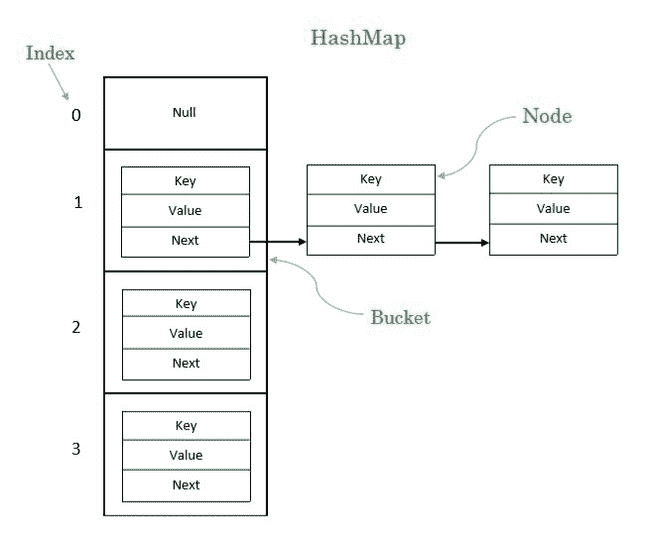

# 示例中的

> 原文：[https://www.geeksforgeeks.org/load-factor-in-hashmap-in-java-with-examples/](https://www.geeksforgeeks.org/load-factor-in-hashmap-in-java-with-examples/)

# Java HashMap 中的负载因子

[`HashMap`](http://www.geeksforgeeks.org/java-util-hashmap-in-java/)是一个类，用于实现 [Java 集合](https://www.geeksforgeeks.org/collections-in-java-2/)框架的[`Map`](https://www.geeksforgeeks.org/map-interface-java-examples/)接口。 `HashMap`的最重要特征是，对于**检索**和**插入**，它具有恒定的时间性能。 决定`HashMap`性能的两个因素是：

*   初始容量

*   负载系数

在我们解释什么是`HashMap`的负载因子之前，必须了解其结构。

`HashMap`具有包含键值对的节点，就像`Map`中的节点一样。 `HashMap`的存储桶包含节点，一个存储桶可能包含多个节点。 `HashMap`的基本结构如下：

`HashMap`的结构示意图

**索引**：它是对键的哈希值和数组大小减一执行按位与运算后获得的整数值。

> `index = hashCode(key) & (ArraySize – 1)`

其中`hashcode`是一个预定义函数，该函数返回键的哈希值的整数值，而`ArraySize`是`HashMap`中的存储桶数。

**存储桶**：它是节点的`LinkedList`结构。

**节点**：它是`HashMap`的基本单位。 它包含键值对和到下一个节点的链接。

声明`HashMap`对象的语法如下：

> `HashMap objectName = new HashMap(int initialCapacity, float loadFactor)`

### 初始容量

初始容量本质上是`HashMap`中的存储桶数，默认情况下为`2 ^ 4 = 16`。 好的`HashMap`算法会将相等数量的元素分配给所有存储桶。

假设我们有 16 个元素，那么每个存储桶将有 1 个节点，对任何元素的搜索将通过 1 个查找来实现。 如果我们有 32 个元素，则每个存储桶将有 2 个节点，对任何元素的搜索将通过 2 个查找来实现。 同样，如果我们有 64 个元素，则每个存储桶将有 4 个节点，对任何元素的搜索将通过 4 个查找来实现，依此类推。

正如您所观察到的，当元质数使查找增量数乘以 1 时，这对性能有好处。

但是，当元质数量达到非常高的值（例如 10,000）时会发生什么，在这种情况下，我们将需要 625 次查找。 同样，如果元质数量为 10,000,000，则将需要 62,500 次查找。 如此大量的查找将降低 HashMap 的性能。 这就是负载系数起作用的地方。

### 负载系数

负载因子是一个阈值，如果当前元素与初始容量的比率超过此阈值，则容量会增加，因此 HashMap 的操作复杂度保持为`O(1)`。`O(1)`的操作复杂度的含义意味着检索和插入操作需要固定的时间。

*HashMap 的默认加载因子为 **0.75f** 。*

#### *我们如何确定何时增加容量？*

让我们举个例子，由于默认的初始容量为 16，请考虑现在有 16 个存储桶。

> 我们插入第一个元素，当前负载系数将为`1/16 = 0.0625`。 检查是`0.0625 > 0.75`吗？ 答案是否定的，因此我们不会增加容量。
> 
> 接下来，我们插入第二个元素，当前负载系数将为`2/16 = 0.125`。 检查是`0.125 > 0.75`吗？ 答案是否定的，因此我们不会增加容量。
> 
> 同样，对于第三个元素，负载系数`= 3/16 = 0.1875`不大于 0.75，容量不变。
> 
> 第 4 个元素，负载系数`= 4/16 = 0.25`不大于 0.75，容量不变。
> 
> 第 5 个元素，负载系数`= 5/16 = 0.3125`不大于 0.75，容量不变。
> 
> 第 6 个元素，负载系数`= 6/16 = 0.375`不大于 0.75，容量不变。
> 
> 第 7 个元素，负载系数`= 7/16 = 0.4375`不大于 0.75，容量不变。
> 
> 第 8 个元素，负载系数`= 8/16 = 0.5`不大于 0.75，容量不变。
> 
> 第 9 个元素，负载系数`= 9/16 = 0.5625`不大于 0.75，容量不变。
> 
> 第 10 个元素，负载系数`= 10/16 = 0.625`不大于 0.75，容量不变。
> 
> 第 11 个元素，负载系数`= 11/16 = 0.6875`不大于 0.75，容量不变。
> 
> 第 12 个元素，负载系数`= 12/16 = 0.75`等于 0.75，但容量不变。
> 
> 第 13 个元素的负载系数`= 13/16 = 0.8125`大于 0.75，因此在第 13 个元素插入时，容量增加了一倍。
> 
> 现在容量为 32。

**以类似的方式，每次插入超过 0.75 的负载系数时，对于`get()`（检索）和`put()`（插入）操作的恒定时间性能，容量将增加一倍。**

* * *

* * *

