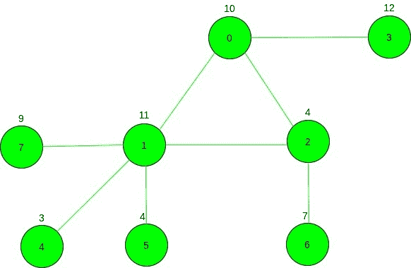

# 无向图中的最大成本路径，使得连续两次都没有访问任何边

> 原文： [https://www.geeksforgeeks.org/maximum-cost-path-in-an-undirected-graph-such-that-no-edge-is-visited-twice-in-a-row/](https://www.geeksforgeeks.org/maximum-cost-path-in-an-undirected-graph-such-that-no-edge-is-visited-twice-in-a-row/)

给定一个具有`N`个顶点和`M`边的无向图，并且每个顶点与一个成本相关联，并给出源顶点`S`。 任务是从源顶点`S`找到最大成本路径，以使没有边缘连续 2 次或更多次被访问。

**示例**：

> **输入**：N = 5，M = 5，源= 1，成本[] = {2，2，8，8，6，9}，如下图所示：
> 
> 
> 
> **输出**：21
> **说明**：
> 最大成本路径矩阵为：
> 1-> 2-> 0-> 1-> 4
> 费用= 2 + 8 + 2 + 2 + 9 = 21
> 
> **输入**：N = 8，M = 8，源= 3，成本[] = {10，11，4，12，3，4，7，9}
> 
> 
> 
> **输出**：46
> **说明**：
> 最大成本路径矩阵为：
> 3-> 0-> 2-> 1-> 7

**方法**：的想法是检查图中是否存在[循环，然后需要遍历循环的所有顶点，然后遍历图的最大叶节点 成本。 而且，如果循环不存在，那么问题语句将转换为在任何有向图中找到最大成本路径。](https://www.geeksforgeeks.org/detect-cycle-undirected-graph/)

以下是程序中使用的声明：

*   **dp [i]**：存储遍历节点**'i'**及其所有子节点的总费用。
*   **vis [i]**：标记已访问的节点。
*   **canTake**：存储最大成本路径的所有节点的总和，不包括叶顶点及其子节点（如果存在）。
*   最佳****：存储最大成本叶子节点及其子节点（如果存在）的成本。
*   **检查**：布尔变量用作在图形中查找循环的标志，找到循环后其值将更改为 0。

步骤如下：

1.  执行 [DFS 遍历](https://www.geeksforgeeks.org/depth-first-search-or-dfs-for-a-graph/)，并将标志变量检查设置为**'1'**，最初表示未找到循环。
2.  同时为每个节点构建 **dp []** ，并更新最大成本，直到遍历该节点为止。
3.  如果发现相邻节点已经访问过并且不是父节点，则找到循环并将 **check** 的值设置为`0`。
4.  将循环的所有节点的成本添加到 **canTake** 中。
5.  遍历遍历遍历节点的相邻节点后，未找到任何回路，则它表示从回路到叶顶点的路径成本，并且如果[ **dp [i]** 大于**最佳**。
6.  遍历图形后，将**和**和**最好**的和打印出来。

下面是上述方法的实现：

## C ++

```

// C++ program for the above approach
#include <bits/stdc++.h>
using namespace std;
const int N = 100000;

// To store the resulting
// sum of the cost
int canTake;

// To store largest
// cost leaf vertex
int best;

int dp[N];
bool vis[N];

// DFS Traversal to find the update
// the maximum cost of from any
// node to leaf
int dfs(vector<vector<int> >& g,
        int* cost, int u, int pre)
{

    // Mark vertex as visited
    vis[u] = true;

    // Store vertex initial cost
    dp[u] = cost[u];

    // Initially assuming edge
    // not to be traversed
    bool check = 1;

    int cur = cost[u];
    for (auto& x : g[u]) {

        // Back edge found so,
        // edge can be part of
        // traversal
        if (vis[x] && x != pre) {
            check = 0;
        }

        // New vertex is found
        else if (!vis[x]) {

            // Bitwise AND the current
            // check with the returned
            // check by the previous
            // DFS Call
            check &= dfs(g, cost, x, u);

            // Adds parent and its
            // children cost
            cur = max(cur,
                      cost[u] + dp[x]);
        }
    }

    // Updates total cost of parent
    // including child nodes
    dp[u] = cur;

    // Edge is part of the cycle
    if (!check) {

        // Add cost of vertex
        // to the answer
        canTake += cost[u];
    }
    else {

        // Updates the largest
        // cost leaf vertex
        best = max(best, dp[u]);
    }

    return check;
}

// Function to find the maximum cost
// from source vertex such that no
// two edges is traversed twice
int FindMaxCost(vector<vector<int> >& g,
                int* cost, int source)
{
    // DFS Call
    dfs(g, cost, source, -1);

    // Print the maximum cost
    cout << canTake + best;
}

// Driver Code
int main()
{
    int n = 5, m = 5;

    // Cost Array
    int cost[] = { 2, 2, 8, 6, 9 };

    vector<vector<int> > g(n);

    // Given Graph
    g[0].push_back(1);
    g[1].push_back(0);
    g[0].push_back(2);
    g[2].push_back(0);
    g[0].push_back(3);
    g[3].push_back(0);
    g[1].push_back(2);
    g[2].push_back(1);
    g[1].push_back(4);
    g[4].push_back(1);

    // Given Source Node
    int source = 1;

    // Function Call
    FindMaxCost(g, cost, source);
    return 0;
}

```

## 爪哇

```

// Java program for the above approach
import java.util.*;

class GFG{

static int N = 100000;

// To store the resulting
// sum of the cost
static int canTake;

// To store largest
// cost leaf vertex
static int best;

static int []dp = new int[N];
static boolean []vis = new boolean[N];

// DFS Traversal to find the update
// the maximum cost of from any
// node to leaf
static boolean dfs(Vector<Integer> []g,
                   int []cost, int u, int pre)
{

    // Mark vertex as visited
    vis[u] = true;

    // Store vertex initial cost
    dp[u] = cost[u];

    // Initially assuming edge
    // not to be traversed
    boolean check = true;

    int cur = cost[u];
    for(int x : g[u])
    {

        // Back edge found so,
        // edge can be part of
        // traversal
        if (vis[x] && x != pre)
        {
            check = false;
        }

        // New vertex is found
        else if (!vis[x]) 
        {

            // Bitwise AND the current
            // check with the returned
            // check by the previous
            // DFS Call
            check = dfs(g, cost, x, u) ? 
                    false : true;

            // Adds parent and its
            // children cost
            cur = Math.max(cur, cost[u] +
                                  dp[x]);
        }
    }

    // Updates total cost of parent
    // including child nodes
    dp[u] = cur;

    // Edge is part of the cycle
    if (!check) 
    {

        // Add cost of vertex
        // to the answer
        canTake += cost[u];
    }
    else
    {

        // Updates the largest
        // cost leaf vertex
        best = Math.max(best, dp[u]);
    }
    return check;
}

// Function to find the maximum cost
// from source vertex such that no
// two edges is traversed twice
static void FindMaxCost(Vector<Integer> [] g,
                        int []cost, int source)
{

    // DFS call
    dfs(g, cost, source, -1);

    // Print the maximum cost
    System.out.print(canTake + best);
}

// Driver Code
public static void main(String[] args)
{
    int n = 5, m = 5;

    // Cost Array
    int cost[] = { 2, 2, 8, 6, 9 };

    @SuppressWarnings("unchecked")
    Vector<Integer> []g = new Vector[n];
    for(int i = 0; i < g.length; i++)
        g[i] = new Vector<Integer>();

    // Given Graph
    g[0].add(1);
    g[1].add(0);
    g[0].add(2);
    g[2].add(0);
    g[0].add(3);
    g[3].add(0);
    g[1].add(2);
    g[2].add(1);
    g[1].add(4);
    g[4].add(1);

    // Given Source Node
    int source = 1;

    // Function call
    FindMaxCost(g, cost, source);
}
}

// This code is contributed by Amit Katiyar

```

## Python3

```

# Python3 program for the above approach
N = 100000

# To store the resulting
# sum of the cost
canTake = 0

# To store largest
# cost leaf vertex
best = 0

dp = [0 for i in range(N)]
vis = [0 for i in range(N)]

# DFS Traversal to find the update
# the maximum cost of from any
# node to leaf
def dfs(g, cost, u, pre):

    global canTake, best

    # Mark vertex as visited
    vis[u] = True

    # Store vertex initial cost
    dp[u] = cost[u]

    # Initially assuming edge
    # not to be traversed
    check = 1

    cur = cost[u]

    for x in g[u]:

        # Back edge found so,
        # edge can be part of
        # traversal
        if (vis[x] and x != pre):
            check = 0

        # New vertex is found
        elif (not vis[x]):

            # Bitwise AND the current
            # check with the returned
            # check by the previous
            # DFS Call
            check &= dfs(g, cost, x, u)

            # Adds parent and its
            # children cost
            cur = max(cur, cost[u] + dp[x])

    # Updates total cost of parent
    # including child nodes
    dp[u] = cur

    # Edge is part of the cycle
    if (not check):

        # Add cost of vertex
        # to the answer
        canTake += cost[u]

    else:

        # Updates the largest
        # cost leaf vertex
        best = max(best, dp[u])

    return check

# Function to find the maximum cost
# from source vertex such that no
# two edges is traversed twice
def FindMaxCost(g, cost, source):

    # DFS Call
    dfs(g, cost, source, -1)

    # Print the maximum cost
    print(canTake + best)

# Driver Code
if __name__=='__main__':

    n = 5
    m = 5

    # Cost Array
    cost = [ 2, 2, 8, 6, 9 ]

    g = [[] for i in range(n)]

    # Given Graph
    g[0].append(1)
    g[1].append(0)
    g[0].append(2)
    g[2].append(0)
    g[0].append(3)
    g[3].append(0)
    g[1].append(2)
    g[2].append(1)
    g[1].append(4)
    g[4].append(1)

    # Given Source Node
    source = 1

    # Function Call
    FindMaxCost(g, cost, source)

# This code is contributed by rutvik_56

```

## C＃

```

// C# program for 
// the above approach
using System;
using System.Collections.Generic;
class GFG{

static int N = 100000;

// To store the resulting
// sum of the cost
static int canTake;

// To store largest
// cost leaf vertex
static int best;

static int []dp = new int[N];
static bool []vis = new bool[N];

// DFS Traversal to find the update
// the maximum cost of from any
// node to leaf
static bool dfs(List<int> []g, 
                int []cost, 
                int u, int pre)
{
  // Mark vertex as visited
  vis[u] = true;

  // Store vertex initial cost
  dp[u] = cost[u];

  // Initially assuming edge
  // not to be traversed
  bool check = true;

  int cur = cost[u];
  foreach(int x in g[u])
  {
    // Back edge found so,
    // edge can be part of
    // traversal
    if (vis[x] && x != pre)
    {
      check = false;
    }

    // New vertex is found
    else if (!vis[x]) 
    {
      // Bitwise AND the current
      // check with the returned
      // check by the previous
      // DFS Call
      check = dfs(g, cost, x, u) ? 
              false : true;

      // Adds parent and its
      // children cost
      cur = Math.Max(cur, cost[u] + dp[x]);
    }
  }

  // Updates total cost of parent
  // including child nodes
  dp[u] = cur;

  // Edge is part of the cycle
  if (!check) 
  {
    // Add cost of vertex
    // to the answer
    canTake += cost[u];
  }
  else
  {
    // Updates the largest
    // cost leaf vertex
    best = Math.Max(best, dp[u]);
  }
  return check;
}

// Function to find the maximum cost
// from source vertex such that no
// two edges is traversed twice
static void FindMaxCost(List<int> [] g,
                        int []cost, int source)
{
  // DFS call
  dfs(g, cost, source, -1);

  // Print the maximum cost
  Console.Write(canTake + best);
}

// Driver Code
public static void Main(String[] args)
{
  int n = 5, m = 5;

  // Cost Array
  int []cost = {2, 2, 8, 6, 9};

  List<int> []g = new List<int>[n];

  for(int i = 0; i < g.Length; i++)
    g[i] = new List<int>();

  // Given Graph
  g[0].Add(1);
  g[1].Add(0);
  g[0].Add(2);
  g[2].Add(0);
  g[0].Add(3);
  g[3].Add(0);
  g[1].Add(2);
  g[2].Add(1);
  g[1].Add(4);
  g[4].Add(1);

  // Given Source Node
  int source = 1;

  // Function call
  FindMaxCost(g, cost, source);
}
}

// This code is contributed by Princi Singh

```

**Output:** 

```
21
```

**时间复杂度**：*O（N + M）*其中 N 是顶点数，M 是边数。
**辅助空间**：*O（N + M）*其中 N 是多个顶点，M 是许多边缘。


* * *

* * *

如果您喜欢 GeeksforGeeks 并希望做出贡献，则还可以使用 [tribution.geeksforgeeks.org](https://contribute.geeksforgeeks.org/) 撰写文章，或将您的文章邮寄至 tribution@geeksforgeeks.org。 查看您的文章出现在 GeeksforGeeks 主页上，并帮助其他 Geeks。

如果您发现任何不正确的地方，请单击下面的“改进文章”按钮，以改进本文。