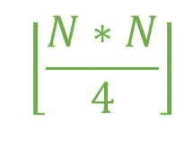

# 双向图

中的最大边数

> 原文： [https://www.geeksforgeeks.org/maximum-number-of-edges-in-bipartite-graph/](https://www.geeksforgeeks.org/maximum-number-of-edges-in-bipartite-graph/)

给定一个整数`N`，它表示顶点的数量。 任务是在`N`个顶点的[二部图](http://www.geeksforgeeks.org/bipartite-graph/)中找到可能的最大边数。

**二部图**：

1.  二分图是一个具有 2 组顶点的图。

2.  该集合使得同一集合中的顶点之间永不共享边。

**示例**：

> **输入**：N = 10
> **输出**：25
> 这两个集合都将包含 5 个顶点，并且第一个集合
> 的每个顶点都将具有一个相对于其他顶点的边 第二组
> 的总边数= 5 * 5 = 25
> 
> **输入**：N = 9
> **输出**：20

**方法**：当给定集合的每个顶点与另一集合的每个其他顶点都有一条边时，即 **edge = m * n** 其中`m`和`n`是两个集合中的边数。 为了最大化边数量，`m`必须等于或尽可能接近`n`。 因此，可以使用公式

计算最大边数

下面是上述方法的实现：

## C++

```cpp

// C++ implementation of the approach 
#include <bits/stdc++.h> 
using namespace std; 

// Function to return the maximum number 
// of edges possible in a Bipartite 
// graph with N vertices 
int maxEdges(int N) 
{ 
    int edges = 0; 

    edges = floor((N * N) / 4); 

    return edges; 
} 

// Driver code 
int main() 
{ 
    int N = 5; 
    cout << maxEdges(N); 

    return 0; 
} 

```