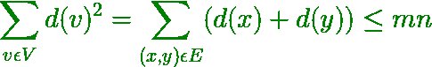
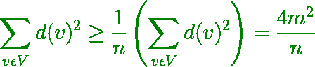

# N 顶点图可以具有的最大边数，使得该图是无三角形的| 壁炉架定理

> 原文： [https://www.geeksforgeeks.org/maximum-number-of-edges-that-n-vertex-graph-can-have-such-that-graph-is-triangle-free-mantels-theorem/](https://www.geeksforgeeks.org/maximum-number-of-edges-that-n-vertex-graph-can-have-such-that-graph-is-triangle-free-mantels-theorem/)

给定数字`N`，它是图形中的节点数，任务是找到 N-顶点图形可以具有的最大边数，以使图形不包含[三角形](https://en.wikipedia.org/wiki/Triangle-free_graph) （这意味着图中不应存在任何三个边 A，B，C，以使 A 连接到 B，B 连接到 C，C 连接到 A）。 该图不能包含自环或多边。

**示例**：

> **输入**：N = 4
> **输出**：4
> **说明**：
> [](https://media.geeksforgeeks.org/wp-content/cdn-uploads/20200227123317/Untitled-Diagram45.jpg)
> 
> **输入**：N = 3
> **输出**：2
> **说明**：
> 如果 3 顶点图中有三个边，它将 有一个三角形。

**方法**：可以使用[曼特尔定理](https://en.wikipedia.org/wiki/Tur%C3%A1n%27s_theorem#Mantel's_theorem)解决此问题，该定理指出图形中不包含任何三角形的最大边数是 floor（n <sup>2</sup> / 4 ）。 换句话说，必须删除几乎一半的边缘才能获得无三角形的图形。

**Mantel 定理是如何工作的？**
对于任何[图](https://www.geeksforgeeks.org/graph-and-its-representations/)，这样该图是无三角形的，那么对于任何顶点 Z 只能连接到 x 和 y 中任一顶点，即对于 x 和 y 之间连接的任何边 y，d（x）+ d（y）≤N，其中 d（x）和 d（y）是顶点 x 和 y 的度数。

*   然后，所有顶点的度–
    [](https://media.geeksforgeeks.org/wp-content/cdn-uploads/20200227132722/CodeCogsEqn7.png)
*   由柯西·施瓦兹不等式–
    [](https://media.geeksforgeeks.org/wp-content/cdn-uploads/20200227133814/CodeCogsEqn17.png)
*   因此，4m <sup>2</sup> / n≤mn，这意味着 m≤n <sup>2</sup> / 4

下面是上述方法的实现：

## C++

```cpp

// C++ implementation to find the maximum 
// number of edges for triangle free graph 

#include <bits/stdc++.h> 
using namespace std; 

// Function to find the maximum number of 
// edges in a N-vertex graph. 
int solve(int n) 
{ 
    // According to the Mantel's theorem 
    // the maximum number of edges will be 
    // floor of [(n^2)/4] 
    int ans = (n * n / 4); 

    return ans; 
} 

// Driver Function 
int main() 
{ 
    int n = 10; 
    cout << solve(n) << endl; 
    return 0; 
} 

```

## Java

```java

// Java implementation to find the maximum  
// number of edges for triangle free graph  
class GFG  
{  

    // Function to find the maximum number of  
    // edges in a N-vertex graph.  
    public static int solve(int n)  
    { 

        // According to the Mantel's theorem  
        // the maximum number of edges will be  
        // floor of [(n^2)/4]  
        int ans = (n * n / 4);  

        return ans;  
    }  

    // Driver code 
    public static void main(String args[]) 
    {  
        int n = 10;  
        System.out.println(solve(n));  
    }  
} 

// This code is contributed by divyamohan123 

```

## C#

```cs

// C# implementation to find the maximum  
// number of edges for triangle free graph  
using System; 

class GFG  
{  

    // Function to find the maximum number of  
    // edges in a N-vertex graph.  
    public static int solve(int n)  
    { 

        // According to the Mantel's theorem  
        // the maximum number of edges will be  
        // floor of [(n^2)/4]  
        int ans = (n * n / 4);  

        return ans;  
    }  

    // Driver code 
    public static void Main() 
    {  
        int n = 10;  
        Console.WriteLine(solve(n));  
    }  
} 

// This code is contributed by AnkitRai01 

```

## Python

```py

# Python3 implementation to find the maximum 
# number of edges for triangle free graph 

# Function to find the maximum number of 
# edges in a N-vertex graph. 
def solve(n): 

    # According to the Mantel's theorem 
    # the maximum number of edges will be 
    # floor of [(n^2)/4] 
    ans = (n * n // 4) 

    return ans 

# Driver Function 
if __name__ == '__main__': 
    n = 10
    print(solve(n)) 

# This code is contributed by mohit kumar 29 

```

**Output:**

```
25

```

**时间复杂度**：O（1）


* * *

* * *

如果您喜欢 GeeksforGeeks 并希望做出贡献，则还可以使用 [tribution.geeksforgeeks.org](https://contribute.geeksforgeeks.org/) 撰写文章，或将您的文章邮寄至 tribution@geeksforgeeks.org。 查看您的文章出现在 GeeksforGeeks 主页上，并帮助其他 Geeks。

如果您发现任何不正确的地方，请单击下面的“改进文章”按钮，以改进本文。