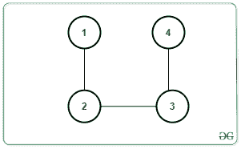
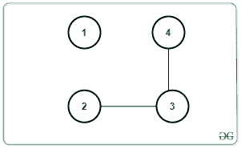
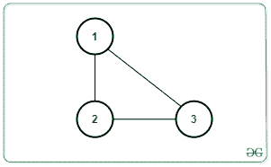
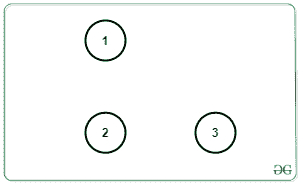

# 图形

中要删除的最大边缘数，以完全包含 K 个连接的组件

> 原文： [https://www.geeksforgeeks.org/maximum-number-of-edges-to-be-removed-to-contain-exactly-k-connected-components-in-the-graph/](https://www.geeksforgeeks.org/maximum-number-of-edges-to-be-removed-to-contain-exactly-k-connected-components-in-the-graph/)

给定[无向图](https://www.geeksforgeeks.org/graph-and-its-representations/)`G`，其中`N`个节点，`M`边和整数`K`， 找到可以去除的边缘的最大数量，以使去除边缘后剩下的`K`[连接的组件](https://www.geeksforgeeks.org/connected-components-in-an-undirected-graph/)完全相同。 如果图形不能包含`K`连接组件，请打印`-1`。

**示例**：

> **输入**：N = 4，M = 3，K = 2，边线[] [] = {{1，2}，{2，3}，{3，4}}
>  
> **输出**：1
> **说明**：
> 一种可能的方法是删除边线[1、2]。 然后将有 2 个连接组件，如下所示：
> 
> 
> **输入**：N = 3，M = 3，K = 3，边线[] [] = {{1，2}，{2，3}，{3，1}}
>  
> **输出**：3
> **说明**：可以去除所有边缘以形成 3 个相连的组件，如下所示：
> 

**方法**：为了解决给定的问题，[计算给定图形](https://www.geeksforgeeks.org/program-to-count-number-of-connected-components-in-an-undirected-graph/)中存在的连接组件的数量。 令计数为`C`。 观察到，如果`C`大于`K`，那么由于连接零件的数量只会增加，因此不可能去除边缘会产生`K`连接的零件。 否则，答案将始终存在。

为了解决该问题，需要进行以下观察：

*   假设 C <sub>1</sub> ，C <sub>2</sub> ，…，C <sub>c</sub> 是每个连接组件中的节点数。 然后，除去边缘后，每个组件的边缘必须为 C <sub>1</sub> – 1，C <sub>2</sub> – 1，…，C <sub>c</sub> -1。 因此，

    > **C <sub>1</sub> – 1 + C <sub>2</sub> – 1 +…+ C <sub>c</sub> – 1 = C <sub>1</sub> + C <sub>2</sub> +…+ C <sub>c</sub> – C = N – C** ，其中`N`是数组数。

*   通过移除 **M –（N – C）**边缘，上述条件将为我们提供`C`连接的组件，因为**需要 **N – C** 边缘 C** 组件。 要获得`K`组件，必须去除**（K – C）**的更多边缘。
*   因此，要去除的边的总数为：

    > **M –（N – C）+（K – C）= M – N + K**

请按照以下步骤解决问题：

1.  [计算给定图形](https://www.geeksforgeeks.org/program-to-count-number-of-connected-components-in-an-undirected-graph/)中存在的已连接组件的数量。 令计数为`C`。
2.  如果`C`大于`K`，则打印`-1`。
3.  其他打印 **M – N + K** ，其中`N`是节点数，`M`是边数，需要`K`连接的组件数。

下面是上述方法的实现：

## Python

```py

# Python program for the above approach 

class Graph: 

    # Constructor 
    def __init__(self, V): 

        # No. of vertices 
        self.V = V 

        # Dictionary of lists 
        self.adj = {i: [] for i in range(1, V + 1)} 

    # Function to add edge 
    # in the graph 
    def addEdge(self, v, w): 
        self.adj[v].append(w) 
        self.adj[w].append(v) 

    # Function to perform DFS 
    def DFS(self, s, visited): 

    # Create a stack for DFS 
        stack = [] 

        # Push the current source node 
        stack.append(s) 
        while (len(stack)): 

            # Pop a vertex from stack 
            # and print it 
            s = stack[-1] 
            stack.pop() 

            # Traverse adjacent vertices 
            # of the popped vertex s 
            for node in self.adj[s]: 
                if (not visited[node]): 

                    # If adjacent is unvisited, 
                    # push it to the stack 
                    visited[node] = True
                    stack.append(node) 

# Function to return the count  
# edges removed 
def countRemovedEdges(N, M, K): 

    C = 0

    # Initially mark all verices 
    # as not visited 
    visited = [False for i in range(g.V + 1)] 

    for node in range(1, N + 1): 

        # If node is unvisited 
        if (not visited[node]): 

            # Increment Connected 
            # component count by 1 
            C = C + 1

            # Perform DFS Traversal 
            g.DFS(node, visited) 

    # Print the result 
    if C <= K: 
        print(M - N + K) 
    else: 
        print(-1) 

# Driver Code 

N, M, K = 4, 3, 2

# Create Graph 
g = Graph(N) 

# Given Edges 
g.addEdge(1, 2) 
g.addEdge(2, 3) 
g.addEdge(3, 4) 

# Function Call 
countRemovedEdges(N, M, K) 

```

**Output:**

```
1

```

***时间复杂度**：O（N + M）*
***辅助空间**：O（M + N）*


* * *

* * *

如果您喜欢 GeeksforGeeks 并希望做出贡献，则还可以使用 [tribution.geeksforgeeks.org](https://contribute.geeksforgeeks.org/) 撰写文章，或将您的文章邮寄至 tribution@geeksforgeeks.org。 查看您的文章出现在 GeeksforGeeks 主页上，并帮助其他 Geeks。

如果您发现任何不正确的地方，请单击下面的“改进文章”按钮，以改进本文。