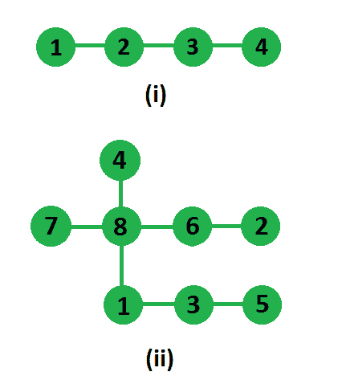

# 树中两个不相交的路径的最大积

> 原文： [https://www.geeksforgeeks.org/maximum-product-of-two-non-intersecting-paths-in-a-tree/](https://www.geeksforgeeks.org/maximum-product-of-two-non-intersecting-paths-in-a-tree/)

给定一个具有 N 个节点（和 N-1 个边）的无向连接树，我们需要在该树中找到两条路径，使它们不相交并且其长度乘积最大。

例子：

```
In first tree two paths which are non-intersecting
and have highest product are, 1-2 and 3-4, so answer
is 1*1 = 1
In second tree two paths which are non-intersecting 
and has highest product are, 1-3-5  and  7-8-6-2 
(or 4-8-6-2), so answer is 3*2 = 6
```



我们可以通过以下步骤对树进行深度优先搜索来解决此问题：由于树已连接且路径不相交，因此，如果采用任意一对这样的路径，则必须存在第三条路径，将这两个路径连接起来；如果删除了 从第三条路径的边缘开始，树将被分为两个部分-一个包含第一条路径，另一个包含第二条路径。 这个观察结果向我们提出了算法：遍历边缘； 对于每个边缘，将其移除，找到两个连接组件中路径的长度，然后将这些路径的长度相乘。 可以通过修改的深度优先搜索找到树中路径的长度，在该深度搜索中，我们将在每个邻居处调用最大路径，并添加两个返回的最大长度，这将是根于当前节点的子树的最大路径长度。

实现细节：
输入是一棵树，但其中没有指定的根，因为我们只有边的集合。 该树表示为无向图。 我们遍历邻接表。 对于每个边缘，我们在其两侧找到了最大长度的路径（移除边缘后）。 我们跟踪由边缘去除引起的最大产品量。

## C++

```cpp

// C++ program to find maximum product of two
// non-intersecting paths
#include <bits/stdc++.h>
using namespace std;

/*  Returns maximum length path in subtree rooted
    at u after removing edge connecting u and v */
int dfs(vector<int> g[], int& curMax, int u, int v)
{
    // To find lengths of first and second maximum
    // in subtrees. currMax is to store overall
    // maximum.
    int max1 = 0, max2 = 0, total = 0;

    //  loop through all neighbors of u
    for (int i = 0; i < g[u].size(); i++)
    {
        //  if neighbor is v, then skip it
        if (g[u][i] == v)
            continue;

        //  call recursively with current neighbor as root
        total = max(total, dfs(g, curMax, g[u][i], u));

        //  get max from one side and update
        if (curMax > max1)
        {
            max2 = max1;
            max1 = curMax;
        }
        else
            max2 = max(max2, curMax);
    }

    // store total length by adding max
    // and second max
    total = max(total, max1 + max2);

    // update current max by adding 1, i.e.
    // current node is included
    curMax = max1 + 1;
    return total;
}

// method returns maximum product of length of
// two non-intersecting paths
int maxProductOfTwoPaths(vector<int> g[], int N)
{
    int res = INT_MIN;
    int path1, path2;

    // one by one removing all edges and calling
    // dfs on both subtrees
    for (int i = 1; i < N+2; i++)
    {
        for (int j = 0; j < g[i].size(); j++)
        {
            // calling dfs on subtree rooted at
            // g[i][j], excluding edge from g[i][j]
            // to i.
            int curMax = 0;
            path1 = dfs(g, curMax, g[i][j], i);

            //  calling dfs on subtree rooted at
            // i, edge from i to g[i][j]
            curMax = 0;
            path2 = dfs(g, curMax, i, g[i][j]);

            res = max(res, path1 * path2);
        }
    }
    return res;
}

// Utility function to add an undirected edge (u,v)
void addEdge(vector<int> g[], int u, int v)
{
    g[u].push_back(v);
    g[v].push_back(u);
}

//  Driver code to test above methods
int main()
{
    int edges[][2] = {{1, 8}, {2, 6}, {3, 1},
                      {5, 3}, {7, 8}, {8, 4},
                      {8, 6} };
    int N = sizeof(edges)/sizeof(edges[0]);

    // there are N edges, so +1 for nodes and +1
    // for 1-based indexing
    vector<int> g[N + 2];
    for (int i = 0; i < N; i++)
         addEdge(g, edges[i][0], edges[i][1]);

    cout << maxProductOfTwoPaths(g, N) << endl;
    return 0;
}

```

## Java

```java

// Java program to find maximum product
// of two non-intersecting paths
import java.util.*;

class GFG{
static int curMax;

// Returns maximum length path in
// subtree rooted at u after 
// removing edge connecting u and v 
static int dfs(Vector<Integer> g[],  
               int u, int v)
{

    // To find lengths of first and 
    // second maximum in subtrees. 
    // currMax is to store overall
    // maximum.
    int max1 = 0, max2 = 0, total = 0;

    // Loop through all neighbors of u
    for(int i = 0; i < g[u].size(); i++)
    {

        // If neighbor is v, then skip it
        if (g[u].get(i) == v)
            continue;

        // Call recursively with current 
        // neighbor as root
        total = Math.max(total, dfs(
            g, g[u].get(i), u));

        // Get max from one side and update
        if (curMax > max1)
        {
            max2 = max1;
            max1 = curMax;
        }
        else
            max2 = Math.max(max2, curMax);
    }

    // Store total length by adding max
    // and second max
    total = Math.max(total, max1 + max2);

    // Update current max by adding 1, i.e.
    // current node is included
    curMax = max1 + 1;
    return total;
}

// Method returns maximum product of 
// length of two non-intersecting paths
static int maxProductOfTwoPaths(Vector<Integer> g[],
                                int N)
{
    int res = Integer.MIN_VALUE;
    int path1, path2;

    // One by one removing all edges and 
    // calling dfs on both subtrees
    for(int i = 1; i < N + 2; i++)
    {
        for(int j = 0; j < g[i].size(); j++)
        {

            // Calling dfs on subtree rooted at
            // g[i][j], excluding edge from g[i][j]
            // to i.
            curMax = 0;
            path1 = dfs(g, g[i].get(j), i);

            // Calling dfs on subtree rooted at
            // i, edge from i to g[i][j]
            curMax = 0;
            path2 = dfs(g,i, g[i].get(j));

            res = Math.max(res, path1 * path2);
        }
    }
    return res;
}

// Utility function to add an 
// undirected edge (u,v)
static void addEdge(Vector<Integer> g[], 
                    int u, int v)
{
    g[u].add(v);
    g[v].add(u);
}

//  Driver code 
public static void main(String[] args)
{
    int edges[][] = { { 1, 8 }, { 2, 6 }, 
                      { 3, 1 }, { 5, 3 },
                      { 7, 8 }, { 8, 4 },
                      { 8, 6 } };

    int N = edges.length;

    // There are N edges, so +1 for nodes
    // and +1 for 1-based indexing
    @SuppressWarnings("unchecked")
    Vector<Integer> []g = new Vector[N + 2];
    for(int i = 0; i < g.length; i++)
        g[i] = new Vector<Integer>();

    for(int i = 0; i < N; i++)
         addEdge(g, edges[i][0], edges[i][1]);

    System.out.print(maxProductOfTwoPaths(g, N) + "\n");
}
}

// This code is contributed by Princi Singh

```

## Python

```py

# Python3 program to find maximum product of two 
# non-intersecting paths 

# Returns maximum length path in subtree rooted 
# at u after removing edge connecting u and v 
def dfs(g, curMax, u, v):

    # To find lengths of first and second maximum 
    # in subtrees. currMax is to store overall 
    # maximum. 
    max1 = 0
    max2 = 0
    total = 0

    # loop through all neighbors of u 
    for i in range(len(g[u])):

        # if neighbor is v, then skip it 
        if (g[u][i] == v):
            continue

        # call recursively with current neighbor as root 
        total = max(total, dfs(g, curMax, g[u][i], u)) 

        # get max from one side and update 
        if (curMax[0] > max1):
            max2 = max1 
            max1 = curMax[0]
        else:
            max2 = max(max2, curMax[0])

    # store total length by adding max 
    # and second max 
    total = max(total, max1 + max2) 

    # update current max by adding 1, i.e. 
    # current node is included 
    curMax[0] = max1 + 1
    return total

# method returns maximum product of length of 
# two non-intersecting paths 
def maxProductOfTwoPaths(g, N):
    res = -999999999999
    path1, path2 = None, None

    # one by one removing all edges and calling 
    # dfs on both subtrees
    for i in range(N):
        for j in range(len(g[i])):

            # calling dfs on subtree rooted at 
            # g[i][j], excluding edge from g[i][j] 
            # to i. 
            curMax = [0] 
            path1 = dfs(g, curMax, g[i][j], i) 

            # calling dfs on subtree rooted at 
            # i, edge from i to g[i][j] 
            curMax = [0] 
            path2 = dfs(g, curMax, i, g[i][j]) 

            res = max(res, path1 * path2)
    return res

# Utility function to add an undirected edge (u,v) 
def addEdge(g, u, v):
    g[u].append(v) 
    g[v].append(u)

# Driver code  
if __name__ == '__main__':
    edges = [[1, 8], [2, 6], [3, 1], [5, 3], [7, 8], [8, 4], [8, 6]] 
    N = len(edges) 

    # there are N edges, so +1 for nodes and +1 
    # for 1-based indexing 
    g = [[] for i in range(N + 2)]
    for i in range(N):
        addEdge(g, edges[i][0], edges[i][1])
    print(maxProductOfTwoPaths(g, N))

# This code is contributed by PranchalK    

```

**输出**：

```
6
```

本文由 [**Utkarsh Trivedi**](https://in.linkedin.com/in/utkarsh-trivedi-253069a7) 提供。 如果您喜欢 GeeksforGeeks 并希望做出贡献，则还可以使用 [tribution.geeksforgeeks.org](http://contribute.geeksforgeeks.org) 撰写文章，或将您的文章邮寄至 tribution@geeksforgeeks.org。 查看您的文章出现在 GeeksforGeeks 主页上，并帮助其他 Geeks。
如果发现任何不正确的内容，或者想分享有关上述主题的更多信息，请发表评论。

