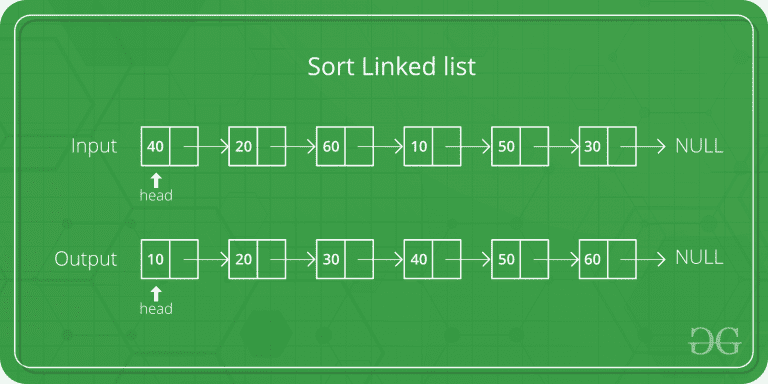

# 合并链表的排序

> 原文：[https://www.geeksforgeeks.org/merge-sort-for-linked-list/](https://www.geeksforgeeks.org/merge-sort-for-linked-list/)

[归并排序](http://en.wikipedia.org/wiki/Merge_sort)通常是对链表进行排序的首选。 链表的随机访问性能较慢，使得其他一些算法（例如快速排序）的性能较差，而其他算法（例如堆排序）则完全不可能。



令`head`是要排序的链表的第一个节点，而`headRef`是指向`head`的指针。 请注意，我们需要在`MergeSort()`中引用`head`，因为以下实现会更改下一个链接以对链表进行排序（而不是节点上的数据），因此，如果原始`head`上的数据不是最小的，则必须更改链表中`head`节点的值。

```
MergeSort(headRef)
1) If the head is NULL or there is only one element in the Linked List 
    then return.
2) Else divide the linked list into two halves.  
      FrontBackSplit(head, &a, &b); /* a and b are two halves */
3) Sort the two halves a and b.
      MergeSort(a);
      MergeSort(b);
4) Merge the sorted a and b (using SortedMerge() discussed here) 
   and update the head pointer using headRef.
     *headRef = SortedMerge(a, b);

```

## C++

```cpp

// C++ code for linked list merged sort 
#include <bits/stdc++.h> 
using namespace std; 

/* Link list node */
class Node { 
public: 
    int data; 
    Node* next; 
}; 

/* function prototypes */
Node* SortedMerge(Node* a, Node* b); 
void FrontBackSplit(Node* source, 
                    Node** frontRef, Node** backRef); 

/* sorts the linked list by changing next pointers (not data) */
void MergeSort(Node** headRef) 
{ 
    Node* head = *headRef; 
    Node* a; 
    Node* b; 

    /* Base case -- length 0 or 1 */
    if ((head == NULL) || (head->next == NULL)) { 
        return; 
    } 

    /* Split head into 'a' and 'b' sublists */
    FrontBackSplit(head, &a, &b); 

    /* Recursively sort the sublists */
    MergeSort(&a); 
    MergeSort(&b); 

    /* answer = merge the two sorted lists together */
    *headRef = SortedMerge(a, b); 
} 

/* See https:// www.geeksforgeeks.org/?p=3622 for details of this  
function */
Node* SortedMerge(Node* a, Node* b) 
{ 
    Node* result = NULL; 

    /* Base cases */
    if (a == NULL) 
        return (b); 
    else if (b == NULL) 
        return (a); 

    /* Pick either a or b, and recur */
    if (a->data <= b->data) { 
        result = a; 
        result->next = SortedMerge(a->next, b); 
    } 
    else { 
        result = b; 
        result->next = SortedMerge(a, b->next); 
    } 
    return (result); 
} 

/* UTILITY FUNCTIONS */
/* Split the nodes of the given list into front and back halves,  
    and return the two lists using the reference parameters.  
    If the length is odd, the extra node should go in the front list.  
    Uses the fast/slow pointer strategy. */
void FrontBackSplit(Node* source, 
                    Node** frontRef, Node** backRef) 
{ 
    Node* fast; 
    Node* slow; 
    slow = source; 
    fast = source->next; 

    /* Advance 'fast' two nodes, and advance 'slow' one node */
    while (fast != NULL) { 
        fast = fast->next; 
        if (fast != NULL) { 
            slow = slow->next; 
            fast = fast->next; 
        } 
    } 

    /* 'slow' is before the midpoint in the list, so split it in two  
    at that point. */
    *frontRef = source; 
    *backRef = slow->next; 
    slow->next = NULL; 
} 

/* Function to print nodes in a given linked list */
void printList(Node* node) 
{ 
    while (node != NULL) { 
        cout << node->data << " "; 
        node = node->next; 
    } 
} 

/* Function to insert a node at the beginging of the linked list */
void push(Node** head_ref, int new_data) 
{ 
    /* allocate node */
    Node* new_node = new Node(); 

    /* put in the data */
    new_node->data = new_data; 

    /* link the old list off the new node */
    new_node->next = (*head_ref); 

    /* move the head to point to the new node */
    (*head_ref) = new_node; 
} 

/* Driver program to test above functions*/
int main() 
{ 
    /* Start with the empty list */
    Node* res = NULL; 
    Node* a = NULL; 

    /* Let us create a unsorted linked lists to test the functions  
Created lists shall be a: 2->3->20->5->10->15 */
    push(&a, 15); 
    push(&a, 10); 
    push(&a, 5); 
    push(&a, 20); 
    push(&a, 3); 
    push(&a, 2); 

    /* Sort the above created Linked List */
    MergeSort(&a); 

    cout << "Sorted Linked List is: \n"; 
    printList(a); 

    return 0; 
} 

// This is code is contributed by rathbhupendra 

```

## C

```c

// C code for linked list merged sort 
#include <stdio.h> 
#include <stdlib.h> 

/* Link list node */
struct Node { 
    int data; 
    struct Node* next; 
}; 

/* function prototypes */
struct Node* SortedMerge(struct Node* a, struct Node* b); 
void FrontBackSplit(struct Node* source, 
                    struct Node** frontRef, struct Node** backRef); 

/* sorts the linked list by changing next pointers (not data) */
void MergeSort(struct Node** headRef) 
{ 
    struct Node* head = *headRef; 
    struct Node* a; 
    struct Node* b; 

    /* Base case -- length 0 or 1 */
    if ((head == NULL) || (head->next == NULL)) { 
        return; 
    } 

    /* Split head into 'a' and 'b' sublists */
    FrontBackSplit(head, &a, &b); 

    /* Recursively sort the sublists */
    MergeSort(&a); 
    MergeSort(&b); 

    /* answer = merge the two sorted lists together */
    *headRef = SortedMerge(a, b); 
} 

/* See https:// www.geeksforgeeks.org/?p=3622 for details of this  
function */
struct Node* SortedMerge(struct Node* a, struct Node* b) 
{ 
    struct Node* result = NULL; 

    /* Base cases */
    if (a == NULL) 
        return (b); 
    else if (b == NULL) 
        return (a); 

    /* Pick either a or b, and recur */
    if (a->data <= b->data) { 
        result = a; 
        result->next = SortedMerge(a->next, b); 
    } 
    else { 
        result = b; 
        result->next = SortedMerge(a, b->next); 
    } 
    return (result); 
} 

/* UTILITY FUNCTIONS */
/* Split the nodes of the given list into front and back halves, 
    and return the two lists using the reference parameters. 
    If the length is odd, the extra node should go in the front list. 
    Uses the fast/slow pointer strategy. */
void FrontBackSplit(struct Node* source, 
                    struct Node** frontRef, struct Node** backRef) 
{ 
    struct Node* fast; 
    struct Node* slow; 
    slow = source; 
    fast = source->next; 

    /* Advance 'fast' two nodes, and advance 'slow' one node */
    while (fast != NULL) { 
        fast = fast->next; 
        if (fast != NULL) { 
            slow = slow->next; 
            fast = fast->next; 
        } 
    } 

    /* 'slow' is before the midpoint in the list, so split it in two 
    at that point. */
    *frontRef = source; 
    *backRef = slow->next; 
    slow->next = NULL; 
} 

/* Function to print nodes in a given linked list */
void printList(struct Node* node) 
{ 
    while (node != NULL) { 
        printf("%d ", node->data); 
        node = node->next; 
    } 
} 

/* Function to insert a node at the beginging of the linked list */
void push(struct Node** head_ref, int new_data) 
{ 
    /* allocate node */
    struct Node* new_node = (struct Node*)malloc(sizeof(struct Node)); 

    /* put in the data */
    new_node->data = new_data; 

    /* link the old list off the new node */
    new_node->next = (*head_ref); 

    /* move the head to point to the new node */
    (*head_ref) = new_node; 
} 

/* Driver program to test above functions*/
int main() 
{ 
    /* Start with the empty list */
    struct Node* res = NULL; 
    struct Node* a = NULL; 

    /* Let us create a unsorted linked lists to test the functions 
Created lists shall be a: 2->3->20->5->10->15 */
    push(&a, 15); 
    push(&a, 10); 
    push(&a, 5); 
    push(&a, 20); 
    push(&a, 3); 
    push(&a, 2); 

    /* Sort the above created Linked List */
    MergeSort(&a); 

    printf("Sorted Linked List is: \n"); 
    printList(a); 

    getchar(); 
    return 0; 
} 

```

## Java

```java

// Java program to illustrate merge sorted 
// of linkedList 

public class linkedList { 
    node head = null; 
    // node a, b; 
    static class node { 
        int val; 
        node next; 

        public node(int val) 
        { 
            this.val = val; 
        } 
    } 

    node sortedMerge(node a, node b) 
    { 
        node result = null; 
        /* Base cases */
        if (a == null) 
            return b; 
        if (b == null) 
            return a; 

        /* Pick either a or b, and recur */
        if (a.val <= b.val) { 
            result = a; 
            result.next = sortedMerge(a.next, b); 
        } 
        else { 
            result = b; 
            result.next = sortedMerge(a, b.next); 
        } 
        return result; 
    } 

    node mergeSort(node h) 
    { 
        // Base case : if head is null 
        if (h == null || h.next == null) { 
            return h; 
        } 

        // get the middle of the list 
        node middle = getMiddle(h); 
        node nextofmiddle = middle.next; 

        // set the next of middle node to null 
        middle.next = null; 

        // Apply mergeSort on left list 
        node left = mergeSort(h); 

        // Apply mergeSort on right list 
        node right = mergeSort(nextofmiddle); 

        // Merge the left and right lists 
        node sortedlist = sortedMerge(left, right); 
        return sortedlist; 
    } 

    // Utility function to get the middle of the linked list 
    public static node getMiddle(node head) 
    { 
        if (head == null) 
            return head; 

        node slow = head, fast = head; 

        while (fast.next != null && fast.next.next != null) { 
            slow = slow.next; 
            fast = fast.next.next; 
        } 
        return slow; 
    } 

    void push(int new_data) 
    { 
        /* allocate node */
        node new_node = new node(new_data); 

        /* link the old list off the new node */
        new_node.next = head; 

        /* move the head to point to the new node */
        head = new_node; 
    } 

    // Utility function to print the linked list 
    void printList(node headref) 
    { 
        while (headref != null) { 
            System.out.print(headref.val + " "); 
            headref = headref.next; 
        } 
    } 

    public static void main(String[] args) 
    { 

        linkedList li = new linkedList(); 
        /* 
         * Let us create a unsorted linked list to test the functions 
         * created. The list shall be a: 2->3->20->5->10->15 
         */
        li.push(15); 
        li.push(10); 
        li.push(5); 
        li.push(20); 
        li.push(3); 
        li.push(2); 

        // Apply merge Sort 
        li.head = li.mergeSort(li.head); 
        System.out.print("\n Sorted Linked List is: \n"); 
        li.printList(li.head); 
    } 
} 

// This code is contributed by Rishabh Mahrsee 

```

## Python3

```py

# Python3 program to merge sort of linked list 

# create Node using class Node. 
class Node: 
    def __init__(self, data): 
        self.data = data 
        self.next = None

class LinkedList: 
    def __init__(self): 
        self.head = None

    # push new value to linked list 
    # using append method 
    def append(self, new_value): 

        # Allocate new node 
        new_node = Node(new_value) 

        # if head is None, initialize it to new node 
        if self.head is None: 
            self.head = new_node 
            return
        curr_node = self.head 
        while curr_node.next is not None: 
            curr_node = curr_node.next

        # Append the new node at the end 
        # of the linked list 
        curr_node.next = new_node 

    def sortedMerge(self, a, b): 
        result = None

        # Base cases 
        if a == None: 
            return b 
        if b == None: 
            return a 

        # pick either a or b and recur.. 
        if a.data <= b.data: 
            result = a 
            result.next = self.sortedMerge(a.next, b) 
        else: 
            result = b 
            result.next = self.sortedMerge(a, b.next) 
        return result 

    def mergeSort(self, h): 

        # Base case if head is None 
        if h == None or h.next == None: 
            return h 

        # get the middle of the list  
        middle = self.getMiddle(h) 
        nexttomiddle = middle.next

        # set the next of middle node to None 
        middle.next = None

        # Apply mergeSort on left list  
        left = self.mergeSort(h) 

        # Apply mergeSort on right list 
        right = self.mergeSort(nexttomiddle) 

        # Merge the left and right lists  
        sortedlist = self.sortedMerge(left, right) 
        return sortedlist 

    # Utility function to get the middle  
    # of the linked list  
    def getMiddle(self, head): 
        if (head == None): 
            return head 

        slow = head 
        fast = head 

        while (fast.next != None and 
               fast.next.next != None): 
            slow = slow.next
            fast = fast.next.next

        return slow 

# Utility function to print the linked list  
def printList(head): 
    if head is None: 
        print(' ') 
        return
    curr_node = head 
    while curr_node: 
        print(curr_node.data, end = " ") 
        curr_node = curr_node.next
    print(' ') 

# Driver Code 
if __name__ == '__main__': 
    li = LinkedList() 

    # Let us create a unsorted linked list 
    # to test the functions created.  
    # The list shall be a: 2->3->20->5->10->15  
    li.append(15) 
    li.append(10) 
    li.append(5) 
    li.append(20) 
    li.append(3) 
    li.append(2) 

    # Apply merge Sort  
    li.head = li.mergeSort(li.head) 
    print ("Sorted Linked List is:") 
    printList(li.head) 

# This code is contributed by Vikas Chitturi 

```

## C#

```cs

// C# program to illustrate merge sorted 
// of linkedList 
using System; 

public class linkedList { 
    node head = null; 

    // node a, b; 
    public class node { 
        public int val; 
        public node next; 

        public node(int val) 
        { 
            this.val = val; 
        } 
    } 

    node sortedMerge(node a, node b) 
    { 
        node result = null; 
        /* Base cases */
        if (a == null) 
            return b; 
        if (b == null) 
            return a; 

        /* Pick either a or b, and recur */
        if (a.val <= b.val) { 
            result = a; 
            result.next = sortedMerge(a.next, b); 
        } 
        else { 
            result = b; 
            result.next = sortedMerge(a, b.next); 
        } 
        return result; 
    } 

    node mergeSort(node h) 
    { 
        // Base case : if head is null 
        if (h == null || h.next == null) { 
            return h; 
        } 

        // get the middle of the list 
        node middle = getMiddle(h); 
        node nextofmiddle = middle.next; 

        // set the next of middle node to null 
        middle.next = null; 

        // Apply mergeSort on left list 
        node left = mergeSort(h); 

        // Apply mergeSort on right list 
        node right = mergeSort(nextofmiddle); 

        // Merge the left and right lists 
        node sortedlist = sortedMerge(left, right); 
        return sortedlist; 
    } 

    // Utility function to get the 
    // middle of the linked list 
    node getMiddle(node h) 
    { 
        // Base case 
        if (h == null) 
            return h; 
        node fastptr = h.next; 
        node slowptr = h; 

        // Move fastptr by two and slow ptr by one 
        // Finally slowptr will point to middle node 
        while (fastptr != null) { 
            fastptr = fastptr.next; 
            if (fastptr != null) { 
                slowptr = slowptr.next; 
                fastptr = fastptr.next; 
            } 
        } 
        return slowptr; 
    } 

    void push(int new_data) 
    { 
        /* allocate node */
        node new_node = new node(new_data); 

        /* link the old list off the new node */
        new_node.next = head; 

        /* move the head to point to the new node */
        head = new_node; 
    } 

    // Utility function to print the linked list 
    void printList(node headref) 
    { 
        while (headref != null) { 
            Console.Write(headref.val + " "); 
            headref = headref.next; 
        } 
    } 

    // Driver code 
    public static void Main(String[] args) 
    { 

        linkedList li = new linkedList(); 
        /*  
        * Let us create a unsorted linked list to test the functions  
        * created. The list shall be a: 2->3->20->5->10->15  
        */
        li.push(15); 
        li.push(10); 
        li.push(5); 
        li.push(20); 
        li.push(3); 
        li.push(2); 

        // Apply merge Sort 
        li.head = li.mergeSort(li.head); 
        Console.Write("\n Sorted Linked List is: \n"); 
        li.printList(li.head); 
    } 
} 

// This code is contributed by Arnab Kundu 

```

**输出**：

```
Sorted Linked List is: 
2 3 5 10 15 20

```

 **时间复杂度**：`O(n Log n)`

来源：

[http://en.wikipedia.org/wiki/Merge_sort](http://en.wikipedia.org/wiki/Merge_sort)

[http://cslibrary.stanford.edu/105/LinkedListProblems.pdf](http://cslibrary.stanford.edu/105/LinkedListProblems.pdf)

如果您发现上述代码/算法有误，请写注释，或者找到解决同一问题的更好方法。

