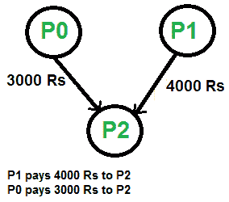

# 最大限度地减少彼此借钱的给定朋友之间的现金流量

> 原文： [https://www.geeksforgeeks.org/minimize-cash-flow-among-given-set-friends-borrowed-money/](https://www.geeksforgeeks.org/minimize-cash-flow-among-given-set-friends-borrowed-money/)

给了许多必须互相赠与或取钱的朋友。 设计一种算法，使所有朋友之间的总现金流量最小化。

示例：

下图显示了要清算的输入债务。


以上债务可以通过以下优化方式进行结算：



这个想法是使用[贪婪算法](https://www.geeksforgeeks.org/tag/Greedy-Algorithm/)，其中每一步都要结清一个人的全部金额，然后对剩余的 n-1 个人重复进行。

如何选择第一人称？ 要选择第一个人，请通过从所有贷项（要付的金额）中减去所有债务（要付的金额）来计算获得净额的每个人的净额。 一旦对每个人的净额进行了评估，就找到两个净额最大和最小的人。 这两个人是最大的债权人和债务人。 最少两个人是我们第一个被解决并从名单中删除的人。 设两个数量的最小值为 x。 我们从最高债务人向最高债权人支付“ x”金额，并结清一个人。 如果 x 等于最大借方，则清算最大债务人，否则清算最大债权人。

以下是详细的算法。

对我从 0 到 n-1 的每个人 Pi 进行跟踪。

1.  计算每个人的净额。 人“ i”的净额可以通过从所有贷项的总和中减去所有债务的总和来计算。

2.  找出最大债权人和最大债务人两个人。 设要记入最大债权人的最大金额为 maxCredit，从最大债务人借记的最大金额为 maxDebit。 设最大债务人为 Pd，最大债权人为 Pc。

3.  找到 maxDebit 和 maxCredit 的最小值。 设两个最小值为 x。 从 Pd 借记“ x”，然后将此金额记入 Pc

4.  如果 x 等于 maxCredit，则从一组人员中删除 Pc，然后对剩余的（n-1）个人进行重复操作。

 **5）**如果 x 等于 maxDebit，则从一组人员中删除 Pd，然后对剩余的（n-1）个人进行重复操作。

感谢 Balaji S 在此处的评论[中建议此方法。](https://www.geeksforgeeks.org/amazon-interview-experience-set-165-sde/)

以下是上述算法的实现。

## C++

```cpp

// C++ program to fin maximum cash flow among a set of persons 
#include<iostream> 
using namespace std; 

// Number of persons (or vertices in the graph) 
#define N 3 

// A utility function that returns index of minimum value in arr[] 
int getMin(int arr[]) 
{ 
    int minInd = 0; 
    for (int i=1; i<N; i++) 
        if (arr[i] < arr[minInd]) 
            minInd = i; 
    return minInd; 
} 

// A utility function that returns index of maximum value in arr[] 
int getMax(int arr[]) 
{ 
    int maxInd = 0; 
    for (int i=1; i<N; i++) 
        if (arr[i] > arr[maxInd]) 
            maxInd = i; 
    return maxInd; 
} 

// A utility function to return minimum of 2 values 
int minOf2(int x, int y) 
{ 
    return (x<y)? x: y; 
} 

// amount[p] indicates the net amount to be credited/debited 
// to/from person 'p' 
// If amount[p] is positive, then i'th person will amount[i] 
// If amount[p] is negative, then i'th person will give  -amount[i] 
void minCashFlowRec(int amount[]) 
{ 
    // Find the indexes of minimum and maximum values in amount[] 
    // amount[mxCredit] indicates the maximum amount to be given 
    //                  (or credited) to any person . 
    // And amount[mxDebit] indicates the maximum amount to be taken 
    //                  (or debited) from any person. 
    // So if there is a positive value in amount[], then there must 
    // be a negative value 
    int mxCredit = getMax(amount), mxDebit = getMin(amount); 

    // If both amounts are 0, then all amounts are settled 
    if (amount[mxCredit] == 0 && amount[mxDebit] == 0) 
        return; 

    // Find the minimum of two amounts 
    int min = minOf2(-amount[mxDebit], amount[mxCredit]); 
    amount[mxCredit] -= min; 
    amount[mxDebit] += min; 

    // If minimum is the maximum amount to be 
    cout << "Person " << mxDebit << " pays " << min 
         << " to " << "Person " << mxCredit << endl; 

    // Recur for the amount array.  Note that it is guaranteed that 
    // the recursion would terminate as either amount[mxCredit]  
    // or  amount[mxDebit] becomes 0 
    minCashFlowRec(amount); 
} 

// Given a set of persons as graph[] where graph[i][j] indicates 
// the amount that person i needs to pay person j, this function 
// finds and prints the minimum cash flow to settle all debts. 
void minCashFlow(int graph[][N]) 
{ 
    // Create an array amount[], initialize all value in it as 0\. 
    int amount[N] = {0}; 

    // Calculate the net amount to be paid to person 'p', and 
    // stores it in amount[p]. The value of amount[p] can be 
    // calculated by subtracting debts of 'p' from credits of 'p' 
    for (int p=0; p<N; p++) 
       for (int i=0; i<N; i++) 
          amount[p] += (graph[i][p] -  graph[p][i]); 

    minCashFlowRec(amount); 
} 

// Driver program to test above function 
int main() 
{ 
    // graph[i][j] indicates the amount that person i needs to 
    // pay person j 
    int graph[N][N] = { {0, 1000, 2000}, 
                        {0, 0, 5000}, 
                        {0, 0, 0},}; 

    // Print the solution 
    minCashFlow(graph); 
    return 0; 
} 

```