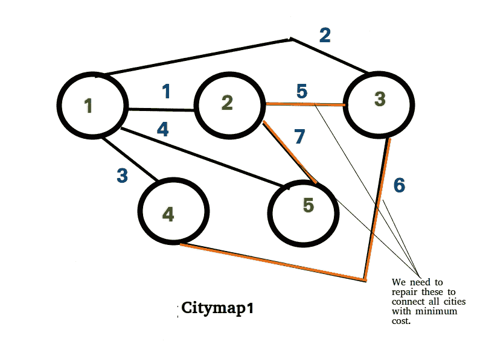

# 连接所有城市的最低费用

> 原文： [https://www.geeksforgeeks.org/minimum-cost-connect-cities/](https://www.geeksforgeeks.org/minimum-cost-connect-cities/)

有 n 个城市，其中一些城市之间有道路。 不知何故，所有道路同时遭到破坏。 我们必须修整道路以再次连接城市。 维修特定道路需要一定的费用。 找出通过修路连接所有城市的最低成本。 输入采用矩阵（城市）形式，如果 city [i] [j] = 0，则城市 i 和 j 之间没有任何道路，如果 city [i] [j] = a> 0，则重建城市的成本 城市 i 和城市 j 之间的路径是 a。 打印出连接所有城市的最低成本。

确保在道路损坏之前所有城市都已连接。

**示例**：

```
Input : {{0, 1, 2, 3, 4},
         {1, 0, 5, 0, 7},
         {2, 5, 0, 6, 0},
         {3, 0, 6, 0, 0},
         {4, 7, 0, 0, 0}};
Output : 10

```



```
Input : {{0, 1, 1, 100, 0, 0},
         {1, 0, 1, 0, 0, 0},
         {1, 1, 0, 0, 0, 0},
         {100, 0, 0, 0, 2, 2},
         {0, 0, 0, 2, 0, 2},
         {0, 0, 0, 2, 2, 0}};
Output : 106

```

**方法**：在这里，我们必须通过成本最低的路径连接所有城市。 这样做的方法是找出城市地图的最小生成树（ [MST](https://www.geeksforgeeks.org/greedy-algorithms-set-5-prims-minimum-spanning-tree-mst-2/) ）（即，每个城市都是该图的一个节点，并且城市之间的所有受损道路都是边）。 总成本是在最小生成树中添加路径边值。

**先决条件**：[MST Prim 的算法](https://www.geeksforgeeks.org/greedy-algorithms-set-5-prims-minimum-spanning-tree-mst-2/)

## C++

```cpp

// C++ code to find out minimum cost
// path to connect all the cities
#include <bits/stdc++.h>

using namespace std;

// Function to find out minimum valued node
// among the nodes which are not yet included in MST
int minnode(int n, int keyval[], bool mstset[]) {
  int mini = numeric_limits<int>::max();
  int mini_index;

  // Loop through all the values of the nodes
  // which are not yet included in MST and find
  // the minimum valued one.
  for (int i = 0; i < n; i++) {
    if (mstset[i] == false && keyval[i] < mini) {
      mini = keyval[i], mini_index = i;
    }
  }
  return mini_index;
}

// Function to find out the MST and
// the cost of the MST.
void findcost(int n, vector<vector<int>> city) {

  // Array to store the parent node of a
  // particular node.
  int parent[n];

  // Array to store key value of each node.
  int keyval[n];

  // Boolean Array to hold bool values whether
  // a node is included in MST or not.
  bool mstset[n];

  // Set all the key values to infinite and
  // none of the nodes is included in MST.
  for (int i = 0; i < n; i++) {
    keyval[i] = numeric_limits<int>::max();
    mstset[i] = false;
  }

  // Start to find the MST from node 0.
  // Parent of node 0 is none so set -1.
  // key value or minimum cost to reach
  // 0th node from 0th node is 0.
  parent[0] = -1;
  keyval[0] = 0;

  // Find the rest n-1 nodes of MST.
  for (int i = 0; i < n - 1; i++) {

    // First find out the minimum node
    // among the nodes which are not yet
    // included in MST.
    int u = minnode(n, keyval, mstset);

    // Now the uth node is included in MST.
    mstset[u] = true;

    // Update the values of neighbor
    // nodes of u which are not yet
    // included in MST.
    for (int v = 0; v < n; v++) {

      if (city[u][v] && mstset[v] == false &&
          city[u][v] < keyval[v]) {
        keyval[v] = city[u][v];
        parent[v] = u;
      }
    }
  }

  // Find out the cost by adding
  // the edge values of MST.
  int cost = 0;
  for (int i = 1; i < n; i++)
    cost += city[parent[i]][i];
  cout << cost << endl;
}

// Utility Program:
int main() {

  // Input 1
  int n1 = 5;
  vector<vector<int>> city1 = {{0, 1, 2, 3, 4},
                               {1, 0, 5, 0, 7},
                               {2, 5, 0, 6, 0},
                               {3, 0, 6, 0, 0},
                               {4, 7, 0, 0, 0}};
  findcost(n1, city1);

  // Input 2
  int n2 = 6;
  vector<vector<int>> city2 = {{0, 1, 1, 100, 0, 0},
                               {1, 0, 1, 0, 0, 0},
                               {1, 1, 0, 0, 0, 0},   
                               {100, 0, 0, 0, 2, 2},
                               {0, 0, 0, 2, 0, 2},  
                               {0, 0, 0, 2, 2, 0}};
  findcost(n2, city2);

  return 0;
}

```

## Java

```java

// Java code to find out minimum cost 
// path to connect all the cities 
import java.util.*;

class GFG{

// Function to find out minimum valued node 
// among the nodes which are not yet included 
// in MST 
static int minnode(int n, int keyval[], 
                   boolean mstset[]) 
{ 
    int mini = Integer.MAX_VALUE; 
    int mini_index = 0; 

    // Loop through all the values of the nodes 
    // which are not yet included in MST and find 
    // the minimum valued one. 
    for(int i = 0; i < n; i++)
    { 
        if (mstset[i] == false &&
            keyval[i] < mini) 
        { 
            mini = keyval[i]; 
            mini_index = i; 
        } 
    } 
    return mini_index; 
} 

// Function to find out the MST and 
// the cost of the MST. 
static void findcost(int n, int city[][])
{ 

    // Array to store the parent node of a 
    // particular node. 
    int parent[] = new int[n]; 

    // Array to store key value of each node. 
    int keyval[] = new int[n]; 

    // Boolean Array to hold bool values whether 
    // a node is included in MST or not. 
    boolean mstset[] = new boolean[n]; 

    // Set all the key values to infinite and 
    // none of the nodes is included in MST. 
    for(int i = 0; i < n; i++) 
    { 
        keyval[i] = Integer.MAX_VALUE; 
        mstset[i] = false; 
    } 

    // Start to find the MST from node 0\. 
    // Parent of node 0 is none so set -1\. 
    // key value or minimum cost to reach 
    // 0th node from 0th node is 0\. 
    parent[0] = -1; 
    keyval[0] = 0; 

    // Find the rest n-1 nodes of MST. 
    for(int i = 0; i < n - 1; i++)
    { 

        // First find out the minimum node 
        // among the nodes which are not yet 
        // included in MST. 
        int u = minnode(n, keyval, mstset); 

        // Now the uth node is included in MST. 
        mstset[u] = true; 

        // Update the values of neighbor 
        // nodes of u which are not yet 
        // included in MST. 
        for(int v = 0; v < n; v++) 
        { 
            if (city[u][v] > 0 && 
                 mstset[v] == false && 
                city[u][v] < keyval[v])
            {
                keyval[v] = city[u][v]; 
                parent[v] = u; 
            } 
        } 
    } 

    // Find out the cost by adding 
    // the edge values of MST. 
    int cost = 0; 
    for(int i = 1; i < n; i++) 
        cost += city[parent[i]][i];

    System.out.println(cost); 
} 

// Driver code
public static void main(String args[])
{ 

    // Input 1 
    int n1 = 5; 
    int city1[][] = { { 0, 1, 2, 3, 4 }, 
                      { 1, 0, 5, 0, 7 }, 
                      { 2, 5, 0, 6, 0 }, 
                      { 3, 0, 6, 0, 0 }, 
                      { 4, 7, 0, 0, 0 } }; 

    findcost(n1, city1); 

    // Input 2 
    int n2 = 6; 
    int city2[][] = { { 0, 1, 1, 100, 0, 0 }, 
                      { 1, 0, 1, 0, 0, 0 }, 
                      { 1, 1, 0, 0, 0, 0 }, 
                      { 100, 0, 0, 0, 2, 2 }, 
                      { 0, 0, 0, 2, 0, 2 }, 
                      { 0, 0, 0, 2, 2, 0 } }; 

    findcost(n2, city2); 

} 
}

// This code is contributed by adityapande88

```

## Python

```py

# Python3 code to find out minimum cost 
# path to connect all the cities 

# Function to find out minimum valued 
# node among the nodes which are not 
# yet included in MST 
def minnode(n, keyval, mstset):
    mini = 999999999999
    mini_index = None

    # Loop through all the values of 
    # the nodes which are not yet 
    # included in MST and find the 
    # minimum valued one.
    for i in range(n):
        if (mstset[i] == False and
            keyval[i] < mini): 
            mini = keyval[i]
            mini_index = i
    return mini_index

# Function to find out the MST and 
# the cost of the MST. 
def findcost(n, city):

    # Array to store the parent 
    # node of a particular node. 
    parent = [None] * n

    # Array to store key value 
    # of each node. 
    keyval = [None] * n 

    # Boolean Array to hold bool 
    # values whether a node is
    # included in MST or not. 
    mstset = [None] * n

    # Set all the key values to infinite and 
    # none of the nodes is included in MST.
    for i in range(n):
        keyval[i] = 9999999999999
        mstset[i] = False

    # Start to find the MST from node 0\. 
    # Parent of node 0 is none so set -1\. 
    # key value or minimum cost to reach 
    # 0th node from 0th node is 0\. 
    parent[0] = -1
    keyval[0] = 0

    # Find the rest n-1 nodes of MST.
    for i in range(n - 1):

        # First find out the minimum node 
        # among the nodes which are not yet 
        # included in MST. 
        u = minnode(n, keyval, mstset) 

        # Now the uth node is included in MST. 
        mstset[u] = True

        # Update the values of neighbor 
        # nodes of u which are not yet 
        # included in MST. 
        for v in range(n):
            if (city[u][v] and mstset[v] == False and
                city[u][v] < keyval[v]): 
                keyval[v] = city[u][v] 
                parent[v] = u

    # Find out the cost by adding 
    # the edge values of MST. 
    cost = 0
    for i in range(1, n):
        cost += city[parent[i]][i] 
    print(cost)

# Driver Code
if __name__ == '__main__':

    # Input 1 
    n1 = 5
    city1 = [[0, 1, 2, 3, 4], 
             [1, 0, 5, 0, 7], 
             [2, 5, 0, 6, 0],
             [3, 0, 6, 0, 0], 
             [4, 7, 0, 0, 0]] 
    findcost(n1, city1) 

    # Input 2 
    n2 = 6
    city2 = [[0, 1, 1, 100, 0, 0],
             [1, 0, 1, 0, 0, 0], 
             [1, 1, 0, 0, 0, 0], 
             [100, 0, 0, 0, 2, 2],
             [0, 0, 0, 2, 0, 2], 
             [0, 0, 0, 2, 2, 0]] 
    findcost(n2, city2)

# This code is contributed by PranchalK

```

**Output:** 

```
10
106

```

**复杂度**：外层循环（即向 MST 添加新节点的循环）运行 n 次，并且在循环的每次迭代中，需要`O(N)`时间才能找到最小节点，而`O(N)`时间则需要 更新第 u 个节点的相邻节点。 因此，总体复杂度为`O(N^2)`


* * *

* * *

如果您喜欢 GeeksforGeeks 并希望做出贡献，则还可以使用 [tribution.geeksforgeeks.org](https://contribute.geeksforgeeks.org/) 撰写文章，或将您的文章邮寄至 tribution@geeksforgeeks.org。 查看您的文章出现在 GeeksforGeeks 主页上，并帮助其他 Geeks。

如果您发现任何不正确的地方，请单击下面的“改进文章”按钮，以改进本文。