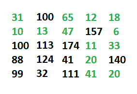

# 允许左，右，下和上移动的最小成本路径

> 原文： [https://www.geeksforgeeks.org/minimum-cost-path-left-right-bottom-moves-allowed/](https://www.geeksforgeeks.org/minimum-cost-path-left-right-bottom-moves-allowed/)

给定一个二维网格，该网格的每个像元都包含整数成本，代表通过该像元所要经过的成本，我们需要找到一条从左上角像元到右下角像元的路径，从而使总成本最小。

**注意**：假定在输入矩阵中不存在负成本周期。

此问题是以下问题的扩展。

[允许最小和最小移动的最小成本路径。](https://www.geeksforgeeks.org/dynamic-programming-set-6-min-cost-path/)

在先前的问题中，只允许向右和向底部移动，但是在此问题中，我们被允许从底部，向上，向右和向左移动，即沿所有四个方向移动。

示例：

```
A cost grid is given in below diagram, minimum 
cost to reach bottom right from top left 
is 327 (= 31 + 10 + 13 + 47 + 65 + 12 + 18 + 
6 + 33 + 11 + 20 + 41 + 20)

The chosen least cost path is shown in green.



```

使用类似于先前问题的动态编程无法解决此问题，因为此处的当前状态不仅取决于右侧和底部单元，还取决于左侧和上部单元。 我们使用 [dijkstra 的算法](https://www.geeksforgeeks.org/greedy-algorithms-set-6-dijkstras-shortest-path-algorithm/)解决了这个问题。 网格的每个像元代表一个顶点，相邻像元代表相邻的顶点。 我们不会从这些单元格中绘制出明确的图形，而是将使用 dijkstra 算法中的矩阵。

在下面的代码[中使用了 Dijkstra 算法的实现](https://www.geeksforgeeks.org/dijkstras-shortest-path-algorithm-using-set-in-stl/)。 更改以下实现的代码以应对矩阵表示的隐式图。 另请参见下面的代码中 dx 和 dy 数组的使用，这些数组用于简化访问每个像元的相邻顶点的过程。

## C++

```cpp

// C++ program to get least cost path in a grid from 
// top-left to bottom-right 
#include <bits/stdc++.h> 
using namespace std; 

#define ROW 5 
#define COL 5 

// structure for information of each cell 
struct cell 
{ 
    int x, y; 
    int distance; 
    cell(int x, int y, int distance) : 
        x(x), y(y), distance(distance) {} 
}; 

// Utility method for comparing two cells 
bool operator<(const cell& a, const cell& b) 
{ 
    if (a.distance == b.distance) 
    { 
        if (a.x != b.x) 
            return (a.x < b.x); 
        else
            return (a.y < b.y); 
    } 
    return (a.distance < b.distance); 
} 

// Utility method to check whether a point is 
// inside the grid or not 
bool isInsideGrid(int i, int j) 
{ 
    return (i >= 0 && i < COL && j >= 0 && j < ROW); 
} 

// Method returns minimum cost to reach bottom 
// right from top left 
int shortest(int grid[ROW][COL], int row, int col) 
{ 
    int dis[row][col]; 

    // initializing distance array by INT_MAX 
    for (int i = 0; i < row; i++) 
        for (int j = 0; j < col; j++) 
            dis[i][j] = INT_MAX; 

    // direction arrays for simplification of getting 
    // neighbour 
    int dx[] = {-1, 0, 1, 0}; 
    int dy[] = {0, 1, 0, -1}; 

    set<cell> st; 

    // insert (0, 0) cell with 0 distance 
    st.insert(cell(0, 0, 0)); 

    // initialize distance of (0, 0) with its grid value 
    dis[0][0] = grid[0][0]; 

    // loop for standard dijkstra's algorithm 
    while (!st.empty()) 
    { 
        // get the cell with minimum distance and delete 
        // it from the set 
        cell k = *st.begin(); 
        st.erase(st.begin()); 

        // looping through all neighbours 
        for (int i = 0; i < 4; i++) 
        { 
            int x = k.x + dx[i]; 
            int y = k.y + dy[i]; 

            // if not inside boundary, ignore them 
            if (!isInsideGrid(x, y)) 
                continue; 

            // If distance from current cell is smaller, then 
            // update distance of neighbour cell 
            if (dis[x][y] > dis[k.x][k.y] + grid[x][y]) 
            { 
                // If cell is already there in set, then 
                // remove its previous entry 
                if (dis[x][y] != INT_MAX) 
                    st.erase(st.find(cell(x, y, dis[x][y]))); 

                // update the distance and insert new updated 
                // cell in set 
                dis[x][y] = dis[k.x][k.y] + grid[x][y]; 
                st.insert(cell(x, y, dis[x][y])); 
            } 
        } 
    } 

    // uncomment below code to print distance 
    // of each cell from (0, 0) 
    /* 
    for (int i = 0; i < row; i++, cout << endl) 
        for (int j = 0; j < col; j++) 
            cout << dis[i][j] << " "; 
    */
    // dis[row - 1][col - 1] will represent final 
    // distance of bottom right cell from top left cell 
    return dis[row - 1][col - 1]; 
} 

// Driver code to test above methods 
int main() 
{ 
    int grid[ROW][COL] = 
    { 
        31, 100, 65, 12, 18, 
        10, 13, 47, 157, 6, 
        100, 113, 174, 11, 33, 
        88, 124, 41, 20, 140, 
        99, 32, 111, 41, 20 
    }; 

    cout << shortest(grid, ROW, COL) << endl; 
    return 0; 
} 

```

## Java

```java

// Java program to get least cost path  
// in a grid from top-left to bottom-right 
import java.io.*; 
import java.util.*; 

class GFG{ 

static int[] dx = { -1, 0, 1, 0 }; 
static int[] dy = { 0, 1, 0, -1 }; 
static int ROW = 5; 
static int COL = 5; 

// Custom class for representing 
// row-index, column-index & 
// distance of each cell 
static class Cell 
{ 
    int x; 
    int y; 
    int distance; 

    Cell(int x, int y, int distance)  
    { 
        this.x = x; 
        this.y = y; 
        this.distance = distance; 
    } 
} 

// Custom comparator for inserting cells  
// into Priority Queue 
static class distanceComparator  
  implements Comparator<Cell> 
{ 
    public int compare(Cell a, Cell b) 
    { 
        if (a.distance < b.distance) 
        { 
            return -1; 
        } 
        else if (a.distance > b.distance) 
        { 
            return 1; 
        } 
        else {return 0;} 
    } 
} 

// Utility method to check whether current 
// cell is inside grid or not 
static boolean isInsideGrid(int i, int j) 
{ 
    return (i >= 0 && i < ROW && 
            j >= 0 && j < COL); 
} 

// Method to return shortest path from  
// top-corner to bottom-corner in 2D grid 
static int shortestPath(int[][] grid, int row,  
                                      int col) 
{ 
    int[][] dist = new int[row][col]; 

    // Initializing distance array by INT_MAX  
    for(int i = 0; i < row; i++) 
    { 
        for(int j = 0; j < col; j++) 
        { 
            dist[i][j] = Integer.MAX_VALUE; 
        } 
    } 

    // Initialized source distance as 
    // initial grid position value 
    dist[0][0] = grid[0][0]; 

    PriorityQueue<Cell> pq = new PriorityQueue<Cell>( 
                  row * col, new distanceComparator()); 

    // Insert source cell to priority queue 
    pq.add(new Cell(0, 0, dist[0][0])); 
    while (!pq.isEmpty()) 
    { 
        Cell curr = pq.poll(); 
        for(int i = 0; i < 4; i++) 
        { 
            int rows = curr.x + dx[i]; 
            int cols = curr.y + dy[i]; 

            if (isInsideGrid(rows, cols)) 
            { 
                if (dist[rows][cols] >  
                    dist[curr.x][curr.y] +  
                    grid[rows][cols]) 
                { 

                    // If Cell is already been reached once, 
                    // remove it from priority queue 
                    if (dist[rows][cols] != Integer.MAX_VALUE) 
                    { 
                        Cell adj = new Cell(rows, cols,  
                                       dist[rows][cols]); 

                        pq.remove(adj); 
                    } 

                    // Insert cell with updated distance  
                    dist[rows][cols] = dist[curr.x][curr.y] + 
                                       grid[rows][cols]; 

                    pq.add(new Cell(rows, cols,  
                               dist[rows][cols])); 
                } 
            } 
        } 
    } 
    return dist[row - 1][col - 1]; 
} 

// Driver code 
public static void main(String[] args)  
throws IOException 
{ 
    int[][] grid = { { 31, 100, 65, 12, 18 }, 
                     { 10, 13, 47, 157, 6 }, 
                     { 100, 113, 174, 11, 33 }, 
                     { 88, 124, 41, 20, 140 }, 
                     { 99, 32, 111, 41, 20 } }; 

    System.out.println(shortestPath(grid, ROW, COL)); 
} 
} 

// This code is contributed by jigyansu 

```

**输出**：

```
327

```

本文由 [**Utkarsh Trivedi**](https://in.linkedin.com/in/utkarsh-trivedi-253069a7) 提供。 如果您喜欢 GeeksforGeeks 并希望做出贡献，则还可以使用 [tribution.geeksforgeeks.org](http://www.contribute.geeksforgeeks.org) 撰写文章，或将您的文章邮寄至 tribution@geeksforgeeks.org。 查看您的文章出现在 GeeksforGeeks 主页上，并帮助其他 Geeks。

如果发现任何不正确的内容，或者想分享有关上述主题的更多信息，请发表评论。

