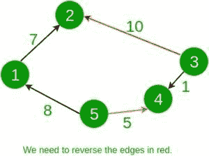

# 反转边缘以使每对节点之间都有路径的最低成本

> 原文： [https://www.geeksforgeeks.org/minimum-cost-to-reverse-edges-such-that-there-is-path-between-every-pair-of-nodes/](https://www.geeksforgeeks.org/minimum-cost-to-reverse-edges-such-that-there-is-path-between-every-pair-of-nodes/)

给定一个连通的有向图。 每个节点正好连接到另外两个节点。 每个边缘都有权重，表示反转其方向的成本。 任务是找到反转图的某些边缘的最小成本，以便可以从每个节点转到每个其他节点。

**示例**：

```
Input: 
5
1 2 7
5 1 8
5 4 5
3 4 1
3 2 10
Output: 15



Input:
6
1 5 4
5 3 8
2 4 15
1 6 16
2 3 23
4 6 42
Output: 39

```

**方法**：

*   为了从每个节点到达每个其他节点，该图必须形成一个环，即沿 2 个方向之一顺时针或逆时针指向其上的所有边。 让我们将将所有顺时针边沿重定向到逆时针方向的成本表示为 cost1，反之亦然表示为 cost2。 答案显然是这两个成本中的最小值。
*   保持两个布尔数组开始和结束。 开始和结束数组表示是否存在从给定节点开始或结束的边。 每当遇到从节点 a 到节点 b 的边时，我们首先检查条件是否存在从节点 a 开始或节点 b 结束的边。 如果存在满足条件的边缘，则该边缘与已存在的边缘的方向相反。 在这种情况下，我们更新 cost2 并存储边缘是相反的方向。 否则，我们将更新 cost1。 这样，我们就能维持两个方向的成本。 最后，打印最低成本。

下面是上述方法的实现：

## C ++

```

// C++ code to find 
// the minimum cost to 
// reverse the edges 
#include <bits/stdc++.h> 
using namespace std; 

// Function to calculate 
// min cost for reversing 
// the edges 
int minCost(vector<vector<int> >& graph, int n) 
{ 

    int cost1 = 0, cost2 = 0; 
    // bool array to mark 
    // start and end node 
    // of a graph 
    bool start[n + 1] = { false }; 
    bool end[n + 1] = { false }; 

    for (int i = 0; i < n; i++) { 

        int a = graph[i][0]; 
        int b = graph[i][1]; 
        int c = graph[i][2]; 

        // This edge must 
        // start from b and end at a 
        if (start[a] || end[b]) { 
            cost2 += c; 
            start[b] = true; 
            end[a] = true; 
        } 

        // This edge must 
        // start from a and end at b 
        else { 
            cost1 += c; 
            start[a] = true; 
            end[b] = true; 
        } 
    } 

    // Return minimum of 
    // both posibilities 
    return min(cost1, cost2); 
} 

// Driver code 
int main() 
{ 
    int n = 5; 
    // Adjacency list representation 
    // of a graph 
    vector<vector<int> > graph = { 
        { 1, 2, 7 }, 
        { 5, 1, 8 }, 
        { 5, 4, 5 }, 
        { 3, 4, 1 }, 
        { 3, 2, 10 } 
    }; 

    int ans = minCost(graph, n); 
    cout << ans << '\n'; 

    return 0; 
} 

```