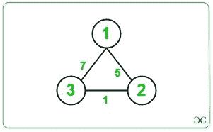

# 使用 Dijkstra 降低边缘成本的最低成本

> 原文： [https://www.geeksforgeeks.org/minimum-cost-using-dijkstra-by-reducing-cost-of-an-edge/](https://www.geeksforgeeks.org/minimum-cost-using-dijkstra-by-reducing-cost-of-an-edge/)

给定 N 个节点的无向​​图，形式为{X，Y，Z}的 M 条边，使得`X`和`Y`之间存在一条边，成本为`Z`。 任务是找到从源节点`1`到目标节点`N`的最小成本，这样我们就可以将遍历期间仅一条路径的成本降低 2。

**示例**：

> **输入**：N = 3，M = 4，边沿= {{1，2，3}，{2，3，1}，{1，3，7}，{2，1，5} }
> **输出**：2
> **说明**：
>  
> 从源节点 1 到目标节点 N 的最低成本为 = 3/2 +1 = 1 +1 = 2。
> 
> **输入**：N = 3，M = 3，边沿= {{{2，3，1}，{1，3，7}，{2，1，5}}
> **输出 **：2
> **说明**：
>  
> 从源节点 1 到目标节点 N 的最低成本为= 7/2 = 3。

**方法**：的想法是考虑每个方面，并尝试通过降低成本来最大程度地降低总体成本。 主要思想是将源到目标的路径分解成源到任何顶点`u`的路径，即**路径（1 到 u）**以及从目标到任何顶点`v`，即所有 u 和 v 的**路径（从 n 到 v）**。以下是步骤：

1.  执行 [Dijkstra 算法](https://www.geeksforgeeks.org/dijkstras-shortest-path-algorithm-greedy-algo-7/)，以查找来自源**节点 1** 的所有顶点的单个源最短路径，并将其存储为 **dist_from_source []** 的数组。
2.  执行 Dijkstra 算法，查找来自源**节点 N** 的所有顶点的单个源最短路径，并将其存储为 **dist_from_dest []** 的数组。
3.  将最小成本（例如 **minCost** ）初始化为最大值。
4.  Traverse the given edges and for each edges reduce the current cost to half and update the minimum cost as:

    > minCost = min（minCost，dist_from_source [u] + c / 2 + dist_from_dest [v]）
    > 其中，
    > c 是当前边沿的成本，
    > dist_from_source [u]是从节点 1 到路径的成本 到 u
    > dist_from_source [v]是从节点 v 到 N 的路径成本

5.  完成上述步骤后，打印 **minCost** 的值。

下面是上述方法的实现：

## C ++ 14

```

// C++ program for the above approach 
#include <bits/stdc++.h> 
using namespace std; 
#define INF 1e9 

// Function for Dijkstra Algorithm to 
// find single source shortest path 
void dijkstra(int source, int n, 
              vector<pair<int, 
                          int> > 
                  adj[], 
              vector<int>& dist) 
{ 
    // Resize dist[] to N and assign 
    // any large value to it 
    dist.resize(n, INF); 

    // Initialise distance of source 
    // node as 0 
    dist = 0; 

    // Using min-heap priority_queue 
    // for sorting wrt edges_cost 
    priority_queue<pair<int, int>, 
                   vector<pair<int, 
                               int> >, 
                   greater<pair<int, 
                                int> > > 
        pq; 

    // Push the current dist 
    // and source to pq 
    pq.push({ dist, source }); 

    // Until priority queue is empty 
    while (!pq.empty()) { 

        // Store the cost of linked 
        // node to edges 
        int u = pq.top().second; 
        // int d = pq.top().first; 

        // Pop the top node 
        pq.pop(); 

        // Iterate over edges 
        for (auto& edge : adj[u]) { 

            // Find the starting and 
            // ending vertex of edge 
            int v = edge.first; 
            int w = edge.second; 

            // Update the distance of 
            // node v to minimum of 
            // dist[u] + w if it is 
            // minimum 
            if (dist[u] + w < dist[v]) { 
                dist[v] = dist[u] + w; 
                pq.push({ dist[v], v }); 
            } 
        } 
    } 
} 

// Function to find the minimum cost 
// between node 1 to node n 
void minCostPath( 
    vector<pair<int, pair<int, int> > >& edges, 
    int n, int M) 
{ 

    // To create Adjacency List 
    vector<pair<int, int> > adj[100005]; 

    // Iterate over edges 
    for (int i = 0; i < M; i++) { 

        // Get source, destination and 
        // edges of edges[i] 
        int x = edges[i].first; 
        int y = edges[i].second.first; 
        int z = edges[i].second.second; 

        // Create Adjacency List 
        adj[x].push_back({ y, z }); 
        adj[y].push_back({ x, z }); 
    } 

    // To store the cost from node 1 
    // and node N 
    vector<int> dist_from_source; 
    vector<int> dist_from_dest; 

    // Find the cost of travel between 
    // source(1) to any vertex 
    dijkstra(1, n + 1, adj, dist_from_source); 

    // Find the cost of travel between 
    // destination(n) to any vertex 
    dijkstra(n, n + 1, adj, dist_from_dest); 

    // Initialise the minimum cost 
    int min_cost = dist_from_source[n]; 

    // Traverse the edges 
    for (auto& it : edges) { 

        // Get the edges 
        int u = it.first; 
        int v = it.second.first; 
        int c = it.second.second; 

        // Find the current cost from 
        // node 1 to u and node u to v 
        // and node v to N with only 
        // current edge cost reduced 
        // to half 
        int cur_cost = dist_from_source[u] 
                       + c / 2 
                       + dist_from_dest[v]; 

        // Update the min_cost 
        min_cost = min(min_cost, cur_cost); 
    } 

    // Print the minimum cost 
    cout << min_cost << '\n'; 
} 

// Driver Code 
int main() 
{ 
    // Give Nodes and Edges 
    int N = 3; 
    int M = 3; 

    // Given Edges with cost 
    vector<pair<int, pair<int, int> > > edges; 

    edges.push_back({ 2, { 3, 1 } }); 
    edges.push_back({ 1, { 3, 7 } }); 
    edges.push_back({ 2, { 1, 5 } }); 

    // Function Call 
    minCostPath(edges, N, M); 
    return 0; 
} 

```

**Output:**

```
3

```

***时间复杂度**：O（N + M），其中 N 是节点数，M 是边数。
**辅助空间**：O（N），其中 N 是节点数。*


* * *

* * *

如果您喜欢 GeeksforGeeks 并希望做出贡献，则还可以使用 [tribution.geeksforgeeks.org](https://contribute.geeksforgeeks.org/) 撰写文章，或将您的文章邮寄至 tribution@geeksforgeeks.org。 查看您的文章出现在 GeeksforGeeks 主页上，并帮助其他 Geeks。

如果您发现任何不正确的地方，请单击下面的“改进文章”按钮，以改进本文。