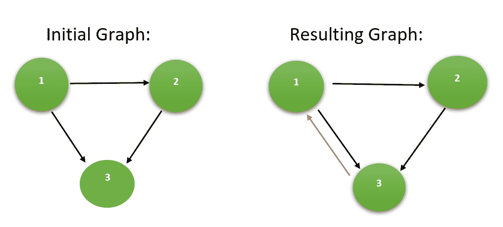

# 形成有向图的强连接所需的最小边线

> 原文： [https://www.geeksforgeeks.org/minimum-edges-required-to-make-a-directed-graph-strongly-connected/](https://www.geeksforgeeks.org/minimum-edges-required-to-make-a-directed-graph-strongly-connected/)

给定**定向** [**图**](https://www.geeksforgeeks.org/graph-data-structure-and-algorithms/) 的`N`顶点和`M`边，任务是找到最小的 制作给定图形 [**强连接的**](https://www.geeksforgeeks.org/strongly-connected-components/) 所需的边缘。

**示例**：

> **输入**：N = 3，M = 3，源[] = {1,2,1}，目的地[] = {2，3，3}。
> **输出**：1
> **说明**：
> 添加连接有一对顶点{3，1}的有向边可以使图形牢固连接。
> 因此，所需的最小边数为 1。
> 下面是上述示例的图示：
> 
> 
> 
> **输入**：N = 6，M = 5，source [] = {1，3，1，3，5}，destination [] = {2，2，3，5，6}
> **输出**：3
> **说明**：
> 添加 3 个有向边以连接以下一对顶点将使图形牢固连接：
> 
> *   {2, 1}
> *   {4, 5}
> *   {6, 4}
> 
> 因此，所需的最小边数为 3。

**方法**：
对于[强连通图](https://www.geeksforgeeks.org/strongly-connected-components/)，每个顶点的[入度和出度](https://www.geeksforgeeks.org/finding-in-and-out-degrees-of-all-vertices-in-a-graph/)至少应为， ] *`1`* 。 因此，为了使图牢固连接，每个顶点必须具有输入边缘和输出边缘。 使图牢固连接所需的传入边缘和传出边缘的最大数量为使其牢固连接所需的最小边缘。
请按照以下步骤解决问题：

*   使用 [DFS](https://www.geeksforgeeks.org/depth-first-search-or-dfs-for-a-graph/) 找出图的每个顶点的度数和度数。
*   如果顶点的入度或出度大于 *1* ，则仅将其视为 *1* 。
*   计算给定图**的总度数和度数。**
*   然后，通过 ***max（N-totalIndegree，N-totalOutdegree）给出使图牢固连接所需的最小边数。***
*   打印最小边缘数作为结果。

下面是上述方法的实现：

## C++

```cpp

// C++ program to implement
// the above approach
#include <bits/stdc++.h>
using namespace std;

// Perform DFS to count the in-degree
// and out-degree of the graph
void dfs(int u, vector<int> adj[], int* vis, int* inDeg,
         int* outDeg)
{
    // Mark the source as visited
    vis[u] = 1;

    // Mark in-degree as 1
    inDeg[u] = 1;

    // Traversing adjacent nodes
    for (auto v : adj[u]) 
    {
        // If not visited
        if (vis[v] == 0) 
        {
            // Mark out-degree as 1
            outDeg[u] = 1;

            // DFS Traversal on
            // adjacent vertex
            dfs(v, adj, vis, inDeg, outDeg);
        }
    }
}

// Function to return minimum number
// of edges required to make the graph
// strongly connected
int findMinimumEdges(int source[], int N, int M, int dest[])
{
    // For Adjacency List
    vector<int> adj[N + 1];

    // Create the Adjacency List
    for (int i = 0; i < M; i++) 
    {
        adj].push_back(dest[i]);
    }

    // Initialize the in-degree array
    int inDeg[N + 1] = { 0 };

    // Initialize the out-degree array
    int outDeg[N + 1] = { 0 };

    // Initialize the visited array
    int vis[N + 1] = { 0 };

    // Perform DFS to count in-degrees
    // and out-degreess
    dfs(1, adj, vis, inDeg, outDeg);

    // To store the result
    int minEdges = 0;

    // To store total count of in-degree
    // and out-degree
    int totalIndegree = 0;
    int totalOutdegree = 0;

    // Find total in-degree
    // and out-degree
    for (int i = 1; i <= N; i++) 
    {
        if (inDeg[i] == 1)
            totalIndegree++;
        if (outDeg[i] == 1)
            totalOutdegree++;
    }

    // Calculate the minimum
    // edges required
    minEdges = max(N - totalIndegree, N - totalOutdegree);

    // Return the minimum edges
    return minEdges;
}

// Driver Code
int main()
{
    int N = 6, M = 5;

    int source[] = { 1, 3, 1, 3, 5 };
    int destination[] = { 2, 2, 3, 5, 6 };

    // Function call
    cout << findMinimumEdges(source, N, M, destination);
    return 0;
}

```

## Java

```java

// Java program to implement
// the above approach
import java.util.*;
class GFG{

// Perform DFS to count the 
// in-degree and out-degree 
// of the graph
static void dfs(int u, Vector<Integer> adj[], 
                int[] vis, int[] inDeg,
         int[] outDeg)
{
  // Mark the source 
  // as visited
  vis[u] = 1;

  // Mark in-degree as 1
  inDeg[u] = 1;

  // Traversing adjacent nodes
  for (int v : adj[u]) 
  {
    // If not visited
    if (vis[v] == 0) 
    {
      // Mark out-degree as 1
      outDeg[u] = 1;

      // DFS Traversal on
      // adjacent vertex
      dfs(v, adj, vis, 
          inDeg, outDeg);
    }
  }
}

// Function to return minimum 
// number of edges required 
// to make the graph strongly 
// connected
static int findMinimumEdges(int source[], 
                            int N, int M, 
                            int dest[])
{
  // For Adjacency List
  Vector<Integer> []adj = 
         new Vector[N + 1];

  for (int i = 0; i < adj.length; i++)
    adj[i] = new Vector<Integer>();

  // Create the Adjacency List
  for (int i = 0; i < M; i++) 
  {
    adj].add(dest[i]);
  }

  // Initialize the in-degree array
  int inDeg[] = new int[N + 1];

  // Initialize the out-degree array
  int outDeg[] = new int[N + 1];

  // Initialize the visited array
  int vis[] = new int[N + 1];

  // Perform DFS to count 
  // in-degrees and out-degreess
  dfs(1, adj, vis, inDeg, outDeg);

  // To store the result
  int minEdges = 0;

  // To store total count of 
  // in-degree and out-degree
  int totalIndegree = 0;
  int totalOutdegree = 0;

  // Find total in-degree
  // and out-degree
  for (int i = 1; i <= N; i++) 
  {
    if (inDeg[i] == 1)
      totalIndegree++;
    if (outDeg[i] == 1)
      totalOutdegree++;
  }

  // Calculate the minimum
  // edges required
  minEdges = Math.max(N - totalIndegree, 
                      N - totalOutdegree);

  // Return the minimum edges
  return minEdges;
}

// Driver Code
public static void main(String[] args)
{
  int N = 6, M = 5;
  int source[] = {1, 3, 1, 3, 5};
  int destination[] = {2, 2, 3, 5, 6};

  // Function call
  System.out.print(findMinimumEdges(source, 
                                    N, M, 
                                    destination));
}
}

// This code is contributed by Rajput-Ji

```

## Python

```py

# Python3 program to implement
# the above approach

# Perform DFS to count the in-degree
# and out-degree of the graph
def dfs(u, adj, vis,inDeg, outDeg):

    # Mark the source as visited
    vis[u] = 1;

    # Mark in-degree as 1
    inDeg[u] = 1;

    # Traversing adjacent nodes
    for v in adj[u]:

        # If not visited
        if (vis[v] == 0):

            # Mark out-degree as 1
            outDeg[u] = 1;

            # DFS Traversal on
            # adjacent vertex
            dfs(v, adj, vis, 
                inDeg, outDeg)

# Function to return minimum 
# number of edges required 
# to make the graph strongly 
# connected
def findMinimumEdges(source, N, 
                     M, dest):

    # For Adjacency List
    adj = [[] for i in range(N + 1)]

    # Create the Adjacency List
    for i in range(M):
        adj[i].append(dest[i]);

    # Initialize the in-degree array
    inDeg = [0 for i in range(N + 1)]

    # Initialize the out-degree array
    outDeg = [0 for i in range(N + 1)]

    # Initialize the visited array
    vis = [0 for i in range(N + 1)]

    # Perform DFS to count in-degrees
    # and out-degreess
    dfs(1, adj, vis, inDeg, outDeg);

    # To store the result
    minEdges = 0;

    # To store total count of 
    # in-degree and out-degree
    totalIndegree = 0;
    totalOutdegree = 0;

    # Find total in-degree
    # and out-degree
    for i in range(N + 1):    
        if (inDeg[i] == 1):
            totalIndegree += 1;
        if (outDeg[i] == 1):
            totalOutdegree += 1;    

    # Calculate the minimum
    # edges required
    minEdges = max(N - totalIndegree, 
                   N - totalOutdegree);

    # Return the minimum edges
    return minEdges;

# Driver code
if __name__ == "__main__":

    N = 6
    M = 5

    source = [1, 3, 1, 3, 5]
    destination = [2, 2, 3, 5, 6]

    # Function call
    print(findMinimumEdges(source, N, 
                           M, destination))

# This code is contributed by rutvik_56

```

## C#

```cs

// C# program to implement
// the above approach
using System;
using System.Collections.Generic;

class GFG{

// Perform DFS to count the 
// in-degree and out-degree 
// of the graph
static void dfs(int u, List<int> []adj, 
                int[] vis, int[] inDeg,
                int[] outDeg)
{

    // Mark the source 
    // as visited
    vis[u] = 1;

    // Mark in-degree as 1
    inDeg[u] = 1;

    // Traversing adjacent nodes
    foreach (int v in adj[u]) 
    {
        // If not visited
        if (vis[v] == 0) 
        {
            // Mark out-degree as 1
            outDeg[u] = 1;

            // DFS Traversal on
            // adjacent vertex
            dfs(v, adj, vis, 
                inDeg, outDeg);
        }
    }
}

// Function to return minimum 
// number of edges required 
// to make the graph strongly 
// connected
static int findMinimumEdges(int []source, 
                            int N, int M, 
                            int []dest)
{

    // For Adjacency List
    List<int> []adj = new List<int>[N + 1];

    for(int i = 0; i < adj.Length; i++)
        adj[i] = new List<int>();

    // Create the Adjacency List
    for(int i = 0; i < M; i++) 
    {
        adj].Add(dest[i]);
    }

    // Initialize the in-degree array
    int []inDeg = new int[N + 1];

    // Initialize the out-degree array
    int []outDeg = new int[N + 1];

    // Initialize the visited array
    int []vis = new int[N + 1];

    // Perform DFS to count 
    // in-degrees and out-degreess
    dfs(1, adj, vis, inDeg, outDeg);

    // To store the result
    int minEdges = 0;

    // To store total count of 
    // in-degree and out-degree
    int totalIndegree = 0;
    int totalOutdegree = 0;

    // Find total in-degree
    // and out-degree
    for (int i = 1; i <= N; i++) 
    {
        if (inDeg[i] == 1)
            totalIndegree++;
        if (outDeg[i] == 1)
            totalOutdegree++;
    }

    // Calculate the minimum
    // edges required
    minEdges = Math.Max(N - totalIndegree, 
                        N - totalOutdegree);

    // Return the minimum edges
    return minEdges;
}

// Driver Code
public static void Main(String[] args)
{
    int N = 6, M = 5;
    int []source = { 1, 3, 1, 3, 5 };
    int []destination = { 2, 2, 3, 5, 6 };

    // Function call
    Console.Write(findMinimumEdges(source, 
                                   N, M, 
                                   destination));
}
}

// This code is contributed by Amit Katiyar

```

输出：

```
3

```

**时间复杂度**：O（N + M）
**辅助空间**：O（N）


* * *

* * *

如果您喜欢 GeeksforGeeks 并希望做出贡献，则还可以使用 [tribution.geeksforgeeks.org](https://contribute.geeksforgeeks.org/) 撰写文章，或将您的文章邮寄至 tribution@geeksforgeeks.org。 查看您的文章出现在 GeeksforGeeks 主页上，并帮助其他 Geeks。

如果您发现任何不正确的地方，请单击下面的“改进文章”按钮，以改进本文。