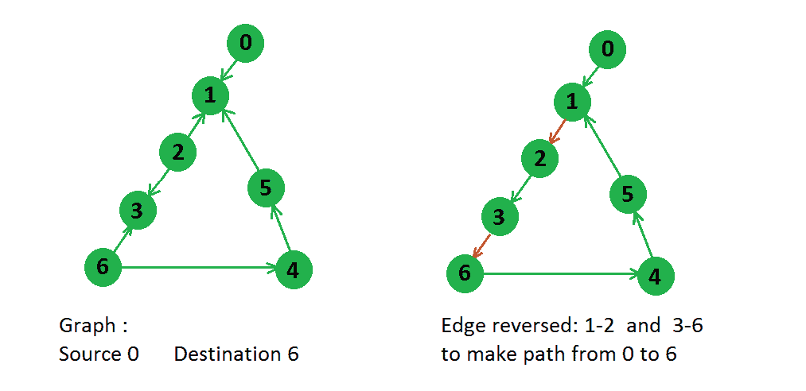

# 反转从源到目标的最小边沿

> 原文： [https://www.geeksforgeeks.org/minimum-edges-reverse-make-path-source-destination/](https://www.geeksforgeeks.org/minimum-edges-reverse-make-path-source-destination/)

给定一个有向图以及一个源节点和目标节点，我们需要找到需要反转的边数，以便从源节点到目标节点至少有 1 条路径。

例子：

```
 
In above graph there were two paths from node 0 to node 6,
0 -> 1 -> 2 -> 3 -> 6
0 -> 1 -> 5 -> 4 -> 6
But for first path only two edges need to be reversed, so answer will be 2 only.

```

假设给定图的版本不同，则可以解决此问题。 在此版本中，我们制作与每个边缘相对应的反向边缘，并为该边缘分配权重 1，为原始边缘分配权重 0。 经过上述修改后，上方图形如下所示：
 [](https://media.geeksforgeeks.org/wp-content/uploads/modifiedGraph.png)

现在我们可以看到，我们以如下方式修改了图形：如果我们朝原始边缘移动，则不会产生任何成本，但是如果我们朝反向边缘 1 移动，则会增加成本。 因此，如果将 [Dijkstra 的最短路径](https://www.geeksforgeeks.org/greedy-algorithms-set-6-dijkstras-shortest-path-algorithm/)从给定的源应用到此经修改的图形上，那么这将使我们从源到目标的最小开销，即从源到目标的最小边沿反转。
下面是基于以上概念的代码。

```

// Program to find minimum edge reversal to get 
// atleast one path from source to destination 
#include <bits/stdc++.h> 
using namespace std; 
# define INF 0x3f3f3f3f 

// This class represents a directed graph using 
// adjacency list representation 
class Graph 
{ 
    int V;    // No. of vertices 

    // In a weighted graph, we need to store vertex 
    // and weight pair for every edge 
    list< pair<int, int> > *adj; 

public: 
    Graph(int V);  // Constructor 

    // function to add an edge to graph 
    void addEdge(int u, int v, int w); 

    // returns shortest path from s 
    vector<int> shortestPath(int s); 
}; 

// Allocates memory for adjacency list 
Graph::Graph(int V) 
{ 
    this->V = V; 
    adj = new list< pair<int, int> >[V]; 
} 

//  method adds a directed edge from u to v with weight w 
void Graph::addEdge(int u, int v, int w) 
{ 
    adj[u].push_back(make_pair(v, w)); 
} 

// Prints shortest paths from src to all other vertices 
vector<int> Graph::shortestPath(int src) 
{ 
    // Create a set to store vertices that are being 
    // prerocessed 
    set< pair<int, int> > setds; 

    // Create a vector for distances and initialize all 
    // distances as infinite (INF) 
    vector<int> dist(V, INF); 

    // Insert source itself in Set and initialize its 
    // distance as 0\. 
    setds.insert(make_pair(0, src)); 
    dist[src] = 0; 

    /* Looping till all shortest distance are finalized 
       then setds will become empty */
    while (!setds.empty()) 
    { 
        // The first vertex in Set is the minimum distance 
        // vertex, extract it from set. 
        pair<int, int> tmp = *(setds.begin()); 
        setds.erase(setds.begin()); 

        // vertex label is stored in second of pair (it 
        // has to be done this way to keep the vertices 
        // sorted distance (distance must be first item 
        // in pair) 
        int u = tmp.second; 

        // 'i' is used to get all adjacent vertices of a vertex 
        list< pair<int, int> >::iterator i; 
        for (i = adj[u].begin(); i != adj[u].end(); ++i) 
        { 
            // Get vertex label and weight of current adjacent 
            // of u. 
            int v = (*i).first; 
            int weight = (*i).second; 

            //  If there is shorter path to v through u. 
            if (dist[v] > dist[u] + weight) 
            { 
                /*  If distance of v is not INF then it must be in 
                    our set, so removing it and inserting again 
                    with updated less distance. 
                    Note : We extract only those vertices from Set 
                    for which distance is finalized. So for them, 
                    we would never reach here.  */
                if (dist[v] != INF) 
                    setds.erase(setds.find(make_pair(dist[v], v))); 

                // Updating distance of v 
                dist[v] = dist[u] + weight; 
                setds.insert(make_pair(dist[v], v)); 
            } 
        } 
    } 
    return dist; 
} 

/* method adds reverse edge of each original edge 
   in the graph. It gives reverse edge a weight = 1 
   and all original edges a weight of 0\. Now, the 
   length of the shortest path will give us the answer. 
   If shortest path is p: it means we used p reverse 
   edges in the shortest path. */
Graph modelGraphWithEdgeWeight(int edge[][2], int E, int V) 
{ 
    Graph g(V); 
    for (int i = 0; i < E; i++) 
    { 
        //  original edge : weight 0 
        g.addEdge(edge[i][0], edge[i][1], 0); 

        //  reverse edge : weight 1 
        g.addEdge(edge[i][1], edge[i][0], 1); 
    } 
    return g; 
} 

// Method returns minimum number of edges to be 
// reversed to reach from src to dest 
int getMinEdgeReversal(int edge[][2], int E, int V, 
                       int src, int dest) 
{ 
    //  get modified graph with edge weight 
    Graph g = modelGraphWithEdgeWeight(edge, E, V); 

    //  get shortes path vector 
    vector<int> dist = g.shortestPath(src); 

    // If distance of destination is still INF, 
    // not possible 
    if (dist[dest] == INF) 
        return -1; 
    else
        return dist[dest]; 
} 

//  Driver code to test above method 
int main() 
{ 
    int V = 7; 
    int edge[][2] = {{0, 1}, {2, 1}, {2, 3}, {5, 1}, 
                     {4, 5}, {6, 4}, {6, 3}}; 
    int E = sizeof(edge) / sizeof(edge[0]); 

    int minEdgeToReverse = 
                  getMinEdgeReversal(edge, E, V, 0, 6); 
    if (minEdgeToReverse != -1) 
        cout << minEdgeToReverse << endl; 
    else
        cout << "Not possible" << endl; 
    return 0 
} 

```

输出：

```
2

```

本文由 **[Utkarsh Trivedi](https://in.linkedin.com/in/utkarsh-trivedi-253069a7)** 提供。 如果您喜欢 GeeksforGeeks 并希望做出贡献，则还可以使用 [tribution.geeksforgeeks.org](http://www.contribute.geeksforgeeks.org) 撰写文章，或将您的文章邮寄至 tribution@geeksforgeeks.org。 查看您的文章出现在 GeeksforGeeks 主页上，并帮助其他 Geeks。

如果发现任何不正确的地方，或者想分享有关上述主题的更多信息，请写评论。

