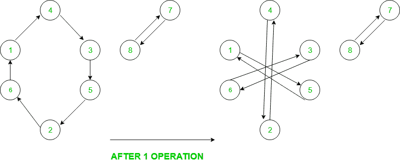

# 将排列转换为身份排列所需的最小给定操作数

> 原文：[https://www.geeksforgeeks.org/minimum-number-of-given-operations-required-to-convert-a-permutation-into-an-identity-permutation/](https://www.geeksforgeeks.org/minimum-number-of-given-operations-required-to-convert-a-permutation-into-an-identity-permutation/)

给定第一个`n`个自然数的置换`P`（`P1, P2, P3, ……, Pn`）。 找到将其转换为身份置换的最小操作数，即`1, 2, 3, ..., n`，其中每个操作定义为：

对于从 1 到`n`的所有`i`，`P[i] = P[P[P[i]]]`（基于 1 的索引）。 如果无法转换，请打印`-1`。

**示例**：

> **输入**：`arr[] = {2, 3, 1}`
>
> **输出**：1
>
> 1 次操作后：
>
> ```
> P [1] = P[P[P[1]]] = P[P[2]] = P[3] = 1
> P [2] = P[P[P[2]]] = P[P[3]] = P[1] = 2
> P [3] = P[P[P[3]]] = P[P[1]] = P[2] = 3
> ```
> 
> 因此，经过 1 次运算，我们获得了一个身份置换。
> 
> **输入**：`arr[] = {2, 1, 3}`
>
> **输出**：-1
>
> 不管我们应用多少操作，都无法获得身份置换 。

**方法**：首先，找到给定排列中的所有循环。 在此，循环是有向图，其中从元素`e`到位置`e`上的元素存在一条边。

例如，这是排列图`{4, 6, 5, 3, 2, 1, 8, 7}`



现在，在一个操作中，长度为`3k`的每个周期分成三个长度为`k`的周期，而长度为`3k + 1`或`3k + 2`的周期不中断。 由于最后我们需要长度为 1 的所有周期，因此，所有周期都必须为 3 的幂。否则，答案将不存在。 答案将是所有循环长度的对数（以 3 为底）的最大值。

下面是上述方法的实现：

## C++

```cpp

// C++ implementation of the approach 
#include <bits/stdc++.h> 
using namespace std; 

int calculateCycleOperations(int len) 
{ 
    int cycle_operations = 0; 
    while (len) { 
        len /= 3; 
        ++cycle_operations; 
    } 
    return --cycle_operations; 
} 

// Function to return the minimum operations required 
int minimumOperations(int p[], int n) 
{ 

    // Array to keep track of visited elements 
    bool visited[n + 1] = { 0 }; 

    // To store the final answer 
    int ans = 0; 

    // Looping through all the elements 
    for (int i = 1; i <= n; i++) { 

        // Current element 
        int ele = p[i]; 

        // If current element is not present in the 
        // previous cycles then only consider this 
        if (!visited[ele]) { 

            // Mark current element visited so that it 
            // will not be considered in other cycles 
            visited[ele] = 1; 

            // To store the length of each cycle 
            int len = 1; 
            ele = p[ele]; 

            // Calculating cycle length 
            while (!visited[ele]) { 
                visited[ele] = 1; 
                ++len; 
                ele = p[ele]; 
            } 

            // Operations needed for this cycle to reduce 
            // to length 1 (if possible) 
            int operations = calculateCycleOperations(len); 

            // Checking cycle length to be power of 3 
            // if not, then return -1 
            int num = pow(3, operations); 
            if (num != len) { 
                return -1; 
            } 

            // Taking maximum of the operations 
            ans = max(ans, operations); 
        } 
    } 
    return ans; 
} 

// Driver code 
int main() 
{ 
    // 1-based indexing 
    int P[] = { -1, 4, 6, 5, 3, 2, 7, 8, 9, 1 }; 
    int n = (sizeof(P) / sizeof(P[0])) - 1; 

    // Calling function 
    cout << minimumOperations(P, n); 

    return 0; 
} 

```

## Java

```java

// Java implementation of the approach 
import java.util.*; 

class GFG 
{ 

static int calculateCycleOperations(int len) 
{ 
    int cycle_operations = 0; 
    while (len > 0)  
    { 
        len /= 3; 
        ++cycle_operations; 
    } 
    return --cycle_operations; 
} 

// Function to return the minimum operations required 
static int minimumOperations(int p[], int n) 
{ 

    // Array to keep track of visited elements 
    int []visited = new int[n+1]; 
    Arrays.fill(visited,0); 

    // To store the final answer 
    int ans = 0; 

    // Looping through all the elements 
    for (int i = 1; i <= n; i++)  
    { 

        // Current element 
        int ele = p[i]; 

        // If current element is not present in the 
        // previous cycles then only consider this 
        if (visited[ele] == 0)  
        { 

            // Mark current element visited so that it 
            // will not be considered in other cycles 
            visited[ele] = 1; 

            // To store the length of each cycle 
            int len = 1; 
            ele = p[ele]; 

            // Calculating cycle length 
            while (visited[ele] == 0) 
            { 
                visited[ele] = 1; 
                ++len; 
                ele = p[ele]; 
            } 

            // Operations needed for this cycle to reduce 
            // to length 1 (if possible) 
            int operations = calculateCycleOperations(len); 

            // Checking cycle length to be power of 3 
            // if not, then return -1 
            int num = (int)Math.pow(3, operations); 
            if (num != len) { 
                return -1; 
            } 

            // Taking maximum of the operations 
            ans = Math.max(ans, operations); 
        } 
    } 
    return ans; 
} 

// Driver code 
public static void main(String args[]) 
{ 
    // 1-based indexing 
    int P[] = { -1, 4, 6, 5, 3, 2, 7, 8, 9, 1 }; 
    int n = P.length-1; 

    // Calling function 
    System.out.println(minimumOperations(P, n)); 
} 
} 

// This code is contributed by 
// Surendra_Gangwar 

```

## Python3

```py

# Python3 implementation of the approach 
def calculateCycleOperations(length): 

    cycle_operations = 0
    while length > 0:  
        length //= 3
        cycle_operations += 1

    return cycle_operations - 1

# Function to return the minimum  
# operations required 
def minimumOperations(p, n): 

    # Array to keep track of visited elements 
    visited = [0] * (n + 1)  

    # To store the final answer 
    ans = 0

    # Looping through all the elements 
    for i in range(1, n + 1):  

        # Current element 
        ele = p[i] 

        # If current element is not present in the 
        # previous cycles then only consider this 
        if not visited[ele]:  

            # Mark current element visited so that it 
            # will not be considered in other cycles 
            visited[ele] = 1

            # To store the length of each cycle 
            length = 1
            ele = p[ele] 

            # Calculating cycle length 
            while not visited[ele]:  
                visited[ele] = 1
                length += 1
                ele = p[ele] 

            # Operations needed for this cycle to 
            # reduce to length 1 (if possible) 
            operations = calculateCycleOperations(length) 

            # Checking cycle length to be power 
            # of 3 if not, then return -1 
            num = pow(3, operations) 
            if num != length:  
                return -1

            # Taking maximum of the operations 
            ans = max(ans, operations) 

    return ans 

# Driver code 
if __name__ == "__main__": 

    # 1-based indexing 
    P = [-1, 4, 6, 5, 3, 2, 7, 8, 9, 1]  
    n = len(P) - 1

    # Calling function 
    print(minimumOperations(P, n)) 

# This code is contributed by Rituraj Jain 

```

## C#

```cs

// C# implementation of the above approach  
using System; 

class GFG  
{  

    static int calculateCycleOperations(int len)  
    {  
        int cycle_operations = 0;  
        while (len > 0)  
        {  
            len /= 3;  
            ++cycle_operations;  
        }  
        return --cycle_operations;  
    }  

    // Function to return the minimum operations required  
    static int minimumOperations(int []p, int n)  
    {  

        // Array to keep track of visited elements  
        int []visited = new int[n+1];  

        // To store the final answer  
        int ans = 0;  

        // Looping through all the elements  
        for (int i = 1; i <= n; i++)  
        {  

            // Current element  
            int ele = p[i];  

            // If current element is not present in the  
            // previous cycles then only consider this  
            if (visited[ele] == 0)  
            {  

                // Mark current element visited so that it  
                // will not be considered in other cycles  
                visited[ele] = 1;  

                // To store the length of each cycle  
                int len = 1;  
                ele = p[ele];  

                // Calculating cycle length  
                while (visited[ele] == 0)  
                {  
                    visited[ele] = 1;  
                    ++len;  
                    ele = p[ele];  
                }  

                // Operations needed for this cycle to reduce  
                // to length 1 (if possible)  
                int operations = calculateCycleOperations(len);  

                // Checking cycle length to be power of 3  
                // if not, then return -1  
                int num = (int)Math.Pow(3, operations);  
                if (num != len)  
                {  
                    return -1;  
                }  

                // Taking maximum of the operations  
                ans = Math.Max(ans, operations);  
            }  
        }  
        return ans;  
    }  

    // Driver code  
    public static void Main()  
    {  
        // 1-based indexing  
        int []P = { -1, 4, 6, 5, 3, 2, 7, 8, 9, 1 };  
        int n = P.Length-1;  

        // Calling function  
        Console.WriteLine(minimumOperations(P, n));  
    }  
}  

// This code is contributed by Ryuga 

```

## PHP

```php

<?php 
// PHP implementation of the approach 
function calculateCycleOperations($len) 
{ 
    $cycle_operations = 0; 
    while ($len) 
    { 
        $len = (int)($len / 3); 
        ++$cycle_operations; 
    } 
    return --$cycle_operations; 
} 

// Function to return the minimum 
// operations required 
function minimumOperations($p, $n) 
{ 

    // Array to keep track of visited elements 
    $visited[$n + 1] = array(0); 

    // To store the final answer 
    $ans = 0; 

    // Looping through all the elements 
    for ($i = 1; $i <= $n; $i++) 
    { 

        // Current element 
        $ele = $p[$i]; 

        // If current element is not present in the 
        // previous cycles then only consider this 
        if (!$visited[$ele]) 
        { 

            // Mark current element visited so that it 
            // will not be considered in other cycles 
            $visited[$ele] = 1; 

            // To store the length of each cycle 
            $len = 1; 
            $ele = $p[$ele]; 

            // Calculating cycle length 
            while (!$visited[$ele]) 
            { 
                $visited[$ele] = 1; 
                ++$len; 
                $ele = $p[$ele]; 
            } 

            // Operations needed for this cycle to reduce 
            // to length 1 (if possible) 
            $operations = calculateCycleOperations($len); 

            // Checking cycle length to be power of 3 
            // if not, then return -1 
            $num = pow(3, $operations); 
            if ($num != $len) 
            { 
                return -1; 
            } 

            // Taking maximum of the operations 
            $ans = max($ans, $operations); 
        } 
    } 
    return $ans; 
} 

// Driver code 

// 1-based indexing 
$P = array(-1, 4, 6, 5, 3, 2, 7, 8, 9, 1); 
$n = sizeof($P) - 1; 

// Calling function 
echo minimumOperations($P, $n); 

// This code is contributed by Akanksha Rai 
?> 

```

**输出**：

```
2

```

**时间复杂度**：`O(N * LogN)`


* * *

* * *


