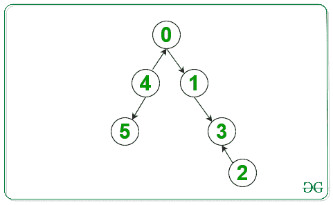
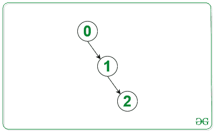

# 从其他每个节点到达节点 0 的最小反转次数

> 原文： [https://www.geeksforgeeks.org/minimum-number-of-reversals-to-reach-node-0-from-every-other-node/](https://www.geeksforgeeks.org/minimum-number-of-reversals-to-reach-node-0-from-every-other-node/)

给定一个`N`顶点值从 **0 到 N – 1** 和 **N – 1** 边的有向图，任务是计算必须颠倒的边数 因此，从每个节点到**节点 0** 总是存在一条路径。

**示例**：

> **输入**：下面是给定的图形
>  
> **输出**：3
> **说明**：
> 
> 
> **输入**：下面是给定的图形
>  
> **输出**：0

**方法**：这个想法是对图形使用 [BFS 遍历。 步骤如下：](https://www.geeksforgeeks.org/breadth-first-search-or-bfs-for-a-graph/)

1.  创建一个有向图，使给定图的边方向相反。

2.  创建[队列](http://www.geeksforgeeks.org/queue-data-structure/)，并将**节点 0** 推送到队列中。

3.  在图表上进行 BFS 遍历期间，请执行以下操作：

    *   从队列中弹出前端节点（例如 **current_node** ）。

    *   在反向图中遍历当前节点的[邻接表](https://www.geeksforgeeks.org/add-and-remove-vertex-in-adjacency-list-representation-of-graph/)，并将未访问的那些节点压入队列。

    *   在反向图中遍历当前节点的[邻接表](https://www.geeksforgeeks.org/add-and-remove-vertex-in-adjacency-list-representation-of-graph/)，并将未访问的那些节点压入队列。

    *   在上述步骤中插入到队列中的总节点数需要反转的边数，因为连接到当前节点并且在图中尚未访问的节点无法到达**节点 0** ，因此，我们需要扭转他们的方向。 将以上步骤中的节点数添加到最终数。

下面是上述方法的实现：

```

// CPP program for the above approach 
#include <bits/stdc++.h> 
using namespace std; 

// Function to find minimum reversals 
int minRev(vector<vector<int> > edges, 
           int n) 
{ 

    // Add all adjacent nodes to 
    // the node in the graph 
    unordered_map<int, vector<int> > graph; 
    unordered_map<int, vector<int> > graph_rev; 

    for (int i = 0; 
         i < edges.size(); i++) { 

        int x = edges[i][0]; 
        int y = edges[i][1]; 

        // Insert edges in the graph 
        graph[x].push_back(y); 

        // Insert edges in the 
        // reversed graph 
        graph_rev[y].push_back(x); 
    } 

    queue<int> q; 

    // Create array visited to mark 
    // all the visited nodes 
    vector<int> visited(n, 0); 
    q.push(0); 

    // Stores the number of 
    // edges to be reversed 
    int ans = 0; 

    // BFS Traversal 
    while (!q.empty()) { 

        // Pop the current node 
        // from the queue 
        int curr = q.front(); 

        // mark the current 
        // node visited 
        visited[curr] = 1; 

        // Intitialize count of edges 
        // need to be reversed to 0 
        int count = 0; 
        q.pop(); 

        // Push adjacent nodes in the 
        // reversed graph to the queue, 
        // if not visited 
        for (int i = 0; 
             i < graph_rev[curr].size(); 
             i++) { 

            if (!visited[graph_rev[curr][i]]) { 
                q.push(graph_rev[curr][i]); 
            } 
        } 

        // Push adjacent nodes in graph 
        // to the queue, if not visited 
        // count the number of 
        // nodes added to the queue 
        for (int i = 0; 
             i < graph[curr].size(); 
             i++) { 

            if (!visited[graph[curr][i]]) { 
                q.push(graph[curr][i]); 
                count++; 
            } 
        } 

        // Update the reverse edge 
        // to the final count 
        ans += count; 
    } 

    // Return the result 
    return ans; 
} 

// Driver Code 
int main() 
{ 
    vector<vector<int> > edges; 

    // Given edges to the graph 
    edges = { { 0, 1 }, { 1, 3 }, { 2, 3 }, 
              { 4, 0 }, { 4, 5 } }; 

    // Number of nodes 
    int n = 6; 

    // Function Call 
    cout << minRev(edges, n); 
    return 0; 
} 

```

**Output:**

```
3

```

**时间复杂度**：*O（V + E）*其中 V 是顶点数，E 是边数。

**辅助空间**：*O（V）*其中 V 是顶点数。


* * *

* * *

如果您喜欢 GeeksforGeeks 并希望做出贡献，则还可以使用 [tribution.geeksforgeeks.org](https://contribute.geeksforgeeks.org/) 撰写文章，或将您的文章邮寄至 tribution@geeksforgeeks.org。 查看您的文章出现在 GeeksforGeeks 主页上，并帮助其他 Geeks。

如果您发现任何不正确的地方，请单击下面的“改进文章”按钮，以改进本文。