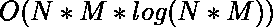
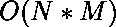

# 矩阵中达到目标

的最小可能修改

> 原文： [https://www.geeksforgeeks.org/minimum-possible-modifications-in-the-matrix-to-reach-destination/](https://www.geeksforgeeks.org/minimum-possible-modifications-in-the-matrix-to-reach-destination/)

给定大小为 **N x M** 的矩阵，该矩阵由整数 **1、2、3** 和`4`组成。
每个值代表该单元格可能发生的移动：

```
1 -> move left
2 -> move right
3 -> move up
4 -> move down.

```

任务是找到矩阵中所需的最小可能变化，以使存在从**（0，0）**到**（N-1，M-1）**的路径。

**示例**：

> **输入**：mat [] [] = {{2，2，4}，
> {1，1，1}，
> {3，3，2}};
> 
> **输出**：1
> 将 mat [1] [2]的值更改为 4。因此，移动顺序为
> （0，0）->（0，1） ->（0，2）->（1，2）->（2，2）
> 
> **输入**：mat [] [] = {{2，2，1}，
> {4，2，3}，
> {4，3，2}}
> **输出**：2

**先决条件**：
1\. [Djikstra 的算法](https://www.geeksforgeeks.org/dijkstras-shortest-path-algorithm-greedy-algo-7/)
2\. [0-1 BFS](https://www.geeksforgeeks.org/0-1-bfs-shortest-path-binary-graph/)

**方法 1**

*   让我们将 2D 矩阵的每个像元视为加权图的一个节点，每个节点最多可以有四个连接的节点（可能是四个方向）。 每个边的权重为：
    *   如果节点 U 的运动方向指向 V，则 weight（U，V）= 0，否则
    *   重量（U，V）= 1
*   现在，这基本上可以简化为最短路径问题，可以使用 [Djikstra 算法](https://www.geeksforgeeks.org/dijkstras-shortest-path-algorithm-greedy-algo-7/)进行计算

下面是上述方法的实现：

## C++

```cpp

// CPP program to find minimum possible 
// changes required in the matrix 
#include <bits/stdc++.h> 
using namespace std; 

// Function to find next possible node 
int nextNode(int x, int y, int dir, int N, int M) 
{ 
    if (dir == 1) 
        y--; 
    else if (dir == 2) 
        y++; 
    else if (dir == 3) 
        x--; 
    else
        x++; 

    // If node is out of matrix 
    if (!(x >= 0 && x < N && y >= 0 && y < M)) 
        return -1; 
    else
        return (x * N + y); 
} 

// Prints shortest paths from src 
// to all other vertices 
int dijkstra(vector<pair<int, int> >* adj, 
             int src, int dest, int N, int M) 
{ 
    // Create a set to store vertices 
    // that are bein preprocessed 
    set<pair<int, int> > setds; 

    // Create a vector for distances 
    // and initialize all distances 
    // as infinite (large value) 
    vector<int> dist(N * M, INT_MAX); 

    // Insert source itself in Set 
    // and initialize its distance as 0 
    setds.insert(make_pair(0, src)); 
    dist[src] = 0; 

    /* Looping till all shortest  
        distance are finalized  
        then setds will become empty */
    while (!setds.empty()) { 
        // The first vertex in Set 
        // is the minimum distance 
        // vertex, extract it from set. 
        pair<int, int> tmp = *(setds.begin()); 
        setds.erase(setds.begin()); 

        // vertex label is stored in second 
        // of pair (it has to be done this 
        // way to keep the vertices sorted 
        // distance (distance must be 
        // first item in pair) 
        int u = tmp.second; 

        // 'i' is used to get all adjacent 
        // vertices of a vertex 
        vector<pair<int, int> >::iterator i; 
        for (i = adj[u].begin(); 
             i != adj[u].end(); ++i) { 
            // Get vertex label and weight 
            // of current adjacent of u. 
            int v = (*i).first; 
            int weight = (*i).second; 

            // If there is shorter path from u to v 
            if (dist[v] > dist[u] + weight) { 
                // If distance of v is not 
                // INF then it must be 
                // in our set, so removing it 
                // and inserting again with 
                // updated less distance. 
                // Note : We extract only 
                // those vertices from Set 
                // for which distance is 
                // finalized. So for them, 
                // we would never reach here 
                if (dist[v] != INT_MAX) 
                    setds.erase(setds.find( 
                        { dist[v], v })); 

                // Updating distance of v 
                dist[v] = dist[u] + weight; 
                setds.insert(make_pair(dist[v], v)); 
            } 
        } 
    } 

    // Return the distance 
    return dist[dest]; 
} 

// Function to find minimum possible 
// changes required in the matrix 
int MinModifications(vector<vector<int> >& mat) 
{ 
    int N = mat.size(), M = mat[0].size(); 

    // Converting given matrix to a graph 
    vector<pair<int, int> > adj[N * M]; 

    for (int i = 0; i < N; i++) { 
        for (int j = 0; j < M; j++) { 
            // Each cell is a node, 
            // with label i*N + j 
            for (int dir = 1; dir <= 4; dir++) { 
                // Label of node if we 
                // move in direction dir 
                int nextNodeLabel 
                    = nextNode(i, j, dir, N, M); 

                // If invalid(out of matrix) 
                if (nextNodeLabel == -1) 
                    continue; 

                // If direction is same as mat[i][j] 
                if (dir == mat[i][j]) 
                    adj[i * N + j].push_back( 
                        { nextNodeLabel, 0 }); 
                else
                    adj[i * N + j].push_back( 
                        { nextNodeLabel, 1 }); 
            } 
        } 
    } 

    // Applying djikstra's algorithm 
    return dijkstra(adj, 0, 
                    (N - 1) * N + M - 1, N, M); 
} 

// Driver code 
int main() 
{ 
    vector<vector<int> > mat = { { 2, 2, 1 }, 
                                 { 4, 2, 3 }, 
                                 { 4, 3, 2 } }; 

    // Function call 
    cout << MinModifications(mat); 

    return 0; 
} 

```

**Output:**

```
2

```

**时间复杂度**：

**方法 2**
此处，边缘权重为 0，仅 1，即 0-1 图。 使用 [0-1 BFS](https://www.geeksforgeeks.org/0-1-bfs-shortest-path-binary-graph/) 可找到此类图中的最短路径。

下面是上述方法的实现：

## C++

```cpp

// CPP program to find minimum 
// possible changes required 
// in the matrix 
#include <bits/stdc++.h> 
using namespace std; 

// Function to find next possible node 
int nextNode(int x, int y, int dir, 
             int N, int M) 
{ 
    if (dir == 1) 
        y--; 
    else if (dir == 2) 
        y++; 
    else if (dir == 3) 
        x--; 
    else
        x++; 

    // If node is out of matrix 
    if (!(x >= 0 && x < N && y >= 0 && y < M)) 
        return -1; 
    else
        return (x * N + y); 
} 

// Prints shortest distance 
// from given source to 
// every other vertex 
int zeroOneBFS(vector<pair<int, int> >* adj, 
               int src, int dest, int N, int M) 
{ 
    // Initialize distances 
    // from given source 
    int dist[N * M]; 
    for (int i = 0; i < N * M; i++) 
        dist[i] = INT_MAX; 

    // Double ended queue to do BFS. 
    deque<int> Q; 
    dist[src] = 0; 
    Q.push_back(src); 

    while (!Q.empty()) { 
        int v = Q.front(); 
        Q.pop_front(); 

        for (auto i : adj[v]) { 
            // Checking for the optimal distance 
            if (dist[i.first] > dist[v] 
                                    + i.second) { 
                dist[i.first] = dist[v] 
                                + i.second; 

                // Put 0 weight edges to front 
                // and 1 weight edges to back 
                // so that vertices are processed 
                // in increasing order of weights. 
                if (i.second == 0) 
                    Q.push_front(i.first); 
                else
                    Q.push_back(i.first); 
            } 
        } 
    } 

    // Shortest distance to 
    // reach destination 
    return dist[dest]; 
} 

// Function to find minimum possible 
// changes required in the matrix 
int MinModifications(vector<vector<int> >& mat) 
{ 
    int N = mat.size(), M = mat[0].size(); 

    // Converting given matrix to a graph 
    vector<pair<int, int> > adj[N * M]; 

    for (int i = 0; i < N; i++) { 
        for (int j = 0; j < M; j++) { 
            // Each cell is a node 
            // with label i*N + j 
            for (int dir = 1; dir <= 4; dir++) { 
                // Label of node if we 
                // move in direction dir 
                int nextNodeLabel = nextNode(i, j, 
                                             dir, N, M); 

                // If invalid(out of matrix) 
                if (nextNodeLabel == -1) 
                    continue; 

                // If direction is same as mat[i][j] 
                if (dir == mat[i][j]) 
                    adj[i * N + j].push_back( 
                        { nextNodeLabel, 0 }); 
                else
                    adj[i * N + j].push_back( 
                        { nextNodeLabel, 1 }); 
            } 
        } 
    } 

    // Applying djikstra's algorithm 
    return zeroOneBFS(adj, 0, 
                      (N - 1) * N + M - 1, N, M); 
} 

// Driver code 
int main() 
{ 
    vector<vector<int> > mat = { { 2, 2, 1 }, 
                                 { 4, 2, 3 }, 
                                 { 4, 3, 2 } }; 

    // Function call 
    cout << MinModifications(mat); 

    return 0; 
} 

```

**Output:**

```
2

```

**时间复杂度**：

[](https://practice.geeksforgeeks.org/courses/competitive-programming-live?utm_source=geeksforgeeks&utm_medium=article&utm_campaign=gfg_article_cp)

* * *

* * *

如果您喜欢 GeeksforGeeks 并希望做出贡献，则还可以使用 [tribution.geeksforgeeks.org](https://contribute.geeksforgeeks.org/) 撰写文章，或将您的文章邮寄至 tribution@geeksforgeeks.org。 查看您的文章出现在 GeeksforGeeks 主页上，并帮助其他 Geeks。

如果您发现任何不正确的地方，请单击下面的“改进文章”按钮，以改进本文。