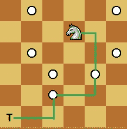

# 骑士达成目标的最低限度步骤 | 系列 1

> 原文： [https://www.geeksforgeeks.org/minimum-steps-reach-target-knight/](https://www.geeksforgeeks.org/minimum-steps-reach-target-knight/)

给定大小为 N x N 的方形棋盘，则给出骑士的位置和目标的位置。 我们需要找出骑士到达目标位置所需的最低限度步骤。

**示例**：

```
 
In above diagram Knight takes 3 step to reach 
from (4, 5) to (1, 1) (4, 5) -> (5, 3) -> (3, 2) 
-> (1, 1)  as shown in diagram

```

<u>**方法**：</u>

该问题可以视为未加权图中的最短路径。 因此，我们使用 [BFS](https://www.geeksforgeeks.org/breadth-first-traversal-for-a-graph/) 解决此问题。 我们会尝试骑士可以从其位置到达的所有 8 个可能位置。 如果可到达的位置尚未访问并且位于板内部，则将其推入队列，其距离比其父状态大 1。 最后，当它从队列中弹出时，我们返回目标位置的距离。

下面的代码实现了 BFS 来搜索单元格，其中每个单元格包含其坐标和距起始节点的距离。 在最坏的情况下，以下代码访问电路板上的所有单元，从而使最坏情况下的时间复杂度为`O(N^2)`

## C++

```cpp

// C++ program to find minimum steps to reach to 
// specific cell in minimum moves by Knight 
#include <bits/stdc++.h> 
using namespace std; 

// structure for storing a cell's data 
struct cell { 
    int x, y; 
    int dis; 
    cell() {} 
    cell(int x, int y, int dis) 
        : x(x), y(y), dis(dis) 
    { 
    } 
}; 

// Utility method returns true if (x, y) lies 
// inside Board 
bool isInside(int x, int y, int N) 
{ 
    if (x >= 1 && x <= N && y >= 1 && y <= N) 
        return true; 
    return false; 
} 

// Method returns minimum step 
// to reach target position 
int minStepToReachTarget( 
    int knightPos[], int targetPos[], 
    int N) 
{ 
    // x and y direction, where a knight can move 
    int dx[] = { -2, -1, 1, 2, -2, -1, 1, 2 }; 
    int dy[] = { -1, -2, -2, -1, 1, 2, 2, 1 }; 

    // queue for storing states of knight in board 
    queue<cell> q; 

    // push starting position of knight with 0 distance 
    q.push(cell(knightPos[0], knightPos[1], 0)); 

    cell t; 
    int x, y; 
    bool visit[N + 1][N + 1]; 

    // make all cell unvisited 
    for (int i = 1; i <= N; i++) 
        for (int j = 1; j <= N; j++) 
            visit[i][j] = false; 

    // visit starting state 
    visit[knightPos[0]][knightPos[1]] = true; 

    // loop untill we have one element in queue 
    while (!q.empty()) { 
        t = q.front(); 
        q.pop(); 

        // if current cell is equal to target cell, 
        // return its distance 
        if (t.x == targetPos[0] && t.y == targetPos[1]) 
            return t.dis; 

        // loop for all reachable states 
        for (int i = 0; i < 8; i++) { 
            x = t.x + dx[i]; 
            y = t.y + dy[i]; 

            // If reachable state is not yet visited and 
            // inside board, push that state into queue 
            if (isInside(x, y, N) && !visit[x][y]) { 
                visit[x][y] = true; 
                q.push(cell(x, y, t.dis + 1)); 
            } 
        } 
    } 
} 

// Driver code to test above methods 
int main() 
{ 
    int N = 30; 
    int knightPos[] = { 1, 1 }; 
    int targetPos[] = { 30, 30 }; 
    cout << minStepToReachTarget(knightPos, targetPos, N); 
    return 0; 
} 

```