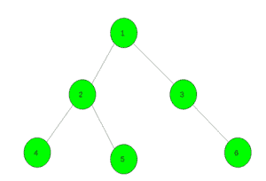

# 使用给定颜色为树着色的最少步骤

> 原文： [https://www.geeksforgeeks.org/minimum-steps-to-color-the-tree-with-given-colors/](https://www.geeksforgeeks.org/minimum-steps-to-color-the-tree-with-given-colors/)

给定一棵具有 **N 个**节点的树，这些节点最初没有颜色，并且数组 **color []** 的大小为 **N** ，它们代表着色过程完成后每个节点的颜色 地点。 任务是使用尽可能少的步骤将树着色为给定的颜色。 在每个步骤中，可以选择一个顶点 **v** 和颜色 **x** ，然后为 **v** 的子树中的所有顶点着色（包括 v 本身） 颜色为 **x** 。 **注意**根是顶点号 1。

**示例：**

> **输入：** color [] = {1，1，2，1，3，1}
> 
> **输出：** 4
> 为子图像上色 根节点 1 的树的颜色为 1。
> 然后所有顶点的颜色为 1。
> 现在，将根节点 3 的子树的颜色设为 2。
> 最后，根节点 5 的子树的颜色。 和 6 分别具有颜色 3 和 1。
> 
> **输入：** color [] = {1，2，3，2，2，3}
> 
> **输出：** 3

**方法：**在顶点 1 调用 [DFS](https://www.geeksforgeeks.org/depth-first-search-or-dfs-for-a-graph/) 函数，最初将答案保持为零。 只要子节点和父节点的颜色不同，就增加答案。
请参阅以下代码，以更好地理解。

下面是上述方法的实现：

## C ++

```

// C++ implementation of the approach 
#include <bits/stdc++.h> 
using namespace std; 

// To store the required answer 
int ans = 0; 

// To store the graph 
vector<int> gr[100005]; 

// Function to add edges 
void Add_Edge(int u, int v) 
{ 
    gr[u].push_back(v); 
    gr[v].push_back(u); 
} 

// Dfs function 
void dfs(int child, int par, int color[]) 
{ 

    // When there is difference in colors 
    if (color[child] != color[par]) 
        ans++; 

    // For all it's child nodes 
    for (auto it : gr[child]) { 
        if (it == par) 
            continue; 
        dfs(it, child, color); 
    } 
} 

// Driver code 
int main() 
{ 

    // Here zero is for parent of node 1 
    int color[] = { 0, 1, 2, 3, 2, 2, 3 }; 

    // Adding edges in the graph 
    Add_Edge(1, 2); 
    Add_Edge(1, 3); 
    Add_Edge(2, 4); 
    Add_Edge(2, 5); 
    Add_Edge(3, 6); 

    // Dfs call 
    dfs(1, 0, color); 

    // Required answer 
    cout << ans; 

    return 0; 
} 

```