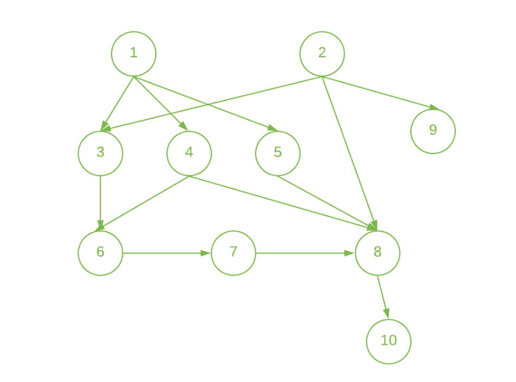
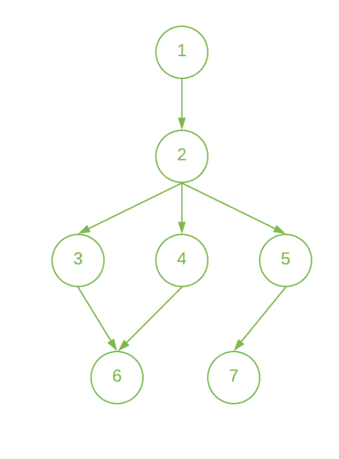

# 有向无环图

给出了每个作业要完成的最短时间

> 原文： [https://www.geeksforgeeks.org/minimum-time-taken-by-each-job-to-be-completed-given-by-a-directed-acyclic-graph/](https://www.geeksforgeeks.org/minimum-time-taken-by-each-job-to-be-completed-given-by-a-directed-acyclic-graph/)

给定具有`V`顶点和`E`边的**有向无环图**，其中每个边 **{U，V}** 表示作业`U`和`V`，这样只能在完成作业`U`之后才能启动作业`V`。 任务是确定每个作业要花费的最短时间，其中每个作业需要花费单位时间才能完成。

**示例**：

> **输入**：N **=** 10，E = 13，如下图所示：
> 
> [](https://media.geeksforgeeks.org/wp-content/uploads/20200804212533/Semester1.png)
> 
> **输出**：1 1 2 2 2 3 4 5 2 6 [
> **说明**：
> 从头开始作业 1 和 2，并以 1 个时间单位完成它们。
> 由于作业 3、4、5 和 9 仅依赖一个作业（即，作业 3、4 和 5 的第一作业，作业 9 的第二作业）。 因此，我们可以在第一个时间单位开始这些作业，并在完成相关任务后在第二个时间单位完成这些作业。
> 同样，
> 作业 6 仅在完成第三和第四作业之后才能完成。 因此，请在第二时间单位启动它，并在第三时间单位完成它。
> 作业 7 仅在作业 6 完成后才能完成。 因此，您可以在第 3 个时间单位启动它，并在第 4 个时间单位完成它。
> 只能在完成第 4、5 和 7 个作业后完成作业 8。 因此，以第 4 个时间单位启动它，并以第 5 个时间单位完成它。
> 仅在完成第 8 个作业后才能完成作业 10。 因此，以第 5 个时间单位启动它，并以第 6 个时间单位完成它。
> 
> **输入**：N = 7，E = 7，如下图所示：
> 
> [](https://media.geeksforgeeks.org/wp-content/uploads/20200808013603/Semester2.png)
> 
> **输出**：1 2 3 3 3 4 4 ??
> **说明**：
> 从头开始作业 1，并在第一时间单位完成。
> 作业 2 仅在完成第一个作业后才能完成。 因此，以第一时间单位启动它，并以第二时间单位完成它。
> 因为，作业 3、4 和 5 仅依赖于第二个作业。 因此，在第二时间单位开始这些作业，并在第三时间单位完成这些作业。
> 只有在完成第 3 和第 4 个作业后才能完成作业 6。 因此，请在第 3 个时间单位启动它，并在第 4 个时间单位完成它。
> 仅在完成第 5 个作业后才能完成作业 7。 因此，请在第 3 小时开始，并在第 4 个时间单位完成它。

**方法**：仅当完成所有作为作业先决条件的作业时，才能启动该作业。 因此，该想法是针对给定网络使用[拓扑排序](https://www.geeksforgeeks.org/topological-sorting/)。 步骤如下：

1.  完成不依赖于任何其他作业的作业。
2.  创建数组 **inDegree []** ，以存储给定网络中每个节点的从属节点数。
3.  初始化[队列](https://www.geeksforgeeks.org/queue-data-structure/)，并推送 **inDegree []** 为 0 的所有顶点。
4.  将计时器初始化为 1 并存储当前队列大小（例如**大小**），然后执行以下操作：
    *   从队列中弹出节点，直到大小为`0`，然后将此节点的完成时间更新为**计时器**。
    *   从队列中弹出节点（例如，节点`U`）时，将减少与其连接的每个节点的 **inDegree** 。
    *   如果在上述步骤中任何节点的 **inDegree** 为`0`，则将该节点插入队列。
    *   完成上述所有步骤后，增加计时器。
5.  在上述步骤中遍历每个节点后，打印所有节点的完成时间。

下面是上述方法的实现：

## C ++

```

// C++ program for the above approach
#include <bits/stdc++.h>
using namespace std;
#define maxN 100000

// Adjacency List to store the graph
vector<int> graph[maxN];

// Array to store the in-degree of node
int indegree[maxN];

// Array to store the time in which
// the job i can be done
int job[maxN];

// Function to add directed edge
// between two vertices
void addEdge(int u, int v)
{
    // Insert edge from u to v
    graph[u].push_back(v);

    // Increasing the indegree
    // of vertex v
    indegree[v]++;
}

// Function to find the minimum time
// needed by each node to get the task
void printOrder(int n, int m)
{
    // Find the topo sort order
    // using the indegree approach

    // Queue to store the
    // nodes while processing
    queue<int> q;

    // Pushing all the vertex in the
    // queue whose in-degree is 0

    // Update the time of the jobs
    // who don't require any job to
    // be completed before this job
    for (int i = 1; i <= n; i++) {
        if (indegree[i] == 0) {
            q.push(i);
            job[i] = 1;
        }
    }

    // Iterate until queue is empty
    while (!q.empty()) {

        // Get front element of queue
        int cur = q.front();

        // Pop the front element
        q.pop();

        for (int adj : graph[cur]) {

            // Decrease in-degree of
            // the current node
            indegree[adj]--;

            if (job[adj] < 1 + job[cur]) {

                // Update the time
                job[adj] = max(job[adj],
                               1 + job[cur]);
            }

            // Push its adjacent elements
            if (indegree[adj] == 0)
                q.push(adj);
        }
    }

    // Print the time to complete
    // the job
    for (int i = 1; i <= n; i++)
        cout << job[i] << " ";
    cout << "\n";
}

// Driver Code
int main()
{
    // Given Nodes N and edges M
    int n, m;
    n = 10;
    m = 13;

    // Given Directed Edges of graph
    addEdge(1, 3);
    addEdge(1, 4);
    addEdge(1, 5);
    addEdge(2, 3);
    addEdge(2, 8);
    addEdge(2, 9);
    addEdge(3, 6);
    addEdge(4, 6);
    addEdge(4, 8);
    addEdge(5, 8);
    addEdge(6, 7);
    addEdge(7, 8);
    addEdge(8, 10);

    // Function Call
    printOrder(n, m);
    return 0;
}

```

## 爪哇

```

// Java program for the above approach
import java.util.*;

class GFG{

static final int maxN = 100000;

// Adjacency List to store the graph
@SuppressWarnings("unchecked")
static Vector<Integer> []graph = new Vector[maxN];

// Array to store the in-degree of node
static int []indegree = new int[maxN];

// Array to store the time in which
// the job i can be done
static int []job = new int[maxN];

// Function to add directed edge
// between two vertices
static void addEdge(int u, int v)
{

    // Insert edge from u to v
    graph[u].add(v);

    // Increasing the indegree
    // of vertex v
    indegree[v]++;
}

// Function to find the minimum time
// needed by each node to get the task
static void printOrder(int n, int m)
{

    // Find the topo sort order
    // using the indegree approach

    // Queue to store the
    // nodes while processing
    Queue<Integer> q = new LinkedList<>();

    // Pushing all the vertex in the
    // queue whose in-degree is 0

    // Update the time of the jobs
    // who don't require any job to
    // be completed before this job
    for(int i = 1; i <= n; i++)
    {
        if (indegree[i] == 0)
        {
            q.add(i);
            job[i] = 1;
        }
    }

    // Iterate until queue is empty
    while (!q.isEmpty())
    {

        // Get front element of queue
        int cur = q.peek();

        // Pop the front element
        q.remove();

        for(int adj : graph[cur])
        {

            // Decrease in-degree of
            // the current node
            indegree[adj]--;

            if (job[adj] < 1 + job[cur])
            {

                // Update the time
                job[adj] = Math.max(job[adj],
                                1 + job[cur]);
            }

            // Push its adjacent elements
            if (indegree[adj] == 0)
                q.add(adj);
        }
    }

    // Print the time to complete
    // the job
    for(int i = 1; i <= n; i++)
        System.out.print(job[i] + " ");
    System.out.print("\n");
}

// Driver Code
public static void main(String[] args)
{

    // Given Nodes N and edges M
    int n, m;
    n = 10;
    m = 13;

    for(int i = 0; i < graph.length; i++)
        graph[i] = new Vector<Integer>();

    // Given directed edges of graph
    addEdge(1, 3);
    addEdge(1, 4);
    addEdge(1, 5);
    addEdge(2, 3);
    addEdge(2, 8);
    addEdge(2, 9);
    addEdge(3, 6);
    addEdge(4, 6);
    addEdge(4, 8);
    addEdge(5, 8);
    addEdge(6, 7);
    addEdge(7, 8);
    addEdge(8, 10);

    // Function call
    printOrder(n, m);
}
}

// This code is contributed by Amit Katiyar 

```

## Python3

```

# Python3 program for the above approach
from collections import defaultdict

# Class to represent a graph
class Graph:

    def __init__(self, vertices, edges):

        # Dictionary containing adjacency List
        self.graph = defaultdict(list) 

        # No. of vertices
        self.n = vertices  

        # No. of edges
        self.m = edges  

    # Function to add an edge to graph
    def addEdge(self, u, v):
        self.graph[u].append(v)

    # Function to find the minimum time 
    # needed by each node to get the task 
    def printOrder(self, n, m):

        # Create a vector to store indegrees of all
        # vertices. Initialize all indegrees as 0.
        indegree = [0] * (self.n + 1)

        # Traverse adjacency lists to fill indegrees
        # of vertices. This step takes O(V + E) time
        for i in self.graph:
            for j in self.graph[i]:
                indegree[j] += 1

        # Array to store the time in which
        # the job i can be done
        job = [0] * (self.n + 1)

        # Create an queue and enqueue all 
        # vertices with indegree 0
        q = []

        # Update the time of the jobs
        # who don't require any job to
        # be completed before this job
        for i in range(1, self.n + 1):
            if indegree[i] == 0:
                q.append(i)
                job[i] = 1

        # Iterate until queue is empty
        while q:

            # Get front element of queue
            cur = q.pop(0)

            for adj in self.graph[cur]:

                # Decrease in-degree of
                # the current node
                indegree[adj] -= 1
                if (job[adj] < 1 + job[cur]):

                    # Update the time
                    job[adj] = max(job[adj], 
                               1 + job[cur])

                # Push its adjacent elements
                if (indegree[adj] == 0):
                    q.append(adj)

        # Print the time to complete 
        # the job 
        for i in range(1, n + 1):
            print(job[i], end = " ")

        print()

# Driver Code

# Given Nodes N and edges M
n = 10
m = 13

g = Graph(n, m)

# Given Directed Edges of graph
g.addEdge(1, 3)
g.addEdge(1, 4)
g.addEdge(1, 5)
g.addEdge(2, 3)
g.addEdge(2, 8)
g.addEdge(2, 9)
g.addEdge(3, 6)
g.addEdge(4, 6)
g.addEdge(4, 8)
g.addEdge(5, 8)
g.addEdge(6, 7)
g.addEdge(7, 8)
g.addEdge(8, 10)

# Function Call
g.printOrder(n, m)

# This code is contributed by Aanchal Tiwari

```

## C＃

```

// C# program for the above approach
using System;
using System.Collections.Generic;

class GFG{

static readonly int maxN = 100000;

// Adjacency List to store the graph
static List<int> []graph = new List<int>[maxN];

// Array to store the in-degree of node
static int []indegree = new int[maxN];

// Array to store the time in which
// the job i can be done
static int []job = new int[maxN];

// Function to add directed edge
// between two vertices
static void addEdge(int u, int v)
{

    // Insert edge from u to v
    graph[u].Add(v);

    // Increasing the indegree
    // of vertex v
    indegree[v]++;
}

// Function to find the minimum time
// needed by each node to get the task
static void printOrder(int n, int m)
{

    // Find the topo sort order
    // using the indegree approach

    // Queue to store the
    // nodes while processing
    Queue<int> q = new Queue<int>();

    // Pushing all the vertex in the
    // queue whose in-degree is 0

    // Update the time of the jobs
    // who don't require any job to
    // be completed before this job
    for(int i = 1; i <= n; i++)
    {
        if (indegree[i] == 0)
        {
            q.Enqueue(i);
            job[i] = 1;
        }
    }

    // Iterate until queue is empty
    while (q.Count != 0)
    {

        // Get front element of queue
        int cur = q.Peek();

        // Pop the front element
        q.Dequeue();

        foreach(int adj in graph[cur])
        {

            // Decrease in-degree of
            // the current node
            indegree[adj]--;

            if (job[adj] < 1 + job[cur])
            {

                // Update the time
                job[adj] = Math.Max(job[adj],
                                1 + job[cur]);
            }

            // Push its adjacent elements
            if (indegree[adj] == 0)
                q.Enqueue(adj);
        }
    }

    // Print the time to complete
    // the job
    for(int i = 1; i <= n; i++)
        Console.Write(job[i] + " ");

    Console.Write("\n");
}

// Driver Code
public static void Main(String[] args)
{

    // Given Nodes N and edges M
    int n, m;
    n = 10;
    m = 13;

    for(int i = 0; i < graph.Length; i++)
        graph[i] = new List<int>();

    // Given directed edges of graph
    addEdge(1, 3);
    addEdge(1, 4);
    addEdge(1, 5);
    addEdge(2, 3);
    addEdge(2, 8);
    addEdge(2, 9);
    addEdge(3, 6);
    addEdge(4, 6);
    addEdge(4, 8);
    addEdge(5, 8);
    addEdge(6, 7);
    addEdge(7, 8);
    addEdge(8, 10);

    // Function call
    printOrder(n, m);
}
}

// This code is contributed by Amit Katiyar 

```

**Output:** 

```
1 1 2 2 2 3 4 5 2 6

```

***时间复杂度**：O（V + E），其中 V 是节点数，E 是边数。*
***辅助空间**：O（V）*


* * *

* * *

如果您喜欢 GeeksforGeeks 并希望做出贡献，则还可以使用 [tribution.geeksforgeeks.org](https://contribute.geeksforgeeks.org/) 撰写文章，或将您的文章邮寄至 tribution@geeksforgeeks.org。 查看您的文章出现在 GeeksforGeeks 主页上，并帮助其他 Geeks。

如果您发现任何不正确的地方，请单击下面的“改进文章”按钮，以改进本文。