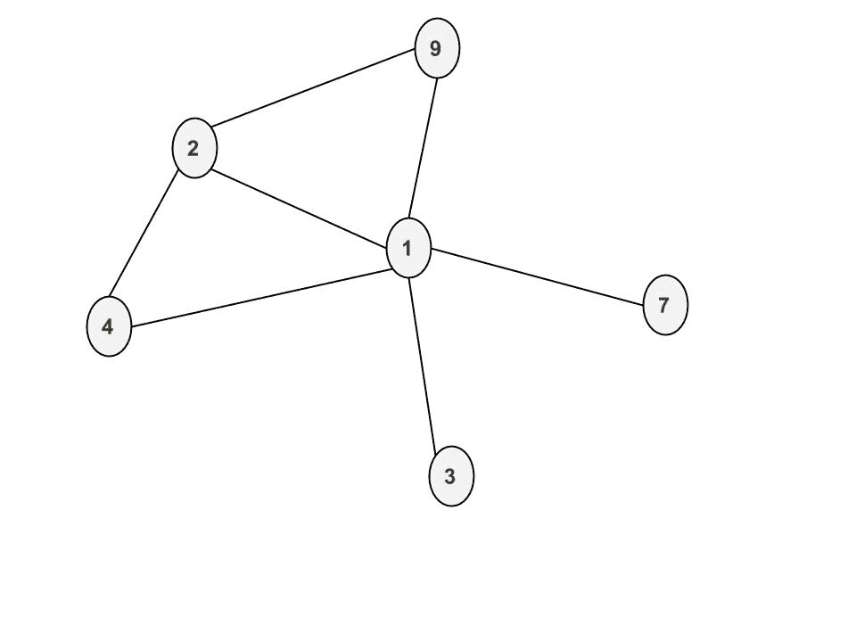

# NetworkX：用于研究复杂网络的 Python 软件包

> 原文： [https://www.geeksforgeeks.org/networkx-python-software-package-study-complex-networks/](https://www.geeksforgeeks.org/networkx-python-software-package-study-complex-networks/)

NetworkX 是一个 Python 语言软件包，用于创建，操纵和研究复杂网络的结构，动力学和功能。 它用于研究以节点和边的图表示的大型复杂网络。 使用 networkx，我们可以加载和存储复杂的网络。 我们可以生成许多类型的随机和经典网络，分析网络结构，构建网络模型，设计新的网络算法并绘制网络。

**软件包的安装**：

```
pip install networkx

```

**创建节点**

一次添加一个节点：

```
 G.add_node(1)
```

添加节点列表：

```
 G.add_nodes_from([2,3])
```

让我们在图 G 中创建节点。添加节点 1，2，3，4，7，9


**创建边**

一次添加一条边：

```
G.add_edge(1,2)
G.add_edge(3,1)
G.add_edge(2,4)
G.add_edge(4,1)
G.add_edge(9,1)
```

添加边列表：

```
G.add_edges_from([(1,2),(1,3)])
```

在添加边（1,2），（3,1），（2,4），（4,1），（9,1），（1,7），（2,9）后



**删除节点和边**

可以使用以下任一功能来拆除图形：

```
Graph.remove_node(), Graph.remove_nodes_from(),
Graph.remove_edge() and Graph.remove_edges_from()
```

删除节点 3 之后


删除边（1,2）之后


```

# Python program to create an undirected  
# graph and add nodes and edges to a graph 

# To import package 
import networkx 

# To create an empty undirected graph 
G = networkx.Graph() 

# To add a node 
G.add_node(1) 
G.add_node(2) 
G.add_node(3) 
G.add_node(4) 
G.add_node(7) 
G.add_node(9) 

# To add an edge 
# Note graph is undirected 
# Hence order of nodes in edge doesn't matter 
G.add_edge(1,2) 
G.add_edge(3,1) 
G.add_edge(2,4) 
G.add_edge(4,1) 
G.add_edge(9,1) 
G.add_edge(1,7) 
G.add_edge(2,9) 

# To get all the nodes of a graph 
node_list = G.nodes() 
print("#1") 
print(node_list) 

# To get all the edges of a graph 
edge_list = G.edges() 
print("#2") 
print(edge_list) 

# To remove a node of a graph 
G.remove_node(3) 
node_list = G.nodes() 
print("#3") 
print(node_list) 

# To remove an edge of a graph 
G.remove_edge(1,2) 
edge_list = G.edges() 
print("#4") 
print(edge_list) 

# To find number of nodes 
n = G.number_of_nodes() 
print("#5") 
print(n) 

# To find number of edges 
m = G.number_of_edges() 
print("#6") 
print(m) 

# To find degree of a node 
# d will store degree of node 2 
d = G.degree(2) 
print("#7") 
print(d) 

# To find all the neighbor of a node 
neighbor_list = G.neighbors(2) 
print("#8") 
print(neighbor_list) 

#To delete all the nodes and edges 
G.clear()

```

输出：

```
#1
[1, 2, 3, 4, 7, 9]
#2
[(1, 9), (1, 2), (1, 3), (1, 4), (1, 7), (2, 4), (2, 9)]
#3
[1, 2, 4, 7, 9]
#4
[(1, 9), (1, 4), (1, 7), (2, 4), (2, 9)]
#5
5
#6
5
#7
2
#8
[4, 9]

```

在下一篇文章中，我们将讨论如何创建加权图，有向图，多图。 如何绘制图形。 在以后的文章中，我们将介绍如何使用内置函数，例如深度拳头搜索 aka dfs，广度优先搜索 aka BFS，dijkstra 的最短路径算法。

 **参考**：[Networxx at Github](https://networkx.github.io/documentation/networkx-1.10/overview.html)

本文由 **[Pratik Chhajer](https://github.com/pratik-chhajer)** 提供。 如果您喜欢 GeeksforGeeks 并希望做出贡献，则还可以使用 [tribution.geeksforgeeks.org](http://www.contribute.geeksforgeeks.org) 撰写文章，或将您的文章邮寄至 tribution@geeksforgeeks.org。 查看您的文章出现在 GeeksforGeeks 主页上，并帮助其他 Geeks。

如果发现任何不正确的地方，或者想分享有关上述主题的更多信息，请写评论。

注意怪胎！ 通过 [**Python 编程基础**](https://practice.geeksforgeeks.org/courses/Python-Foundation?utm_source=geeksforgeeks&utm_medium=article&utm_campaign=GFG_Article_Bottom_Python_Foundation) 课程加强基础，并学习基础知识。

首先，您的面试准备将通过 [**Python DS**](https://practice.geeksforgeeks.org/courses/Data-Structures-With-Python?utm_source=geeksforgeeks&utm_medium=article&utm_campaign=GFG_Article_Bottom_Python_DS) 课程来增强您的数据结构概念。