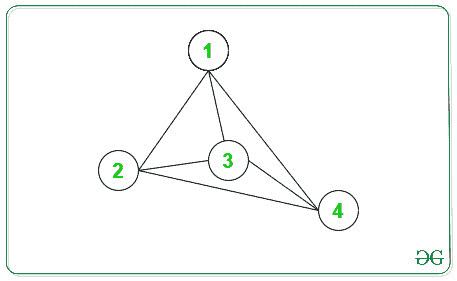

# 无向图

中具有质数的节点

> 原文： [https://www.geeksforgeeks.org/nodes-with-prime-degree-in-an-undirected-graph/](https://www.geeksforgeeks.org/nodes-with-prime-degree-in-an-undirected-graph/)

给定[无向图](https://www.geeksforgeeks.org/graph-data-structure-and-algorithms/)，其中 **N 个**顶点且 **M 个**边，任务是打印给定图的度为[素数的所有节点](https://www.geeksforgeeks.org/prime-numbers/) 。
**范例**：

> **输入**：N = 4，arr [] [] = {{1，2}，{1，3}，{1，4}，{2，3}，{2，4}，{ 3，4}}
> **输出**：1 2 3 4
> **说明**：
> 下图是上述信息的图形：
> 
> 
> 
> 如上图所示，节点的等级为：
> 节点->等级
> 1-> 3
> 2-> 3
> 3-> 3
> 4-> 3
> 因此，素数为 1 2 3 4 的节点为
> **输入**：N = 5，arr [] [] = {{1，2}，{ 1，3}，{2，4}，{2，5}} {
> **输出**：1

**方法**：

1.  使用 Eratosthenes 的[筛网](http://www.geeksforgeeks.org/sieve-of-eratosthenes/)计算最多 10 <sup>5</sup> 的质数。
2.  对于每个顶点，度可以通过给定图在相应顶点处的[邻接表](https://www.geeksforgeeks.org/convert-adjacency-matrix-to-adjacency-list-representation-of-graph/)的长度来计算。
3.  打印给定图的度为[质数](https://www.geeksforgeeks.org/prime-numbers/)的那些顶点。

下面是上述方法的实现：

## C++

```cpp

// C++ implementation of the approach

#include <bits/stdc++.h>
using namespace std;

int n = 10005;

// To store Prime Numbers
vector<bool> Prime(n + 1, true);

// Function to find the prime numbers
// till 10^5
void SieveOfEratosthenes()
{

    int i, j;
    Prime[0] = Prime[1] = false;
    for (i = 2; i * i <= 10005; i++) {

        // Traverse all multiple of i
        // and make it false
        if (Prime[i]) {

            for (j = 2 * i; j < 10005; j += i) {
                Prime[j] = false;
            }
        }
    }
}

// Function to print the nodes having
// prime degree
void primeDegreeNodes(int N, int M,
                      int edges[][2])
{
    // To store Adjacency List of
    // a Graph
    vector<int> Adj[N + 1];

    // Make Adjacency List
    for (int i = 0; i < M; i++) {
        int x = edges[i][0];
        int y = edges[i][1];

        Adj[x].push_back(y);
        Adj[y].push_back(x);
    }

    // To precompute prime numbers
    // till 10^5
    SieveOfEratosthenes();

    // Traverse each vertex
    for (int i = 1; i <= N; i++) {

        // Find size of Adjacency List
        int x = Adj[i].size();

        // If length of Adj[i] is Prime
        // then print it
        if (Prime[x])
            cout << i << ' ';
    }
}

// Driver code
int main()
{
    // Vertices and Edges
    int N = 4, M = 6;

    // Edges
    int edges[M][2] = { { 1, 2 }, { 1, 3 }, 
                        { 1, 4 }, { 2, 3 }, 
                        { 2, 4 }, { 3, 4 } };

    // Function Call
    primeDegreeNodes(N, M, edges);

    return 0;
}

```

## Java

```java

// Java implementation of the approach
import java.util.*;
class GFG{

static int n = 10005;

// To store Prime Numbers
static boolean []Prime = new boolean[n + 1];

// Function to find the prime numbers
// till 10^5
static void SieveOfEratosthenes()
{
    int i, j;
    Prime[0] = Prime[1] = false;
    for (i = 2; i * i <= 10005; i++) 
    {

        // Traverse all multiple of i
        // and make it false
        if (Prime[i])
        {
            for (j = 2 * i; j < 10005; j += i) 
            {
                Prime[j] = false;
            }
        }
    }
}

// Function to print the nodes having
// prime degree
static void primeDegreeNodes(int N, int M,
                              int edges[][])
{
    // To store Adjacency List of
    // a Graph
    Vector<Integer> []Adj = new Vector[N + 1];
    for(int i = 0; i < Adj.length; i++)
        Adj[i] = new Vector<Integer>();

    // Make Adjacency List
    for (int i = 0; i < M; i++) 
    {
        int x = edges[i][0];
        int y = edges[i][1];

        Adj[x].add(y);
        Adj[y].add(x);
    }

    // To precompute prime numbers
    // till 10^5
    SieveOfEratosthenes();

    // Traverse each vertex
    for (int i = 1; i <= N; i++) 
    {

        // Find size of Adjacency List
        int x = Adj[i].size();

        // If length of Adj[i] is Prime
        // then print it
        if (Prime[x])
            System.out.print(i + " ");
    }
}

// Driver code
public static void main(String[] args)
{
    // Vertices and Edges
    int N = 4, M = 6;

    // Edges
    int edges[][] = { { 1, 2 }, { 1, 3 }, 
                      { 1, 4 }, { 2, 3 }, 
                      { 2, 4 }, { 3, 4 } };
    Arrays.fill(Prime, true);

    // Function Call
    primeDegreeNodes(N, M, edges);
}
}

// This code is contributed by sapnasingh4991

```

## Python3

```

# Python3 implementation of 
# the above approach
n = 10005;

# To store Prime Numbers
Prime = [True for i in range(n + 1)]

# Function to find 
# the prime numbers 
# till 10^5
def SieveOfEratosthenes():

    i = 2   
    Prime[0] = Prime[1] = False;

    while i * i <= 10005:

        # Traverse all multiple 
        # of i and make it false
        if (Prime[i]):            
            for j in range(2 * i, 10005):
                Prime[j] = False       
        i += 1  

# Function to print the 
# nodes having prime degree
def primeDegreeNodes(N, M, edges):

    # To store Adjacency 
    # List of a Graph
    Adj = [[] for i in range(N + 1)];

    # Make Adjacency List
    for i in range(M):
        x = edges[i][0];
        y = edges[i][1];

        Adj[x].append(y);
        Adj[y].append(x);    

    # To precompute prime 
    # numbers till 10^5
    SieveOfEratosthenes();

    # Traverse each vertex
    for i in range(N + 1):

        # Find size of Adjacency List
        x = len(Adj[i]);

        # If length of Adj[i] is Prime
        # then print it
        if (Prime[x]):
            print(i, end = ' ')           

# Driver code
if __name__ == "__main__":

    # Vertices and Edges
    N = 4
    M = 6

    # Edges
    edges = [[1, 2], [1, 3], 
             [1, 4], [2, 3], 
             [2, 4], [3, 4]];

    # Function Call
    primeDegreeNodes(N, M, edges);

# This code is contributed by rutvik_56

```

## C#

```cs

// C# implementation of the approach
using System;
using System.Collections.Generic;

class GFG{

static int n = 10005;

// To store Prime Numbers
static bool []Prime = new bool[n + 1];

// Function to find the prime numbers
// till 10^5
static void SieveOfEratosthenes()
{
    int i, j;
    Prime[0] = Prime[1] = false;
    for(i = 2; i * i <= 10005; i++) 
    {

       // Traverse all multiple of i
       // and make it false
       if (Prime[i])
       {
           for(j = 2 * i; j < 10005; j += i) 
           {
              Prime[j] = false;
           }
       }
    }
}

// Function to print the nodes having
// prime degree
static void primeDegreeNodes(int N, int M,
                             int [,]edges)
{

    // To store Adjacency List of
    // a Graph
    List<int> []Adj = new List<int>[N + 1];
    for(int i = 0; i < Adj.Length; i++)
       Adj[i] = new List<int>();

    // Make Adjacency List
    for(int i = 0; i < M; i++) 
    {
       int x = edges[i, 0];
       int y = edges[i, 1];

       Adj[x].Add(y);
       Adj[y].Add(x);
    }

    // To precompute prime numbers
    // till 10^5
    SieveOfEratosthenes();

    // Traverse each vertex
    for(int i = 1; i <= N; i++) 
    {

       // Find size of Adjacency List
       int x = Adj[i].Count;

       // If length of Adj[i] is Prime
       // then print it
       if (Prime[x])
           Console.Write(i + " ");
    }
}

// Driver code
public static void Main(String[] args)
{

    // Vertices and Edges
    int N = 4, M = 6;

    // Edges
    int [,]edges = { { 1, 2 }, { 1, 3 }, 
                     { 1, 4 }, { 2, 3 }, 
                     { 2, 4 }, { 3, 4 } };

    for(int i = 0; i < Prime.Length; i++)
       Prime[i] = true;

    // Function Call
    primeDegreeNodes(N, M, edges);
}
}

// This code is contributed by 29AjayKumar

```

**Output:** 

```
1 2 3 4

```

***时间复杂度**：O（N + M）*，其中 N 是顶点数，M 是边数。

[](https://practice.geeksforgeeks.org/courses/competitive-programming-live?utm_source=geeksforgeeks&utm_medium=article&utm_campaign=gfg_article_cp)

* * *

* * *

如果您喜欢 GeeksforGeeks 并希望做出贡献，则还可以使用 [tribution.geeksforgeeks.org](https://contribute.geeksforgeeks.org/) 撰写文章，或将您的文章邮寄至 tribution@geeksforgeeks.org。 查看您的文章出现在 GeeksforGeeks 主页上，并帮助其他 Geeks。

如果您发现任何不正确的地方，请单击下面的“改进文章”按钮，以改进本文。