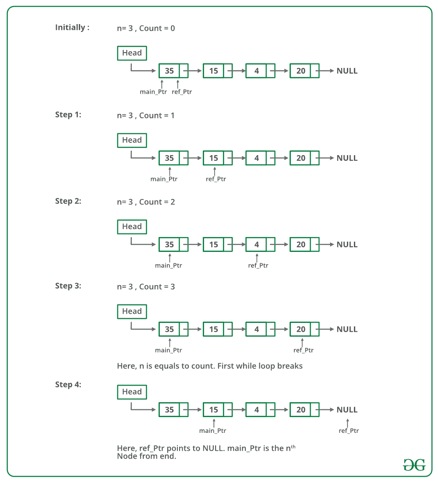

# 从链表

> 原文：[https://www.geeksforgeeks.org/nth-node-from-the-end-of-a-linked-list/](https://www.geeksforgeeks.org/nth-node-from-the-end-of-a-linked-list/)

末尾开始的第 n 个节点的程序

给定一个链表和一个数字 n，编写一个函数，该函数从链表的末尾返回第 n 个节点的值。

例如，如果输入在列表下方且 n = 3，则输出为“ B”


**方法 1（使用链表的长度）**，

1.  计算链表的长度。 让长度为 len。

2.  从链表的开头打印第（len – n + 1）个节点。

**双指针概念**：第一个指针用于存储变量的地址，第二个指针用于存储第一个指针的地址。 如果希望通过函数更改变量的值，则将指针传递给它。 并且，如果我们希望改变指针的值（即，它应该开始指向其他东西），则将指针传递给指针。

下面是上述方法的实现：

## C++ 14

```

// Simple C++ program to find n'th node from end 
#include <bits/stdc++.h> 
using namespace std; 

/* Link list node */
struct Node { 
    int data; 
    struct Node* next; 
}; 

/* Function to get the nth node from the last of a linked list*/
void printNthFromLast(struct Node* head, int n) 
{ 
    int len = 0, i; 
    struct Node* temp = head; 

    // count the number of nodes in Linked List 
    while (temp != NULL) { 
        temp = temp->next; 
        len++; 
    } 

    // check if value of n is not 
    // more than length of the linked list 
    if (len < n) 
        return; 

    temp = head; 

    // get the (len-n+1)th node from the beginning 
    for (i = 1; i < len - n + 1; i++) 
        temp = temp->next; 

    cout << temp->data; 

    return; 
} 

void push(struct Node** head_ref, int new_data) 
{ 
    /* allocate node */
    struct Node* new_node = new Node(); 

    /* put in the data */
    new_node->data = new_data; 

    /* link the old list off the new node */
    new_node->next = (*head_ref); 

    /* move the head to point to the new node */
    (*head_ref) = new_node; 
} 

// Driver Code 
int main() 
{ 
    /* Start with the empty list */
    struct Node* head = NULL; 

    // create linked 35->15->4->20 
    push(&head, 20); 
    push(&head, 4); 
    push(&head, 15); 
    push(&head, 35); 

    printNthFromLast(head, 4); 
    return 0; 
}

```

## Java

```java

// Simple Java program to find n'th node from end of linked list 
class LinkedList { 
    Node head; // head of the list 

    /* Linked List node */
    class Node { 
        int data; 
        Node next; 
        Node(int d) 
        { 
            data = d; 
            next = null; 
        } 
    } 

    /* Function to get the nth node from the last of a 
       linked list */
    void printNthFromLast(int n) 
    { 
        int len = 0; 
        Node temp = head; 

        // 1) count the number of nodes in Linked List 
        while (temp != null) { 
            temp = temp.next; 
            len++; 
        } 

        // check if value of n is not more than length of 
        // the linked list 
        if (len < n) 
            return; 

        temp = head; 

        // 2) get the (len-n+1)th node from the beginning 
        for (int i = 1; i < len - n + 1; i++) 
            temp = temp.next; 

        System.out.println(temp.data); 
    } 

    /* Inserts a new Node at front of the list. */
    public void push(int new_data) 
    { 
        /* 1 & 2: Allocate the Node & 
                  Put in the data*/
        Node new_node = new Node(new_data); 

        /* 3\. Make next of new Node as head */
        new_node.next = head; 

        /* 4\. Move the head to point to new Node */
        head = new_node; 
    } 

    /*Driver program to test above methods */
    public static void main(String[] args) 
    { 
        LinkedList llist = new LinkedList(); 
        llist.push(20); 
        llist.push(4); 
        llist.push(15); 
        llist.push(35); 

        llist.printNthFromLast(4); 
    } 
} // This code is contributed by Rajat Mishra 

```

## Python3

```py

# Simple Python3 program to find 
# n'th node from end 
class Node: 
    def __init__(self, new_data): 
        self.data = new_data 
        self.next = None

class LinkedList: 
    def __init__(self): 
        self.head = None

    # createNode and and make linked list 
    def push(self, new_data): 
        new_node = Node(new_data) 
        new_node.next = self.head 
        self.head = new_node 

    # Function to get the nth node from  
    # the last of a linked list  
    def printNthFromLast(self, n): 
        temp = self.head # used temp variable 

        length = 0
        while temp is not None: 
            temp = temp.next
            length += 1

        # print count  
        if n > length: # if entered location is greater  
                       # than length of linked list 
            print('Location is greater than the' +
                         ' length of LinkedList') 
            return
        temp = self.head 
        for i in range(0, length - n): 
            temp = temp.next
        print(temp.data) 

# Driver Code         
llist = LinkedList()  
llist.push(20)  
llist.push(4)  
llist.push(15)  
llist.push(35) 
llist.printNthFromLast(4) 

# This code is contributed by Yogesh Joshi 

```

## C#

```cs

// C# program to find n'th node from end of linked list  
using System; 

public class LinkedList 
{  
    public Node head; // head of the list  

    /* Linked List node */
    public class Node  
    {  
        public int data;  
        public Node next;  
        public Node(int d)  
        {  
            data = d;  
            next = null;  
        }  
    }  

    /* Function to get the nth node from the last of a  
    linked list */
    void printNthFromLast(int n)  
    {  
        int len = 0;  
        Node temp = head;  

        // 1) count the number of nodes in Linked List  
        while (temp != null)  
        {  
            temp = temp.next;  
            len++;  
        }  

        // check if value of n is not more than length of  
        // the linked list  
        if (len < n)  
            return;  

        temp = head;  

        // 2) get the (len-n+1)th node from the beginning  
        for (int i = 1; i < len - n + 1; i++)  
            temp = temp.next;  

        Console.WriteLine(temp.data);  
    }  

    /* Inserts a new Node at front of the list. */
    public void push(int new_data)  
    {  
        /* 1 & 2: Allocate the Node &  
                Put in the data*/
        Node new_node = new Node(new_data);  

        /* 3\. Make next of new Node as head */
        new_node.next = head;  

        /* 4\. Move the head to point to new Node */
        head = new_node;  
    }  

    /*Driver code */
    public static void Main(String[] args)  
    {  
        LinkedList llist = new LinkedList();  
        llist.push(20);  
        llist.push(4);  
        llist.push(15);  
        llist.push(35);  

        llist.printNthFromLast(4);  
    }  
} 

// This code is contributed by Rajput-Ji 

```

**Output**

```
35
```

以下是相同方法的递归 C 代码。 感谢 Anuj Bansal 提供以下代码。

## C

```c

void printNthFromLast(struct Node* head, int n) 
{ 
    static int i = 0; 
    if (head == NULL) 
        return; 
    printNthFromLast(head->next, n); 
    if (++i == n) 
        printf("%d", head->data); 
} 

```

**时间复杂度**：`O(n)`，其中 n 是链表的长度。

**方法 2（使用两个指针）**

维护两个指针-参考指针和主指针。 初始化引用和主指向 head 的指针。 首先，将参考指针从头移到 n 个节点。 现在将两个指针一一移动，直到参考指针到达末尾。 现在，主指针将从末尾指向第 n 个节点。 返回主指针。

下图是上述方法的模拟：



下面是上述方法的实现：

## C++

```cpp

// Simple C++ program to  
// find n'th node from end 
#include<bits/stdc++.h> 
using namespace std; 

/* Link list node */
struct Node 
{ 
  int data; 
  struct Node* next; 
}; 

/* Function to get the nth node  
   from the last of a linked list*/
void printNthFromLast(struct Node *head, int n) 
{ 
  struct Node *main_ptr = head; 
  struct Node *ref_ptr = head; 

  int count = 0; 
  if(head != NULL) 
  { 
     while( count < n ) 
     { 
        if(ref_ptr == NULL) 
        { 
           printf("%d is greater than the no. of "
                    "nodes in list", n); 
           return; 
        } 
        ref_ptr = ref_ptr->next; 
        count++; 
     } /* End of while*/

     if(ref_ptr == NULL) 
     { 
        head = head->next; 
        if(head != NULL) 
            printf("Node no. %d from last is %d ", n, main_ptr->data); 
     } 
     else
     { 
       while(ref_ptr != NULL) 
       { 
          main_ptr = main_ptr->next; 
          ref_ptr  = ref_ptr->next; 
       } 
       printf("Node no. %d from last is %d ", n, main_ptr->data); 
     } 
  } 
} 

// Function to push 
void push(struct Node** head_ref, int new_data) 
{ 
  /* allocate node */
  struct Node* new_node = new Node();  

  /* put in the data  */
  new_node->data  = new_data; 

  /* link the old list off the new node */
  new_node->next = (*head_ref);     

  /* move the head to point to the new node */
  (*head_ref)    = new_node; 
} 

/* Driver program to test above function*/
int main() 
{ 
  /* Start with the empty list */
  struct Node* head = NULL; 
  push(&head, 20); 
  push(&head, 4); 
  push(&head, 15); 
  push(&head, 35); 

  printNthFromLast(head, 4); 
}

```

## Java

```java

// Java program to find n'th  
// node from end using slow and 
// fast pointers 
class LinkedList  
{ 
    Node head; // head of the list 

    /* Linked List node */
    class Node { 
        int data; 
        Node next; 
        Node(int d) 
        { 
            data = d; 
            next = null; 
        } 
    } 

    /* Function to get the  
      nth node from end of list */
    void printNthFromLast(int n) 
    { 
        Node main_ptr = head; 
        Node ref_ptr = head; 

        int count = 0; 
        if (head != null)  
        { 
            while (count < n)  
            { 
                if (ref_ptr == null)  
                { 
                    System.out.println(n  
                     + " is greater than the no "
                       + " of nodes in the list"); 
                    return; 
                } 
                ref_ptr = ref_ptr.next; 
                count++; 
            } 

            if(ref_ptr == null) 
            { 
              head = head.next; 
              if(head != null) 
                System.out.println("Node no. " + n + 
                                   " from last is " +  
                                      head.data); 
            } 
            else
            { 

              while (ref_ptr != null)  
              { 
                  main_ptr = main_ptr.next; 
                  ref_ptr = ref_ptr.next; 
              } 
              System.out.println("Node no. " + n + 
                                " from last is " + 
                                  main_ptr.data); 
            } 
        } 
    } 

    /* Inserts a new Node at front of the list. */
    public void push(int new_data) 
    { 
        /* 1 & 2: Allocate the Node & 
                  Put in the data*/
        Node new_node = new Node(new_data); 

        /* 3\. Make next of new Node as head */
        new_node.next = head; 

        /* 4\. Move the head to point to new Node */
        head = new_node; 
    } 

    /*Driver program to test above methods */
    public static void main(String[] args) 
    { 
        LinkedList llist = new LinkedList(); 
        llist.push(20); 
        llist.push(4); 
        llist.push(15); 
        llist.push(35); 

        llist.printNthFromLast(4); 
    } 
}  
// This code is contributed by Rajat Mishra 

```

## Python

```py

# Python program to find n'th node from end using slow 
# and fast pointer 

# Node class  
class Node: 

    # Constructor to initialize the node object 
    def __init__(self, data): 
        self.data = data 
        self.next = None

class LinkedList: 

    # Function to initialize head 
    def __init__(self): 
        self.head = None

    # Function to insert a new node at the beginning 
    def push(self, new_data): 
        new_node = Node(new_data) 
        new_node.next = self.head 
        self.head = new_node 

    def printNthFromLast(self, n): 
        main_ptr = self.head 
        ref_ptr = self.head  

        count = 0 
        if(self.head is not None): 
            while(count < n ): 
                if(ref_ptr is None): 
                    print "% d is greater than the  
                           no. pf nodes in list" %(n) 
                    return

                ref_ptr = ref_ptr.next
                count += 1

        if(ref_ptr is None): 
            self.head = self.head.next
            if(self.head is not None): 
                 print "Node no. % d from last is % d " 
                                   %(n, main_ptr.data) 
        else: 

          while(ref_ptr is not None): 
              main_ptr = main_ptr.next 
              ref_ptr = ref_ptr.next

          print "Node no. % d from last is % d " 
                                     %(n, main_ptr.data) 

# Driver program to test above function 
llist = LinkedList() 
llist.push(20) 
llist.push(4) 
llist.push(15) 
llist.push(35) 

llist.printNthFromLast(4) 

# This code is contributed by Nikhil Kumar Singh(nickzuck_007) 

```

## C#

```cs

// C# program to find n'th node from end using slow and 
// fast pointerspublic  
using System; 

public class LinkedList 
{ 
  Node head; // head of the list 

  /* Linked List node */
  public class Node  
  { 
    public int data; 
    public Node next; 
    public Node(int d) 
    { 
      data = d; 
      next = null; 
    } 
  } 

  /* Function to get the nth node from end of list */
  void printNthFromLast(int n) 
  { 
    Node main_ptr = head; 
    Node ref_ptr = head; 

    int count = 0; 
    if (head != null) 
    { 
      while (count < n)  
      { 
        if (ref_ptr == null) 
        { 
          Console.WriteLine(n + " is greater than the no "
                            + " of nodes in the list"); 
          return; 
        } 
        ref_ptr = ref_ptr.next; 
        count++; 
      } 

      if(ref_ptr == null) 
      { 
        head = head.next; 
        if(head != null) 
          Console.WriteLine("Node no. " +  
                            n + " from last is " + 
                            main_ptr.data); 
      } 
      else
      { 
        while (ref_ptr != null) 
        { 
          main_ptr = main_ptr.next; 
          ref_ptr = ref_ptr.next; 
        } 
        Console.WriteLine("Node no. " +  
                          n + " from last is " + 
                          main_ptr.data); 
      } 
    } 
  } 

  /* Inserts a new Node at front of the list. */
  public void push(int new_data) 
  { 
    /* 1 & 2: Allocate the Node & 
                Put in the data*/
    Node new_node = new Node(new_data); 

    /* 3\. Make next of new Node as head */
    new_node.next = head; 

    /* 4\. Move the head to point to new Node */
    head = new_node; 
  } 

  /*Driver code */
  public static void Main(String[] args) 
  { 
    LinkedList llist = new LinkedList(); 
    llist.push(20); 
    llist.push(4); 
    llist.push(15); 
    llist.push(35); 

    llist.printNthFromLast(4); 
  } 
} 

/* This code is contributed by PrinciRaj1992 */

```

**Output**

```
Node no. 4 from last is 35 
```

**时间复杂度**：`O(n)`，其中 n 是链表的长度。

如果您发现上述代码/算法不正确，或者找到其他解决同一问题的方法，请发表评论。

