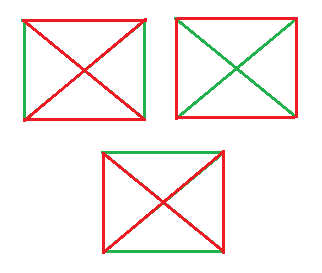

# 哈密顿循环数

> 原文： [https://www.geeksforgeeks.org/number-of-hamiltonian-cycle/](https://www.geeksforgeeks.org/number-of-hamiltonian-cycle/)

给定 N 个顶点的**无向完全图**，其中 N >2。任务是找到图的不同**哈密顿循环**的数量。

**完整图形**：如果每个可能的顶点通过边连接，则认为图形是完整的。

**哈密顿周期**：这是一个封闭的步行，每个顶点除初始顶点外最多被访问一次。 而且没有必要走遍所有的边。

**公式**：


**示例**：

```
Input : N = 6
Output : Hamiltonian cycles = 60

Input : N = 4
Output : Hamiltonian cycles = 3

```

**说明**：
让我们以 N = 4 个完全无向图为例，这 3 个不同的哈密顿循环如下所示：



下面是上述方法的实现：

## C++

```cpp

// C++ program for implementation of the  
// above program 

#include <bits/stdc++.h> 
using namespace std; 

// Function that calculates 
// number of Hamiltonian cycle 
int Cycles(int N) 
{ 

    int fact = 1, result = 0; 

    result = N - 1; 

    // Calculating factorial 
    int i = result; 
    while (i > 0) { 
        fact = fact * i; 
        i--; 
    } 

    return fact / 2; 
} 

// Driver code 
int main() 
{ 
    int N = 5; 

    int Number = Cycles(N); 

    cout << "Hamiltonian cycles = " << Number; 
    return 0; 
} 

```