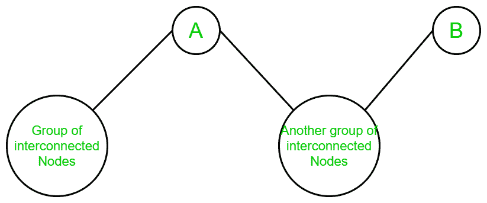
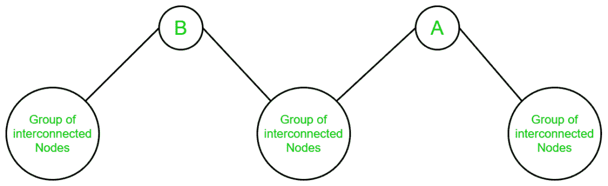

# 对的数量，使得对之间的路径具有两个顶点 A 和 B

> 原文： [https://www.geeksforgeeks.org/number-of-pairs-such-that-path-between-pairs-has-the-two-vertices-a-and-b/](https://www.geeksforgeeks.org/number-of-pairs-such-that-path-between-pairs-has-the-two-vertices-a-and-b/)

给定一个无向连通图和两个顶点`A`和`B`，任务是找到成对的顶点 **{X，Y}** 的对数 从`X`到`Y`包含两个顶点`A`和`B`。

**注意**：

*   {X，Y}等效于{Y，X}。
*   X！= A，X！= B，Y！= A 和 Y！= B.

**示例**：

> [](https://media.geeksforgeeks.org/wp-content/uploads/20200319113941/Graph19.png) 
> 对于上图：
> **输入**：A = 3，B = 5
> **输出**：4
> **说明**：
> 有四对{X，Y}，因此从源 X 到目标 Y 的所有路径都包含顶点 A，B。它们是：
> {1、6 }，{1，7}，{2，6}和{2，7}。
> 
> [](https://media.geeksforgeeks.org/wp-content/uploads/20200319114520/Graph-Example-2.png) 
> 对于上图：
> **输入**：A = 2，B = 1
> **输出**：1
> **说明**：
> 只有一对{X，Y}，使得从源 X 到目标 Y 的所有路径都包含顶点 A，B。也就是说：
> {4， 3}。

**方法**：

*   对于给定的图，如果对于任何对 **{X，Y}** ，除了给定的顶点`A`和`B`之外，它们之间还存在其他路径。 这两个顶点不包含在最终答案中。 那是因为我们需要对的数量，以使这些对中的任何路径都包含顶点`A`和`B`。
*   因此，我们对成对的顶点 **{X，Y}** 感兴趣，以便删除顶点`A`（从`B`时）断开从 X 到 X 的连接。 Y 并删除顶点`B`（从`A`出发时）会断开从 X 到 Y 的连接。
*   换句话说，当删除`A`和删除`B`时，如果 X 和 Y 属于图的不同部分，则对 **{X，Y}** 对 。

因此，为了找到上述对，请执行以下步骤：

*   考虑随机有向连接图，其中一组互连的节点连接到`A`，而一组互连的节点连接到`B`。`A`和`B`之间可能有节点，也可能没有节点。
*   如果我们同时删除了`A`和`B`，该怎么办？ 然后，图形可以断开连接或保持连接状态。
*   如果图形保持连接状态，则不存在一对顶点，因为图形中所有对 **{X，Y}** 都存在其他路径，而没有顶点`A`和`B`。
*   如果图形断开连接，则出现两种情况：
    1.  删除顶点 A 和 B 时，图形将转换为两个断开的组件。
    2.  删除顶点 A 和 B 时，图形将转换为三个断开的组件。

如果在移除顶点`A`和`B`时，图形被转换为两个断开的分量，则出现三种情况：

1.  当有一组互连的节点连接到顶点 A 时，一些独立的节点连接到 A 和 B，而顶点 B 是图的叶节点：
    [](https://media.geeksforgeeks.org/wp-content/uploads/20200319121718/Case-1.png) 
    显然，在上图中，当从图中删除了顶点`A`和顶点`B`时，该图将转换为**两个不同的分量**。 并且，可以丢弃任何组件，因为一个组件的顶点可以不经过顶点`B`而到达任何其他组件的顶点。 所以不存在一对。
2.  当存在一组互连的节点连接到顶点 B 时，一些独立的节点连接到 A 和 B，并且顶点 A 是图的叶节点：
    [](https://media.geeksforgeeks.org/wp-content/uploads/20200319122108/Case-21.png) 
    显然，在上图中，从顶点`A`和顶点`B`中删除后，该图将转换为**两种不同的成分**。 并且，可以丢弃任何分量，因为一个分量的顶点可以不经过顶点`A`而到达任何其他分量的顶点。 所以不存在一对。
3.  当顶点`A`和顶点`B`之间没有节点，并且顶点`A`和`B`都不是图的叶节点时 ：
    [](https://media.geeksforgeeks.org/wp-content/uploads/20200319122635/Case-31.png) 
    显然，​​在上图中，当顶点`A`和顶点**时，图形被转换为**两个不同的分量** ] B** 从其中删除。 在此，一个组件的任意一个顶点可以与另一组件的任意一个顶点配对。 因此，该图中的对数成为组件 1 和组件 2 中互连节点数量的计数的**乘积**。

如果在删除顶点 A 和 B 时，图形被转换为三个断开的分量，那么只会出现一种情况：

1.  如果有一组互连的节点连接到顶点 A，顶点 B，并且在顶点 A 和顶点 B 之间还有另一组节点，则顶点 A 和 B 都不是叶节点：
    [](https://media.geeksforgeeks.org/wp-content/uploads/20200319123457/Case-3-1.png) 
    在这种情况下，由于上述原因，可以丢弃顶点 A 和 B 之间的分量。 并且，一旦将其丢弃，它就是两分量图中的情况 3。 可以使用相同的概念来找到顶点数。

因此，可以通过以下步骤实现上述想法：

1.  使用向量 STL 将图形存储为[邻接表](https://www.geeksforgeeks.org/graph-and-its-representations/)。
2.  运行 [DFS](http://www.geeksforgeeks.org/depth-first-traversal-for-a-graph/) ，以便我们固定顶点`B`，就像我们将其删除一样。 这可以使用 DFS 函数的基本条件来完成，即在到达顶点`B`时返回调用。
3.  在删除`B`之后，计算`A`无法到达的顶点。
4.  通过固定顶点 A 并计算除去顶点`A`之后`B`无法达到的顶点数量，重复上述两个步骤。
5.  将两个计数存储在两个不同的变量中。 这表示在删除`B`然后删除`A`时首先设置的顶点数。
6.  将两个计数相乘是必需的答案。

下面是上述方法的实现：

## C ++

```

// C++ program to find the number 
// of pairs such that the path between 
// every pair contains two given vertices 

#include <bits/stdc++.h> 
using namespace std; 
const int N = 1000001; 
int c, n, m, a, b; 

// Function to perform DFS on the given graph 
// by fixing the a vertex 
void dfs(int a, int b, vector<int> v[], int vis[]) 
{ 
    // To mark a particular vertex as visited 
    vis[a] = 1; 

    // Variable to store the count of the 
    // vertices which can be reached from a 
    c++; 

    // Performing the DFS by iterating over 
    // the visited array 
    for (auto i : v[a]) { 

        // If the vertex is not visited 
        // and removing the vertex b 
        if (!vis[i] && i != b) 
            dfs(i, b, v, vis); 
    } 
} 

// Function to return the number of pairs 
// such that path between any two pairs 
// consists the given two vertices A and B 
void Calculate(vector<int> v[]) 
{ 

    // Initializing the visited array 
    // and assigning it with 0's 
    int vis[n + 1]; 
    memset(vis, 0, sizeof(vis)); 

    // Initially, the count of vertices is 0 
    c = 0; 

    // Performing DFS by removing the vertex B 
    dfs(a, b, v, vis); 

    // Count the vertices which cannot be 
    // reached after removing the vertex B 
    int ans1 = n - c - 1; 

    // Again reinitializing the visited array 
    memset(vis, 0, sizeof(vis)); 

    // Setting the count of vertices to 0 to 
    // perform the DFS again 
    c = 0; 

    // Performing the DFS by removing the vertex A 
    dfs(b, a, v, vis); 

    // Count the vertices which cannot be 
    // reached after removing the vertex A 
    int ans2 = n - c - 1; 

    // Multiplying both the vertices set 
    cout << ans1 * ans2 << "\n"; 
} 

// Driver code 
int main() 
{ 
    n = 7, m = 7, a = 3, b = 5; 

    int edges[][2] = { { 1, 2 }, 
                       { 2, 3 }, 
                       { 3, 4 }, 
                       { 4, 5 }, 
                       { 5, 6 }, 
                       { 6, 7 }, 
                       { 7, 5 } }; 
    vector<int> v[n + 1]; 

    // Loop to store the graph 
    for (int i = 0; i < m; i++) { 
        v[edges[i][0]].push_back(edges[i][1]); 
        v[edges[i][1]].push_back(edges[i][0]); 
    } 

    Calculate(v); 
    return 0; 
} 

```