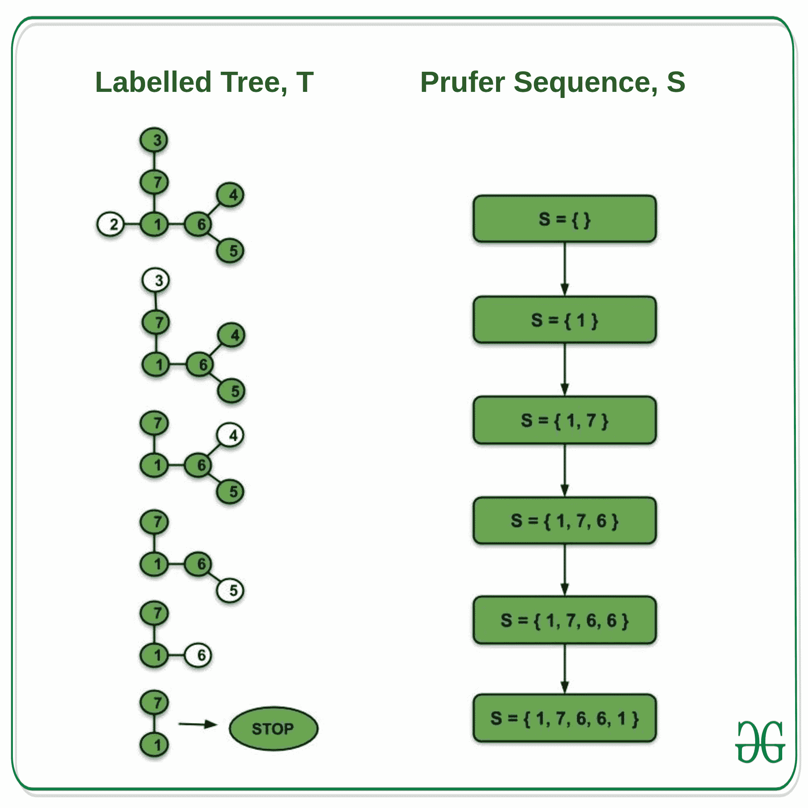
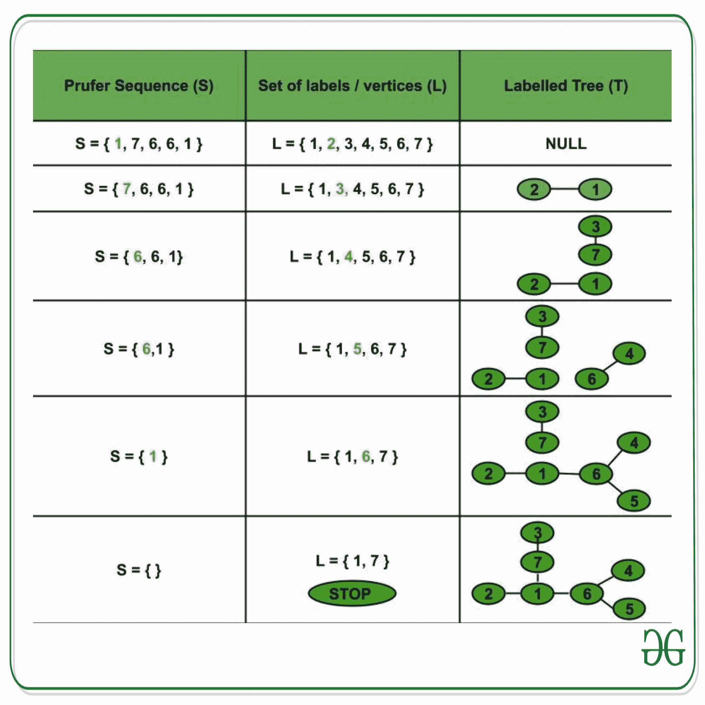

# 加权完整图

的生成树数

> 原文： [https://www.geeksforgeeks.org/number-of-spanning-trees-of-a-weighted-complete-graph/](https://www.geeksforgeeks.org/number-of-spanning-trees-of-a-weighted-complete-graph/)

**先决条件**：[图论基础](https://www.geeksforgeeks.org/mathematics-graph-theory-basics-set-1/)和[生成树。](https://en.wikipedia.org/wiki/Spanning_tree)

**完全加权图**：其中一条边连接每对图顶点并且每个边具有与之相关联的权重的图称为完全加权图。

具有 n 个顶点的完整加权图的生成树数为 **n （n-2）** 。

**证明**：生成树是图 G 的子图，它包含图的所有顶点。 因此，完整加权图的生成树的数量与具有 n 个顶点的标记树的数量（不需要是二进制的）相同。

带有 n 个顶点的标记树的 Prüfer 序列是与树相关的唯一长度（n-2）序列。 同样，对于标签 1 到 n 上给定长度（n-2）的 Prüfer 序列，存在具有给定 Prüfer 序列的唯一标记树。 因此，我们在具有 n 个顶点的**标记树的集合 A 和标签 1 到 n [n [** 。 这可以证明如下：

令 T 为标记树，其顶点 1,2，…，n 和 S 为大小为（n-2）的 Prüfer 序列。 因此，T 和 S 分别是集合 A 和 B 的元素。

**（i）标记树（T）– >捕获序列（S）**

<u>构建标记树</u>的 Prüfer 序列–

最初，令 S = NULL。

**程序–**

*   查找带有最小标签的 T 的叶节点（L）。

*   将 L 的邻居添加到 S。

*   删除叶子节点 L。

*   重复上述步骤，直到树上只剩下两个节点（只能有一个生成树）。

*   我们构建了与标记树 T 相关的 Prüfer 序列 S。

**观察结果–**

*   没有叶子节点附加到 S。

*   树 T 的每个顶点 V 加到 S 上，总共达到度（V）-1 倍。

*   树 T 具有 n 个顶点，因此具有（n-1）个边。

*   S 中的项数=属于树的所有顶点 V 的（度（V）– 1）的总和 T =树 T 的所有顶点的度的总和–（1 + 1 +…+ 1..n 次）= 2（边数）– n = 2 *（n-1）– n = n-2。 （因为树的所有顶点的度数之和= 2 *树的边数）。

*   因此，T 类似于长度为（n-2）的 Prüfer 序列 S。

**（ii）Prufer 序列（S）– >标记树（T）**

<u>根据其 Pr</u> ü <u>fer 序列</u>构建标记树–

**程序-**

*   令 L = {1,2，…，n}为标签集（T 的顶点）。

*   令 S = {a 1 ，a 2 ，…，a （n-2）}为大小（n-2）的 Prüfer 序列，其中每个 i 属于 L。

*   找到属于 L 但不属于 S 的最小元素 x。

*   通过边连接 x 和 S 的第一个元素（ 1 ）。

*   从 S 删除 1 ，从 L 删除 x（因此，S：= S- {a 1 }，L：= L- {x}）。

*   同样，找到 y，它是属于 L 而不属于 S 的最小元素。

*   将 y 和 S（a 2 ）的第一个元素连接起来。

*   从 L 除去 y，从 S 除去 2 （因此，S：= S- {a 2 }和 L：= L- {y}）。

*   继续上述过程，直到 L 剩下两个项目为止。

*   将这两个项目连接到到目前为止形成的树中。

从 S 获得的树与 T 相同。因此，大小为（n-2）的 Prüfer 序列 S 类似于 T（S T）。 因此，在具有 n 个顶点的标记树集合与标签 1 至 n 上大小为（n-2）的 Prüfer 序列集合之间存在**双射**。

因此，n 个顶点的完整加权图的**生成树的数量** =具有 n 个顶点的标记树的数量=大小为（n-2）的 Prüfer 序列的数量= **n （ n-2）** 。

* * *

* * *

如果您喜欢 GeeksforGeeks 并希望做出贡献，则还可以使用 [tribution.geeksforgeeks.org](https://contribute.geeksforgeeks.org/) 撰写文章，或将您的文章邮寄至 tribution@geeksforgeeks.org。 查看您的文章出现在 GeeksforGeeks 主页上，并帮助其他 Geeks。

如果您发现任何不正确的地方，请单击下面的“改进文章”按钮，以改进本文。