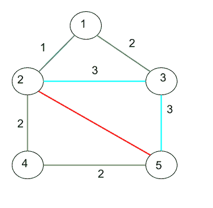

# 两个节点之间的单色路径数

> 原文： [https://www.geeksforgeeks.org/number-unicolored-paths-two-nodes/](https://www.geeksforgeeks.org/number-unicolored-paths-two-nodes/)

给定一个无向的有色图（[的边缘为有色](https://en.wikipedia.org/wiki/Edge_coloring)），并带有源顶点“ s”和目标顶点“ d”，请打印从给定“ s”到“ d”的路径数，以使该路径 是 UniColored（路径中的边缘具有相同的颜色）。

边缘是彩色的，这里的颜色用数字表示。 最多，不同颜色的数量将成为边缘的数量。


```
Input : Graph
       u, v, color
        1, 2, 1
        1, 3, 2
        2, 3, 3
        2, 4, 2
        2, 5, 4
        3, 5, 3
        4, 5, 2
source = 2   destination = 5             

Output : 3
Explanation : There are three paths from 2 to 5
2 -> 5 with color red
2 -> 3 - > 5 with color sky blue
2 -> 4 - > 5  with color green

```

**算法：**
1.在源节点的相邻节点上进行 dfs 遍历。
2.源节点和邻居节点之间的颜色是已知的，如果 DFS 遍历也具有相同的颜色，请继续，否则停止沿该路径前进。
3.到达目标节点后，将计数递增 1。

**注意：**颜色数量将始终小于边数。

## C ++

```

// C++ code to find unicolored paths 
#include <bits/stdc++.h> 
using namespace std; 

const int MAX_V = 100; 

int color[MAX_V]; 
bool vis[MAX_V]; 

// Graph class represents a udirected graph 
// using adjacency list representation 
class Graph 
{ 
    // vertices, edges, adjancy list 
    int V; 
    int E; 
    vector<pair<int, int> > adj[MAX_V]; 

    // function used by UniColorPaths 
    // DFS traversal o from x to y 
    void dfs(int x, int y, int z); 

// Constructor 
public: 
    Graph(int V, int E); 

    // function to add an edge to graph 
    void addEdge(int v, int w, int z); 

    // finds paths between a and b having 
    // same color edges 
    int UniColorPaths(int a, int b); 
}; 

Graph::Graph(int V, int E) 
{ 
    this -> V = V; 
    this -> E = E; 
} 

void Graph::addEdge(int a, int b, int c) 
{ 
    adj[a].push_back({b, c}); // Add b to a’s list. 
    adj[b].push_back({a, c}); // Add c to b’s list. 
} 

void Graph::dfs(int x, int y, int col) 
{ 
    if (vis[x]) 
        return; 
    vis[x] = 1; 

    // mark this as a possible color to reach s to d 
    if (x == y) 
    { 
        color[col] = 1; 
        return; 
    } 

    // if the next edge is also of same color 
    for (int i = 0; i < int(adj[x].size()); i++) 
        if (adj[x][i].second == col) 
            dfs(adj[x][i].first, y, col); 
} 

// function that finds paths between a and b 
// such that all edges are same colored 
// It uses recursive dfs() 
int Graph::UniColorPaths(int a, int b) 
{ 

    // dfs on nodes directly connected to source 
    for (int i = 0; i < int(adj[a].size()); i++) 
    { 
        dfs(a, b, adj[a][i].second); 

        // to visit again visited nodes 
        memset(vis, 0, sizeof(vis)); 
    } 

    int cur = 0; 
    for (int i = 0; i <= E; i++) 
        cur += color[i]; 

    return (cur); 
} 

// driver code 
int main() 
{ 
    // Create a graph given in the above diagram 
    Graph g(5, 7); 
    g.addEdge(1, 2, 1); 
    g.addEdge(1, 3, 2); 
    g.addEdge(2, 3, 3); 
    g.addEdge(2, 4, 2); 
    g.addEdge(2, 5, 4); 
    g.addEdge(3, 5, 3); 
    g.addEdge(4, 5, 2); 

    int s = 2; // source 
    int d = 5; // destination 

    cout << "Number of unicolored paths : "; 
    cout << g.UniColorPaths(s, d) << endl; 
    return 0; 
} 

```

## Python3

```

# Python3 code to find unicolored paths  

MAX_V = 100 
color = [0] * MAX_V 
vis = [0] * MAX_V 

# Graph class represents a udirected graph  
# using adjacency list representation  
class Graph:  

    def __init__(self, V, E): 
        self.V = V 
        self.E = E 
        self.adj = [[] for i in range(MAX_V)] 

    # Function used by UniColorPaths  
    # DFS traversal o from x to y  
    def dfs(self, x, y, col): 

        if vis[x]:  
            return 
        vis[x] = 1 

        # mark this as a possible color to reach s to d  
        if x == y:  
            color[col] = 1 
            return 

        # if the next edge is also of same color  
        for i in range(0, len(self.adj[x])):  
            if self.adj[x][i][1] == col:  
                self.dfs(self.adj[x][i][0], y, col) 

    def addEdge(self, a, b, c):  

        self.adj[a].append((b, c)) # Add b to a’s list.  
        self.adj[b].append((a, c)) # Add c to b’s list.  

    # Function that finds paths between a  
    # and b such that all edges are same  
    # colored. It uses recursive dfs()  
    def UniColorPaths(self, a, b):  

        global vis 

        # dfs on nodes directly connected to source  
        for i in range(0, len(self.adj[a])):  

            self.dfs(a, b, self.adj[a][i][1])  

            # to visit again visited nodes  
            vis = [0] * len(vis)  

        cur = 0 
        for i in range(0, self.E + 1):  
            cur += color[i]  

        return cur 

# Driver code  
if __name__ == "__main__":  

    # Create a graph given in the above diagram  
    g = Graph(5, 7)  
    g.addEdge(1, 2, 1)  
    g.addEdge(1, 3, 2)  
    g.addEdge(2, 3, 3)  
    g.addEdge(2, 4, 2)  
    g.addEdge(2, 5, 4)  
    g.addEdge(3, 5, 3)  
    g.addEdge(4, 5, 2)  

    s = 2 # source  
    d = 5 # destination  

    print("Number of unicolored paths : ", end = "")  
    print(g.UniColorPaths(s, d))  

# This code is contributed by Rituraj Jain 

```

**Output:**

```
Number of unicolored paths : 3

```

**时间复杂度：** O（E *（E + V））


* * *

* * *

如果您喜欢 GeeksforGeeks 并希望做出贡献，则还可以使用 [tribution.geeksforgeeks.org](https://contribute.geeksforgeeks.org/) 撰写文章，或将您的文章邮寄至 tribution@geeksforgeeks.org。 查看您的文章出现在 GeeksforGeeks 主页上，并帮助其他 Geeks。

如果您发现任何不正确的地方，请单击下面的“改进文章”按钮，以改进本文。