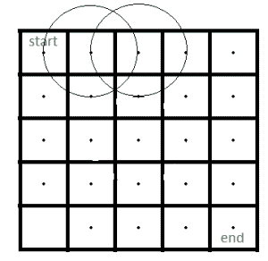

# 带圆圈的矩形的路径

> 原文： [https://www.geeksforgeeks.org/path-rectangle-containing-circles/](https://www.geeksforgeeks.org/path-rectangle-containing-circles/)

有一个 m * n 矩形矩阵，其左上（开始）位置为（1，1），右下（结束）位置为（m * n）。 有 k 个圆，每个圆的半径为 r。 查找是否有从头到尾的任何路径而不碰任何圆圈。
输入包含 m，n，k，r 的值以及两个整数 X 和 Y 的数组，每个数组的长度为 k。 （X [i]，Y [i]）是第<sup>个第</sup>个圆的中心。
**来源**：[Directi 访谈](https://www.geeksforgeeks.org/directi-interview-set-5-campus/)

**示例**：

```
Input : m = 5, n = 5, k = 2, r = 1, 
         X = {1, 3}, Y = {3, 3}
Output : Possible

```


这是一条从起点到终点的路径。

```
Input : m = 5, n = 5, k = 2, r = 1, 
         X = {1, 1}, Y = {2, 3}.
Output : Not Possible

```



**方法**：检查矩形的单元格（i，j）的中心是否在任何圆内，然后不要遍历该单元格并将其标记为“已阻止”。 最初将其余单元标记为“未访问”。 然后使用 [BFS](https://www.geeksforgeeks.org/breadth-first-traversal-for-a-graph/) 从起始位置找出每个单元的最短路径。 如果访问了终端单元，则将返回“可能”，否则返回“不可能”。

**算法**：

1.  取大小为 m * n 的数组。 将所有单元格初始化为 0。
2.  对于矩形的每个像元，检查它是否在任何圆内（通过计算该像元到每个圆的距离）。 如果它在任何圆圈内，请将该单元格的值更改为-1（“已阻止”）。
3.  现在，从起始单元格开始应用 BFS，如果可以到达某个单元格，则将该单元格的值更改为 1。
4.  如果结尾单元格的值为 1，则返回“可能”，否则返回“不可能”。

下面是上述想法的实现：

## C++

```cpp

// C++ program to find out path in
// a rectangle containing circles.
#include <iostream>
#include <math.h>
#include <vector>

using namespace std;

// Function to find out if there is
// any possible path or not.
bool isPossible(int m, int n, int k, int r, vector<int> X,
                vector<int> Y)
{
    // Take an array of m*n size and
    // initialize each element to 0.
    int rect[m][n] = { 0 };

    // Now using Pythagorean theorem find if a
    // cell touches or within any circle or not.
    for (int i = 0; i < m; i++) {
        for (int j = 0; j < n; j++) {
            for (int p = 0; p < k; p++) {
                if (sqrt((pow((X[p] - 1 - i), 2)
                          + pow((Y[p] - 1 - j), 2)))
                    <= r) {
                    rect[i][j] = -1;
                }
            }
        }
    }

    // If the starting cell comes within
    // any circle return false.
    if (rect[0][0] == -1)
        return false;

    // Now use BFS to find if there
    // is any possible path or not.

    // Initialize the queue which holds
    // the discovered cells whose neighbors
    // are not discovered yet.
    vector<vector<int> > qu;

    rect[0][0] = 1;
    qu.push_back({ 0, 0 });

    // Discover cells until queue is not empty
    while (!qu.empty()) {
        vector<int> arr = qu.front();
        qu.erase(qu.begin());
        int elex = arr[0];
        int eley = arr[1];

        // Discover the eight adjacent nodes.
        // check top-left cell
        if ((elex > 0) && (eley > 0)
            && (rect[elex - 1][eley - 1] == 0)) {
            rect[elex - 1][eley - 1] = 1;
            vector<int> v = { elex - 1, eley - 1 };
            qu.push_back(v);
        }

        // check top cell
        if ((elex > 0) && (rect[elex - 1][eley] == 0)) {
            rect[elex - 1][eley] = 1;
            vector<int> v = { elex - 1, eley };
            qu.push_back(v);
        }

        // check top-right cell
        if ((elex > 0) && (eley < n - 1)
            && (rect[elex - 1][eley + 1] == 0)) {
            rect[elex - 1][eley + 1] = 1;
            vector<int> v = { elex - 1, eley + 1 };
            qu.push_back(v);
        }

        // check left cell
        if ((eley > 0) && (rect[elex][eley - 1] == 0)) {
            rect[elex][eley - 1] = 1;
            vector<int> v = { elex, eley - 1 };
            qu.push_back(v);
        }

        // check right cell
        if ((eley < n - 1) && (rect[elex][eley + 1] == 0)) {
            rect[elex][eley + 1] = 1;
            vector<int> v = { elex, eley + 1 };
            qu.push_back(v);
        }

        // check bottom-left cell
        if ((elex < m - 1) && (eley > 0)
            && (rect[elex + 1][eley - 1] == 0)) {
            rect[elex + 1][eley - 1] = 1;
            vector<int> v = { elex + 1, eley - 1 };
            qu.push_back(v);
        }

        // check bottom cell
        if ((elex < m - 1) && (rect[elex + 1][eley] == 0)) {
            rect[elex + 1][eley] = 1;
            vector<int> v = { elex + 1, eley };
            qu.push_back(v);
        }

        // check bottom-right cell
        if ((elex < m - 1) && (eley < n - 1)
            && (rect[elex + 1][eley + 1] == 0)) {
            rect[elex + 1][eley + 1] = 1;
            vector<int> v = { elex + 1, eley + 1 };
            qu.push_back(v);
        }
    }

    // Now if the end cell (i.e. bottom right cell)
    // is 1(reachable) then we will send true.
    return (rect[m - 1][n - 1] == 1);
}

// Driver Program
int main()
{

    // Test case 1
    int m1 = 5, n1 = 5, k1 = 2, r1 = 1;
    vector<int> X1 = { 1, 3 };
    vector<int> Y1 = { 3, 3 };

    // Function call
    if (isPossible(m1, n1, k1, r1, X1, Y1))
        cout << "Possible" << endl;
    else
        cout << "Not Possible" << endl;

    // Test case 2
    int m2 = 5, n2 = 5, k2 = 2, r2 = 1;
    vector<int> X2 = { 1, 1 };
    vector<int> Y2 = { 2, 3 };

    // Function call
    if (isPossible(m2, n2, k2, r2, X2, Y2))
        cout << "Possible" << endl;
    else
        cout << "Not Possible" << endl;

    return 0;
}

```

## Python

```py

# Python3 program to find out path in
# a rectangle containing circles.
import math
import queue

# Function to find out if there is
# any possible path or not.

def isPossible(m, n, k, r, X, Y):

    # Take an array of m*n size and
    # initialize each element to 0.
    rect = [[0] * n for i in range(m)]

    # Now using Pythagorean theorem find if a
    # cell touches or within any circle or not.
    for i in range(m):
        for j in range(n):
            for p in range(k):
                if (math.sqrt((pow((X[p] - 1 - i), 2) +
                               pow((Y[p] - 1 - j), 2))) <= r):
                    rect[i][j] = -1

    # If the starting cell comes within
    # any circle return false.
    if (rect[0][0] == -1):
        return False

    # Now use BFS to find if there
    # is any possible path or not.

    # Initialize the queue which holds
    # the discovered cells whose neighbors
    # are not discovered yet.
    qu = queue.Queue()

    rect[0][0] = 1
    qu.put([0, 0])

    # Discover cells until queue is not empty
    while (not qu.empty()):
        arr = qu.get()
        elex = arr[0]
        eley = arr[1]

        # Discover the eight adjacent nodes.
        # check top-left cell
        if ((elex > 0) and (eley > 0) and
                (rect[elex - 1][eley - 1] == 0)):
            rect[elex - 1][eley - 1] = 1
            v = [elex - 1, eley - 1]
            qu.put(v)

        # check top cell
        if ((elex > 0) and
                (rect[elex - 1][eley] == 0)):
            rect[elex - 1][eley] = 1
            v = [elex - 1, eley]
            qu.put(v)

        # check top-right cell
        if ((elex > 0) and (eley < n - 1) and
                (rect[elex - 1][eley + 1] == 0)):
            rect[elex - 1][eley + 1] = 1
            v = [elex - 1, eley + 1]
            qu.put(v)

        # check left cell
        if ((eley > 0) and
                (rect[elex][eley - 1] == 0)):
            rect[elex][eley - 1] = 1
            v = [elex, eley - 1]
            qu.put(v)

        # check right cell
        if ((eley < n - 1) and
                (rect[elex][eley + 1] == 0)):
            rect[elex][eley + 1] = 1
            v = [elex, eley + 1]
            qu.put(v)

        # check bottom-left cell
        if ((elex < m - 1) and (eley > 0) and
                (rect[elex + 1][eley - 1] == 0)):
            rect[elex + 1][eley - 1] = 1
            v = [elex + 1, eley - 1]
            qu.put(v)

        # check bottom cell
        if ((elex < m - 1) and
                (rect[elex + 1][eley] == 0)):
            rect[elex + 1][eley] = 1
            v = [elex + 1, eley]
            qu.put(v)

        # check bottom-right cell
        if ((elex < m - 1) and (eley < n - 1) and
                (rect[elex + 1][eley + 1] == 0)):
            rect[elex + 1][eley + 1] = 1
            v = [elex + 1, eley + 1]
            qu.put(v)

    # Now if the end cell (i.e. bottom right cell)
    # is 1(reachable) then we will send true.
    return (rect[m - 1][n - 1] == 1)

# Driver Code
if __name__ == '__main__':

    # Test case 1
    m1 = 5
    n1 = 5
    k1 = 2
    r1 = 1
    X1 = [1, 3]
    Y1 = [3, 3]

    # Function call
    if (isPossible(m1, n1, k1, r1, X1, Y1)):
        print("Possible")
    else:
        print("Not Possible")

    # Test case 2
    m2 = 5
    n2 = 5
    k2 = 2
    r2 = 1
    X2 = [1, 1]
    Y2 = [2, 3]

    # Function call
    if (isPossible(m2, n2, k2, r2, X2, Y2)):
        print("Possible")
    else:
        print("Not Possible")

# This code is contributed by PranchalK

```

输出：

```
Possible
Not Possible

```

**时间复杂度**：需要 O（m * n * k）时间来计算一个单元是否在任何圆周内。 而且在 BFS 中需要 O（V + E）时间。 此处，m * n 网格中的边数为 m *（n-1）+ n *（m-1）和顶点 m * n。 因此在 DFS 中需要 O（m * n）时间。 因此，时间复杂度为 O（m * n * k）。 如果我们遍历每个圆圈并标记-1 进入其中的单元格，则可以提高复杂性。


* * *

* * *

如果您喜欢 GeeksforGeeks 并希望做出贡献，则还可以使用 [tribution.geeksforgeeks.org](https://contribute.geeksforgeeks.org/) 撰写文章，或将您的文章邮寄至 tribution@geeksforgeeks.org。 查看您的文章出现在 GeeksforGeeks 主页上，并帮助其他 Geeks。

如果您发现任何不正确的地方，请单击下面的“改进文章”按钮，以改进本文。