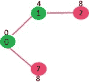
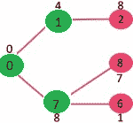

# Prim 的最小生成树（MST）| 贪婪的 Algo-5

> 原文： [https://www.geeksforgeeks.org/prims-minimum-spanning-tree-mst-greedy-algo-5/](https://www.geeksforgeeks.org/prims-minimum-spanning-tree-mst-greedy-algo-5/)

我们已经讨论了 [Kruskal 的最小生成树](https://www.geeksforgeeks.org/archives/26604)算法。 像 Kruskal 算法一样，Prim 算法也是[贪婪算法](https://www.geeksforgeeks.org/archives/18528)。 它从一棵空的生成树开始。 这个想法是维持两组顶点。 第一组包含 MST 中已包含的顶点，另一组包含尚未包含的顶点。 在每一步中，它都会考虑连接两组的所有边，并从这些边中选取最小权重边。 拾取边缘后，它将边缘的另一个端点移动到包含 MST 的集合。
在图论中，将连接图形中两组顶点的一组边线称为[。 *因此，在 Prim 算法的每一步中，我们都会找到一个割线（两套，其中一组包含 MST 中已经包含的顶点，另一组包含其余顶点），从割中选取最小权重边并包含此顶点 MST 集（包含已经包含的顶点的集）。*
***Prim 的算法如何工作？*** Prim 算法的思想很简单，生成树意味着必须连接所有顶点。 因此，必须连接两个不相交的顶点子集（如上所述），以形成*生成*树。 并且它们必须以最小重量边缘连接，以使其成为*最小*生成树。
***算法***
**1）**创建一个集合 *mstSet* ，该集合跟踪已包含在 MST 中的顶点。
**2）**为输入图中的所有顶点分配一个键值。 将所有键值初始化为 INFINITE。 将第一个顶点的键值指定为 0，以便首先选择它。
**3）**虽然 mstSet 不包括所有顶点
…。 **a）**选取 *mstSet* 中不存在且具有最小键值的顶点 *u* 。
…。 **b）**将 *u* 包括到 mstSet 中。
…。 **c）**更新 *u* 的所有相邻顶点的键值。 要更新键值，请遍历所有相邻的顶点。 对于每个相邻顶点 *v* ，如果边 *uv* 的权重小于 *v* 的先前键值，则将键值更新为 *uv 的权重*
使用键值的想法是从](http://en.wikipedia.org/wiki/Cut_%28graph_theory%29)[切割](http://en.wikipedia.org/wiki/Cut_(graph_theory))中挑选最小的重量边缘。 关键值仅用于尚未包含在 MST 中的顶点，这些顶点的关键值指示将其连接到 MST 中包含的一组顶点的最小权重边。

让我们通过以下示例来理解：


集合 *mstSet* 最初为空，分配给顶点的键为{0，INF，INF，INF，INF，INF，INF，INF}，其中 INF 表示无穷大。 现在选择具有最小键值的顶点。 选择顶点 0，将其包含在 *mstSet* 中。 因此 *mstSet* 变为{0}。 在包含到 *mstSet* 之后，更新相邻顶点的关键点值。 0 的相邻顶点是 1 和 7。1 和 7 的关键值更新为 4 和 8。下面的子图显示了顶点及其关键值，仅显示了具有有限关键值的顶点。 MST 中包含的顶点显示为绿色。


选择具有最小键值且尚未包含在 MST 中的顶点（不在 mstSET 中）。 选择顶点 1 并将其添加到 mstSet。 因此，mstSet 现在变为{0，1}。 更新相邻顶点的键值 1。顶点 2 的键值变为 8。



选择具有最小键值且尚未包含在 MST 中的顶点（不在 mstSET 中）。 我们可以选择顶点 7 或顶点 2，让顶点 7 被选择。 因此，mstSet 现在变为{0，1，7}。 更新相邻顶点 7 的关键值。顶点 6 和 8 的关键值变得有限（分别为 1 和 7）。



选择具有最小键值且尚未包含在 MST 中的顶点（不在 mstSET 中）。 选择了顶点 6。 这样 mstSet 现在变为{0，1，7，6}。 更新相邻顶点 6 的关键点值。更新顶点 5 和 8 的关键点值。


我们重复上述步骤，直到 *mstSet* 包含给定图形的所有顶点。 最后，我们得到下图。


***如何实现以上算法？***
我们使用布尔数组 mstSet []表示 MST 中包含的一组顶点。 如果值 mstSet [v]为 true，则顶点 v 包含在 MST 中，否则不包含。 数组 key []用于存储所有顶点的键值。 另一个数组 parent []，用于在 MST 中存储父节点的索引。 父数组是用于显示构造的 MST 的输出数组。

## C++

```cpp

// A C++ program for Prim's Minimum  
// Spanning Tree (MST) algorithm. The program is  
// for adjacency matrix representation of the graph  
#include <bits/stdc++.h> 
using namespace std; 

// Number of vertices in the graph  
#define V 5  

// A utility function to find the vertex with  
// minimum key value, from the set of vertices  
// not yet included in MST  
int minKey(int key[], bool mstSet[])  
{  
    // Initialize min value  
    int min = INT_MAX, min_index;  

    for (int v = 0; v < V; v++)  
        if (mstSet[v] == false && key[v] < min)  
            min = key[v], min_index = v;  

    return min_index;  
}  

// A utility function to print the  
// constructed MST stored in parent[]  
void printMST(int parent[], int graph[V][V])  
{  
    cout<<"Edge \tWeight\n";  
    for (int i = 1; i < V; i++)  
        cout<<parent[i]<<" - "<<i<<" \t"<<graph[i][parent[i]]<<" \n";  
}  

// Function to construct and print MST for  
// a graph represented using adjacency  
// matrix representation  
void primMST(int graph[V][V])  
{  
    // Array to store constructed MST  
    int parent[V];  

    // Key values used to pick minimum weight edge in cut  
    int key[V];  

    // To represent set of vertices included in MST  
    bool mstSet[V];  

    // Initialize all keys as INFINITE  
    for (int i = 0; i < V; i++)  
        key[i] = INT_MAX, mstSet[i] = false;  

    // Always include first 1st vertex in MST.  
    // Make key 0 so that this vertex is picked as first vertex.  
    key[0] = 0;  
    parent[0] = -1; // First node is always root of MST  

    // The MST will have V vertices  
    for (int count = 0; count < V - 1; count++) 
    {  
        // Pick the minimum key vertex from the  
        // set of vertices not yet included in MST  
        int u = minKey(key, mstSet);  

        // Add the picked vertex to the MST Set  
        mstSet[u] = true;  

        // Update key value and parent index of  
        // the adjacent vertices of the picked vertex.  
        // Consider only those vertices which are not  
        // yet included in MST  
        for (int v = 0; v < V; v++)  

            // graph[u][v] is non zero only for adjacent vertices of m  
            // mstSet[v] is false for vertices not yet included in MST  
            // Update the key only if graph[u][v] is smaller than key[v]  
            if (graph[u][v] && mstSet[v] == false && graph[u][v] < key[v])  
                parent[v] = u, key[v] = graph[u][v];  
    }  

    // print the constructed MST  
    printMST(parent, graph);  
}  

// Driver code 
int main()  
{  
    /* Let us create the following graph  
        2 3  
    (0)--(1)--(2)  
    | / \ |  
    6| 8/ \5 |7  
    | / \ |  
    (3)-------(4)  
            9     */
    int graph[V][V] = { { 0, 2, 0, 6, 0 },  
                        { 2, 0, 3, 8, 5 },  
                        { 0, 3, 0, 0, 7 },  
                        { 6, 8, 0, 0, 9 },  
                        { 0, 5, 7, 9, 0 } };  

    // Print the solution  
    primMST(graph);  

    return 0;  
}  

// This code is contributed by rathbhupendra 

```

## C

```c

// A C program for Prim's Minimum 
// Spanning Tree (MST) algorithm. The program is 
// for adjacency matrix representation of the graph 
#include <limits.h> 
#include <stdbool.h> 
#include <stdio.h> 
// Number of vertices in the graph 
#define V 5 

// A utility function to find the vertex with 
// minimum key value, from the set of vertices 
// not yet included in MST 
int minKey(int key[], bool mstSet[]) 
{ 
    // Initialize min value 
    int min = INT_MAX, min_index; 

    for (int v = 0; v < V; v++) 
        if (mstSet[v] == false && key[v] < min) 
            min = key[v], min_index = v; 

    return min_index; 
} 

// A utility function to print the 
// constructed MST stored in parent[] 
int printMST(int parent[], int graph[V][V]) 
{ 
    printf("Edge \tWeight\n"); 
    for (int i = 1; i < V; i++) 
        printf("%d - %d \t%d \n", parent[i], i, graph[i][parent[i]]); 
} 

// Function to construct and print MST for 
// a graph represented using adjacency 
// matrix representation 
void primMST(int graph[V][V]) 
{ 
    // Array to store constructed MST 
    int parent[V]; 
    // Key values used to pick minimum weight edge in cut 
    int key[V]; 
    // To represent set of vertices included in MST 
    bool mstSet[V]; 

    // Initialize all keys as INFINITE 
    for (int i = 0; i < V; i++) 
        key[i] = INT_MAX, mstSet[i] = false; 

    // Always include first 1st vertex in MST. 
    // Make key 0 so that this vertex is picked as first vertex. 
    key[0] = 0; 
    parent[0] = -1; // First node is always root of MST 

    // The MST will have V vertices 
    for (int count = 0; count < V - 1; count++) { 
        // Pick the minimum key vertex from the 
        // set of vertices not yet included in MST 
        int u = minKey(key, mstSet); 

        // Add the picked vertex to the MST Set 
        mstSet[u] = true; 

        // Update key value and parent index of 
        // the adjacent vertices of the picked vertex. 
        // Consider only those vertices which are not 
        // yet included in MST 
        for (int v = 0; v < V; v++) 

            // graph[u][v] is non zero only for adjacent vertices of m 
            // mstSet[v] is false for vertices not yet included in MST 
            // Update the key only if graph[u][v] is smaller than key[v] 
            if (graph[u][v] && mstSet[v] == false && graph[u][v] < key[v]) 
                parent[v] = u, key[v] = graph[u][v]; 
    } 

    // print the constructed MST 
    printMST(parent, graph); 
} 

// driver program to test above function 
int main() 
{ 
    /* Let us create the following graph 
        2 3 
    (0)--(1)--(2) 
    | / \ | 
    6| 8/ \5 |7 
    | /     \ | 
    (3)-------(4) 
            9         */
    int graph[V][V] = { { 0, 2, 0, 6, 0 }, 
                        { 2, 0, 3, 8, 5 }, 
                        { 0, 3, 0, 0, 7 }, 
                        { 6, 8, 0, 0, 9 }, 
                        { 0, 5, 7, 9, 0 } }; 

    // Print the solution 
    primMST(graph); 

    return 0; 
} 

```

## Java

```java

// A Java program for Prim's Minimum Spanning Tree (MST) algorithm. 
// The program is for adjacency matrix representation of the graph 

import java.util.*; 
import java.lang.*; 
import java.io.*; 

class MST { 
    // Number of vertices in the graph 
    private static final int V = 5; 

    // A utility function to find the vertex with minimum key 
    // value, from the set of vertices not yet included in MST 
    int minKey(int key[], Boolean mstSet[]) 
    { 
        // Initialize min value 
        int min = Integer.MAX_VALUE, min_index = -1; 

        for (int v = 0; v < V; v++) 
            if (mstSet[v] == false && key[v] < min) { 
                min = key[v]; 
                min_index = v; 
            } 

        return min_index; 
    } 

    // A utility function to print the constructed MST stored in 
    // parent[] 
    void printMST(int parent[], int graph[][]) 
    { 
        System.out.println("Edge \tWeight"); 
        for (int i = 1; i < V; i++) 
            System.out.println(parent[i] + " - " + i + "\t" + graph[i][parent[i]]); 
    } 

    // Function to construct and print MST for a graph represented 
    // using adjacency matrix representation 
    void primMST(int graph[][]) 
    { 
        // Array to store constructed MST 
        int parent[] = new int[V]; 

        // Key values used to pick minimum weight edge in cut 
        int key[] = new int[V]; 

        // To represent set of vertices included in MST 
        Boolean mstSet[] = new Boolean[V]; 

        // Initialize all keys as INFINITE 
        for (int i = 0; i < V; i++) { 
            key[i] = Integer.MAX_VALUE; 
            mstSet[i] = false; 
        } 

        // Always include first 1st vertex in MST. 
        key[0] = 0; // Make key 0 so that this vertex is 
        // picked as first vertex 
        parent[0] = -1; // First node is always root of MST 

        // The MST will have V vertices 
        for (int count = 0; count < V - 1; count++) { 
            // Pick thd minimum key vertex from the set of vertices 
            // not yet included in MST 
            int u = minKey(key, mstSet); 

            // Add the picked vertex to the MST Set 
            mstSet[u] = true; 

            // Update key value and parent index of the adjacent 
            // vertices of the picked vertex. Consider only those 
            // vertices which are not yet included in MST 
            for (int v = 0; v < V; v++) 

                // graph[u][v] is non zero only for adjacent vertices of m 
                // mstSet[v] is false for vertices not yet included in MST 
                // Update the key only if graph[u][v] is smaller than key[v] 
                if (graph[u][v] != 0 && mstSet[v] == false && graph[u][v] < key[v]) { 
                    parent[v] = u; 
                    key[v] = graph[u][v]; 
                } 
        } 

        // print the constructed MST 
        printMST(parent, graph); 
    } 

    public static void main(String[] args) 
    { 
        /* Let us create the following graph 
        2 3 
        (0)--(1)--(2) 
        | / \ | 
        6| 8/ \5 |7 
        | /     \ | 
        (3)-------(4) 
            9         */
        MST t = new MST(); 
        int graph[][] = new int[][] { { 0, 2, 0, 6, 0 }, 
                                      { 2, 0, 3, 8, 5 }, 
                                      { 0, 3, 0, 0, 7 }, 
                                      { 6, 8, 0, 0, 9 }, 
                                      { 0, 5, 7, 9, 0 } }; 

        // Print the solution 
        t.primMST(graph); 
    } 
} 
// This code is contributed by Aakash Hasija 

```

## Python

```py

# A Python program for Prim's Minimum Spanning Tree (MST) algorithm. 
# The program is for adjacency matrix representation of the graph 

import sys # Library for INT_MAX 

class Graph(): 

    def __init__(self, vertices): 
        self.V = vertices 
        self.graph = [[0 for column in range(vertices)]  
                    for row in range(vertices)] 

    # A utility function to print the constructed MST stored in parent[] 
    def printMST(self, parent): 
        print "Edge \tWeight"
        for i in range(1, self.V): 
            print parent[i], "-", i, "\t", self.graph[i][ parent[i] ] 

    # A utility function to find the vertex with  
    # minimum distance value, from the set of vertices  
    # not yet included in shortest path tree 
    def minKey(self, key, mstSet): 

        # Initilaize min value 
        min = sys.maxint 

        for v in range(self.V): 
            if key[v] < min and mstSet[v] == False: 
                min = key[v] 
                min_index = v 

        return min_index 

    # Function to construct and print MST for a graph  
    # represented using adjacency matrix representation 
    def primMST(self): 

        # Key values used to pick minimum weight edge in cut 
        key = [sys.maxint] * self.V 
        parent = [None] * self.V # Array to store constructed MST 
        # Make key 0 so that this vertex is picked as first vertex 
        key[0] = 0 
        mstSet = [False] * self.V 

        parent[0] = -1 # First node is always the root of 

        for cout in range(self.V): 

            # Pick the minimum distance vertex from  
            # the set of vertices not yet processed.  
            # u is always equal to src in first iteration 
            u = self.minKey(key, mstSet) 

            # Put the minimum distance vertex in  
            # the shortest path tree 
            mstSet[u] = True

            # Update dist value of the adjacent vertices  
            # of the picked vertex only if the current  
            # distance is greater than new distance and 
            # the vertex in not in the shotest path tree 
            for v in range(self.V): 

                # graph[u][v] is non zero only for adjacent vertices of m 
                # mstSet[v] is false for vertices not yet included in MST 
                # Update the key only if graph[u][v] is smaller than key[v] 
                if self.graph[u][v] > 0 and mstSet[v] == False and key[v] > self.graph[u][v]: 
                        key[v] = self.graph[u][v] 
                        parent[v] = u 

        self.printMST(parent) 

g = Graph(5) 
g.graph = [ [0, 2, 0, 6, 0], 
            [2, 0, 3, 8, 5], 
            [0, 3, 0, 0, 7], 
            [6, 8, 0, 0, 9], 
            [0, 5, 7, 9, 0]] 

g.primMST(); 

# Contributed by Divyanshu Mehta 

```

## C#

```cs

// A C# program for Prim's Minimum 
// Spanning Tree (MST) algorithm. 
// The program is for adjacency 
// matrix representation of the graph 
using System; 
class MST { 

    // Number of vertices in the graph 
    static int V = 5; 

    // A utility function to find 
    // the vertex with minimum key 
    // value, from the set of vertices 
    // not yet included in MST 
    static int minKey(int[] key, bool[] mstSet) 
    { 

        // Initialize min value 
        int min = int.MaxValue, min_index = -1; 

        for (int v = 0; v < V; v++) 
            if (mstSet[v] == false && key[v] < min) { 
                min = key[v]; 
                min_index = v; 
            } 

        return min_index; 
    } 

    // A utility function to print 
    // the constructed MST stored in 
    // parent[] 
    static void printMST(int[] parent, int[, ] graph) 
    { 
        Console.WriteLine("Edge \tWeight"); 
        for (int i = 1; i < V; i++) 
            Console.WriteLine(parent[i] + " - " + i + "\t" + graph[i, parent[i]]); 
    } 

    // Function to construct and 
    // print MST for a graph represented 
    // using adjacency matrix representation 
    static void primMST(int[, ] graph) 
    { 

        // Array to store constructed MST 
        int[] parent = new int[V]; 

        // Key values used to pick 
        // minimum weight edge in cut 
        int[] key = new int[V]; 

        // To represent set of vertices 
        // included in MST 
        bool[] mstSet = new bool[V]; 

        // Initialize all keys 
        // as INFINITE 
        for (int i = 0; i < V; i++) { 
            key[i] = int.MaxValue; 
            mstSet[i] = false; 
        } 

        // Always include first 1st vertex in MST. 
        // Make key 0 so that this vertex is 
        // picked as first vertex 
        // First node is always root of MST 
        key[0] = 0; 
        parent[0] = -1; 

        // The MST will have V vertices 
        for (int count = 0; count < V - 1; count++) { 

            // Pick thd minimum key vertex 
            // from the set of vertices 
            // not yet included in MST 
            int u = minKey(key, mstSet); 

            // Add the picked vertex 
            // to the MST Set 
            mstSet[u] = true; 

            // Update key value and parent 
            // index of the adjacent vertices 
            // of the picked vertex. Consider 
            // only those vertices which are 
            // not yet included in MST 
            for (int v = 0; v < V; v++) 

                // graph[u][v] is non zero only 
                // for adjacent vertices of m 
                // mstSet[v] is false for vertices 
                // not yet included in MST Update 
                // the key only if graph[u][v] is 
                // smaller than key[v] 
                if (graph[u, v] != 0 && mstSet[v] == false
                    && graph[u, v] < key[v]) { 
                    parent[v] = u; 
                    key[v] = graph[u, v]; 
                } 
        } 

        // print the constructed MST 
        printMST(parent, graph); 
    } 

    // Driver Code 
    public static void Main() 
    { 

        /* Let us create the following graph 
        2 3 
        (0)--(1)--(2) 
        | / \ | 
        6| 8/ \5 |7 
        | / \ | 
        (3)-------(4) 
            9 */

        int[, ] graph = new int[, ] { { 0, 2, 0, 6, 0 }, 
                                      { 2, 0, 3, 8, 5 }, 
                                      { 0, 3, 0, 0, 7 }, 
                                      { 6, 8, 0, 0, 9 }, 
                                      { 0, 5, 7, 9, 0 } }; 

        // Print the solution 
        primMST(graph); 
    } 
} 

// This code is contributed by anuj_67\. 

```

输出：

```
Edge   Weight
0 - 1    2
1 - 2    3
0 - 3    6
1 - 4    5

```

上面程序的时间复杂度是 O（V ^ 2）。 如果使用邻接表表示输入[图，则可以借助二进制堆将 Prim 算法的时间复杂度降低到 O（E log V）。 有关更多详细信息，请参见](https://www.geeksforgeeks.org/archives/27134) [Prim 的 MST，用于邻接列表表示](https://www.geeksforgeeks.org/greedy-algorithms-set-5-prims-mst-for-adjacency-list-representation/)。

如果发现任何不正确的地方，或者想分享有关上述主题的更多信息，请写评论。

