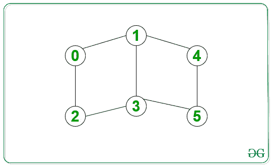

# 在无向图中打印给定源与目标之间的所有最短路径

> 原文： [https://www.geeksforgeeks.org/print-all-shortest-paths-between-given-source-and-destination-in-an-undirected-graph/](https://www.geeksforgeeks.org/print-all-shortest-paths-between-given-source-and-destination-in-an-undirected-graph/)

给定一个无向，不加权的图，并以两个节点作为**源**和**目标**，任务是打印给定源与目标之间最短长度的所有路径。

**示例**：

> **输入**：源= 0，目标= 5
> [](https://media.geeksforgeeks.org/wp-content/cdn-uploads/20200623032006/ShortestPathEx-1.jpg) 
> **输出**：
> 0-> 1-> 3-> 5
> 0-> 2-> 3-> 5
> 0-> 1-> 4-> 5
> **说明**：
> 上述所有路径的长度均为 3，这是 0 到 5 之间的最短距离。
> 
> **输入**：源= 0，目标= 4
> [](https://media.geeksforgeeks.org/wp-content/cdn-uploads/20200623032139/ShortestPathEx-2.jpg) 
> **输出**：
> 0-> 1-> 4

**方法**：对图形执行[广度优先遍历（BFS）](https://www.geeksforgeeks.org/breadth-first-search-or-bfs-for-a-graph/)。 步骤如下：

1.  从源顶点开始 BFS 遍历。
2.  在执行 BFS 时，存储到其他每个节点的最短距离，并为每个节点维护父向量。
3.  将源节点的父代设为**“ -1”** 。 对于每个节点，它将存储距离源节点最短距离的所有父节点。
4.  使用父数组恢复所有路径。 在任何时候，我们都会在路径数组中推送一个顶点，然后调用其所有父对象。
5.  如果在上述步骤中遇到“ -1”，则意味着已找到路径，并且可以将其存储在 paths 数组中。

下面是上述方法的实现：

```

// Cpp program for the above approach 
#include <bits/stdc++.h> 
using namespace std; 

// Function to form edge between 
// two vertices src and dest 
void add_edge(vector<int> adj[], 
              int src, int dest) 
{ 
    adj[src].push_back(dest); 
    adj[dest].push_back(src); 
} 

// Function which finds all the paths 
// and stores it in paths array 
void find_paths(vector<vector<int> >& paths, 
                vector<int>& path, 
                vector<int> parent[], 
                int n, int u) 
{ 
    // Base Case 
    if (u == -1) { 
        paths.push_back(path); 
        return; 
    } 

    // Loop for all the parents 
    // of the given vertex 
    for (int par : parent[u]) { 

        // Insert the current 
        // vertex in path 
        path.push_back(u); 

        // Recursive call for its parent 
        find_paths(paths, path, parent, 
                   n, par); 

        // Remove the current vertex 
        path.pop_back(); 
    } 
} 

// Function which performs bfs 
// from the given souce vertex 
void bfs(vector<int> adj[], 
         vector<int> parent[], 
         int n, int start) 
{ 
    // dist will contain shortest distance 
    // from start to every other vertex 
    vector<int> dist(n, INT_MAX); 

    queue<int> q; 

    // Insert source vertex in queue and make 
    // its parent -1 and distance 0 
    q.push(start); 
    parent[start] = { -1 }; 
    dist[start] = 0; 

    // Untill Queue is empty 
    while (!q.empty()) { 
        int u = q.front(); 
        q.pop(); 
        for (int v : adj[u]) { 
            if (dist[v] > dist[u] + 1) { 

                // A shorter distance is found 
                // So erase all the previous parents 
                // and insert new parent u in parent[v] 
                dist[v] = dist[u] + 1; 
                q.push(v); 
                parent[v].clear(); 
                parent[v].push_back(u); 
            } 
            else if (dist[v] == dist[u] + 1) { 

                // Another candidate parent for 
                // shortes path found 
                parent[v].push_back(u); 
            } 
        } 
    } 
} 

// Function which prints all the paths 
// from start to end 
void print_paths(vector<int> adj[], 
                 int n, int start, int end) 
{ 
    vector<vector<int> > paths; 
    vector<int> path; 
    vector<int> parent[n]; 

    // Function call to bfs 
    bfs(adj, parent, n, start); 

    // Function call to find_paths 
    find_paths(paths, path, parent, n, end); 

    for (auto v : paths) { 

        // Since paths contain each 
        // path in reverse order, 
        // so reverse it 
        reverse(v.begin(), v.end()); 

        // Print node for the current path 
        for (int u : v) 
            cout << u << " "; 
        cout << endl; 
    } 
} 

// Driver Code 
int main() 
{ 
    // Number of vertices 
    int n = 6; 

    // array of vectors is used 
    // to store the graph 
    // in the form of an adjacency list 
    vector<int> adj[n]; 

    // Given Graph 
    add_edge(adj, 0, 1); 
    add_edge(adj, 0, 2); 
    add_edge(adj, 1, 3); 
    add_edge(adj, 1, 4); 
    add_edge(adj, 2, 3); 
    add_edge(adj, 3, 5); 
    add_edge(adj, 4, 5); 

    // Given source and destination 
    int src = 0; 
    int dest = n - 1; 

    // Function Call 
    print_paths(adj, n, src, dest); 

    return 0; 
} 

```

**Output:**

```
0 1 3 5 
0 2 3 5 
0 1 4 5

```

**时间复杂度**：*O（V + E）*其中 V 是顶点数，E 是边数。
**辅助空间**：*O（V）*其中 V 是顶点数。

[](https://practice.geeksforgeeks.org/courses/competitive-programming-live?utm_source=geeksforgeeks&utm_medium=article&utm_campaign=gfg_article_cp)

* * *

* * *

如果您喜欢 GeeksforGeeks 并希望做出贡献，则还可以使用 [tribution.geeksforgeeks.org](https://contribute.geeksforgeeks.org/) 撰写文章，或将您的文章邮寄至 tribution@geeksforgeeks.org。 查看您的文章出现在 GeeksforGeeks 主页上，并帮助其他 Geeks。

如果您发现任何不正确的地方，请单击下面的“改进文章”按钮，以改进本文。