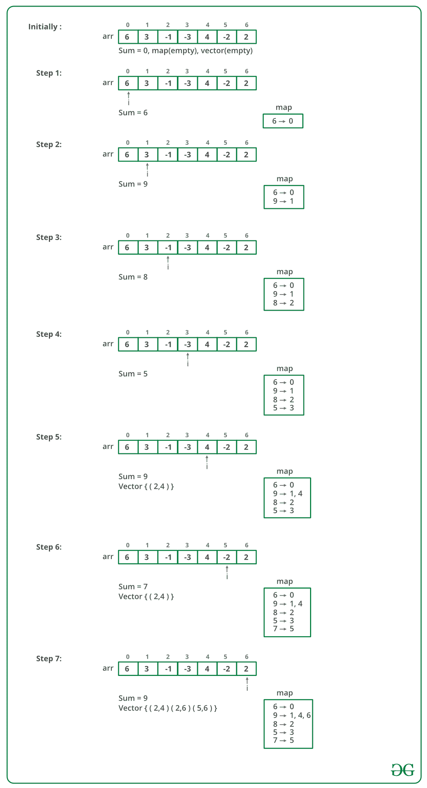

# 打印总和为 0 的所有子数组

> 原文：[https://www.geeksforgeeks.org/print-all-subarrays-with-0-sum/](https://www.geeksforgeeks.org/print-all-subarrays-with-0-sum/)

给定一个数组，打印该数组中所有总和为 0 的子数组。

**示例**：

```
Input:  arr = [6, 3, -1, -3, 4, -2, 2,
             4, 6, -12, -7]
Output:  
Subarray found from Index 2 to 4
Subarray found from Index 2 to 6          
Subarray found from Index 5 to 6
Subarray found from Index 6 to 9
Subarray found from Index 0 to 10

```

相关文章：[查找是否存在一个总和为 0 的子数组](https://www.geeksforgeeks.org/find-subarray-with-given-sum/)

一个简单的解决方案是一一考虑所有子数组，并检查每个子数组的总和是否等于 0。 该解决方案的复杂度为`O(N ^ 2)`。

更好的方法是使用哈希。

对数组中的每个元素执行以下操作

1.  保持到目前为止在变量中遇到的元素的总和（例如总和）。

2.  如果当前总和为 0，则找到一个从索引 0 开始到索引当前索引结束的子数组

3.  检查哈希表中是否存在当前总和。

4.  如果哈希表中已经存在当前总和，则表明该总和是某些子数组元素 arr [0]…arr [i]的总和，现在对于当前子数组 arr [0]获得相同的总和 …arr [j]表示子数组 arr [i + 1]…arr [j]的总和必须为 0。

5.  将当前总和插入哈希表

以下是上述方法的模拟：



下面是上述方法的实现：

## C++

```cpp

// C++ program to print all subarrays 
// in the array which has sum 0 
#include <bits/stdc++.h> 
using namespace std; 

// Function to print all subarrays in the array which 
// has sum 0 
vector< pair<int, int> > findSubArrays(int arr[], int n) 
{ 
    // create an empty map 
    unordered_map<int, vector<int> > map; 

    // create an empty vector of pairs to store 
    // subarray starting and ending index 
    vector <pair<int, int>> out; 

    // Maintains sum of elements so far 
    int sum = 0; 

    for (int i = 0; i < n; i++) 
    { 
        // add current element to sum 
        sum += arr[i]; 

        // if sum is 0, we found a subarray starting 
        // from index 0 and ending at index i 
        if (sum == 0) 
            out.push_back(make_pair(0, i)); 

        // If sum already exists in the map there exists 
        // at-least one subarray ending at index i with 
        // 0 sum 
        if (map.find(sum) != map.end()) 
        { 
            // map[sum] stores starting index of all subarrays 
            vector<int> vc = map[sum]; 
            for (auto it = vc.begin(); it != vc.end(); it++) 
                out.push_back(make_pair(*it + 1, i)); 
        } 

        // Important - no else 
        map[sum].push_back(i); 
    } 

    // return output vector 
    return out; 
} 

// Utility function to print all subarrays with sum 0 
void print(vector<pair<int, int>> out) 
{ 
    for (auto it = out.begin(); it != out.end(); it++) 
        cout << "Subarray found from Index " << 
            it->first << " to " << it->second << endl; 
} 

// Driver code 
int main() 
{ 
    int arr[] = {6, 3, -1, -3, 4, -2, 2, 4, 6, -12, -7}; 
    int n = sizeof(arr)/sizeof(arr[0]); 

    vector<pair<int, int> > out = findSubArrays(arr, n); 

    // if we didn’t find any subarray with 0 sum, 
    // then subarray doesn’t exists 
    if (out.size() == 0) 
        cout << "No subarray exists"; 
    else
        print(out); 

    return 0; 
} 

```

## Java

```java

// Java program to print all subarrays 
// in the array which has sum 0 
import java.io.*; 
import java.util.*; 

// User defined pair class 
class Pair  
{ 
    int first, second; 
    Pair(int a, int b)  
    { 
        first = a; 
        second = b; 
    } 
} 

public class GFG 
{ 
    // Function to print all subarrays in the array which  
    // has sum 0 
    static ArrayList<Pair> findSubArrays(int[] arr, int n) 
    { 
            // create an empty map  
            HashMap<Integer,ArrayList<Integer>> map = new HashMap<>(); 

            // create an empty vector of pairs to store  
            // subarray starting and ending index  
            ArrayList<Pair> out = new ArrayList<>(); 

            // Maintains sum of elements so far 
            int sum = 0; 

            for (int i = 0; i < n; i++)  
            { 
                // add current element to sum  
                sum += arr[i]; 

                // if sum is 0, we found a subarray starting  
                // from index 0 and ending at index i  
                if (sum == 0) 
                    out.add(new Pair(0, i)); 
                ArrayList<Integer> al = new ArrayList<>(); 

                // If sum already exists in the map there exists  
                // at-least one subarray ending at index i with  
                // 0 sum  
                if (map.containsKey(sum)) 
                { 
                    // map[sum] stores starting index of all subarrays 
                    al = map.get(sum); 
                    for (int it = 0; it < al.size(); it++) 
                    { 
                            out.add(new Pair(al.get(it) + 1, i));  
                    } 
                } 
                al.add(i); 
                map.put(sum, al); 
            } 
            return out; 
    }  

    // Utility function to print all subarrays with sum 0 
    static void print(ArrayList<Pair> out) 
    { 
            for (int i = 0; i < out.size(); i++) 
            { 
                Pair p = out.get(i); 
                System.out.println("Subarray found from Index "
                        + p.first + " to " + p.second);  
            } 
    } 

    // Driver code 
    public static void main(String args[]) 
    { 
            int[] arr = {6, 3, -1, -3, 4, -2, 2, 4, 6, -12, -7}; 
            int n = arr.length; 

            ArrayList<Pair> out = findSubArrays(arr, n); 

            // if we did not find any subarray with 0 sum,  
            // then subarray does not exists  
            if (out.size() == 0) 
                System.out.println("No subarray exists"); 
            else
                print(out); 
    } 
} 

// This code is contributed by rachana soma 

```

## Python3

```py

# Python3 program to print all subarrays 
# in the array which has sum 0 

# Function to get all subarrays 
# in the array which has sum 0 
def findSubArrays(arr,n): 

    # create a python dict 
    hashMap = {} 

    # create a python list  
    # equivalent to ArrayList 
    out = [] 

    # tracker for sum of elements 
    sum1 = 0
    for i in range(n): 

        # increment sum by element of array 
        sum1 += arr[i] 

        # if sum is 0, we found a subarray starting  
        # from index 0 and ending at index i 
        if sum1 == 0: 
            out.append((0, i)) 
        al = [] 

        # If sum already exists in the map  
        # there exists at-least one subarray  
        # ending at index i with 0 sum  
        if sum1 in hashMap: 

            # map[sum] stores starting index  
            # of all subarrays 
            al = hashMap.get(sum1) 
            for it in range(len(al)): 
                out.append((al[it] + 1, i)) 
        al.append(i) 
        hashMap[sum1] = al 
    return out 

# Utility function to print 
# all subarrays with sum 0  
def printOutput(output): 
    for i in output: 
        print ("Subarray found from Index " + 
                str(i[0]) + " to " + str(i[1])) 

# Driver Code 
if __name__ == '__main__': 
    arr = [6, 3, -1, -3, 4, -2,  
              2, 4, 6, -12, -7] 
    n = len(arr) 
    out = findSubArrays(arr, n) 

    # if we did not find any subarray with 0 sum,  
    # then subarray does not exists  
    if (len(out) == 0): 
        print ("No subarray exists") 
    else: 
        printOutput (out)  

# This code is contributed by Vikas Chitturi 

```

## C#

```cs

// C# program to print all subarrays 
// in the array which has sum 0 
using System; 
using System.Collections.Generic; 

// User defined pair class 
class Pair  
{ 
    public int first, second; 
    public Pair(int a, int b)  
    { 
        first = a; 
        second = b; 
    } 
} 

class GFG 
{ 
    // Function to print all subarrays  
    // in the array which has sum 0 
    static List<Pair> findSubArrays(int[] arr, int n) 
    { 
        // create an empty map  
        Dictionary<int, List<int>> map =  
                   new Dictionary<int, List<int>>(); 

        // create an empty vector of pairs to store  
        // subarray starting and ending index  
        List<Pair> outt = new List<Pair>(); 

        // Maintains sum of elements so far 
        int sum = 0; 

        for (int i = 0; i < n; i++)  
        { 
            // add current element to sum  
            sum += arr[i]; 

            // if sum is 0, we found a subarray starting  
            // from index 0 and ending at index i  
            if (sum == 0) 
                outt.Add(new Pair(0, i)); 
            List<int> al = new List<int>(); 

            // If sum already exists in the map there exists  
            // at-least one subarray ending at index i with  
            // 0 sum  
            if (map.ContainsKey(sum)) 
            { 
                // map[sum] stores starting index  
                // of all subarrays 
                al = map[sum]; 
                for (int it = 0; it < al.Count; it++) 
                { 
                    outt.Add(new Pair(al[it] + 1, i));  
                } 
            } 
            al.Add(i); 
            if(map.ContainsKey(sum)) 
                map[sum] = al; 
            else
                map.Add(sum, al); 
        } 
        return outt; 
    }  

    // Utility function to print all subarrays with sum 0 
    static void print(List<Pair> outt) 
    { 
        for (int i = 0; i < outt.Count; i++) 
        { 
            Pair p = outt[i]; 
            Console.WriteLine("Subarray found from Index " +  
                               p.first + " to " + p.second);  
        } 
    } 

    // Driver code 
    public static void Main(String []args) 
    { 
        int[] arr = {6, 3, -1, -3, 4, -2, 
                        2, 4, 6, -12, -7}; 
        int n = arr.Length; 

        List<Pair> outt = findSubArrays(arr, n); 

        // if we did not find any subarray with 0 sum,  
        // then subarray does not exists  
        if (outt.Count == 0) 
            Console.WriteLine("No subarray exists"); 
        else
            print(outt); 
    } 
} 

// This code is contributed by Rajput-Ji 

```

**输出**：

```
Subarray found from Index 2 to 4
Subarray found from Index 2 to 6
Subarray found from Index 5 to 6
Subarray found from Index 6 to 9
Subarray found from Index 0 to 10

```

本文由 **Aditya Goel** 提供。 如果您喜欢 GeeksforGeeks 并希望做出贡献，则还可以使用 [tribution.geeksforgeeks.org](http://www.contribute.geeksforgeeks.org) 撰写文章，或将您的文章邮寄至 tribution@geeksforgeeks.org。 查看您的文章出现在 GeeksforGeeks 主页上，并帮助其他 Geeks。

如果发现任何不正确的地方，或者想分享有关上述主题的更多信息，请写评论。

