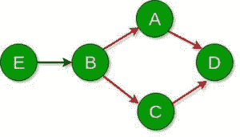

# 根据相关性最终打印完成的任务

> 原文： [https://www.geeksforgeeks.org/print-completed-tasks-at-end-according-to-dependencies/](https://www.geeksforgeeks.org/print-completed-tasks-at-end-according-to-dependencies/)

给定`N`依存关系，形式为 **X Y** ，其中 X & Y 代表两个不同的任务。 依赖关系 XY 表示形式为 **Y-> X** 的依赖关系，即，如果任务 Y 发生，则任务 X 将发生，换句话说，任务 Y 必须首先完成才能启动任务 X。 首先开始。 任务是按**词典顺序**打印将在最后完成的所有任务。 **注意**任务将仅由大写英文字母表示。

> **输入**：dep [] [] = {{A，B}，{C，B}，{D，A}，{D，C}，{B，E}}，任务[] = {B，C}
> **输出**：ABCD
> 任务 A 在任务 B 之后发生，而任务 D 只能在任务 A 或 C 完成之后发生
> 。
> 因此， 所需订单为 ABCD。
> 
> **输入**：dep [] [] = {{Q，P}，{S，Q}，{Q，R}}，task [] = {R}
> **输出：[** QRS

**方法**：[DFS](https://www.geeksforgeeks.org/depth-first-search-or-dfs-for-a-graph/) 可用于解决问题。 形式 **X Y（Y-> X）**的依存关系可以表示为图中节点`Y`到节点`X`的边。 从每个`M`个初始节点中启动 DFS，并使用布尔数组将遇到的节点标记为已访问。 最后，按字典顺序打印使用 DFS 覆盖的节点/任务。 该方法之所以有效，是因为 DFS 将以顺序的方式覆盖从初始节点开始的所有节点。

考虑下面的图，该图代表以上的第一个示例：

该图显示了 DFS 中初始任务 B 和 C 在 DFS 中覆盖的边缘，其颜色为
红色。 这样访问的节点是 A，B，C 和 D。

下面是上述方法的实现：

## C++

```cpp

// C++ implementation of the approach 
#include <cstring> 
#include <iostream> 
#include <vector> 
using namespace std; 

// Graph class represents a directed graph 
// using adjacency list representation 
class Graph { 

    // Number of vertices 
    int V; 

    // Pointer to an array containing 
    // adjacency lists 
    vector<int>* adj; 

    // Boolean array to mark tasks as visited 
    bool visited[26]; 

    // A recursive function used by DFS 
    void DFSUtil(int v); 

public: 
    // Constructor 
    Graph() 
    { 

        // There are only 26 English 
        // upper case letters 
        this->V = 26; 
        adj = new vector<int>[26]; 
    } 

    // Function to add an edge to the graph 
    void addEdge(char v, char w); 

    // DFS traversal of the vertices 
    // reachable from v 
    void DFS(char start[], int M); 

    void printTasks(); 
}; 

// Function to add an edge to the graph 
void Graph::addEdge(char v, char w) 
{ 

    // Add w to v's list 
    adj[v - 65].push_back(w - 65); 
} 

void Graph::DFSUtil(int v) 
{ 

    // Mark the current node as visited and 
    // print it 
    visited[v] = true; 

    // Recur for all the vertices adjacent 
    // to this vertex 
    vector<int>::iterator i; 
    for (i = adj[v].begin(); i != adj[v].end(); ++i) 
        if (!visited[*i]) 
            DFSUtil(*i); 
} 

// DFS traversal of the vertices reachable 
// from start nodes 
// It uses recursive DFSUtil() 
void Graph::DFS(char start[], int M) 
{ 
    // Mark all the vertices as not visited 
    for (int i = 0; i < V; i++) 
        visited[i] = false; 

    // Call the recursive helper function 
    // to print DFS traversal 
    for (int i = 0; i < M; i++) 
        DFSUtil(start[i] - 65); 
} 

// Helper function to print the tasks in 
// lexicographical order that are completed 
// at the end of the DFS 
void Graph::printTasks() 
{ 
    for (int i = 0; i < 26; i++) { 
        if (visited[i]) 
            cout << char(i + 65) << " "; 
    } 
    cout << endl; 
} 

// Driver code 
int main() 
{ 
    // Create the graph 
    Graph g; 
    g.addEdge('B', 'A'); 
    g.addEdge('B', 'C'); 
    g.addEdge('A', 'D'); 
    g.addEdge('C', 'D'); 
    g.addEdge('E', 'B'); 

    // Initial tasks to be run 
    char start[] = { 'B', 'C' }; 
    int n = sizeof(start) / sizeof(char); 

    // Start the dfs 
    g.DFS(start, n); 

    // Print the tasks that will get finished 
    g.printTasks(); 

    return 0; 
} 

```

## Python3

```

# Python3 implementation of the approach 
from collections import defaultdict  

# This class represents a directed graph  
# using adjacency list representation  
class Graph:  

    # Constructor  
    def __init__(self):  

        # Default dictionary to store the graph  
        self.graph = defaultdict(list)  
        self.visited = [False]*26

    # Function to add an edge to the graph  
    def addEdge(self, u, v):  
        self.graph[ord(u)-65].append(ord(v)-65)  

    # A function used by DFS  
    def DFSUtil(self, v):  

        # Mark the current node as visited  
        # and print it  
        self.visited[v]= True

        # Recur for all the vertices adjacent  
        # to this vertex  
        for i in self.graph[v]:  
            if self.visited[i] == False:  
                self.DFSUtil(i)  

    # Function to perform the DFS traversal  
    # It uses recursive DFSUtil()  
    def DFS(self, start, M):  

        # Total vertices  
        V = len(self.graph) 

        # Call the recursive helper function  
        # to print the DFS traversal starting  
        # from all vertices one by one  
        for i in range(M): 
            self.DFSUtil(ord(start[i])-65)  

    def printOrder(self): 
        for i in range(26): 
            if self.visited[i] == True: 
                print(chr(i + 65), end =" ") 
        print("\n") 

# Driver code  
g = Graph()  
g.addEdge('B', 'A')  
g.addEdge('B', 'C')  
g.addEdge('A', 'D')  
g.addEdge('C', 'D')  
g.addEdge('E', 'B')  

g.DFS(['B', 'C'], 2)  
g.printOrder() 

```

**Output:**

```
A B C D

```

**时间复杂度**：O（V + E），其中 V 是图形中节点的数量，E 是边或依存关系的数量。 在这种情况下，由于 V 始终为 26，因此在最坏的情况下，时间复杂度为 O（26 + E）或仅为 **O（E）**。
**空间复杂度**：O（V + E）


* * *

* * *

如果您喜欢 GeeksforGeeks 并希望做出贡献，则还可以使用 [tribution.geeksforgeeks.org](https://contribute.geeksforgeeks.org/) 撰写文章，或将您的文章邮寄至 tribution@geeksforgeeks.org。 查看您的文章出现在 GeeksforGeeks 主页上，并帮助其他 Geeks。

如果您发现任何不正确的地方，请单击下面的“改进文章”按钮，以改进本文。