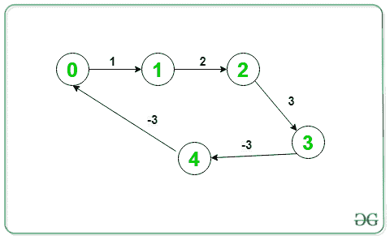

# 在有向图

中打印负重量周期

> 原文： [https://www.geeksforgeeks.org/print-negative-weight-cycle-in-a-directed-graph/](https://www.geeksforgeeks.org/print-negative-weight-cycle-in-a-directed-graph/)

给定一个由`V`顶点和`E`边组成的加权有向图。 任务是打印权重之和为负的[循环路径](https://www.geeksforgeeks.org/detect-cycle-in-a-graph/)。 如果不存在这样的路径，则打印**“ -1”** 。

> **输入**：V = 5，E = 5，下图是：
>  
> **输出**：1 2 3 4 1
> **说明**：
> 给定的图形包含一个负周期，（1- > 2- > 3- > 4- > 1）
> 
> **输入**：V = 5，E = 5，下图是：
>  
> **输出**：0 1 2 3 4 0
> **说明**：
> 给定的图形包含一个负周期，（0- > 1- > 2- > 3- > 4- > 0）

**方法**：想法是使用 [Bellman-Ford 算法](https://www.geeksforgeeks.org/bellman-ford-algorithm-dp-23/)，该算法用于[是否检测到负周期](https://www.geeksforgeeks.org/detect-negative-cycle-graph-bellman-ford/)。 要打印负周期，请执行 Bellman-Ford 的**第 N 次**迭代，并从该迭代中松弛的任何边中选取一个顶点。 使用此顶点及其祖先，可以打印负周期。 步骤如下：

*   执行 Bellman-Ford 算法的 **N-1** 次迭代，并放松每个边**（u，v）**。 跟踪每个顶点的父级，并将其存储在数组 **parent []** 中。
*   现在，再进行一次迭代，如果在此**第 N 次迭代**中没有发生边松弛，则图中不存在负权重的循环。
*   否则，取变量`C`并存储任意边**（u，v）**的顶点`v`，在第**次第**次迭代中将其放宽 。
*   现在，从`C`顶点开始向其祖先移动，直到找到一个循环并最终打印出来。
*   该周期将是负重量的期望周期。

下面是上述方法的实现：

## CPP

```

// C++ program for the above approach 
#include <bits/stdc++.h> 
using namespace std; 

// Structure to represent a weighted 
// edge in graph 
struct Edge { 
    int src, dest, weight; 
}; 

// Structure to represent a directed 
// and weighted graph 
struct Graph { 

    // V -> Number of vertices, 
    // E -> Number of edges 
    int V, E; 

    // Graph is represented as an 
    // array of edges 
    struct Edge* edge; 
}; 

// Creates a new graph with V vertices 
// and E edges 
struct Graph* createGraph(int V, int E) 
{ 
    struct Graph* graph = new Graph; 
    graph->V = V; 
    graph->E = E; 
    graph->edge = new Edge[graph->E]; 
    return graph; 
} 

// Function runs Bellman-Ford algorithm 
// and prints negative cycle(if present) 
void NegCycleBellmanFord(struct Graph* graph, 
                         int src) 
{ 
    int V = graph->V; 
    int E = graph->E; 
    int dist[V]; 
    int parent[V]; 

    // Initialize distances from src 
    // to all other vertices as INFINITE 
    // and all parent as -1 
    for (int i = 0; i < V; i++) { 

        dist[i] = INT_MAX; 
        parent[i] = -1; 
    } 
    dist[src] = 0; 

    // Relax all edges |V| - 1 times. 
    for (int i = 1; i <= V - 1; i++) { 
        for (int j = 0; j < E; j++) { 

            int u = graph->edge[j].src; 
            int v = graph->edge[j].dest; 
            int weight = graph->edge[j].weight; 

            if (dist[u] != INT_MAX 
                && dist[u] + weight < dist[v]) { 

                dist[v] = dist[u] + weight; 
                parent[v] = u; 
            } 
        } 
    } 

    // Check for negative-weight cycles 
    int C = -1; 
    for (int i = 0; i < E; i++) { 

        int u = graph->edge[i].src; 
        int v = graph->edge[i].dest; 
        int weight = graph->edge[i].weight; 

        if (dist[u] != INT_MAX 
            && dist[u] + weight < dist[v]) { 

            // Store one of the vertex of 
            // the negative weight cycle 
            C = v; 
            break; 
        } 
    } 

    if (C != -1) { 

        for (int i = 0; i < V; i++) 
            C = parent[C]; 

        // To store the cycle vertex 
        vector<int> cycle; 
        for (int v = C;; v = parent[v]) { 

            cycle.push_back(v); 
            if (v == C 
                && cycle.size() > 1) 
                break; 
        } 

        // Reverse cycle[] 
        reverse(cycle.begin(), cycle.end()); 

        // Printing the negative cycle 
        for (int v : cycle) 
            cout << v << ' '; 
        cout << endl; 
    } 
    else
        cout << "-1" << endl; 
} 

// Driver Code 
int main() 
{ 
    // Number of vertices in graph 
    int V = 5; 

    // Number of edges in graph 
    int E = 5; 

    struct Graph* graph = createGraph(V, E); 

    // Given Graph 
    graph->edge[0].src = 0; 
    graph->edge[0].dest = 1; 
    graph->edge[0].weight = 1; 

    graph->edge[1].src = 1; 
    graph->edge[1].dest = 2; 
    graph->edge[1].weight = 2; 

    graph->edge[2].src = 2; 
    graph->edge[2].dest = 3; 
    graph->edge[2].weight = 3; 

    graph->edge[3].src = 3; 
    graph->edge[3].dest = 4; 
    graph->edge[3].weight = -3; 

    graph->edge[4].src = 4; 
    graph->edge[4].dest = 1; 
    graph->edge[4].weight = -3; 

    // Function Call 
    NegCycleBellmanFord(graph, 0); 

    return 0; 
} 

```

**Output:**

```
1 2 3 4 1

```

**时间复杂度**：*O（V * E）*
**辅助空间**：*O（V）*


* * *

* * *

如果您喜欢 GeeksforGeeks 并希望做出贡献，则还可以使用 [tribution.geeksforgeeks.org](https://contribute.geeksforgeeks.org/) 撰写文章，或将您的文章邮寄至 tribution@geeksforgeeks.org。 查看您的文章出现在 GeeksforGeeks 主页上，并帮助其他 Geeks。

如果您发现任何不正确的地方，请单击下面的“改进文章”按钮，以改进本文。