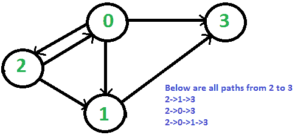

# 使用 BFS 打印从给定源到目标的所有路径。

> 原文： [https://www.geeksforgeeks.org/print-paths-given-source-destination-using-bfs/](https://www.geeksforgeeks.org/print-paths-given-source-destination-using-bfs/)

给定有向图，源顶点“ src”和目标顶点“ dst”，打印从给定“ src”到“ dst”的所有路径。

考虑以下有向图。 令 src 为 2，dst 为 3。从 2 到 3 共有 3 条不同的路径。



我们已经讨论过[使用 DFS](https://www.geeksforgeeks.org/find-paths-given-source-destination/) 打印从给定源到目标的所有路径。

以下是基于 BFS 的解决方案。

**算法**：

```
create a queue which will store path(s) of type vector
initialise the queue with first path starting from src

Now run a loop till queue is not empty
   get the frontmost path from queue
   check if the lastnode of this path is destination
       if true then print the path
   run a loop for all the vertices connected to the
   current vertex i.e. lastnode extracted from path
      if the vertex is not visited in current path
         a) create a new path from earlier path and 
             append this vertex
         b) insert this new path to queue

```

```

// CPP program to print all paths of source to 
// destination in given graph 
#include <bits/stdc++.h> 
using namespace std; 

// utility function for printing 
// the found path in graph 
void printpath(vector<int>& path) 
{ 
    int size = path.size(); 
    for (int i = 0; i < size; i++)  
        cout << path[i] << " ";     
    cout << endl; 
} 

// utility function to check if current 
// vertex is already present in path 
int isNotVisited(int x, vector<int>& path) 
{ 
    int size = path.size(); 
    for (int i = 0; i < size; i++)  
        if (path[i] == x)  
            return 0;  
    return 1; 
} 

// utility function for finding paths in graph 
// from source to destination 
void findpaths(vector<vector<int> >&g, int src,  
                                 int dst, int v) 
{ 
    // create a queue which stores 
    // the paths 
    queue<vector<int> > q; 

    // path vector to store the current path 
    vector<int> path; 
    path.push_back(src); 
    q.push(path); 
    while (!q.empty()) { 
        path = q.front(); 
        q.pop(); 
        int last = path[path.size() - 1]; 

        // if last vertex is the desired destination 
        // then print the path 
        if (last == dst)  
            printpath(path);         

        // traverse to all the nodes connected to  
        // current vertex and push new path to queue 
        for (int i = 0; i < g[last].size(); i++) { 
            if (isNotVisited(g[last][i], path)) { 
                vector<int> newpath(path); 
                newpath.push_back(g[last][i]); 
                q.push(newpath); 
            } 
        } 
    } 
} 

// driver program 
int main() 
{ 
    vector<vector<int> > g; 
    // number of vertices 
    int v = 4; 
    g.resize(4); 

    // construct a graph 
    g[0].push_back(3); 
    g[0].push_back(1); 
    g[0].push_back(2); 
    g[1].push_back(3); 
    g[2].push_back(0); 
    g[2].push_back(1); 

    int src = 2, dst = 3; 
    cout << "path from src " << src 
         << " to dst " << dst << " are \n"; 

    // function for finding the paths 
    findpaths(g, src, dst, v); 

    return 0; 
} 

```

输出：

```
path from src 2 to dst 3 are 
2 0 3 
2 1 3 
2 0 1 3

```

本文由 **[Mandeep Singh](https://github.com/msdeep14)** 贡献。 如果您喜欢 GeeksforGeeks 并希望做出贡献，则还可以使用 [tribution.geeksforgeeks.org](http://www.contribute.geeksforgeeks.org) 撰写文章，或将您的文章邮寄至 tribution@geeksforgeeks.org。 查看您的文章出现在 GeeksforGeeks 主页上，并帮助其他 Geeks。

如果发现任何不正确的地方，或者想分享有关上述主题的更多信息，请写评论。

