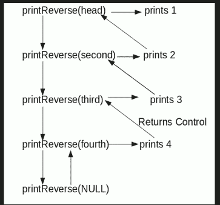

# 反向打印链接列表，而不实际反转

给定一个链表，使用递归函数反向打印。 例如，如果给定的链表为 1-> 2-> 3-> 4，则输出应为 4-> 3-> 2-> 1。

注意，问题仅在于打印反面。 要反转列表本身，请参阅[，](https://www.geeksforgeeks.org/reverse-a-linked-list/)，

**难度级别：**新秀



**算法**

```
printReverse(head)
  1\. call print reverse for head->next
  2\. print head->data

```

**实施：**

## C++

```cpp

// C++ program to print reverse of a linked list  
#include <bits/stdc++.h> 
using namespace std; 

/* Link list node */
class Node  
{  
    public: 
    int data;  
    Node* next;  
};  

/* Function to reverse the linked list */
void printReverse(Node* head)  
{  
    // Base case  
    if (head == NULL)  
    return;  

    // print the list after head node  
    printReverse(head->next);  

    // After everything else is printed, print head  
    cout << head->data << " ";  
}  

/*UTILITY FUNCTIONS*/
/* Push a node to linked list. Note that this function  
changes the head */
void push(Node** head_ref, char new_data)  
{  
    /* allocate node */
    Node* new_node = new Node(); 

    /* put in the data */
    new_node->data = new_data;  

    /* link the old list off the new node */
    new_node->next = (*head_ref);  

    /* move the head to pochar to the new node */
    (*head_ref) = new_node;  
}  

/* Driver code*/
int main()  
{  
    // Let us create linked list 1->2->3->4  
    Node* head = NULL;  
    push(&head, 4);  
    push(&head, 3);  
    push(&head, 2);  
    push(&head, 1);  

    printReverse(head);  
    return 0;  
}  

// This code is contributed by rathbhupendra 

```

## C

```c

// C program to print reverse of a linked list 
#include<stdio.h> 
#include<stdlib.h> 

/* Link list node */
struct Node 
{ 
    int data; 
    struct Node* next; 
}; 

/* Function to reverse the linked list */
void printReverse(struct Node* head) 
{ 
    // Base case   
    if (head == NULL) 
       return; 

    // print the list after head node 
    printReverse(head->next); 

    // After everything else is printed, print head 
    printf("%d  ", head->data); 
} 

/*UTILITY FUNCTIONS*/
/* Push a node to linked list. Note that this function 
  changes the head */
void push(struct Node** head_ref, char new_data) 
{ 
    /* allocate node */
    struct Node* new_node = 
            (struct Node*) malloc(sizeof(struct Node)); 

    /* put in the data  */
    new_node->data  = new_data; 

    /* link the old list off the new node */
    new_node->next = (*head_ref);    

    /* move the head to pochar to the new node */
    (*head_ref)    = new_node; 
}  

/* Driver program to test above function*/
int main() 
{ 
    // Let us create linked list 1->2->3->4 
    struct Node* head = NULL;     
    push(&head, 4); 
    push(&head, 3); 
    push(&head, 2); 
    push(&head, 1); 

    printReverse(head); 
    return 0; 
} 

```

## Java

```java

// Java program to print reverse of a linked list 
class LinkedList 
{ 
    Node head;  // head of list 

    /* Linked list Node*/
    class Node 
    { 
        int data; 
        Node next; 
        Node(int d) {data = d; next = null; } 
    } 

    /* Function to print reverse of linked list */
    void printReverse(Node head) 
    { 
        if (head == null) return; 

        // print list of head node 
        printReverse(head.next); 

        // After everything else is printed 
        System.out.print(head.data+" "); 
    } 

    /* Utility Functions */

    /* Inserts a new Node at front of the list. */
    public void push(int new_data) 
    { 
        /* 1 & 2: Allocate the Node & 
                  Put in the data*/
        Node new_node = new Node(new_data); 

        /* 3\. Make next of new Node as head */
        new_node.next = head; 

        /* 4\. Move the head to point to new Node */
        head = new_node; 
    } 

    /*Driver function to test the above methods*/
    public static void main(String args[]) 
    { 
        // Let us create linked list 1->2->3->4 
        LinkedList llist = new LinkedList(); 
        llist.push(4); 
        llist.push(3); 
        llist.push(2); 
        llist.push(1); 

        llist.printReverse(llist.head); 
    } 
} 
/* This code is contributed by Rajat Mishra */

```

## Python3

```py

# Python3 program to print reverse 
# of a linked list  

# Node class  
class Node:  

    # Constructor to initialize 
    # the node object  
    def __init__(self, data):  

        self.data = data  
        self.next = None

class LinkedList:  

    # Function to initialize head  
    def __init__(self):  
        self.head = None

    # Recursive function to print  
    # linked list in reverse order 
    def printrev(self, temp): 

        if temp: 
            self.printrev(temp.next) 
            print(temp.data, end = ' ') 
        else: 
            return

    # Function to insert a new node  
    # at the beginning  
    def push(self, new_data):  

        new_node = Node(new_data)  
        new_node.next = self.head  
        self.head = new_node  

# Driver code 
llist = LinkedList()  

llist.push(4)  
llist.push(3)  
llist.push(2)  
llist.push(1)  

llist.printrev(llist.head) 

# This code is contributed by Vinay Kumar(vinaykumar71) 

```

## C#

```cs

// C# program to print reverse of a linked list 
using System; 

public class LinkedList 
{ 
    Node head; // head of list 

    /* Linked list Node*/
    class Node 
    { 
        public int data; 
        public Node next; 
        public Node(int d)  
        { 
            data = d; next = null; 
        } 
    } 

    /* Function to print reverse of linked list */
    void printReverse(Node head) 
    { 
        if (head == null) return; 

        // print list of head node 
        printReverse(head.next); 

        // After everything else is printed 
        Console.Write(head.data + " "); 
    } 

    /* Utility Functions */

    /* Inserts a new Node at front of the list. */
    public void push(int new_data) 
    { 
        /* 1 & 2: Allocate the Node & 
                Put in the data*/
        Node new_node = new Node(new_data); 

        /* 3\. Make next of new Node as head */
        new_node.next = head; 

        /* 4\. Move the head to point to new Node */
        head = new_node; 
    } 

    /*Driver function to test the above methods*/
    public static void Main(String []args) 
    { 
        // Let us create linked list 1->2->3->4 
        LinkedList llist = new LinkedList(); 
        llist.push(4); 
        llist.push(3); 
        llist.push(2); 
        llist.push(1); 

        llist.printReverse(llist.head); 
    } 
} 

// This code has been contributed by Rajput-Ji  

```

**输出：**

```
4 3 2 1

```

**时间复杂度：**`O(n)`

如果发现不正确的内容，或者想分享有关上述主题的更多信息，请写评论。

