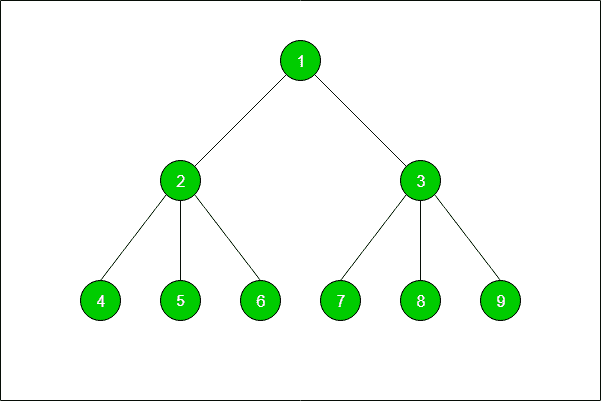

# 打印树的任意两个节点之间的路径| DFS

> 原文： [https://www.geeksforgeeks.org/print-the-path-between-any-two-nodes-of-a-tree-dfs/](https://www.geeksforgeeks.org/print-the-path-between-any-two-nodes-of-a-tree-dfs/)

给定一棵具有 **N-1** 个边缘的节点`N`和一对节点`P`的树。 任务是使用 [DFS](http://www.geeksforgeeks.org/depth-first-traversal-for-a-graph/) 查找并打印树的两个给定节点之间的路径。

```
Input: N = 10
          1
       /    \
      2      3
    / | \  / | \
   4  5 6  7 8  9
Pair = {4, 8}
Output: 4 -> 2 -> 1 -> 3 -> 8

Input: N = 3
      1
     /  \
    2    3
Pair = {2, 3}
Output:  2 -> 1 -> 3

```



**例如，上面树中的**在节点`5`和`3`之间的路径是 **5-> 2-> 1-> 3** 。
节点`4`和`8`之间的路径是 **4-> 2-> 1-> 3-> 8** 。

**方法**：

*   想法是从源节点运行 [DFS](http://www.geeksforgeeks.org/depth-first-traversal-for-a-graph/) ，并将遍历的节点推入[堆栈](http://www.geeksforgeeks.org/stack-data-structure/)，直到遍历目标节点。
*   每当发生[回溯](http://wstackww.geeksforgeeks.org/backtracking-algorithms/)时，就从堆栈中弹出节点。

**注意**：在给定的节点对之间应该有一条路径。

下面是上述方法的实现：

## C++

```cpp

// C++ implementation 
#include <bits/stdc++.h> 
using namespace std; 

// An utility function to add an edge in an 
// undirected graph. 
void addEdge(vector<int> v[], 
             int x, 
             int y) 
{ 
    v[x].push_back(y); 
    v[y].push_back(x); 
} 

// A function to print the path between 
// the given pair of nodes. 
void printPath(vector<int> stack) 
{ 
    int i; 
    for (i = 0; i < (int)stack.size() - 1; 
         i++) { 
        cout << stack[i] << " -> "; 
    } 
    cout << stack[i]; 
} 

// An utility function to do 
// DFS of graph recursively 
// from a given vertex x. 
void DFS(vector<int> v[], 
         bool vis[], 
         int x, 
         int y, 
         vector<int> stack) 
{ 
    stack.push_back(x); 
    if (x == y) { 

        // print the path and return on 
        // reaching the destination node 
        printPath(stack); 
        return; 
    } 
    vis[x] = true; 

    // if backtracking is taking place 
    if (!v[x].empty()) { 
        for (int j = 0; j < v[x].size(); j++) { 
            // if the node is not visited 
            if (vis[v[x][j]] == false) 
                DFS(v, vis, v[x][j], y, stack); 
        } 
    } 

    stack.pop_back(); 
} 

// A utility function to initialise 
// visited for the node and call 
// DFS function for a given vertex x. 
void DFSCall(int x, 
             int y, 
             vector<int> v[], 
             int n, 
             vector<int> stack) 
{ 
    // visited array 
    bool vis[n + 1]; 

    memset(vis, false, sizeof(vis)); 

    // DFS function call 
    DFS(v, vis, x, y, stack); 
} 

// Driver Code 
int main() 
{ 
    int n = 10; 
    vector<int> v[n], stack; 

    // Vertex numbers should be from 1 to 9\. 
    addEdge(v, 1, 2); 
    addEdge(v, 1, 3); 
    addEdge(v, 2, 4); 
    addEdge(v, 2, 5); 
    addEdge(v, 2, 6); 
    addEdge(v, 3, 7); 
    addEdge(v, 3, 8); 
    addEdge(v, 3, 9); 

    // Function Call 
    DFSCall(4, 8, v, n, stack); 

    return 0; 
} 

```