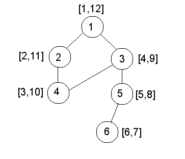

# 在图表的[DFS]中打印访问前和访问后的时间

> 原文： [https://www.geeksforgeeks.org/printing-pre-and-post-visited-times-in-dfs-of-a-graph/](https://www.geeksforgeeks.org/printing-pre-and-post-visited-times-in-dfs-of-a-graph/)

[深度优先搜索](https://www.geeksforgeeks.org/depth-first-search-or-dfs-for-a-graph/)（DFS）将图形的所有顶点标记为已访问。 因此，为了使 DFS 有用，还可以存储一些其他信息。 例如，运行 DFS 时顶点的访问顺序。

访问前和访问后号码是在图形上运行 DFS 时可以存储的额外信息，这些信息实际上非常有用。 访问前编号指示节点进入递归堆栈的时间，访问后编号指示节点从 DFS 递归堆栈中出来的时间。

**示例**：



括号内的数字表示[访问前编号，访问后编号]。

> **Pre** 和 **Post** 数字广泛用于**图算法**。 例如，它们可以用于找出特定的**节点是否位于另一个节点**的子树中。
> 要确定`u`是否位于`v`的**子树**中，我们只是比较 u 和 v 的前后编号。 **pre [u] > pre [v]** 和 **post [u] < post [v]** 之后，`u`位于[`v`否则为否。 您可以查看上面的示例以获取更多说明。

可以通过简单的 DFS 来找到访问前和访问后的号码。 我们将采用两个数组，一个用于存储前序号，另一个用于存储后序号，并采用一个可跟踪时间的变量。 相同的实现如下：

## Java

```java

import java.util.*;
public class GFG {

    // Variable to keep track of time
    static int time = 1;

    // Function to perform DFS starting from node u
    static void dfs(int u, ArrayList<ArrayList<Integer> > aList,
                    int pre[], int post[], int vis[])
    {

        // Storing the pre number whenever
        // the node comes into recursion stack
        pre[u] = time;

        // Increment time
        time++;
        vis[u] = 1;
        for (int v : aList.get(u)) {
            if (vis[v] == 0)
                dfs(v, aList, pre, post, vis);
        }

        // Storing the post number whenever
        // the node goes out of recursion stack
        post[u] = time;
        time++;
    }

    // Driver code
    public static void main(String args[])
    {

        // Number of nodes in graph
        int n = 6;

        // Adjacency list
        ArrayList<ArrayList<Integer> > aList
            = new ArrayList<ArrayList<Integer> >(n + 1);
        for (int i = 1; i <= n; i++) {
            ArrayList<Integer> list = new ArrayList<>();
            aList.add(list);
        }
        aList.add(new ArrayList<Integer>());
        int pre[] = new int[n + 1];
        int post[] = new int[n + 1];

        // Visited array
        int vis[] = new int[n + 1];

        // Edges
        aList.get(1).add(2);
        aList.get(2).add(1);
        aList.get(2).add(4);
        aList.get(4).add(2);
        aList.get(1).add(3);
        aList.get(3).add(1);
        aList.get(3).add(4);
        aList.get(4).add(3);
        aList.get(3).add(5);
        aList.get(5).add(3);
        aList.get(5).add(6);
        aList.get(6).add(5);

        // DFS starting at Node 1
        dfs(1, aList, pre, post, vis);

        // Number of nodes in graph
        for (int i = 1; i <= n; i++)
            System.out.println("Node " + i + " Pre number "
                               + pre[i] + " Post number " + post[i]);
    }
}

```

## Python

```py

# Variable to keep track of time 
time = 1

# Function to perform DFS starting 
# from node u 
def dfs(u, aList, pre, post, vis):

    global time

    # Storing the pre number whenever 
    # the node comes into recursion stack 
    pre[u] = time

    # Increment time 
    time += 1

    vis[u] = 1

    for v in aList[u]:
        if (vis[v] == 0):
            dfs(v, aList, pre, post, vis)

    # Storing the post number whenever 
    # the node goes out of recursion stack 
    post[u] = time
    time += 1

# Driver code 
if __name__=='__main__':

    # Number of nodes in graph 
    n = 6

    # Adjacency list 
    aList = [[] for i in range(n + 1)]

    pre = [0 for i in range(n + 1)]
    post = [0 for i in range(n + 1)]

    # Visited array 
    vis = [0 for i in range(n + 1)]

    # Edges 
    aList[1].append(2)
    aList[2].append(1) 
    aList[2].append(4) 
    aList[4].append(2) 
    aList[1].append(3) 
    aList[3].append(1) 
    aList[3].append(4) 
    aList[4].append(3) 
    aList[3].append(5) 
    aList[5].append(3) 
    aList[5].append(6)
    aList[6].append(5) 

    # DFS starting at Node 1 
    dfs(1, aList, pre, post, vis)

    # Number of nodes in graph 
    for i in range(1, n + 1):
        print("Node " + str(i) +
              " Pre number " + str(pre[i]) +
              " Post number " + str(post[i]))

# This code is contributed by rutvik_56

```

**Output:** 

```
Node 1 Pre number 1 Post number 12
Node 2 Pre number 2 Post number 11
Node 3 Pre number 4 Post number 9
Node 4 Pre number 3 Post number 10
Node 5 Pre number 5 Post number 8
Node 6 Pre number 6 Post number 7
```


* * *

* * *

如果您喜欢 GeeksforGeeks 并希望做出贡献，则还可以使用 [tribution.geeksforgeeks.org](https://contribute.geeksforgeeks.org/) 撰写文章，或将您的文章邮寄至 tribution@geeksforgeeks.org。 查看您的文章出现在 GeeksforGeeks 主页上，并帮助其他 Geeks。

如果您发现任何不正确的地方，请单击下面的“改进文章”按钮，以改进本文。