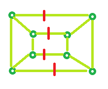

# 程序，用于计算图形的边缘覆盖率

> 原文： [https://www.geeksforgeeks.org/program-to-calculate-the-edge-cover-of-a-graph/](https://www.geeksforgeeks.org/program-to-calculate-the-edge-cover-of-a-graph/)

给定图的顶点数 N。 任务是确定边缘盖。

**边缘覆盖**：覆盖所有顶点所需的最小边缘数称为边缘覆盖。

**示例**：

```
Input : N = 5
Output : 3

Input : N = 4
Output : 2

```

**示例 1**：对于 N = 5 个顶点，


边缘覆盖为：3（选择红色标记的边缘，所有顶点将被覆盖）


**示例 2**：对于 N = 8 个顶点，


边缘覆盖为：4（选择红色标记的边缘，所有顶点将被覆盖）


**公式**：

```
Edge Cover = ceil (no. of vertices / 2)

```

下面是上述方法的实现：

## C++

```cpp

// C++ program to find Edge Cover 
#include <bits/stdc++.h> 
using namespace std; 

// Function that calculates Edge Cover 
int edgeCover(int n) 
{ 
    float result = 0; 

    result = ceil(n / 2.0); 

    return result; 
} 

// Driver Code 
int main() 
{ 
    int n = 5; 

    cout << edgeCover(n); 

    return 0; 
} 

```