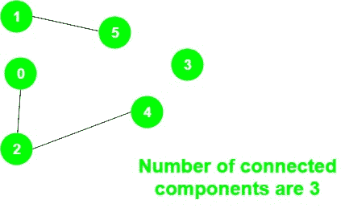

# 程序，用于计算无向图

中已连接组件的数量

> 原文： [https://www.geeksforgeeks.org/program-to-count-number-of-connected-components-in-an-undirected-graph/](https://www.geeksforgeeks.org/program-to-count-number-of-connected-components-in-an-undirected-graph/)

给定无向图`g`，任务是打印图中的连接组件数。

**示例**：

> **输入**：
> 
> 
> 
> **输出**：3
> 连接了三个组件：
> 1 – 5、0 – 2 – 4 和 3

**方法**：的想法是使用变量**计数**存储连接的组件数，并执行以下步骤：

1.  将所有顶点初始化为未访问。
2.  对于所有顶点，检查是否尚未访问顶点，然后在该顶点上执行 DFS，并将变量**计数**递增 1。

下面是上述方法的实现：

## C ++

```

// C++ program for above approach
#include <bits/stdc++.h>
using namespace std;

// Graph class represents a undirected graph
// using adjacency list representation
class Graph {
    // No. of vertices
    int V;

    // Pointer to an array containing adjacency lists
    list<int>* adj;

    // A function used by DFS
    void DFSUtil(int v, bool visited[]);

public:
    // Constructor
    Graph(int V);

    void addEdge(int v, int w);
    int NumberOfconnectedComponents();
};

// Function to return the number of
// connected components in an undirected graph
int Graph::NumberOfconnectedComponents()
{

    // Mark all the vertices as not visited
    bool* visited = new bool[V];

    // To store the number of connected components
    int count = 0;
    for (int v = 0; v < V; v++)
        visited[v] = false;

    for (int v = 0; v < V; v++) {
        if (visited[v] == false) {
            DFSUtil(v, visited);
            count += 1;
        }
    }

    return count;
}

void Graph::DFSUtil(int v, bool visited[])
{

    // Mark the current node as visited
    visited[v] = true;

    // Recur for all the vertices
    // adjacent to this vertex
    list<int>::iterator i;

    for (i = adj[v].begin(); i != adj[v].end(); ++i)
        if (!visited[*i])
            DFSUtil(*i, visited);
}

Graph::Graph(int V)
{
    this->V = V;
    adj = new list<int>[V];
}

// Add an undirected edge
void Graph::addEdge(int v, int w)
{
    adj[v].push_back(w);
    adj[w].push_back(v);
}

// Driver code
int main()
{
    Graph g(5);
    g.addEdge(1, 0);
    g.addEdge(2, 3);
    g.addEdge(3, 4);

    cout << g.NumberOfconnectedComponents();

    return 0;
}

```

## 爪哇

```

// Java program for above approach
import java.io.*;
import java.util.*;

public class ConnectedComponentCount
{

    private int v;
    private int e;
    private Map<Integer, 
                HashSet<Integer>> adjMap;
    private static Map<Integer, 
                       Integer> visited;

    ConnectedComponentCount(int vertices)
    {
        v = vertices;
        adjMap = new HashMap<Integer, 
                        HashSet<Integer>>(); 
        visited = new HashMap<Integer, 
                                  Integer>();
    }

    // Function to add edges
    private void addEdge(int s, int d)
    {
        adjMap.putIfAbsent(s, 
                     new HashSet<Integer>());
        adjMap.putIfAbsent(d, 
                     new HashSet<Integer>());
        adjMap.get(s).add(d);
        adjMap.get(s).add(s);
        adjMap.get(d).add(s);
        adjMap.get(d).add(d);
        visited.put(s, 0);
        visited.put(d, 0);
    }

    // To mark vertices which can be visites
    private void findDFS(int vertex)
    {

        // Mark as visited
        visited.put(vertex,1);

        // Print the vertex
        System.out.println("vertex " + vertex + 
                                   " visited");
        for(Integer child : adjMap.get(vertex))
        {
            if(visited.get(child) == 0){
               findDFS(child);
            }
        }
    }

    // Function to print graph
    private void printGraph()
    {
        for(HashSet<Integer> v : 
                          adjMap.values())
        {
            System.out.println(v.toString());
        }
    }

    // Driver Code
    public static void main(String args[])
    {

        Scanner sc = new Scanner(System.in);
        System.out.println("Enter the number 
                           of vertices (V): ");
        int vertices = sc.nextInt();

        System.out.println("Enter the number 
                                of edges (E): ");
        int edges = sc.nextInt();

        // To count total number of
        // components
        int ccCount = 0;

        ConnectedComponentCount ccc = 
                 new ConnectedComponentCount(
                                      vertices);

        // Input of edges
        while (edges > 0)
        {
            System.out.println("Enter the 
                                nodes s & d: ");
            int s = sc.nextInt();
            int d = sc.nextInt();
            ccc.addEdge(s,d);
            edges-- ;
        }

        // Function to print graph                      
        ccc.printGraph();

        // Traversing every node 
        for(Integer vertex : visited.keySet())
        {

            // Check if vertex is already
            // visited  or not
            if(visited.get(vertex) == 0)
            {

                // Function Call for findDFS
                ccc.findDFS(vertex);

                // Print Component Found
                System.out.println("CC Found");

                // Increase the counter
                ccCount++;
            }
        }

        // Print number of components                        
        System.out.println("Number of cc component: "
                                        + ccCount);
    }
}

//The code is contributed by Alfred Skaria

```

## Python3

```

# Python3 program for above approach

# Graph class represents a undirected graph
# using adjacency list representation
class Graph:

    def __init__(self, V):

        # No. of vertices
        self.V = V

        # Pointer to an array containing
        # adjacency lists
        self.adj = [[] for i in range(self.V)]

    # Function to return the number of
    # connected components in an undirected graph
    def NumberOfconnectedComponents(self):

        # Mark all the vertices as not visited
        visited = [False for i in range(self.V)]

        # To store the number of connected 
        # components
        count = 0

        for v in range(self.V):
            if (visited[v] == False):
                self.DFSUtil(v, visited)
                count += 1

        return count

    def DFSUtil(self, v, visited):

        # Mark the current node as visited
        visited[v] = True

        # Recur for all the vertices
        # adjacent to this vertex
        for i in self.adj[v]:
            if (not visited[i]):
                self.DFSUtil(i, visited)

    # Add an undirected edge
    def addEdge(self, v, w):

        self.adj[v].append(w)
        self.adj[w].append(v)

# Driver code        
if __name__=='__main__':

    g = Graph(5)
    g.addEdge(1, 0)
    g.addEdge(2, 3)
    g.addEdge(3, 4)

    print(g.NumberOfconnectedComponents())

# This code is contributed by rutvik_56

```

**Output**

```
2
```


* * *

* * *

如果您喜欢 GeeksforGeeks 并希望做出贡献，则还可以使用 [tribution.geeksforgeeks.org](https://contribute.geeksforgeeks.org/) 撰写文章，或将您的文章邮寄至 tribution@geeksforgeeks.org。 查看您的文章出现在 GeeksforGeeks 主页上，并帮助其他 Geeks。

如果您发现任何不正确的地方，请单击下面的“改进文章”按钮，以改进本文。