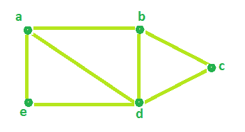

# 程序，用于查找无向图

的电路等级

> 原文： [https://www.geeksforgeeks.org/program-to-find-circuit-rank-of-an-undirected-graph/](https://www.geeksforgeeks.org/program-to-find-circuit-rank-of-an-undirected-graph/)

给定顶点数量和无向图的边数量。 任务是确定电路等级。

**电路等级**：无向图的电路等级定义为必须从图形中移除以中断其所有循环，将其转换为树木或森林的最小边数。

**范例**：

```
Input : Edges = 7 , Vertices = 5
Output : Circuit rank = 3

Input : Edges = 7 , Vertices = 6
Output : Circuit rank = 2

```

**公式**：

```
Circuit rank = Edges - (Vertices - 1)

```

看下面的示例图，



边总数= 7，顶点= 5。

根据以上公式，

```
Circuit Rank =  Edges - (Vertices - 1)
             =  7 - (5 - 1)
             = 3

```

因此，上图的电路等级= 3。

在下图中可以看到，通过从上图中删除 3 个边（a-d，a-e，c-d），可以删除所有循环。


下面是上述方法的实现：

## C++

```cpp

// C++ Program to find Circuit Rank of an Undirected Graph 
#include <bits/stdc++.h> 
using namespace std; 

// Function that calculates the 
// Circuit rank of the Graph. 
int Rank(int Edges, int Vertices) 
{ 
    int result = 0; 

    // calculates Circuit Rank 
    result = Edges - Vertices + 1; 

    return result; 
} 

// Driver Code 
int main() 
{ 
    int Edges = 7, Vertices = 5; 

    cout << "Circuit Rank = " << Rank(Edges, Vertices); 

    return 0; 
} 

```