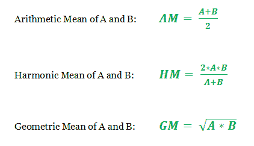

# 使用 STL 检查数组中是否存在两个数字及其 AM 和 HM

> 原文：[https://www.geeksforgeeks.org/program-to-find-if-two-numbers-and-their-am-and-hm-are-present-in-an-array-using-stl/](https://www.geeksforgeeks.org/program-to-find-if-two-numbers-and-their-am-and-hm-are-present-in-an-array-using-stl/)

给定一个数字数组和两个值`A`和`B`，任务是检查以下条件：

1.  数组中是否存在两个数字。

2.  如果是，则它们的算术平均值和谐波平均值也存在或不存在于同一数组中。

3.  如果满足所有条件，则打印两个数字的几何平均值。

各个数字的均值可以表示为：



**示例**：

> **输入**：`arr[] = {1.0, 2.0, 2.5, 3.0, 4.0, 4.5, 5.0, 6.0}, A = 3, B = 6`
> **输出**：`GM = 4.24`
> **说明**：
> 数组中存在`A = 3`，`B = 6`。
> 数组中还存在`AM = 4.5`，`HM = 4`。
> 因此，`GM = 4.24`。
> 
> **输入**：`arr = {1.0, 2.0, 2.5, 3.0, 4.0, 4.5, 5.0, 6.0}, A = 4, B = 6`
> **输出**：`"AM and HM not found"`

**方法**：

*   这个想法是使用**散列**，通过该散列，我们可以将数组元素简单地存储在哈希容器中，并使用固定时间`O(1)`操作来查找和跟踪数字及其均值 。 最后，如果通过满足简单关系`AM * HM = GM ^ 2`来满足所有条件，则计算几何平均值。

*   上述方法的分步实现如下：

    1.  定义了一个哈希容器来存储数组元素。

    2.  根据该公式计算算术和谐波均值。

    3.  简单的条件语句用于在恒定时间内查找哈希容器中的元素。

    4.  在满足所有条件的前提下，根据上述关系式计算出 GM。

下面是上述方法的实现：

## C++

```cpp

// C++ program to check if two numbers  
// are present in an array then their 
// AM and HM are also present. Finally, 
// find the GM of the numbers 
#include <bits/stdc++.h> 
using namespace std; 

// Function to find the Arithmetic Mean  
// of 2 numbers 
float ArithmeticMean(float A, float B) 
{ 
    return (A + B) / 2; 
} 

// Function to find the Harmonic Mean 
// of 2 numbers 
float HarmonicMean(float A, float B) 
{ 
    return (2 * A * B) / (A + B); 
} 

// Following function checks and computes the 
// desired results based on the means 
void CheckArithmeticHarmonic(float arr[], 
                             float A,  
                             float B, int N) 
{ 

    // Calculate means  
    float AM = ArithmeticMean(A, B); 
    float HM = HarmonicMean(A, B); 

    // Hash container (Set) to store elements 
    unordered_set<float> Hash; 

    // Insertion of array elements in the Set 
    for (int i = 0; i < N; i++) 
    { 
        Hash.insert(arr[i]); 
    } 

    // Conditionals to check if numbers 
    // are present in array by Hashing 
    if (Hash.find(A) != Hash.end() 
        && Hash.find(B) != Hash.end()) { 

        // Conditionals to check if the AM and HM 
        // of the numbers are present in array 
        if (Hash.find(AM) != Hash.end() 
            && Hash.find(HM) != Hash.end()) { 

            // If all conditions are satisfied, 
            // the Geometric Mean is calculated 
            cout << "GM = "; 
            printf("%0.2f", sqrt(AM * HM)); 
        } 
        else
        { 
            // If numbers are found but the  
            // respective AM and HM are not 
            // found in the array 
            cout << "AM and HM not found"; 
        } 
    } 
    else
    { 
        // If none of the conditions are satisfied 
        cout << "Numbers not found"; 
    } 
} 

int main() 
{ 

    float arr[] = {1.0, 2.0, 2.5, 3.0, 4.0, 
                   4.5, 5.0, 6.0}; 

    int N = sizeof(arr)/sizeof(arr[0]); 
    float A = 3.0; 
    float B = 6.0; 
    CheckArithmeticHarmonic(arr, A, B, N); 
    return 0; 
} 

```

## Java

```java

// Java program to check if two numbers  
// are present in an array then their  
// AM and HM are also present. Finally,  
// find the GM of the numbers  
import java.util.*;  

class GFG{ 

// Function to find the Arithmetic Mean  
// of 2 numbers  
static Double ArithmeticMean(Double A, Double B)  
{  
    return (A + B) / 2;  
}  

// Function to find the Harmonic Mean  
// of 2 numbers  
static Double HarmonicMean(Double A, Double B)  
{  
    return (2 * A * B) / (A + B);  
}  

// Following function checks and computes the  
// desired results based on the means  
static void CheckArithmeticHarmonic(Double arr[],  
                                    Double A,  
                                    Double B, int N)  
{  

    // Calculate means  
    Double AM = ArithmeticMean(A, B);  
    Double HM = HarmonicMean(A, B);  

    // Hash container (HashMap) to store elements  
    HashMap<Double,  
            Integer> Hash = new HashMap<Double, 
                                        Integer>(); 

    // Insertion of array elements in the Set  
    for(int i = 0; i < N; i++)  
    {  
        Hash.put(arr[i], 1);  
    }  

    // Conditionals to check if numbers  
    // are present in array by Hashing  
    if (Hash.get(A) != 0 &&  
        Hash.get(B) != 0) 
    {  

        // Conditionals to check if the AM and HM  
        // of the numbers are present in array  
        if (Hash.get(AM) != 0 &&  
            Hash.get(HM) != 0) 
        {  

            // If all conditions are satisfied,  
            // the Geometric Mean is calculated  
            System.out.print("GM = "); 
            System.out.format("%.2f", Math.sqrt(AM * HM));  
        }  
        else
        {  

            // If numbers are found but the  
            // respective AM and HM are not  
            // found in the array  
            System.out.print("AM and HM not found"); 
        }  
    }  
    else
    {  

        // If none of the conditions are satisfied  
        System.out.print("numbers not found"); 
    }  
} 

// Driver code 
public static void main(String args[])  
{  
    Double arr[] = { 1.0, 2.0, 2.5, 3.0,  
                     4.0, 4.5, 5.0, 6.0}; 

    int N = (arr.length);  
    Double A = 3.0;  
    Double B = 6.0;  

    CheckArithmeticHarmonic(arr, A, B, N); 
} 
} 

// This code is contributed by Stream_Cipher     

```

## Python3

```py

# Python3 program to check if two numbers  
# are present in an array then their 
# AM and HM are also present. Finally, 
# find the GM of the numbers 
from math import sqrt 

# Function to find the arithmetic mean  
# of 2 numbers 
def ArithmeticMean(A, B): 
    return (A + B) / 2

# Function to find the harmonic mean 
# of 2 numbers 
def HarmonicMean(A, B): 
    return (2 * A * B) / (A + B) 

# Following function checks and computes the 
# desired results based on the means 
def CheckArithmeticHarmonic(arr, A, B, N): 

    # Calculate means  
    AM = ArithmeticMean(A, B) 
    HM = HarmonicMean(A, B) 

    # Hash container (set) to store elements 
    Hash = set() 

    # Insertion of array elements in the set 
    for i in range(N): 
        Hash.add(arr[i]) 

    # Conditionals to check if numbers 
    # are present in array by Hashing 
    if (A in Hash and B in Hash): 

        # Conditionals to check if the AM and HM 
        # of the numbers are present in array 
        if (AM in Hash and HM in Hash): 

            # If all conditions are satisfied, 
            # the Geometric Mean is calculated 
            print("GM =", round(sqrt(AM * HM), 2)) 
        else: 

            # If numbers are found but the  
            # respective AM and HM are not 
            # found in the array 
            print("AM and HM not found") 
    else: 

        # If none of the conditions are satisfied 
        print("Numbers not found") 

# Driver Code 
if __name__ == '__main__': 

    arr = [ 1.0, 2.0, 2.5, 3.0, 
            4.0, 4.5, 5.0, 6.0 ] 
    N = len(arr) 
    A = 3.0
    B = 6.0

    CheckArithmeticHarmonic(arr, A, B, N) 

# This code is contributed by Samarth 

```

## C#

```cs

// C# program to check if two numbers  
// are present in an array then their 
// AM and HM are also present. Finally, 
// find the GM of the numbers 
using System;  
using System.Collections.Generic; 

class GFG{ 

// Function to find the Arithmetic Mean  
// of 2 numbers 
static Double ArithmeticMean(Double A, Double B)  
{  
    return (A + B) / 2;  
}  

// Function to find the Harmonic Mean  
// of 2 numbers  
static Double HarmonicMean(Double A, Double B)  
{  
    return (2 * A * B) / (A + B);  
}  

// Following function checks and computes the  
// desired results based on the means  
static void CheckArithmeticHarmonic(Double []arr,  
                                    Double A,  
                                    Double B, int N)  
{  

    // Calculate means  
    Double AM = ArithmeticMean(A, B);  
    Double HM = HarmonicMean(A, B);  

    // Hash container (Set) to store elements  
    // HashMap<Double,int> Hash = new HashMap<Double,int>(); 
    Dictionary<Double, 
               int> Hash = new Dictionary<Double, 
                                          int>(); 

    // Insertion of array elements in the Set  
    for(int i = 0; i < N; i++)  
    {  
        Hash[arr[i]] = 1;  
    }  

    // Conditionals to check if numbers  
    // are present in array by Hashing  
    if (Hash.ContainsKey(A) &&  
        Hash.ContainsKey(B)) 
    {  

        // Conditionals to check if the AM and HM  
        // of the numbers are present in array  
        if (Hash.ContainsKey(AM) && 
            Hash.ContainsKey(HM)) 
        {  

            // If all conditions are satisfied,  
            // the Geometric Mean is calculated  
            Console.Write("GM = "); 
            Console.Write(Math.Round( 
                          Math.Sqrt(AM * HM), 2));  
        }  
        else
        {  

            // If numbers are found but the  
            // respective AM and HM are not  
            // found in the array  
            Console.WriteLine("AM and HM not found"); 
        }  
    }  
    else
    {  

        // If none of the conditions are satisfied  
        Console.WriteLine("numbers not found"); 
    }  
} 

// Driver code 
public static void Main()  
{  
    Double []arr = { 1.0, 2.0, 2.5, 3.0,  
                     4.0, 4.5, 5.0, 6.0 };  

    int N = (arr.Length);  
    Double A = 3.0;  
    Double B = 6.0;  

    CheckArithmeticHarmonic(arr, A, B, N); 
} 
} 

// This code is contributed by Stream_Cipher     

```

**输出**： 

```
GM = 4.24

```

**复杂度分析**：

上面程序的整体时间复杂度基于用户定义输入处数组元素的初始迭代。 与集合关联的查找操作都是`O(1)`恒定时间操作。 因此，程序的复杂度为`O(n)`，其中`N`是数组的大小。


* * *

* * *


